Bar-Line Chart Widget
=====================

.. important:: Bar-Line Chart is available in software versions from AIMMS 4.76 onwards as part of Experimental Features. Please reach out to User Support on how to enable Experimental Features.

.. important:: The Bar-Line Chart currently supports only single domain identifiers, a common Y-axis and a one line for the first identifier added to the contents section.

The bar-line chart combines the features of the `bar chart <bar-chart-widget.html>`_ and the `line chart <line-chart-widget.html>`_. The bar-line chart displays the data using a number of bars and/or lines, each of which represent a particular identifier or data set. A combination of bars and lines in the same visualization can be useful when comparing values in different categories, since the combination gives a clear view of which category is higher or lower. For example, a bar-line combination chart can be used in order to compare the projected sales with the actual sales of some products across different channels.

An example of the bar-line chart widget is shown below:

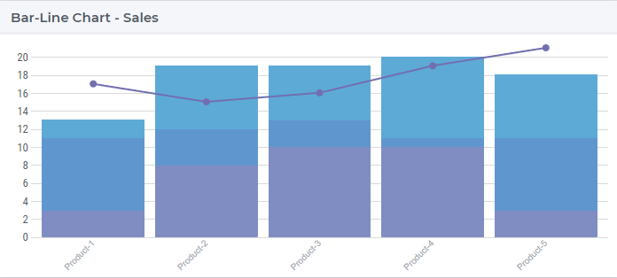

In the next sections we discuss and illustrate one-by-one the functionalities in the options editor of the bar-line chart.

Contents and Pivoting
---------------------

In order to determine the information to be rendered by a bar-line chart, first one has to specify the data identifier(s) in the Contents tab of the widget's options editor, where one may search 
for the available model data using the corresponding functionality at the bottom:

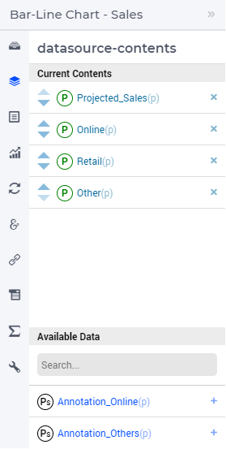
	
The first identifier added will always be represented as the line in the chart. All the other identifiers added will be represented as bars. 

In the Pivot tab of the options editor, one can specify how the data dimensions are to be organized in the chart. For example, if the Products index ``p`` is specified in the X-axis section and the ``<IDENTIFIER-SET>`` in the Grouped section then the resulting bar-line chart looks like in the illustration below:

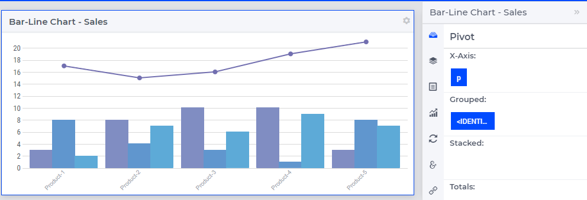

And if the ``<IDENTIFIER-SET>`` is pivoted in the Stacked section then the resulting bar-line chart looks like the illustration below:

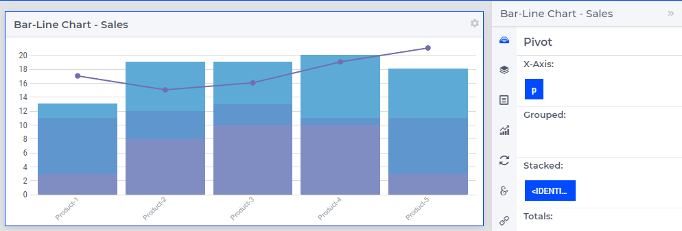

Change Type
-----------

In the Change Type tab of the widget's options editor, one can switch from the bar-line chart type to some other representation type. 
In the example at hand, one can switch e.g. from the bar-line chart to the table, resulting in the tabular view of the same data values:

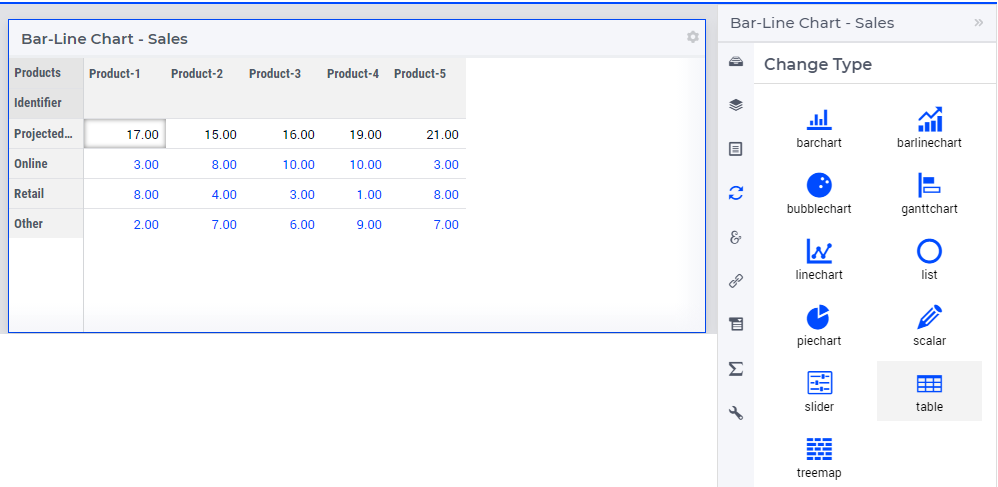

Bar-Line Chart Settings
-----------------------

In the Bar-Line chart settings tab of the widget’s options editor, a minimum and a maximum bound for the Y-axis may be specified, either as constants or as scalar identifiers from the model. Additionally, one may also specify a step size which determines the distance between the horizontal grid lines drawn in the chart:

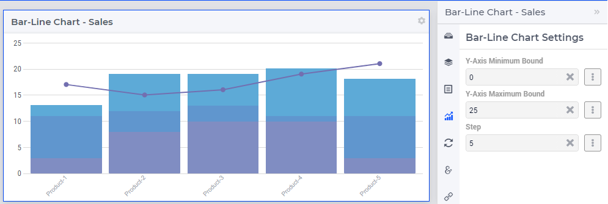
	

Totals
------

In the Totals tab of the widget's options editor, aggregated values such as Sum, Total Sum, Mean, Total Mean, Count, Total Count, Min, Total Min or Max, Total Max computed over one of the data indexes my be added to the chart. For example, when we add the sum over the Products ``p`` to our example bar-line chart, additional bars and a point representing the aggregated values become visible in the chart and the Y-axis is re-scaled accordingly: 

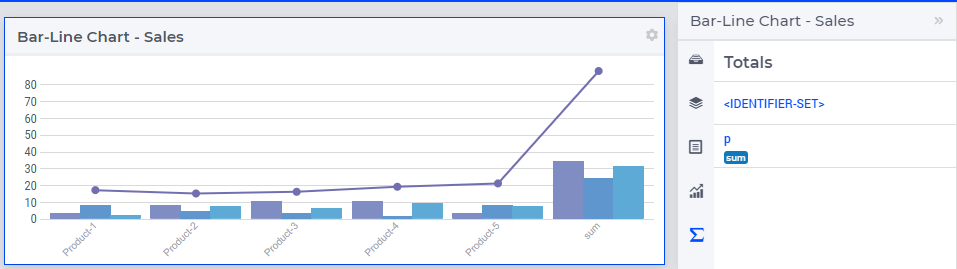

Identifier Settings
-------------------

In the Identifier Settings tab of the widget's options editor, one can apply a display domain or some slicing to the data identifier(s).

In the “Set display domain” section, a constant or a model identifier may be specified. The bar-line chart will then only display data points for which the display condition is evaluated as true. In our example, when ``GoodSales(p)`` is specified as display domain for ``Projected_Sales(p)``, then the bar-line chart only displays the data points for ``p`` combination for which the ``Projected_Sales(p)`` is less than the sum of ``Online(p)``, ``Retail(p)``, and ``Other(p)`` as illustrated below:

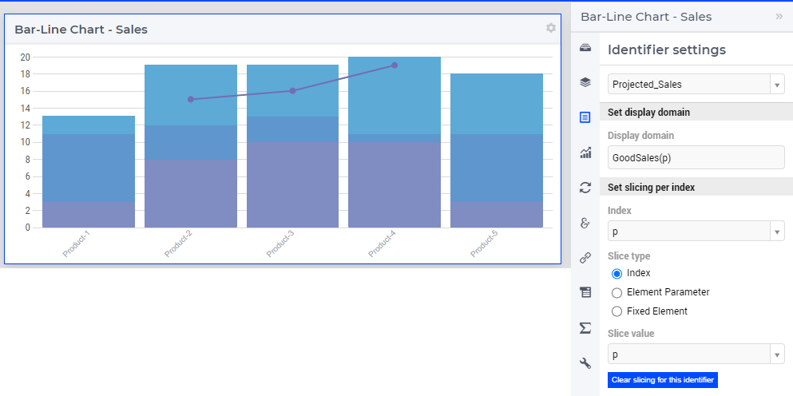

In the “Set slicing per index” section it is possible to slice one index to another index of a subset, to an element parameter or to a fixed element in the corresponding set. For instance, we can slice our product index ``p`` to the fixed element ``Product-3`` in the Products set, for all the identifiers, resulting in the bar-line chart view as shown here: 

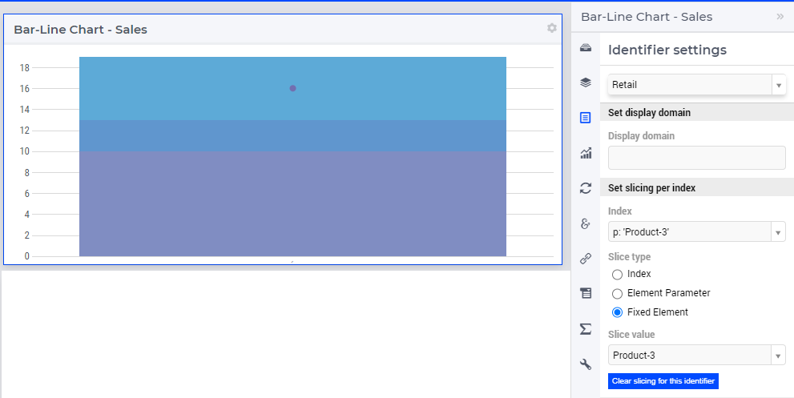

Store Focus, Hover and Select
-----------------------------

In the Store Focus tab of the widget’s options editor, for each index it is possible to specify an element parameter in the same set which will store the corresponding value when the user sets the focus on a specific bar or point in the line in the chart. For example, we can specify ``SelectedProduct`` for the index ``p``, where ``SelectedProduct`` is an element parameter in our application with the range ``Products``. The values of ``SelectedProduct`` may be displayed for inspection in some other widgets outside the bar-line chart. When the user sets the focus on a specific bar, the corresponding product value is stored in ``SelectedProduct``. In this case, the selected bar is highlighted, while the other bars, points and line are faded away. The picture below depicts this situation:

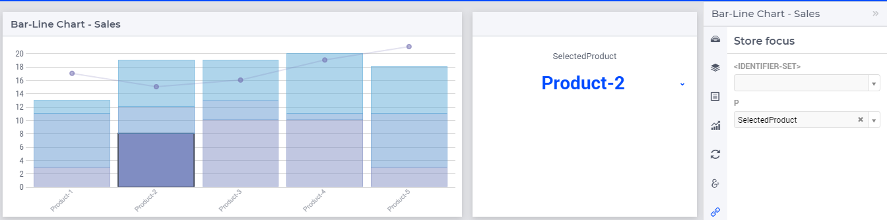

When a bar has been selected, the user may still hover over another bars or points or line and inspect the tooltip information, in the same way as the hovering works when no element has been selected (remark: a selected bar, point or line may be unselected by clicking again on it):

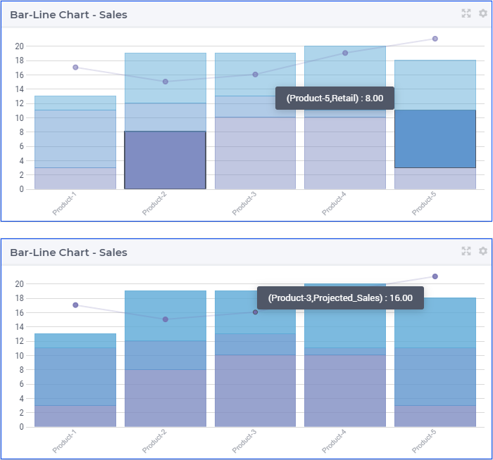

Widget Extensions
-----------------

In the Widget Extensions tab, it is possible to add the string parameters configured for the `Widget Actions <widget-options.html#widget-actions>`_ and the `Item Actions <widget-options.html#item-actions>`_ for the widget.

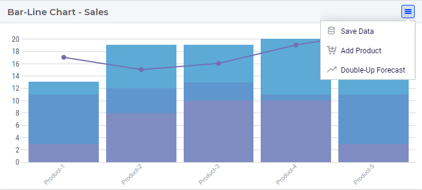

.. image:: images/BarLineChart_ItemActions.png
    :align: center    

Miscellaneous
-------------

In the Miscellaneous tab of the bar-line chart's options editor, other options may be set such as the title of the widget, whether or not the widget is visible (this may be determined by a model parameter)
or the number of decimals for the values displayed in the chart.
