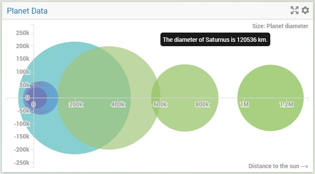
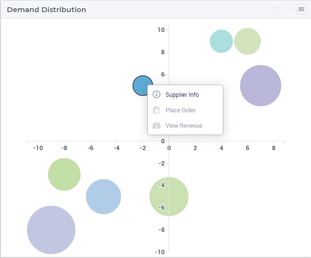

Bubble Chart Widget
===================

The Bubble Chart widget offers the possibility to display 3 aspects of information about set elements in your model. 
It uses an X/Y-plane to display circles (the so-called *bubbles*) for each data point. 
The size of the circles also provides information about the data points. 
For example, in a bubble chart about project management, the X-axis could represent the time to complete, the Y-axis the projected profit and the sizes of the bubbles could depict the risk involved.

With every widget there is always some limitation on how much data can be rendered at a time. As a general guideline, the bubble widget can currently handle situations with up to (about) 16000 bubbles in the chart. 
At the same time, please note the following:

.. note::
   The capacity and performance of the bubble widget may depend on the specifications of your user’s machine, server and database speed, and the browser being used, among other factors.

Specifying the contents
-------------------------

To create a bubble chart, you have to specify exactly 3 AIMMS parameters on the Bubblechart tab of the widget's option editor (the one with the lonely bubble in it). The top one ('X') should contain the X-coordinates, the second one ('Y') the Y-coordinates and the third one ('Size') the bubble sizes. All 3 parameters should have the same index domain. For a bubble chart displaying information about the planets in our solar system, the following identifiers could be used in your model:

* A set called :token:`Planets` with index :token:`p`;
* A parameter called :token:`DistanceToSun(p)`;
* A parameter called :token:`Y(p)`; and
* A parameter called :token:`Diameter(p)`.

In this particular case, the Y-coordinate doesn't mean anything. In such cases, just set it to a constant value. In your bubble chart you would have to specify the 3 parameters in the order given above. Using real 'world' data could result in the following bubble chart.

Maximum Reference Size
^^^^^^^^^^^^^^^^^^^^^^^

Maximum Reference Size is a scalar parameter used when you want to relatively size the areas of the bubbles based on a user defined value. When defined, the areas of all the bubbles will be calculated based on the maximum reference size, rather than the largest value of the Size identifier. 

Overriding tooltips
--------------------

As described in the `Widget Options <widget-options.html#adding-tooltips>`_ section, you can also override the default tooltips for a bubble chart. 
However, for this you need to add a string parameter based on the name of the identifier that represents the size of the bubble. 
So, for example, if the parameter :token:`Diameter` represents the bubble sizes, you should add a string parameter called :token:`Diameter_Tooltips` with the same index domain as :token:`Diameter` 
in order to override the default tooltip (in this case, index :token:`p`). In the chart above, you can see the result of using the following definition for the :token:`Diameter_Tooltips(p)` identifier:

.. code::

    FormatString("The diameter of %e is %n km.", p, Diameter(p));
    
Coloring
--------

The coloring of the individual bubbles in a bubble chart is determined by the last index that you have specified on the Groups tab of the options editor. For example, if you have a bubble chart with bubbles based on identifiers with a 3-dimensional index, let's say years, countries and seasons, and pivot the chart such that the years index is the last one, all bubbles with the same year will be colored equally.

Specific options
----------------

The bubble chart has some specific options that you can specify. These are located on the Miscellaneous tab of the widget's options editor:

* X-axis label: here you can specify a literal string or a model identifier to use as a legend which will be displayed along the X-axis.
* Y-axis label: the same, only this time for the Y-axis.
* Size label: here you can specify a literal string or a model identifier to describe what piece of information is used as the bubble size. It is displayed in the top-right corner of your bubble chart.

Widget Extensions
-----------------

In the Widget Extensions tab, it is possible to add the string parameters configured for the `Widget Actions <widget-options.html#widget-actions>`_ and the `Item Actions <widget-options.html#item-actions>`_ for the widget.

.. image:: images/WidgetActions_BubbleChart.png
    :align: center

.. note:: 
    When configuring the string parameter for the Item Actions, the actions should be added to the identifer that is used as the Size property in the Bubble chart settings.

Additional Remarks
------------------

A number of things are important to know when creating or interpreting the Bubble Chart widget:

#. The axis scaling may include standard abbreviations of quantities, such as :token:`k` for thousands, or :token:`M` for millions.
#. If there are bubbles with a *negative* size, they are rendered as empty circles, as opposed to the filled positive values.
#. Bubbles with a size of 0 are not rendered.
#. The *area* of the bubbles depict their relative sizes, not their *diameter*. Please note that the scale of the bubble areas is unrelated to the scale on the X- and/or Y-axis. Only their relative sizes are important.
#. You can specify reverse links on the 'Store focus' tab of the widget's option editor. When you select a bubble in the chart, the element parameters that you specify here will be filled accordingly, opening up all kinds of interactive opportunities.