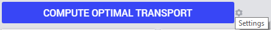
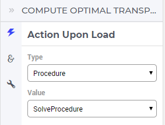
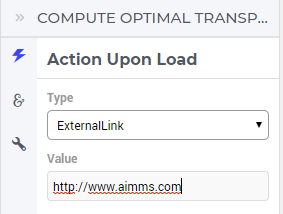
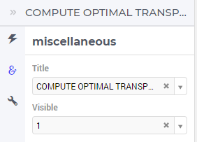

Button Widget
-------------

The Button widget allows the user to execute an action upon clicking on it. The type of action executed is determined by the widget settings:

In the sequel we discuss and illustrate the type of actions which may be specified through the Settings wheel as shown in the picture above.

.. note:: Please note that calling the pre-definded function :token:`ExitAimms()` from within WebUI (for example, as part of an action behind a button) is currently not supported and will result in an error (for more info on this function, please see `AIMMS Function Reference <https://manual.aimms.com/_downloads/AIMMS_func.pdf>`_). 
   In fact, calling :token:`ExitAimms()` only works for the main AIMMS thread itself and not for any of the other AIMMS contexts (of which WebUI is just one example). Exiting only from the underlying AIMMS session itself is not deemed as a proper behavior for an application with Web-based User Interface. See also: `"Constructs to Avoid" section in the AIMMS PRO documentation <../pro/conversion-to-pro.html>`_.

Action
++++++

For example, in the TransNet application, when the action type is set to Procedure, then one may select one of the procedures in the model, eg. SolveProcedure, as the
action to be executed:

When the action type is set to PageLink, then one may select one of the other page is the app's WebUI to link and open upon click (ResultsStatistics is here a potential other page):

.. image:: images/Button-ActionPageLink.png
    :align: center

Finnaly, if the action type chosen is ExternalLink, then one may select an URL for a web page to open:

	
Miscellaneous
+++++++++++++

In the Miscellaneous tab of the button's options editor, other options may be set such as the title of the widget and whether or not the widget is visible (this may be determined by a model parameter):

