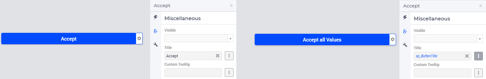
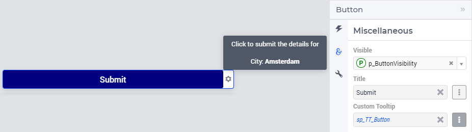

Button Widget
=============

The Button widget allows the user to execute an action upon clicking it. The type of action executed is determined by the widget settings:

.. image:: images/Button-View1.png
    :align: center

Below we will discuss and illustrate the types of actions which may be specified through the Settings wheel as shown in the picture above.

.. note:: Please note that calling the pre-defined function :any:`ExitAimms` from within WebUI (for example, as part of an action behind a button) is currently not supported and will result in an error (for more info on this function, please see `AIMMS Function Reference <https://documentation.aimms.com/functionreference/>`_). 
   In fact, calling :any:`ExitAimms` only works for the main AIMMS thread itself and not for any of the other AIMMS contexts (of which WebUI is just one example). Exiting only from the underlying AIMMS session itself is not deemed to be proper behavior for an application with a WebUI. See also: `"Constructs to Avoid" section in the AIMMS PRO documentation <../pro/conversion-to-pro.html>`_.

Action
------

For example, in the TransNet application, if the action type is set to Procedure, you can select one of the procedures in the model, e.g. SolveProcedure, as the
action to be executed:

.. image:: images/Button-ActionProcedure.png
    :align: center

If the action type is set to PageLink, you can select one of the other pages in the app's WebUI to link and open upon click (ResultsStatistics is a potential other page here):

.. image:: images/Button-ActionPageLink.png
    :align: center

Finally, if the action type chosen is ExternalLink, you can select a URL for an external web page (i.e. a page not in your WebUI, but from anywhere on the internet) to open:

.. image:: images/Button-ActionExternalLink.png
    :align: center
	
Miscellaneous
-------------

In the Miscellaneous tab of the button's options editor, other options may be set that are explained below: 

.. image:: images/Button-Misc.png
    :align: center

Visibility
^^^^^^^^^^

You can control the visibility of the button by either specifying a literal value 1 (visible) or 0 (hidden) or a binary parameter.

Title
^^^^^

Set the button title/text here. You can specify either a literal value like "OK" or "Accept" (without the quotes) or a string parameter.

.. _button-widget-custom-tooltip:

Custom Tooltip
^^^^^^^^^^^^^^

You can specify a custom tooltip to display more information when the user hovers over the button. You can specify either a literal value like "Click here to confirm the action" (without the quotes) or a string parameter.

The content for the string parameter can be data driven. It can also contain HTML. 

As illustrated below, the definition of string parameter ``sp_TT_Button`` is used to specify the ``Custom Tooltip`` option.

.. code:: 
    
    formatstring("Click to submit the details for   City: <strong>Amsterdam</strong>");

