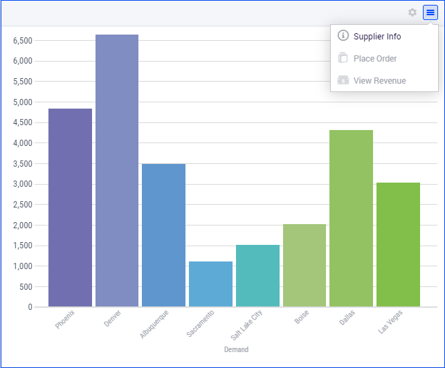
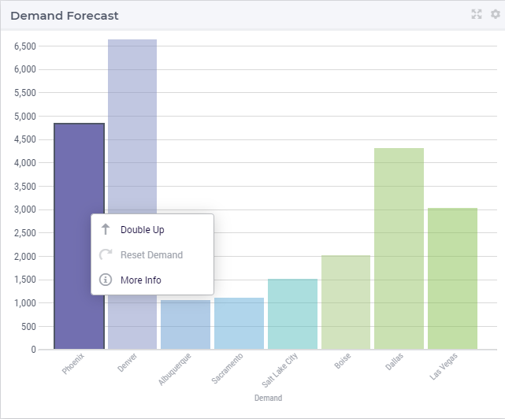

Column Chart Widget
===================

The Column Chart is a particular instance of the Combination Chart which represents data as vertical bars, also called columns. In this section we refer to a combination chart widget which uses only columns as a column chart widget. 
Note, however, that the formal widget type used for adding it to a page is still "combinationchart".

A column chart widget can render data in your model by using an X/Y-plane and display a column for each data point. The height of a column in the chart equals the value of the corresponding data point.
In this section we discuss and illustrate the features and options of the column chart. The chart's options may be set and accessed through the options editor which open upon clicking on the Settings cog-wheel in the widget header:

.. image:: images/ColumnChart-Settings-1.png
   :align: center

| 
	
Besides literal values, most options may also be specified using identifiers declared in the AIMMS model. 
For example, in the TransNet application, the demand for products of every distribution center may be represented using a column chart widget. 
Similarly, the unit transport costs for every combination (factory, center) may be rendered in a column chart. 
We use such examples, as will become clearer in the sequel, in order to illustrate the concrete usage of the various chart features. 

Contents 
--------

Firstly, a data identifier to be rendered in the column chart has to be specified in the Contents tab of the widget's options editor. An identifier may be added to the contents by using the "+" functionality at the bottom:

.. image:: images/ColumnChart-Contents-1.png
   :align: center

| 

For each identifier added to the Contents tab the following settings can be specified: the indentifier name (as declared in the AIMMS model), its display domain, the number of decimals, and the indicator for showing/hidding the units of measurement. 
These values may be literal or given through identifiers present in the AIMMS model, as shown below:

.. image:: images/ColumnChart-Identifier-Settings-1.png
   :align: center  

An AIMMS model identifier may be selected by using the icon on the right side of each option field:

.. image:: images/ColumnChart-Select-Identifier-1.png
   :align: center  

Clicking on this icon opens an option dialog which allows to select the identifier itself as well as to specify some slicing which is to be applied to the identifier indexes:

.. image:: images/ColumnChart-Identifier-Slicing-1.png
   :align: center  

In the "Display Domain" field of the idetifier settings, a constant or a model identifier may be specified as well. The column chart will then only display data points for which the display condition is evaluated as true.
In our example, if the indexed (binary) parameter p_IsSomeCenter(c) is specified as the display domain for Demand(c), then the column chart only displays the demand values of the distribution centers c for which the parameter p_IsSomeCenter(c) is
not 0. We can visualize this effect, for instance, by showing the values of p_IsSomeCenter(c) in a selection widget of type "multiselect" next to the column chart which shows Demand(c):

.. image:: images/ColumnChart-DisplayDomain-1.png
   :align: center
   :scale: 82%

.. image:: images/ColumnChart-DisplayDomain-2.png
   :align: center
   :scale: 81%

In the "Set slicing per index" section it is possible to slice one index to another index of a subset, to an element parameter or to a fixed element in the corresponding set.
For instance, we can slice our factory index f to the fixed element 'Hamburg' in the Factories set, resulting in the bar chart view as shown here: 

.. image:: images/BarChart-ViewSlice.png
    :align: center 

Similarly, one could slice the index f to an element parameter CurrentFactory having the declared range the set Factories (where the value of CurrentFactory may be determined from within the model
or by a choice made through another widget in the user interface). 

Pivoting
--------

Next, in the Pivot tab of the options editor, one can specify how the data dimensions are to be organized in the chart. 
For example, if both the factory index f and the center index c are specified in the X-axis section and the <IDENTIFIER-SET> in the Totals section then the resulting bar chart looks like 
in the picture below on the right:

.. image:: images/BarChart-View1.png
    :align: center

One may move some data indexes in the Grouped section of the Pivot tab. In our example, moving the center index c to the Grouped section results in the following bar chart view:

.. image:: images/BarChart-View2.png
    :align: center

Similarly, one may move some data indexes in the Stacked section of the Pivot tab. In our example, moving the center index c to the Stacked section results in a bar chart view like below:

.. image:: images/BarChart-View3.png
    :align: center

Column Chart Settings
---------------------

In the Barchart Settings tab of the widget's options editor, a minimum and a maximum bound for the Y-axis may be specified, either as constants or as scalar identifiers from the model.
Additionally, one may also specify a step size which determines the distance between the horizontal grid lines drawn in the chart:

.. image:: images/BarChart-ViewSettings.png
    :align: center	

Store Focus, Hover and Select
--------------------------------

In the Store Focus tab of the widget's options editor, for each index it is possible to specify an element parameter in the same set which will store the corresponding value when the user sets the
focus on a specific bar in the chart. For example, we can specify SelectedFactory for the index f and SelectedCenter for the index c, where SelectedFactory and SelectedCenter are element parameters 
in our application at hand with ranges Factories and Centers, respectively. The values of SelectedFactory and SelectedCenter may be displayed for inspection in some other widgets outside the bar chart.
When the user sets the focus on a specific bar, the corresponding factory and center values are stored in SelectedFactory and SelectedCenter, respectively. In this case, the selected bar is highlighted, 
while the other bars are faded away. The picture below depicts this situation:

.. image:: images/BarChart-ViewStoreFocus.png
    :align: center

When a bar has been selected, the user may still hover over another bar and inspect the tooltip information, in the same way as the hovering works when no bar has been selected 
(remark: a selected bar may be unselected by clicking again on it):

.. image:: images/BarChart-ViewHover.png
    :align: center

Widget Extensions
-----------------

In the Widget Extensions tab, it is possible to add the string parameters configured for the `Widget Actions <widget-options.html#widget-actions>`_ and the `Item Actions <widget-options.html#item-actions>`_ for the widget.

Miscellaneous
----------------

In the Miscellaneous tab of the bar chart's options editor, other options may be set such as the title of the widget, whether or not the widget is visible (this may be determined by a model parameter)
or the number of decimals for the values displayed in the chart.
