Combination Chart Widget
========================

The Combination Chart widget is an example of a widget based on the so-called highcharts offered by https://www.highcharts.com/ and further supported in the AIMMS WebUI.

The Combination Chart widget can combine several chart types in a single chart widget. More specifically, it has been built upon the combination chart presented at https://www.highcharts.com/docs/chart-and-series-types/combining-chart-types.

Currently, The Combination Chart widget only supports the 'column' chart type, resulting in a Column Chart, see also https://www.highcharts.com/docs/chart-and-series-types/column-chart. 
In the near future, the Combination Chart widget in AIMMS WebUI will be extended with other chart types like ‘line’ and ‘area’ and you will be able to specify a chart type per identifier. 

<name is explained by the fact that you can combine different chart types in a single chart> @Ovidiu

For the time being, please refer to the supported features described below...

Converting Existing Widgets to a Combination Chart Widget 
---------------------------------------------------------

Since the Combination Chart widget offers more flexibility and options than the original Bar, Line and BarLine chart widgets, we can imagine that you would like to replace your existing widgets with the new type. The WebUI offers you this possibility. Do the following steps to do so:

1. Open the options editor of the existing widget that you wish to convert;
2. On the 'Change Type' tab, you will notice a 'Convert Type' section at the bottom, with 'combinationchart' as an option to choose:

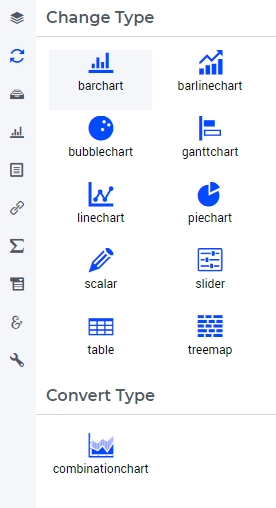

3. Click on 'combinationchart';
4. This will bring up a dialog that tells you what is about to happen. Click on 'Continue'.

After these steps, your existing widget will have been replaced by a Combination Chart widget, complete with all the options from the existing widget that could be converted. Currently, only a non-binary display domain cannot be converted yet. The Combination Chart widget is present at the original position of the existing widget, with a numerical suffix in its name, because two widgets with the same name are not possible. 

As not all options have an equivalent in the Combination Chart, we have made sure that you have not lost your old widget. It is still present, with its original name, in the 'Unassigned widgets' area of your WebUI page. If you need to compare both, you can simply drag it onto an active area on your page to do so. If you are sure that the new widget is fully OK, you can delete the original one.

Please note that it is only possible to convert widgets of type Bar, Line and BarLine chart, so only those offer the option on the 'Change Type' tab.

The Column Chart
----------------

The Column Chart is a particular instance of the Combination Chart which represents data as vertical bars, also called columns. In this section we refer to a Combination Chart Widget which uses only columns as a column chart widget. 
Note, however, that the formal widget type used for adding it to a page is still "combinationchart".

A column chart widget can render data in your model by using an X/Y-plane and display a column for each data point. The height of a column in the chart equals the value of the corresponding data point.
In this section we discuss and illustrate the features and options of the column chart. The chart's options may be set and accessed through the options editor which open upon clicking on the Settings cog-wheel in the widget header:

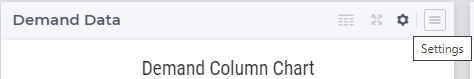

| 
	
Besides literal values, most options may also be specified using identifiers declared in the AIMMS model. 
For example, in the TransNet application, the demand for products of every distribution center may be represented using a column chart widget. 
Similarly, the unit transport costs for every combination (factory, center) may be rendered in a column chart. 
We use such examples, as will become clearer in the sequel, in order to illustrate the concrete usage of the various chart features. 

Contents 
--------

Firstly, a data identifier to be rendered in the column chart has to be specified in the Contents tab of the widget's options editor. An identifier may be added to the contents by using the "+" functionality at the bottom:

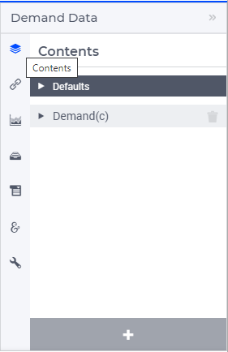

| 

For each identifier added to the Contents tab the following settings can be specified: the identifier name (as declared in the AIMMS model), the chart type to be applied to this identifier, its display domain, the number of decimals, and the indicator for showing/hiding the units of measurement. 
These values may be literal or given through identifiers present in the AIMMS model, as shown below:

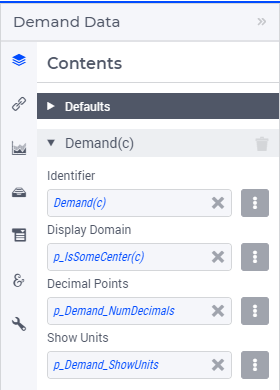

An AIMMS model identifier may be selected by using the icon on the right side of each option field:

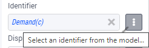

Clicking on this icon opens an option dialog which allows to select the identifier itself as well as to specify some slicing which is to be applied to the identifier indexes:

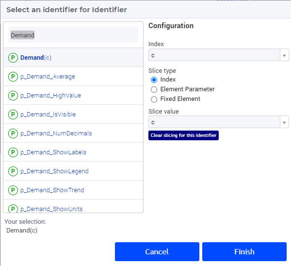

In the "Configuration" section of the option dialog shown above it is possible to slice one index to another index of a subset, to an element parameter, or to a fixed element in the corresponding set.
For instance, we can slice our center index c to the fixed element 'Amsterdam' in the Centers set. Similarly, one could slice the index c to an element parameter CurrentCenter having the declared range the set Centers 
(where the value of CurrentCenter may be determined from within the model or by a choice made through another widget in the user interface). 
Clearly, each slicing specification will result in a different data view in the chart showing only the data points corresponding to those tuples (set element combinations) which are still valid according to current slicing. 
For detailed explanation, please refer to `Widget Options > Indentifier Settings > Slicing <widget-options.html#id6>`__.

<best practices with regard to selecting identifiers with different domains, explain what happens with missing indices> @Ovidiu

For each identifier, the chart type to be applied to it can be specified in the "Chart Type" field...

<add section on chart types, for each chart type add a small description and example screenshot>
<update screenshot's, should we wait for the order of the options to change?> @Ovidiu

<please be aware that a lot of examples in this section use the 'column' chart type as an example. However, the info is also valid for other chart types> @Ovidiu

<add comment to say that the combination chart widget can now also be used to create a bar-line chart> @Ovidiu

Moving on, in the "Display Domain" field of the identifier settings, a constant or a model identifier may be specified as well. The column chart will then only display data points for which the display condition is evaluated as true.
In our example, if the indexed (binary) parameter p_IsSomeCenter(c) is specified as the display domain for Demand(c), then the column chart only displays the demand values of the distribution centers c for which the parameter p_IsSomeCenter(c) is
not 0. We can visualize this effect, for instance, by showing the values of p_IsSomeCenter(c) in a selection widget of type "multiselect" next to the column chart which shows Demand(c).

.. note:: Please realize that entering the number ‘1’ as the display domain will result in a dense view of your data.

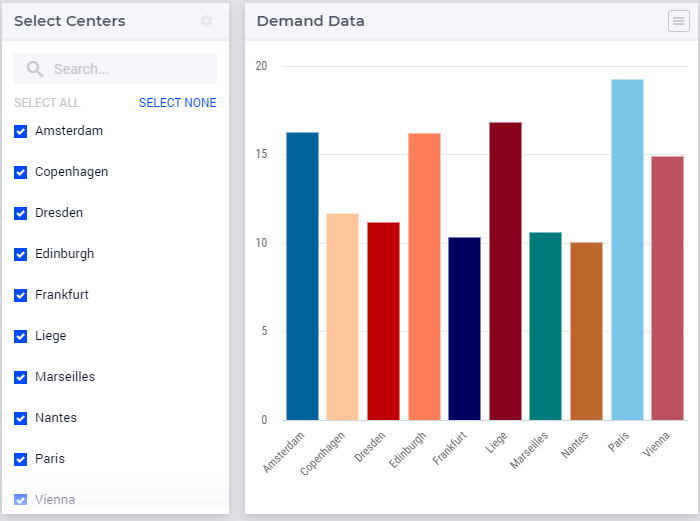

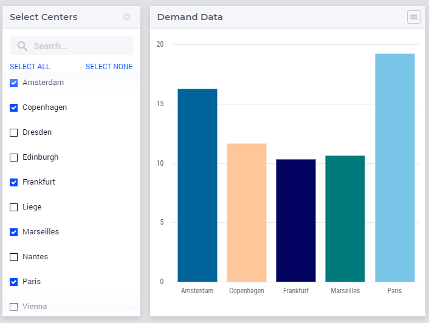

|

Next, the number of decimals and the indicator for showing/hiding the units of measurement may be specified in the corresponding fields of the identifier settings, as already shown above. 
Please note that either option needs to be resolved to a scalar value. So, in particular, it is not possible to specify an indexed identifier like p_NumDecimals(c) for the number of decimals. 
This means that you cannot show a different number of decimals for different data values which belong to the same identifier.
These "per identifier" options are then reflected in the chart view provided that the data labels are toggled on (see more info about toggling labels in the `Chart Settings <column-chart-widget.html#column-chart-settings>`__ section below):

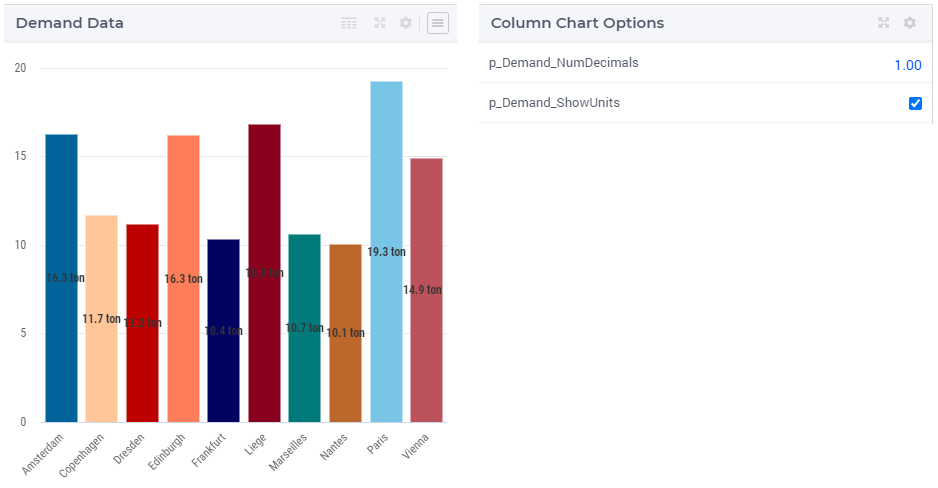

|

Note, that if the number of decimals and/or the indicator for showing/hiding the units of measurement are not specified for a certain identifier, then the values from the Defaults section will be inherited and applied to that identifier:

.. image:: images/ColumnChart-NumDec-ShowUnits-2.png
   :align: center  

|

More specifically, in the example above the number of decimals is not explicitly set for the identifier Demand(c) and therefore, this option value '2' is automatically inherited from the number of decimals specified in the Defaults section of the Contents tab.
Similarly, the value '1' (or "on") of the the indicator for showing/hiding the units of measurement for the identifier Demand(c) is not specified explicitly in the corresponding identifier field, but it is inherited from the indicator value from the Defaults.
Either option can be specified per identifier or inherited from Defaults independently from the other option. 

Pivoting
--------

In the Pivot tab of the chart options editor, one can specify how the data dimensions are to be organized in the chart. The dimensions shown correspond to the union of the domain indices of the model identifiers that have been specified on the contents tab.

For example, if the <IDENTIFIER-SET> index in the X-axis section and the center index c is moved to the Grouped section, then the resulting column chart looks like in the picture below on the left:

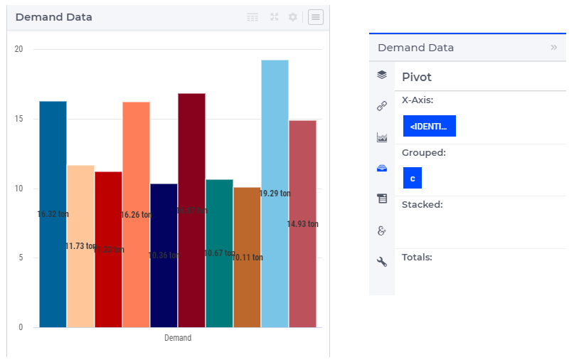

Similarly, one may move some data indexes in the Stacked section of the Pivot tab. In our example, moving the center index c to the Stacked section results in a column chart view as follows:

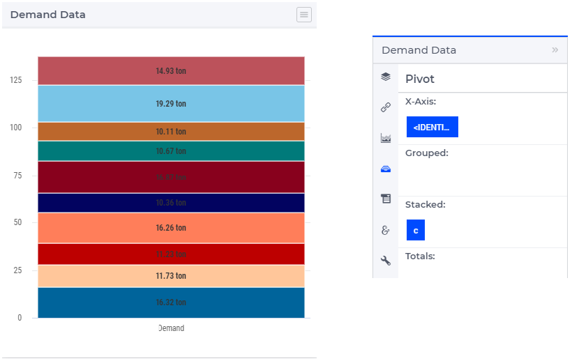

Typically, the identifiers that are put in a single chart will share the same (or at least have a very similar) index domain, but this is not necessary. In case some index (that is present on the Pivot tab) is not present in the index domain of a certain contents identifier, the corresponding *missing index* is denoted with a dash ('-') character.

The combination chart widget allows you to specify a chart type **per identifier**. In case you want to make use of different chart types, the dimensions should be pivoted in such a way that, for each sequence of data points in the chart, the corresponding identifier can be uniquely determined. This means, that, in case you want to mix different chart chart, the <IDENTIFIER-SET> index should not be put in the Header or Totals section. 

When the <IDENTIFIER-SET> index is put in the Header section, the different data point in a single data series, may correspond to different chart types. When, the <IDENTIFIER-SET> index is put in the Header section, each single data point is a total over multiple identifiers, each with their own chart type. In bot of these case, the chart type of the first identifier will be used.

Column Chart Settings
---------------------

In the Chart Settings tab of the widget options editor there are several groups of options which may be specified: 

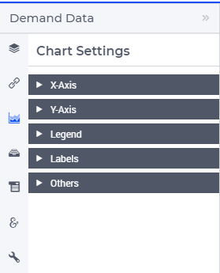

Next, we discuss each of these option groups in turn.

X-Axis
++++++

In the X-Axis group it is possible to specify the Label for the X-axis and the so-called "Maximum Number of Categories in the Viewport":

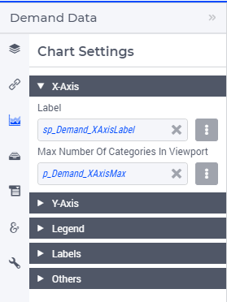

In order to illustrate the effect of these settings, assume for the time being that the Pivoting is adjusted as follows: 

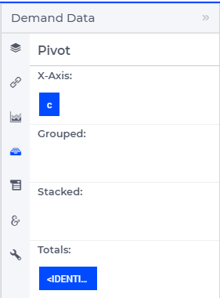

The Label value add the corresponding text as label of the X-axis. 
The value of the "Maximum Number of Categories in the Viewport" specifies the maximum number of data tuples from the X-axis in the Pivot tab which are shown at a time in the chart.
If there are more data points than this maximum number in viewport, then a horizontal scroll bar appears along the X-axis such that the user can scroll through all points.
These are illustrated in the following picture:

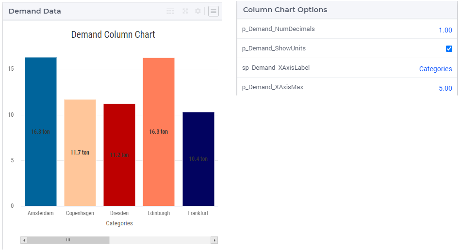

| 

Y-Axis
++++++

In the Y-Axis group it is possible to specify the Label for the Y-axis, a minimum and a maximum bound for the Y-axis, and a step size which determines the distance between the horizontal grid lines drawn in the chart 
(these all may be constant literals or given by model identifiers):

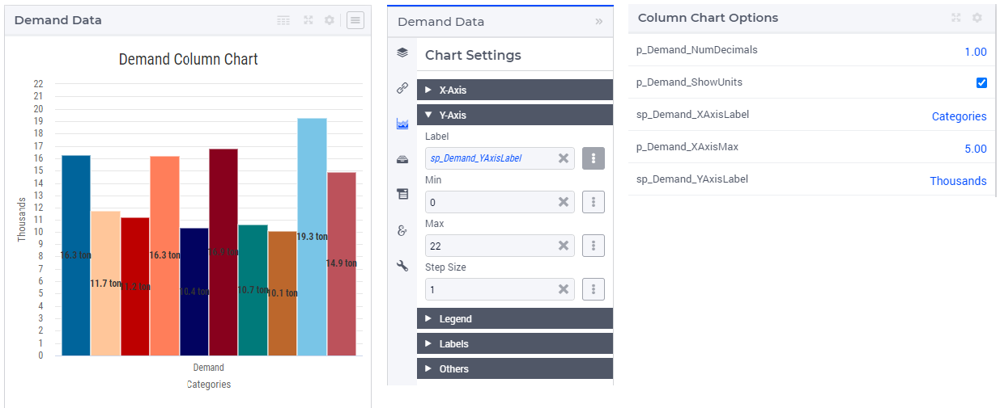

Note that the situation shown here corresponds again to the first instance of pivoting the indexes as discussed in the Pivoting section above.

Legend
++++++

In the Legend group it is possible to specify an indicator whether to show or to hide the legend provided by the chart:

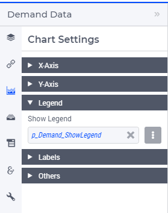

When the Legend is turned on, then it is displayed at the bottom of the chart, as illustrated below:

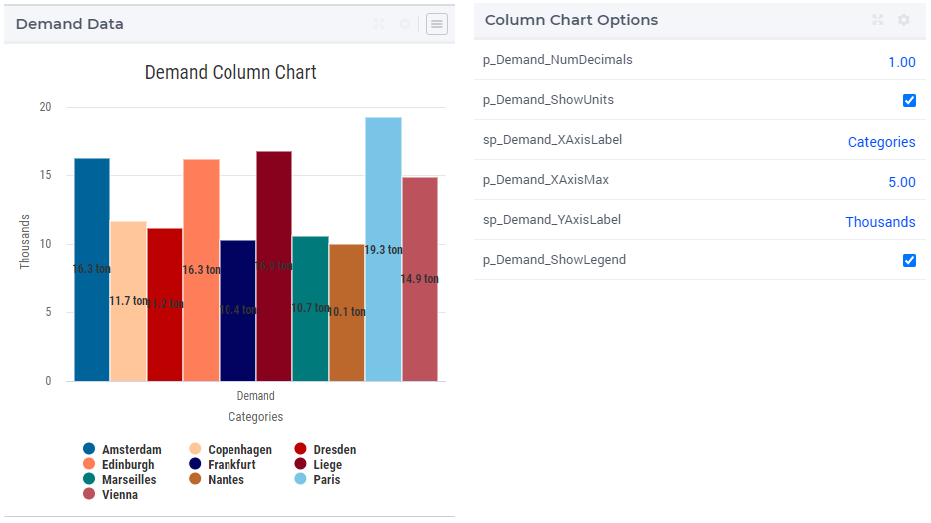

When the Legend option is not specified by a model identifier, but by the literal (binary) indicator, then the option of toggling the Legend on/off is also available through a dedicated icon on the widget header:

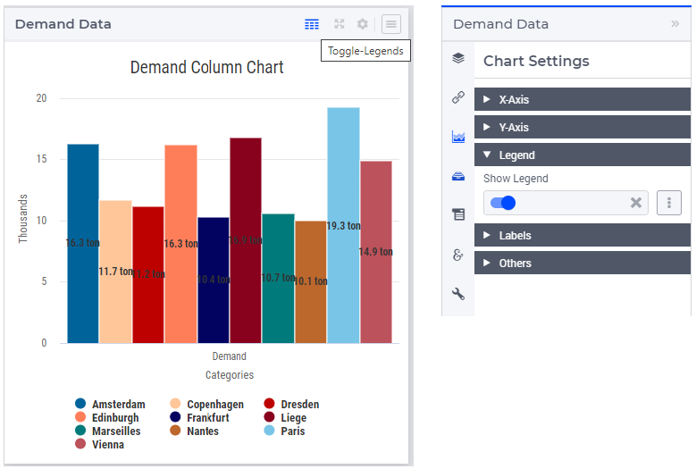

Labels
++++++

In the Labels group it is possible to specify an indicator whether to show or to hide the text labels of the columns in the chart:

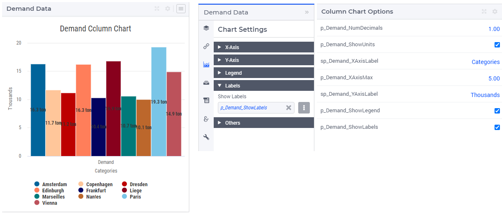

<are labels only valid for the 'column' chart-type?>  @Ovidiu

Color Index
+++++++++++

One of the indices can be specified as Color Index. This means that all data points will be colored based on the set element corresponding to the Color Index. For example, consider a chart that displays data for the identifier UnitCost(f,c). When specifying the *f* index as the Color Index, the chart element (e.g. the column) corresponding to UnitCost('London','Liege') will be colored with the second color out of a 19 color palette as 'London' is the second element in the (root set of the) set Factories. Note that a modulo 19 operation will be applied to determine the color. As a result, the twentieth factory will have a similar color as the first. Similarlt, when specifying the *c* index as the Color Index, the chart element will use the sixth color out of the color palette as 'Liege' is the sixth element in the 'Centers' set.

If not specified explicitly, the combination chart will use the last index in the Grouped section as a Color Index. If there is no such index, the last index in the Stacked section will be used and if bot the Grouped and Stacked sections are empty, the last index in the Header section is used as the Color Index.

In most cases, it makes sense to select an index in the Stacked or Grouped section as the color index, as indices in the Header section are already explicitly displayed in the chart (meaning there already is a way to visually distinguish between them).

Consider a column chart with a single identifier UnitCost(f,c) in which the <IDENTIFIER-SET> index is in the Header group, the f index is in the Stacked group and the c index is in the Grouped group. 

If you would specify the c index as the *Color Index*

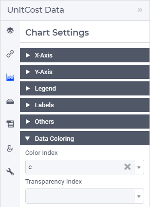

|

in the resulting chart all Centers c will each have their own color:

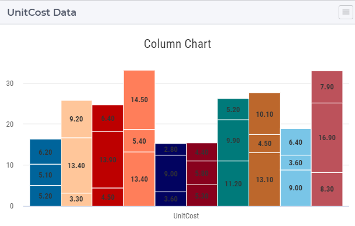

|

On the other hand, if in the same chart, you would specify the index f to be the Color Index, all (stacked) factories will each have their own color.

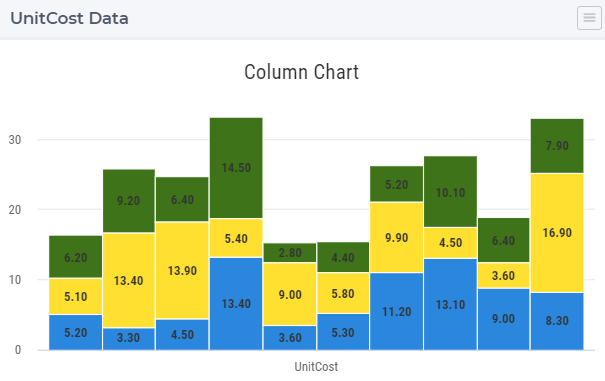

|

Selecting a Color Index will allow you (as an app developer) will help your end users view the data from the viewpoint of a specific dimension. 

Transparency Index
++++++++++++++++++

Only one of the indices in your chart will be used as the Color Index. In case your chart contains multiple indices, you may end up with duplication of colors for different elements. For example, in the example (from the previous section) in which the c index was specified as the color index, you that that all three factories (that are stacked upon each other) have the same color. By specifying the f index as the *Transparency Index*, a transparency/shading pattern will be applied to each color depending on the ordinal number of the set element in the (root set of the) Factories set. The hard-coded transparency palette that is currently being used distinguishes 5 different levels of transparency. The resulting chart now looks like
 
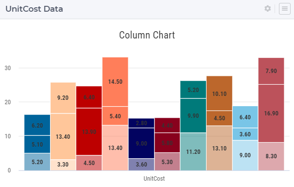

|

To be able to see differences between colors in combination with transparency, it works best if the colors in the color palette are well distinguishable from each other. You might want to create a special custom color palette (and provide it as an application specific resource) to be used in charts were also a Transparency Index has been specified.

Others
++++++

In the Others group it is possible to specify the Chart Title which will be shown on the top of the chart:

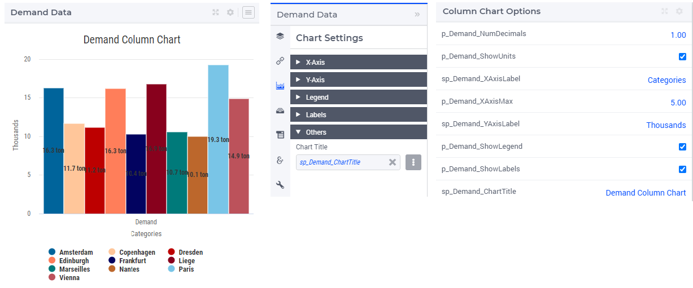

|  

Index Settings, Select, and Store Focus
---------------------------------------

In the Index Settings tab of the widget options editor, for each index it is possible to specify an element parameter in the same set which will store the corresponding value when the user selects a specific column in the chart (by clicking on it, in which case the color of the column turns grey). 
For example, we can specify an element parameter ep_Center for the index c and en element parameter ep_Focusidentifier for the <IDENTIFIER-SET> index, where ep_Center and ep_Focusidentifier are element parameters 
in our application at hand with the sets Centers and AllIdentifiers, respectively, as ranges. The values of ep_Center and ep_Focusidentifier may be displayed for inspection in some other widgets outside the column chart:

.. image:: images/ColumnChart-IndexSettings-1.png
    :align: center

|  

Select, Hover, and Tooltips
---------------------------

When the user selects a specific column, the corresponding center value is stored in the element parameter ep_Center as shown above. When the user hovers with the mouse cursor over a column (for example, before selecting it), then that column is highlighted, 
while the other columns are faded away. In this case, also a tooltip is shown, either a default tooltip or a custom tooltip specified using a webui::TooltipIdentifier annotation, see the section `Identifier Annotations <widget-options.html#identifier-annotations>`__.
The picture below depicts this situation:

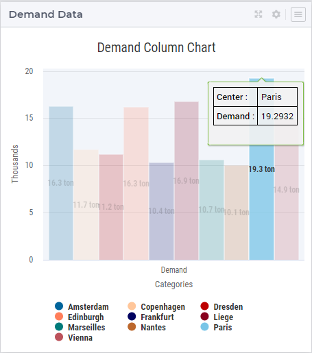

|  

When a column has been selected, the user may still hover over another column and inspect the tooltip information, in the same way as the hovering works when no column has been selected 
(remark: a selected column may be unselected by clicking again on it):

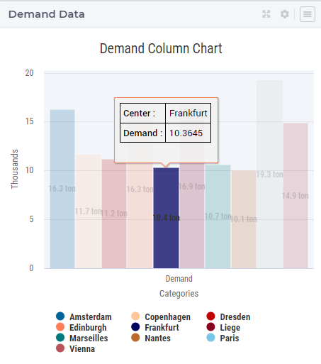

|  

Custom Styling
--------------

By specifying a webui::AnnotationsIdentifier as explain in the section `Identifier Annotations <widget-options.html#identifier-annotations>`__ and by using it subsequently for custom styling as explained in the section `Custom Styling <css-styling.html#css-styling>`__, 
it is possible to apply a custom styling to a column chart as well.
For instance, in our example application at hand one could style differently those columns in the chart which have a demand value greater than a certain threshold value given by a scalar parameter called p_Demand_HighValue. 
This situation is depicted in the following picture:

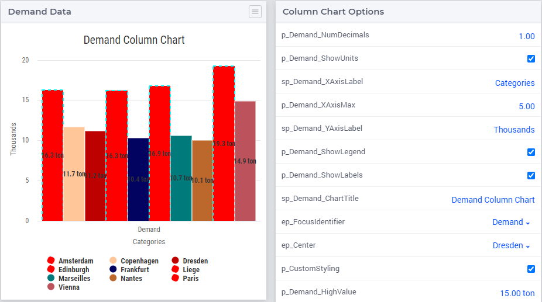

|  

In case you want to use a custom color palette for your application, you can create a new CSS file, place the file in the ``MainProject\WebUI\resources\css`` folder, and populate it with something like

.. code-block::

	:root {
		--color_data-palette-19_1: red;
		--color_data-palette-19_2: orange;
		--color_data-palette-19_3: yellow;
		--color_data-palette-19_4: green;
		--color_data-palette-19_5: blue;
		...
		--color_data-palette-19_19: #964B00;
	}

Widget Extensions
-----------------

In the Widget Extensions tab of the widget options editor, it is possible to add the string parameters configured for the `Widget Actions <widget-options.html#widget-actions>`_ and the `Item Actions <widget-options.html#item-actions>`_ for the widget.
When these parameters are configured, then the widget actions may be accessed using the corresponding icon on the widget header or the item actions (for a selected column) may be called using the right-mouse click:

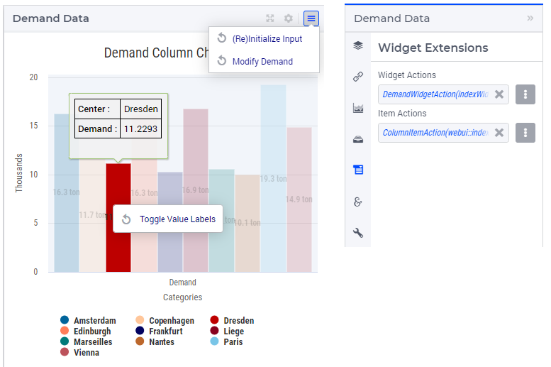

|  

Miscellaneous
----------------

In the Miscellaneous tab of the column chart options editor, other options may be set such as the title of the widget and the indicator whether or not the widget is visible on the page (besides literals, both may be specified through model identifiers as well):

.. image:: images/ColumnChart-Miscellaneous-Options-1.png
    :align: center

|  

The specified chart title is reflected on the widget header:

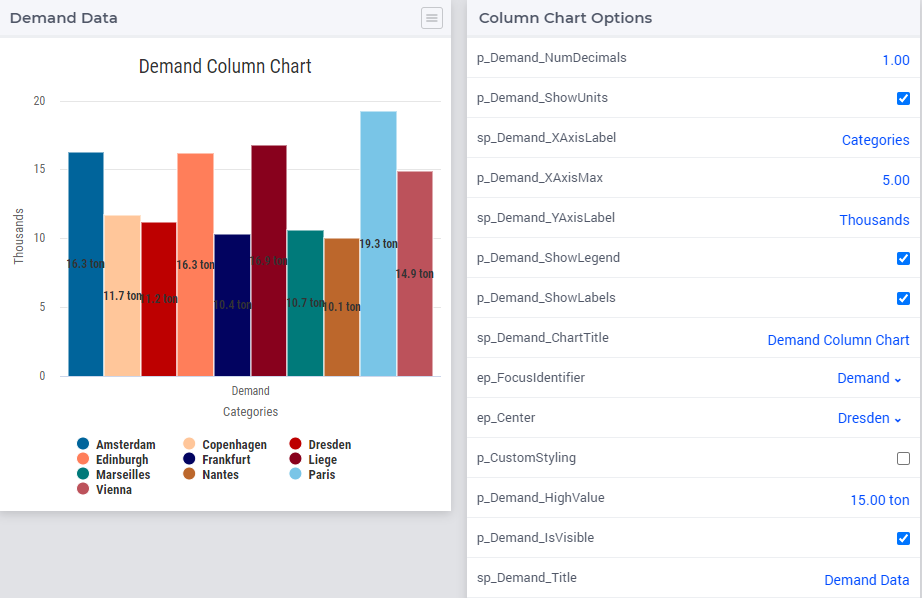

|  

.. spelling::

    highcharts