CSS Styling
============

As mentioned before, it is possible to (re)style your web application by providing custom Cascading Style Sheets (CSS). This section discusses this topic in more detail.

Data-Dependent Styling
----------------------

You can define user-annotations in your AIMMS model which will be used to style the corresponding so-called `DOM <https://en.wikipedia.org/wiki/Document_Object_Model>`_ elements in the WebUI page. In order to define user annotations for an identifier :token:`X(i,j)` that is being displayed in a widget, you can define a string parameter, say :token:`DangerValuesOfX(i,j)`, defined over a valid subdomain of the original identifier. This string parameter should have as value a space-separated string of class-names (that will be used to decorate the DOM elements with). In the attribute form of the identifier for which you are specifying the annotations, you should add the :token:`webui::AnnotationsIdentifier` annotation attribute and then fill in the string parameter containing the desired annotation(s) there:

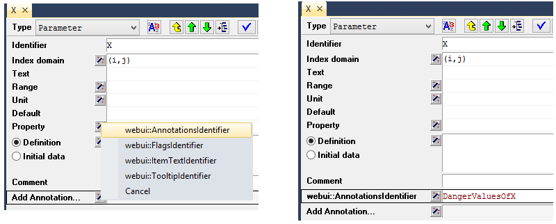

In combination with an additional project-specific `CSS <#css-styling>`_ file, you can then specify the styling on, for example, a per-table-cell basis.

For example, the following 'user annotation'

.. code::	

    StringParameter DangerValuesOfX {
        IndexDomain: (i,j);	
        Definition: "invalid-value danger" onlyif ( Y(i,j)  >= Y_UB(i,j) );
    }

In combination with the following CSS rule

.. code-block:: CSS

    .aimms-widget td.annotation-invalid-value {
        background-color : red;
    }

will show all cells in tables (because of the :token:`.td` class), where the annotation has the value :token:`invalid-value` with a red background color. Note that the :token:`DangerValuesOfX` shows a combination of two annotations: :token:`invalid-value` as well as :token:`danger`, but only the former is used in the example above.

By default, all core WebUI plugins (including widgets) will prefix user annotations with :token:`annotation-` and replace whitespace characters, like spaces or tabs, with a hyphen (-). It is recommended that app developers use this as well. For more information: see `AWF.Util.getAsCSSClasses <#applying- annotations-or-flags>`_.

.. note:: 
     Please note that in AIMMS versions prior to 4.49, you had to define a string parameter called :token:`X_annotations(i,j)` (with the domain of this '_annotations identifier' being a valid subdomain of the original identifier) in order to achieve the same result. This had the disadvantage that when you renamed the original identifier, the '_annotations identifier' was not automatically renamed with it, possibly leading to unexpected effects in the WebUI front-end.

The WebUI uses flags to indicate whether a certain DOM element corresponds to a *readOnly* value or not. DOM elements that correspond to editable values are annotated with a :token:`flag-editable` CSS class while read-only DOM elements are annotated with a :token:`flag-readOnly` class. It is possible to make the data which is editable from a model perspective appear as read-only in the WebUI by using user-flags. One can achieve this as follows: define a new string parameter in the model, say FlagsOfX(i,j), add a :token:`webui::FlagsIdentifier` annotation to the attribute form of the original identifier X, and fill in the new string FlagsOfX(i,j) as the contents of this annotation: 

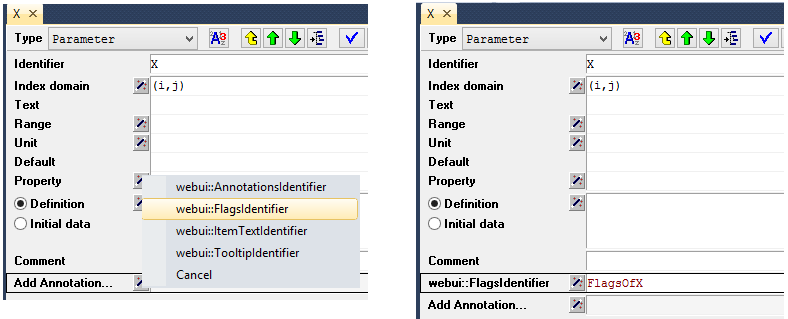

Finally, one can assign the value "readOnly" to FlagsOfX(i,j) for the (updatable) values of X(i,j) which should appear as read-only in the front-end.

.. note:: 
     Please note that in AIMMS versions prior to 4.71, you had to define a string parameter called :token:`X_flags(i,j)` (with the domain of this '_flags identifier' being a valid subdomain of the original identifier) in order to achieve the same result. This had the disadvantage that when you renamed the original identifier, the '_flags identifier' was not automatically renamed with it, possibly leading to unexpected effects in the WebUI front-end.

Widgets and CSS properties supported for annotations
----------------------------------------------------

There are several CSS properties that can be changed for each widget that support annotations. AIMMS provides support for specific CSS properties with respect to CSS customization. The below table denotes the supported widgets and their respective CSS properties that can be changed.

+------------------------+------------------------------------------------------------------------------+
| Widgets                | CSS Property                                                                 |
+========================+==========================+===================================================+
| Bar Chart              | fill, fill-opacity       | stroke, stroke-width, stroke-dasharray            |
+------------------------+--------------------------+---------------------------------------------------+
| Line Chart             | fill, fill-opacity       | stroke, stroke-width, stroke-dasharray            |
+------------------------+--------------------------+---------------------------------------------------+
| Pie Chart              | fill, fill-opacity       | stroke, stroke-width, stroke-dasharray            |
+------------------------+--------------------------+---------------------------------------------------+
| TreeMap Chart          | background, opacity      | font-size, font-family, font-style, font-weight   |
+------------------------+--------------------------+---------------------------------------------------+
| Gantt Chart            | fill, fill-opacity       | stroke, stroke-width, stroke-dasharray            |
+------------------------+--------------------------+---------------------------------------------------+
| Table                  | background, opacity      | font-size, font-family, font-style, font-weight   |
+------------------------+--------------------------+---------------------------------------------------+
| Bubble Chart           |  fill, fill-opacity      | stroke, stroke-width, stroke-dasharray            |
+------------------------+--------------------------+---------------------------------------------------+
| Map (Nodes)            |  fill, fill-opacity      | stroke, stroke-width, stroke-dasharray            |
+------------------------+--------------------------+---------------------------------------------------+
| Scalar                 | background, opacity      | font-size, font-family, font-style, font-weight   |
+------------------------+--------------------------+---------------------------------------------------+

.. warning:: 
    For Line Chart, Bubble Chart and Map the radius property "r" is supported only on the Chrome browser, and not on IE 11 and Edge browsers.

The Bar Chart, Line Chart, Pie Chart, Gantt Chart, Bubble Chart and Map widget use SVG elements. SVG stands for Scalable Vector Graphics, and uses a coordinates system to draw different vectors, like the rectangles and circles in charts. AIMMS supports the use of the fill and stroke properties for SVG elements. 

The illustration below shows the use of SVG properties to change the fill and stroke of a bar chart when the annotation "blue" is added to the identifier. Followed by illustrations of the other charts.

.. code:: CSS

    .annotation-blue{
    /* fill changes */
        fill: Blue;
        fill-opacity: .5;
    /* stroke changes */
        stroke: aqua !important;
        stroke-width: 4 !important;
        stroke-dasharray: 5;
    }

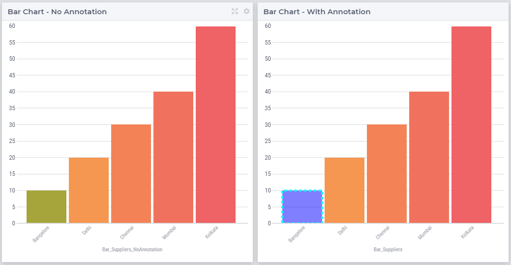

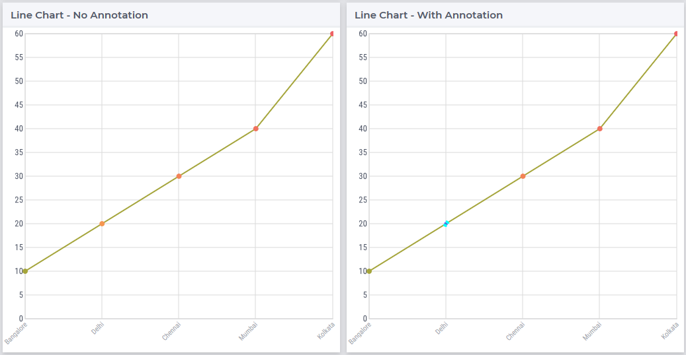

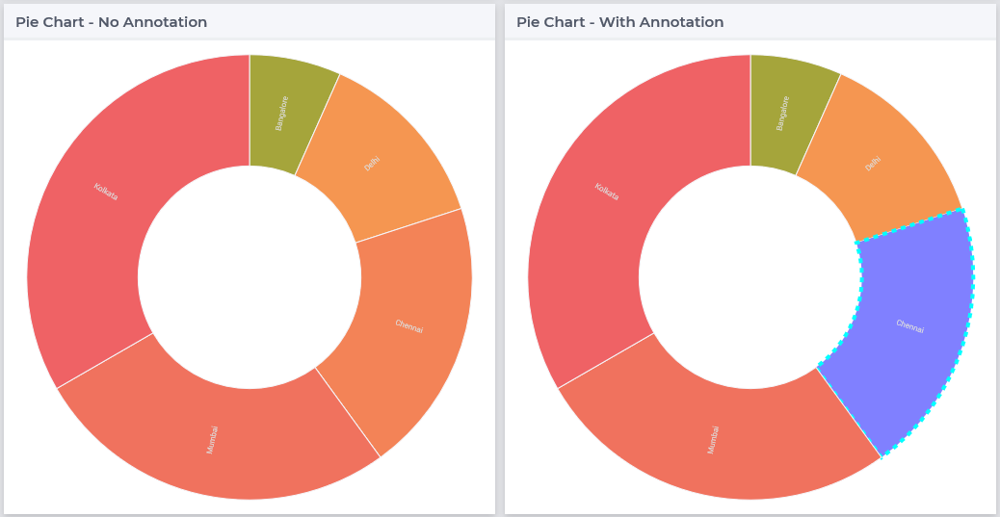

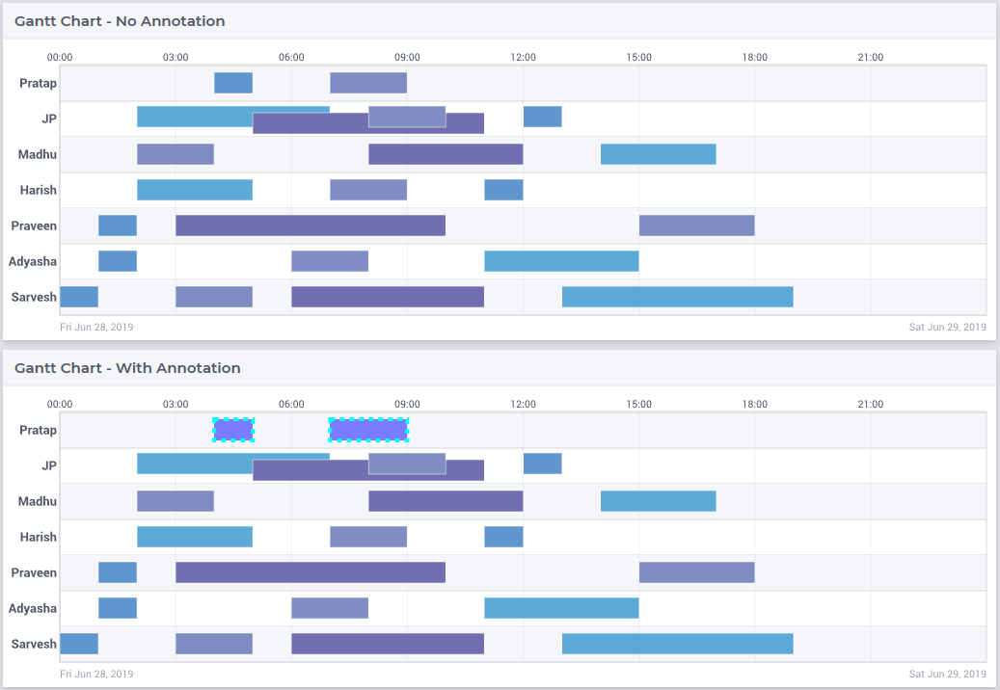

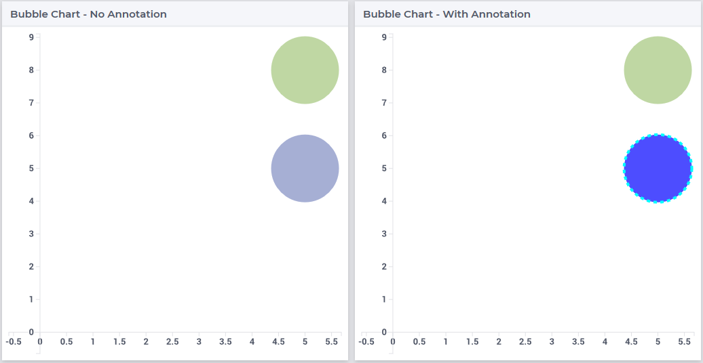

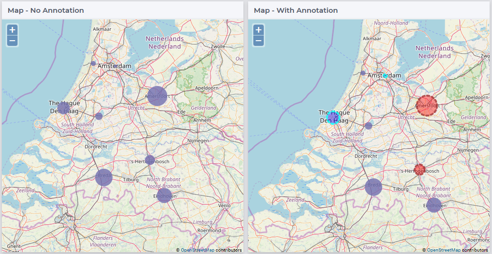

The Table, Treemap Chart and Scalar widget use the DIV element. A DIV defines a division or a section in an HTML document. The 
 element is often used as a container for other HTML elements to style them with CSS or to perform certain tasks with JavaScript. AIMMS supports the use of background and font properties.

The illustration below shows the use of DIV properties to change the background and font of a table cell when the annotation "blue" is added to the identifier. Followed by illustrations of the TreeMap and Scalar widgets.

.. code:: CSS

    .annotation-blue{
    /* fill changes */
	    background: Blue;
        opacity: .5;
	/* text changes */
	    font-size: 30px !important;
        font-family: sans-serif;
        font-style: italic;
        font-weight: bold;
    }

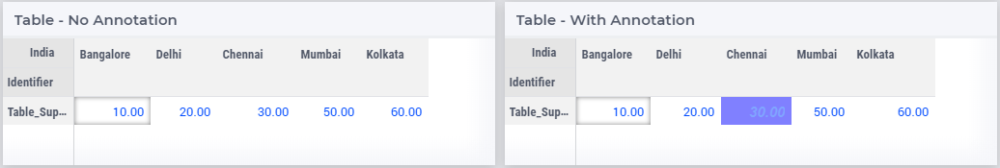

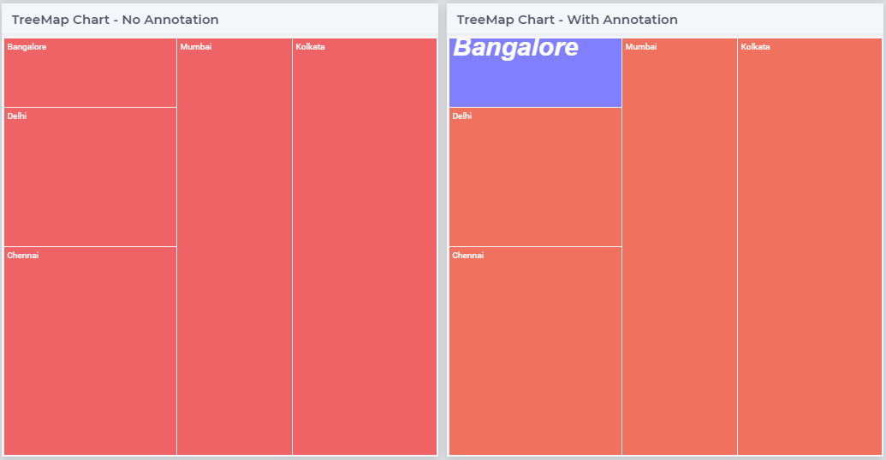

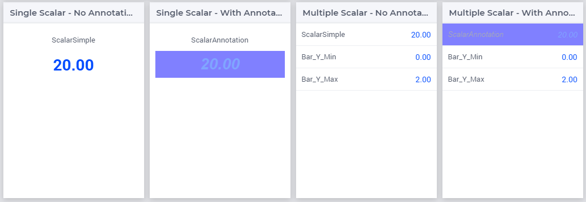

.. tip:: 
    There are hover and select effects on the charts and Map widgets which can be changed, but are not yet supported by AIMMS. If you would like to change the properties of those states as well, please look at our How To document on `changing CSS effects on charts <https://how-to.aimms.com/Articles/315/315-hover-and-select-effects-webui-charts.html>`_.

Highlighting (experimental)
---------------------------

.. important:: Highlighting is available in software versions from AIMMS 4.68.5 onwards as part of Experimental Features. Please reach out to AIMMS support on how to enable Experimental Features.

Next to the annotations mechanism described above, we offer a lightweight way to responsively highlight certain tuples in the Table and the Gantt Chart widget. As opposed to former, this feature removes the need to re-render the whole widget just for highlighting a specific (small) selection of tuples, making it more responsive. To use it, you have to provide an additional string parameter in your model, which has the exact same index domain as the identifier(s) displayed in the widget, extended with an extra index :token:`indexIdentifiers`. You need to specify this identifier in the Highlight option provided in the Miscellaneous tab of the widget's options editor. For example, if you display an identifier :token:`JobDuration(i, j)` in a Gantt Chart, you need to introduce a string parameter like :token:`GanttHighlight(i, j, indexIdentifiers)`. You can choose any identifier name which suits your model.

In your model, you can determine which tuples you want to highlight in your widget, by assigning values to the additional string parameter. For example, you could write something like: 

.. code::

	if JobDuration(i, j) > max_duration then
		GanttHighlight(Selected_i, Selected_j, 'JobDuration') := "exceeds-time-limit";
	endif;

This would result in an annotation :token:`annotation-exceeds-time-limit` on the Gantt Chart's bar representing the :token:`(i, j)` tuple. In css, you could then add a rule like:

.. code-block:: CSS

	.annotation-exceeds-time-limit {
		fill: red;
	}

to color the bar red.

You are of course not restriced to highlight just a single cell. You could also write something like:

.. code::

	if JobDuration(i, j) > max_duration then
		GanttHighlight(Selected_i, j, 'JobDuration') := "exceeds-time-limit";
	endif;

In combination with the css rule above, this would result in all jobs for the :token:`Selected_i` to be colored red. Do however keep in mind that this mechanism is intended for use with a relatively low number of tuples. If you want to style a huge number of tuples, we recommend using the annotations method described above.

If you display more than one identifier in a widget, you can specify the tuples for those by using the corresponding identifier name(s) in the extra index.

Annotations or Flags in Custom Plugins
--------------------------------------

Applying annotations or flags
+++++++++++++++++++++++++++++

Core plugins (widgets, addons, etc.) now prefix all model annotations and flags with e.g. :token:`annotation-` or :token:`flag-` when these are used in HTML element attributes. Additionally, to ensure valid values, all sequences of whitespace are converted into single hyphens: for example, the annotation :token:`some model info` becomes :token:`annotation-some-model-info`.

Core styling has also been updated to adopt this pattern.

To properly prefix annotations or flags, use the :token:`AWF.Util.getAsCSSClasses` utility-method:

.. code-block:: js

    // More usually, these would be requested from the datasource's
    // annotations and flags layers.
    const annotations = ["foo", "bar baz"];
    const flags = ["readOnly"];

    // Generate an array of prefixed, escaped versions of the original
    // model annotations.
    const annotationsAsClasses = AWF.Util.getAsCSSClasses(annotations);

    // The default prefix is "annotation" plus a hyphen, but the second
    // argument allows alternative prefixes.
    const flagsAsClasses = AWF.Util.getAsCSSClasses(flags, "flag");

    // somePluginElQ would be defined elsewhere, and is a jQuery element.
    // This concatenates the prefixed flags and annotations arrays, joins the
    // array items with spaces, then adds them as classes to somePluginElQ.
    somePluginElQ.addClass(annotationsAsClasses.concat(flagsAsClasses).join(" "));

This will result in an element with the following :token:`class` attribute:

.. code-block:: css

    ... class="annotation-foo annotation-bar-baz flag-readOnly" ...

Manipulating and selecting elements by annotations or flags
+++++++++++++++++++++++++++++++++++++++++++++++++++++++++++

Once an annotation or flag has been applied to an HTML element in a plugin, that element can be selected programmatically, or styled, with CSS selectors.

To achieve this, the prefixed annotation or flag should always be CSS-escaped using the standards-track `CSS.escape <https://drafts.csswg.org/cssom/#utility-apis>`_ method. A substitute for this method is provided by the WebUI runtime when the user's browser does not yet support it.

Example 1: Programmatically selecting and manipulating HTML elements by annotation or flag
++++++++++++++++++++++++++++++++++++++++++++++++++++++++++++++++++++++++++++++++++++++++++

Example JavaScript:

.. code-block:: js

    // This selects all widgets with the class "annotation-bar-baz", and adds the
    // class "my-widget" to them.
    $(".aimms-widget." + CSS.escape(annotationsAsClasses[1]))
        .addClass("my-widget")
    ;

Example 2: Using the annotation or flag in a stylesheet
+++++++++++++++++++++++++++++++++++++++++++++++++++++++

The prefixed annotation or flag should still be properly escaped for use in a selector (see `CSS.escape <https://drafts.csswg.org/cssom/#utility-apis>`_), although in these examples it is not strictly necessary. Example CSS:

.. code-block:: css

    /* This styles all text in widgets with the classes "my-widget" and "flag-readOnly" in gray. */
    .my-widget.flag-readOnly {
        color: #808080;
    }

Custom Icon Sets
----------------

Certain features like the Widget Actions or the (experimental) Page Actions may use icons. AIMMS has a predefined list of `1600+ icons <../_static/aimms-icons/icons-reference.html>`_ which can be used. Custom icons can also be used for the aforementioned features by adding the desired icon font to the CSS folder and using the class names defined in the .css file in the icon field in the model specification. The icon font folder will need to have at least the ``.ttf`` file or the ``.woff`` file and the corresponding ``.css`` file, which together define the icon.

When an icon font is downloaded it will have the CSS file with the TTF and/or WOFF files. Just add these to the Resources/CSS folder. To use the icons, open the CSS file and use the class name for the respective icon in the icon filed in the model specification.

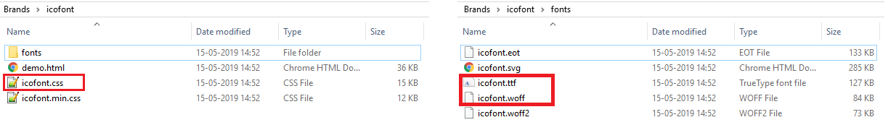

For example, the ``icofont.css`` may have classes defined for each icon as illustrated below:

.. code-block:: css

    .icofont-brand-acer:before
    {
        content: "\e896";
    }

    .icofont-brand-adidas:before
    {
        content: "\e897";
    }

    .icofont-brand-adobe:before
    {
        content: "\e898";
    }

You need to pick the name of the desired icon class and assign it to the icon field in the model specification. eg: :token:`icofont-brand-adidas` 
