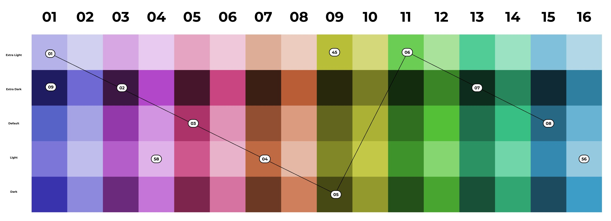
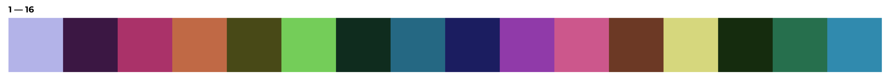
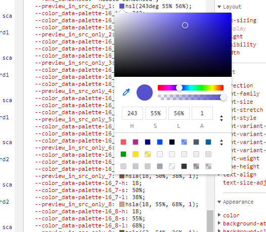

Data Coloring and Palettes
==========================

WebUI comes with some palettes that can be used to color the data in your widgets. For this, most elements of Chart/Map widgets automatically receive the correct annotations to allow each of them to show up in a specific color.

This section offers you some background about how the palette was created, how it should work and how you might deviate from it.

.. note::
     Please note that in AIMMS versions prior to 4.87 the default palette had a length of 19 colors, not 16. Also, the palette was more of a smooth gradient, aimed at making charts pretty, but sometimes also making it harder to tell the difference between adjacent items.

     If you insist on (still) having the older palettes of 19, 11 or 7 colors, or if you want to provide your own colors for the default ordinals, please refer to the section about Custom Palettes

Origin of the default 16-color palette
--------------------------------------
The default palette for charted/mapped elements was created and hand-picked specifically by our design partner, Total Design, in order to try and deal with as many 'difficulties' in displaying data as possible.

The main target was to make sure that consecutive data elements could be distinguished from each other, both within the chart and within a related legend. Moreover, this should also hold true for users that have a Color Vision Deficiency.

The outcome was a palette of 16 base colors, each of which is present at 5 different levels of lightness. Creating a total of 80 colors:

The image also shows how the consecutive colors were then picked from that block of colors, basically using a sawtooth-like pattern. For the final order some manual alterations were done too, but all colors were still picked from these 80. This is the final sequence of 16 colors:

Applying a transparency index: a modified palette
-------------------------------------------------
If you specify a transparency index in your chart settings (:ref:`Combination Chart Widget <combination_chart_widget>` only) another logic will be used to create the colors.
For each color index, the transparency index will start from the 'dark' color (the bottom one in the image above), then the 'light' version, followed by the 'default', the 'extra dark' and finally the 'extra light' version. All to create maximum contrast between the elements again.

Having said that, please understand that we let the web browser calculate these different variations, starting from the 'default' color. If you theme the palette to be different, you will be specifying the default colors, not the whole range of 80 colors. The modifications made for creating the transparency palette might end up looking wrong if your modifications to the default colors do not mix well with the calculations. Expect to see too many colors near white or black when that happens. See the section below for hints.

Although it is allowed for you to modify the base palette, there is no option to tweak the type and amount of modification we use in the calculations for the transparency index colors. That mapping is fixed. The only way to break free from this, is using the (elaborate) method mentioned in the section below about `Specifying a completely different palette`_ .

Custom Palettes
---------------
As always, you can customize our 16-color palette in several ways. Depending on your needs, you might find the following approaches suitable.

.. note::
    If you were (correctly) specifying a custom palette for your application before, using custom Style Sheets, your application should not be looking any different than before. Custom Style Sheet definitions always take precedence over the default definitions, when defined at the same level of `css specificity <https://developer.mozilla.org/en-US/docs/Web/CSS/Specificity>`_.

Modifying the default 16 colors
+++++++++++++++++++++++++++++++
The 16 default colors are specified as color references, part of the regular list of *themable properties* (also see :ref:`Theming <theming>`. Their specification is not done by means of the usual RGB-values, but as separate HSL-values: hue, saturation and lightness. This was done to be able to apply the calculations needed for the transparency index palette and because the origin of the original colors is also a mostly mathematical rotation of hue, saturation and lightness to achieve the goals.

You will find 16 of the following 'triplets' (not counting the preview) for theming. Please also read the hints within the file itself.

.. code-block:: css

  --preview_in_src_only_1: hsla(243, 55%, 56%, 1);
  --color_data-palette-16_1-h: 243;
  --color_data-palette-16_1-s: 55%;
  --color_data-palette-16_1-l: 56%;

The preview is there to help you identify the outcome better when using the web browser's developer toolbar. Also know that the developer toolbar has an extensive editor that opens when you click on the small color preview rectangles. It will allow you to interactively manipulate HSL values or convert to and from RGB, without guessing.

Two important hints to repeat from the base theme file:

* odd and even colors should always be a pair of the same color, but at two different levels of lightness (about 20% to 30% apart with the dark one for the odd number), preferably chosen such that the modified versions for the transparency index do not overlap too much.

* the lightness value of any color should remain between about 25% and 75%, otherwise you will certainly end up with calculated colors that are too pale or too dark.

If you fail to reasonably stay within the above hints, the 'sawtooth selection process' explained above will result in undesirable results.

Reducing the number of colors
+++++++++++++++++++++++++++++
If you want to keep the colors we specified, but would like to reduce the number of colors, you can reduce (only) to either 8, 4 or 2 colors by simply copying/keeping the values of the first 8, 4 or 2 colors to the remaining 16 colors.

You do need to specify all 16, because all calculations use all 16 references. Making them equal to an earlier one will of course make them look like they are the same and like there are less colors in use. Mistakes will again easily show up as disruptions of the color sequences being used.

Specifying a completely different palette
+++++++++++++++++++++++++++++++++++++++++
Using the above, it is perfectly possible to have a different-looking palette. With less variety of color, or a shifted hue experience. Just by changing or copying a few of the parameters used in the calculations done in the browser.

If however you feel like you really just want to override the whole palette and know exactly how things turn out, you could still revert to including custom Style Sheets with your application. This Style Sheet should set the colors for the 16 ordinals as shown in the next example (using your own colors, of course).

.. code-block:: css

  .annotation-Mod16Ord1 {
    fill: #123456;
    background: #123456
    stroke: #654321
  }

  // ... Ord2 through to Ord15 (so 14 items) ...

  .annotation-Mod16Ord16 {
    fill: #654321;
    background: #654321
    stroke: #123456
  }

Not specifying both fill, background and stroke will result in them falling back to the default palette, which could be an odd-looking combination. All three values could be different, but apart from maybe using a specific stroke color, you are better off using the same color for fill and background.

If you plan on using the transparency index option of the Combination Chart, the above is not enough to have a correct palette for that. It will still show the default palette with 'transparency variations'. If you want those to follow your needs too, you need a longer list of overrides that include all the modifications too:

.. code-block:: css

  .annotation-Mod16Ord1.annotation-Mod5Trans1 {
    fill: #123456;
    background: #112233
    stroke: #654321
  }

  // ... Ord1.Trans2 through to Ord16.Trans4 (so another 78 (!) items) ...

  .annotation-Mod16Ord16.annotation-Mod5Trans5 {
    fill: #654321;
    background: #654321
    stroke: #123456
  }

.. note::
    As you can see you are better off using theming and calculated colors, when considering usage of the transparency index option.

Re-activating the older 19, 11 or 7 palette
+++++++++++++++++++++++++++++++++++++++++++
As per the feature deprecation table, we still support the display of the color palette that was in use before AIMMS 4.87.

For that, you need to change one application setting, which is normally also used to apply 'custom themes' to your application: the 'Custom Theme Class' option, as found under Application/Miscellaneous.

This option lets you specify a single, or a space-separated array of names (class names) that will be applied to the top level of the application. You can attach your own programmable customizations to that, but we have reserved three names for setting up the older palettes:

* color-palette-19
* color-palette-11
* color-palette-7

These will all automatically get the 'theme-' prefix, as also documented for this application setting. Have a look at our own AIMMS-WebUI Style Sheet (using the web browser's developer toolbar) to see those definitions again.

.. note::
    * The older palettes will eventually become End-of-Life. Product Updates and the Deprecation Table will keep you notified.
    * Using the Transparency Index data coloring feature for the Combination Chart Widget, combined with the older palettes, might have a negative impact on the performance of your page, especially when showing large amounts of data. Also, instead of creating different levels of lightness for each base color, modifications will also be done by altering the hue and saturation, which means that related data points might not have a directly, visually related color like you get with the 16-color palette.

.. spelling::

    themable
