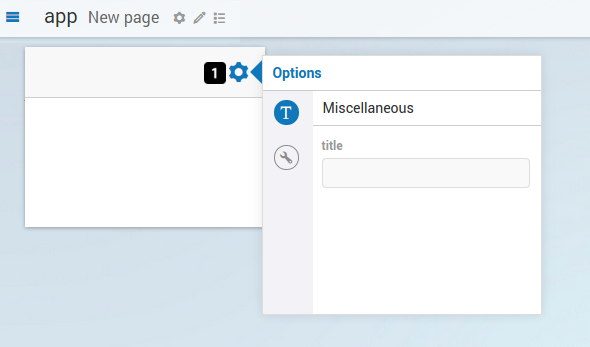
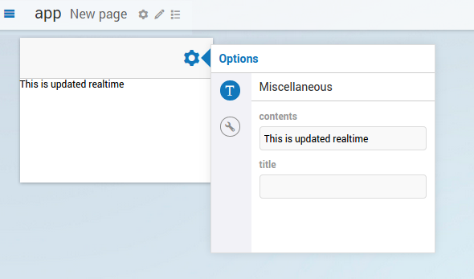

Adding dynamic contents, part I: Options
========================================

In this tutorial you will learn how to extend the widget that we created in
`Writing your first custom widget <dev-tut-1.html>`_ with dynamic contents. Like in the
previous tutorial, we will leave out much of the technical details and underlying design and only explain the
essential things in order to get you up-and-running as soon as possible.

Before we begin - Prerequisites
-------------------------------

To make the most out of this tutorial, it is important that you meet a couple of prerequisites.

First of all, we are going to assume that you already familiarized yourself a bit with the AIMMS WebUI.
Both with the end-usage and the app-development. That you have a recent AIMMS and that you have it
running in your set-up.

Since this is a (software) development tutorial, we are also assuming that you have experience in writing
software in a generic programming language, and, that you have a basic knowledge on HTML5 technologies
(HTML5 DOM, CSS, JavaScript, and the likes). It is also beneficial, however not required, if you are
familiar with `jQuery <http://jquery.org>`_ and, to lesser extent,
`jQuery UI <https://jqueryui.com/>`_, as AIMMS WebUI is built on top of these technologies.

Finally, since this tutorial builds on the previous tutorial, we expect that you have done that tutorial
first. If you have not done so yet, here is a link to `Writing your first custom widget <dev-tut-1.html>`_.

Dynamic contents in AWF
-----------------------

There are two ways of having dynamic contents in an AWF widget. The easiest way is through options; the second way
is through data from AIMMS. In this tutorial we will be explaining the former method. The latter method will be
the topic of a later tutorial.

Options
-------

As already mentioned in `Writing your first custom widget <dev-tut-1.html>`_,
a widget can be manipulated during its lifecycle through the AWF Option Mechanism.
As an option value changes, the widget responds to such a change by updating its associated DOM element.
Likewise, a widget can change the value of an option and thereby make changes in a model.

The basic components of an option
---------------------------------

An option in AWF consists of:
        
* a *name*,
* a *type*, and
* a *value*.

		
An option *name* is just that, a string to identify the option. It should be all lower
case consisting of short nouns separated by periods, not unlike
`Java package names <https://docs.oracle.com/javase/tutorial/java/package/namingpkgs.html>`_. For example:

* :token:`car.interior.steeringwheel`
* :token:`car.door.handle`
* :token:`car.door.window`

An option *type* determines the types of values it can hold (or can be resolved to).
The basic option types in AWF are:
*number*, *string*, *boolean*, *array*, *object* and *datasource*.
These names should speak for themselves, except for, perhaps, the *datasource* option type, which we
will explain in a later tutorial. The framework allows plugins to introduce their own option types, more
on this will also be in a later tutorial.

The option *value* depends, as was stated, on the option *type*. A value of :token:`null`
denotes that a default value, intrinsic to the widget, should be used.

An option is declared and specified in the widget *factory*

Option editors
--------------

Where an option be seen as a widget programmer's means of informing AWF what it wants as input, there also
needs to be a means for an end-user to interact with the widget using that option. In AWF the value of an
option can be manipulated through the UI by means of an option editor. For known option types, AWF will take
care of instantiating the corresponding option editor for each option that is declared in the widget's factory.
All option editors are accessible through the option dialog, which opens by clicking on the gear icon of a widget
(figure 1 - point 1).

Adding an option to our widget
------------------------------
		
Now that we know a little more about the AWF Option Mechanism and how it works with options and option editors,
we can extend our static "Hello AIMMS!" widget with an AWF option. Then, we will be able to change the option's
value through the option editor and finally, we can respond to the option value changes and update the contents
of our widget dynamically.

Inside the factory.js we specify the *contents* option which is of type :token:`string`. We do this inside the
:token:`onInitializeOptionTypes`.

.. code-block:: javascript

    // factory.js

    AWF.Bus.subscribe({
        onCollectTypes: function(collectedTypes, contextElQ) {
            if(!contextElQ || contextElQ.awf.tags("placeable-widget-container")) {
                collectedTypes.push("my-widget");
            }
        },
        onInitializeTags: function(elQ, type) {
            if (type === "my-widget") {
                elQ.awf.tags(["placeable"], 'add');
            }
        },
        onDecorateElement: function(elQ, type) {
            if (type === "my-widget") {
                elQ.aimms_my_widget();
            }
        },
        onInitializeOptionTypes: function(elQ, type) {
            if (type === "my-widget") {
                elQ.awf.optionTypes("contents", AWF.OptionUtil.createOptionType("string"));
            }
        },
    });

Reacting to option changes
--------------------------
		
In the widget we need to use the :token:`onResolvedOptionChanged` function which is automatically invoked by AWF
whenever an option value of the widget changes.
Because we specified the *contents* option in the factory we are now able to listen for changes and
react accordingly. In our case we update the text in the widget.

.. code-block:: javascript

    // jquery.aimms.my-widget.js

    jQuery.widget('ui.aimms_my_widget', AWF.Widget.create({
        _create: function() {
            var widget = this;
            widget.contentElQ = $('
Hello AIMMS!
');

            widget.element
                    .find('.awf-dock.center')
                    .append(widget.contentElQ);
        },
        onResolvedOptionChanged: function(optionName, optionValue) {
            var widget = this;

            if (optionName === "contents") {
                if (optionValue) {
                    widget.contentElQ.text(optionValue);
                } else {
                    widget.contentElQ.text("Empty contents!");
                }
            }
        },
    }));

Changing the value
-------------------

After reloading the browser-tab, if we now open the widget's option dialog and navigate to the miscellaneous
option editor (for historical reasons the icon is still denoted by a :token:`T`), we will see that a new
option editor has become available for the *contents* option. By typing inside the contents
option's text field, we can see that our widgets content is updated! (See figure 2)

And there you have it, your first steps into the world of dynamic widgets in AWF using options. Next tutorial
we will show you how to have dynamic widgets in AWF using data that comes from an AIMMS model.

