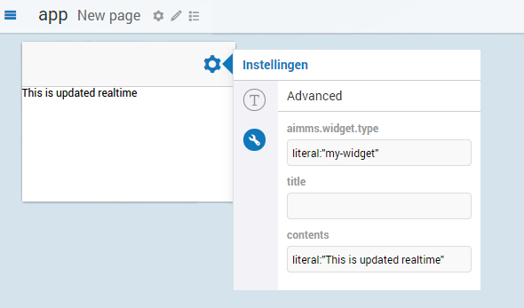
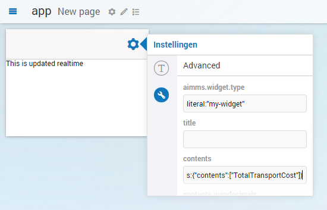
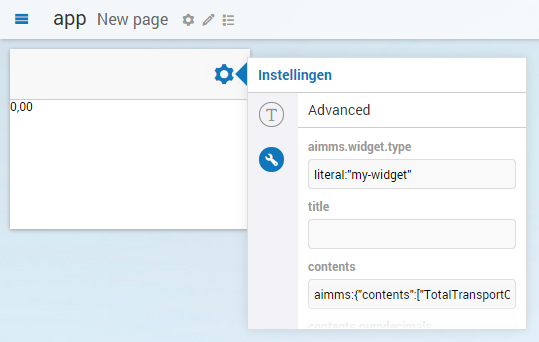
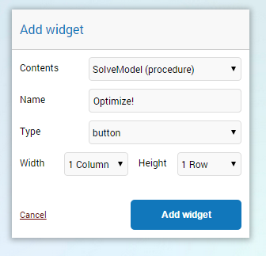
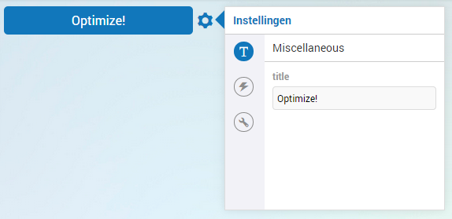
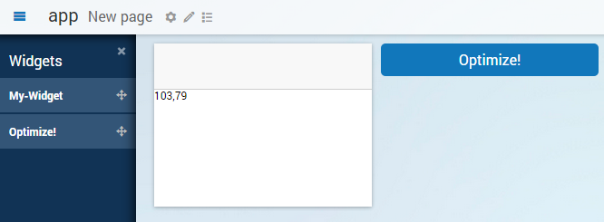

Adding dynamic contents, part II: Simple data from AIMMS
========================================================

.. |pencil| image:: images/pencil-grey.png

.. |plus| image:: images/plus.png

In this tutorial you will learn how to update the widget that we created in
`Writing your first custom widget <dev-tut-1.html>`_ and extended with dynamic contents in 
`Adding dynamic contents, part I: Options <dev-tut-2.html>`_ such that you can change 
its contents from within an AIMMS model. We will go into a little more details on the
*AWF Option Mechanism* that was previously introduced. Like in the previous tutorials, we will
leave out much of the technical details and underlying design and only explain the essential things
in order to get you up-and-running as soon as possible. But this tutorial will be longer and will go
into more details than the previous tutorials.

Before we begin - Prerequisites
-------------------------------

To make the most out of this tutorial, it is important that you meet a couple of prerequisites.

First of all, we are going to assume that you already familiarized yourself a bit with the AIMMS WebUI.
Both with the end-usage and the app-development. That you have a recent AIMMS and that you have it
running in your set-up.

Since this is a (software) development tutorial, we are also assuming that you have experience in writing
software in a generic programming language, and, that you have a basic knowledge on HTML5 technologies
(HTML5 DOM, CSS, Javascript, and the likes). It is also beneficial, however not required, if you are
familiar with `jQuery <http://jquery.org>`_ and, to lesser extent,
`jQuery UI <https://jqueryui.com/>`_, as AIMMS WebUI is built on top of these technologies.

Finally, since this tutorial builds on the previous tutorial, we expect that you have done that tutorial
first. If you have not done so yet, here is a link to `Adding dynamic contents, part I: Options <dev-tut-2.html>`_.

Dynamic contents in AWF - revisited
-----------------------------------

Previously, it was stated that there are two ways of having dynamic contents in an AWF widget. The easiest
method being through the use of options and the other method is to use data from the AIMMS model.
The distinction between these two methods was made for the sake of simplicity. In reality, both methods
use the AWF Option Mechanism, though in a slightly different way. To understand the subtle differences, it is
important to understand how an option, in AWF, gets a value, and, what actually that value in AWF encompasses.

Model data is bound to an AWF option through a process called *data binding*, the process that establishes a connection between the application UI (User Interface) and business logic. If the settings and notifications are correctly set, the data reflects changes when made.
It can also mean that when the UI is changed, the underlying data will reflect that change.

Currently in AWF, an option can be bound to one of the following two sources of data:

* a (local) *literal* value, and
* a (remote) *aimms* value.
 
How to bind data to an option will be explained in the next section.

The basic components of an option (repeat)
------------------------------------------

Recall from `Adding dynamic contents, part I: Options <dev-tut-2.html>`_ that an option in AWF consists of:
 
* a *name*,
* a *type*, and
* a *value*.

Three states of an option value
------------------------------- 

In addition to this, an option value can have three different states:

* *specified*,
* *parsed*, and
* *resolved*.
 

The *specified* value of an option is the option value in its serialized form. It is either :token:`null`, or,
a (JSON/JavaScript) string literal. It has the following syntax:

    :token:`<data-provider>`::token:`<JSON>`
    
    Where:
    
    * :token:`data-provider` is the name of the provider for the data. Currently in AWF there are two data-providers
      available: *literal*² and *aimms*.
    * :token:`JSON` is the object, serialized as JSON, that, together with the option *type*, is used by
      AWF data-binding to resolve the final value.
    
    Notes:
    
    * Examples of specified values:

      * :token:`literal:123`
      * :token:`literal:"Hello AIMMS!"`
      * :token:`aimms:{"contents": ["MyIdentifierA", "MyIdentifierB"]}`

    * In AWF databinding, small simple type-coercion³ is performed when possible. This means that a number will
      be resolved to a string if the option *type* is a string, even when the input is a numerical value, and,
      vice versa (restrictions apply).
    * For the literal data-provider, the resolved value is typically obtained by stripping the *literal*
      prefix from the specified value.

The *parsed* value of an option is an intermediate value state between *specified* and *resolved* and is used
to aid in the transition between the two.

The *resolved* value of an option is the actual option value which a widget typically uses to update its
associated DOM element.

Option editors - revisited
--------------------------

Recall from `Adding dynamic contents, part I: Options <dev-tut-2.html>`_ that an option editor
provides a means to change the value of an option from the UI. To put this more precise, an option editor typically
uses the *resolved value* to draw itself (i.e. its DOM tree), and, when a value is changed by the user using that
option editor, the option editor subsequently uses the *parsed value* to update the *specified value* of
the option. AWF data-binding then picks up the change, potentially causing a new value to resolve and -hence- the
widget to be updated.

Binding AIMMS data to our widget's option
-----------------------------------------

Now that we know a little more about the AWF Option Mechanism and its underlying data-binding mechanism, we can update
our widget such that it gets its value from AIMMS. But first let's have a quick look at the current state of our widget
and see the theory from the previous sections in action.

We start by opening the option dialog again:

.. image:: images/simple-option-editor-of-new-literal-option.png
    :align: center

Now click on the tool icon |wrench|. This will show the *advanced option editor*.
This option editor acts as a fall-back option editor. You can use it to directly manipulate the *specified value*
of an option, when a normal option editor is not (yet) present or even when a normal option editor fails.

Please observe the specified value for the *contents* option. If we recall from the theoretical section that
the specified value of an option has the form: :token:`<data-provider>`::token:`<JSON>`, we can see that
the current version of our widget is using the *literal* data provider:

    =========================  ===================================
     :token:`data-provider`    :token:`JSON`
    -------------------------  -----------------------------------
     ``literal``                ``"This is updated realtime"``
    =========================  ===================================

Now let's see how easy it is to hook up an identifier from the AIMMS model to our widget. For that, we switch to
the *AIMMS* data provider and tell it to resolve the value to that of the :token:`TotalTransportCost` variable from
the model:

    =========================  ============================================
     :token:`data-provider`    :token:`JSON`
    -------------------------  --------------------------------------------
     ``aimms``                 ``{"contents":["TotalTransportCost"]}``
    =========================  ============================================

In other words, change the specified value of the contents option using the advanced option editor to:
:token:`aimms:{"contents":["TotalTransportCost"]}`, like so (do not press enter yet):

Then, when you press enter, the contents of the widget updates:

:token:`0,00`! That may not seem much, but this value is coming from AIMMS! (You can check it if you wish.) And,
because we specified the option type to be a :token:`string` while the underlying data in the model is a numerical
value, AWF even coerced the type for us to a nicely formatted string!

If you're not convinced yet, let's let AIMMS update the model. For this, we add a button to our page. Click the
pencil icon in the top toolbar |pencil| and click the plus icon |plus|
on the side bar that opens. Fill in the fields of the widget wizard that pops up like so:

By default the title of the button is the same as the name of the procedure, but let's use a more inspiring name:

After adding and configuring our new button, the page should look like this:

Now, when we press the new *Optimize!* button, we instruct AIMMS to calculate the optimal solution and update
the *TotalTransportCost* variable that we show in our widget. Let's see what happens...

Et voilà! After pressing the button, our widget updates as expected. And there you have it, your first widget with
data from AIMMS!

Recap
-----

This was quite a big tutorial. Let's do a small recap of what we've learnt today. AWF allows you to *bind* data
to your widget through the use of *options*. Two *data-providers* are readily available in AWF, one for
*literal* values and one for values coming from *aimms*.
An option value has three states (or forms), *specified*, *parsed* and *resolved*. In this tutorial,
we did not have to change any code of our widget, we only changed the *specified* value of our option and changed
the data-provider from *literal* to *aimms*.
Next time, we will continue on this path and show you how to retrieve *multi-dimensional* data from AIMMS.
