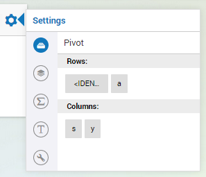
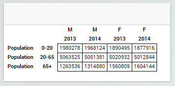

Creating a custom widget with multi-dimensional data from AIMMS
===============================================================

In the previous tutorial
`Adding dynamic contents, part II: Simple data from AIMMS <dev-tut-3.html>`_ we discussed how to 
create a widget that shows scalar data from AIMMS. In this tutorial we will explain  how to create
a widget that is populated with multi-dimensional data from AIMMS. To do so, we will first explain the
concept of pivoting. Pivoting is essential in multi-dimensional widgets because it allows the user to specify 
how the widget should deal with the individual domain indices. After that, we explain the handling of the asynchronous
data requests. As an example, we will build a simple table widget that will display data from a 
high dimensional identifier in AIMMS.

Before we begin - Prerequisites
-------------------------------

To make the most out of this tutorial, it is important that you meet a couple of prerequisites.

First of all, we are going to assume that you already familiarized yourself a bit with the AIMMS WebUI.
Both with the end-usage and the app-development. That you have a recent AIMMS and that you have it
running in your set-up.

Since this is a (software) development tutorial, we are also assuming that you have experience in writing
software in a generic programming language, and, that you have a basic knowledge on HTML5 technologies
(HTML5 DOM, CSS, Javascript, and the likes). It is also beneficial, however not required, if you are
familiar with `jQuery <http://jquery.org>`_ and, to lesser extent,
`jQuery UI <https://jqueryui.com/>`_, as AIMMS WebUI is built on top of these technologies.

More specifically, since we will be creating an HTML table widget, we assume that you are familiar with
the basics to create an `HTML table <http://www.w3.org/wiki/HTML_tables>`_.

Finally, since this tutorial uses the concepts that have been introduced in the previous tutorials, we expect that 
you have completed the previous tutorials 
(`Writing your first custom widget <dev-tut-1.html>`_,
`Adding dynamic contents, part I: Options <dev-tut-2.html>`_, and
`Adding dynamic contents, part II: Simple data from AIMMS <dev-tut-3.html>`_) first.

Pivoting
--------

A pivot table usually consists of row, columns and data fields in which the user has freedom to position the labels
in the rows or in the columns creating an overview that provides him the most insight. In addition, most pivot tables
do support some kind of automatic aggregation of data. Although AWF does have support for automatic aggregation of
values, this topic will <b>not</b> be discussed in this tutorial. This tutorial will focus on the freedom of the user 
to position	the *element* labels where he wants to see them. 

The following example further illustrates the concept of the pivoting. Consider the following 
3-dimensional data that contains population numbers per sex, age group and year.
            
.. code-block:: javascript

    Population('0-20', M,2013) = 1,980,278
    Population('0-20', F,2013) = 1,890,495
    Population('20-65',M,2013) = 5,063,525
    Population('20-65',F,2013) = 5,020,932
    Population('65+',  M,2013) = 1,263,536
    Population('65+',  F,2013) = 1,560,809
    Population('0-20', M,2014) = 1,968,124
    Population('0-20', F,2014) = 1,877,916
    Population('20-65',M,2014) = 5,051,381
    Population('20-65',F,2014) = 5,012,844
    Population('65+',  M,2014) = 1,314,880
    Population('65+',  F,2014) = 1,604,144

When positioning the *age group* and *sex* indices in the rows and the *year* index in the columns,
the table will look like:
            
===== === ==========  =========            
		  2013        2014 
----- --- ----------  ---------
0-20  M   1,980,278   1,968,124
      F   1,890,495   1,877,916
20-65 M   5,063,525   5,051,381
      F   5,020,932   5,012,844
65+   M   1,263,536   1,314,880
      F	  1,560,809   1,604,144
===== === ==========  =========            

However, when positioning the *sex* and *year* indices in the rows and the *age group* index
in the columns, the same data will now look like:

= ===== =========== =========== ==========            
         0-20        20-65       65+
- ----- ----------- ----------- ----------
M 2013   1,980,278   5,063,525   1,263,536
  2014   1,968,124   5,051,381   1,314,880
F 2013   1,890,495   5,020,932   1,560,809
  2014   1,877,916   5,012,844   1,604,144
= ===== =========== =========== ==========            

Also note that the order of the indices may influence the appearance of the table. For example, changing the order of
the *sex* and *year* indices in the above table will yield the following table:
            
==== == ==========  ===========  =========            
         0-20        20-65       65+
------- ----------  -----------  ---------
2013 M   1,980,278   5,063,525   1,263,536
     F   1,890,495   5,020,932   1,560,809
2014 M   1,968,124   5,051,381   1,314,880
     F   1,877,916   5,012,844   1,604,144
==== == ==========  ===========  =========     
       
Partitioning the indices
++++++++++++++++++++++++

In the above example every one of the three indices needs to be assigned to either the *rows* or the *columns*.
In case of a table, the *rows* and *columns* can be viewed as the parts. In a gantt chart, parts like *resources* 
(to specify the resource rows to be rendered) and *jobs* (to specify what indices to be used to color the bars) would 
probably make more sense.

In general, an *index partition* can be defined as a partition of *m* indices into *n* parts. *Pivoting* is the 
process that results in an index partition.

Pivoting support has been implemented as a generic AWF option editor that is available for widget developers. Pivot support is
automatically added to a widget whenever the *pivotable contents property* tag has been specified in the widget's factory.
The simple table widget that will be created later in this tutorial will illustrate this.

In addition to using the *pivotable contents property* tag, 

Extending a widget with pivoting support
++++++++++++++++++++++++++++++++++++++++

AWF has built-in pivoting support that can be added to a widget by adding the *pivotable contents property*
to a widget. Doing so, the widget will be extended with a pivot option editor that helps the user specify the partition.

The pivot editor in figure 1 shows four indices. In addition to the domain indices of the identifier (which, in
figure 1 are the *a* (age-groups), *s* (sex) and *y* (year) indices, the pivot option
editor also shows the *<IDENTIFIER-SET>* index which allows the user to control the position of
the identifier title in the widget. This index is always added by AWF and is specially useful in case the widget
displays data of more than one identifier (with potential different index domains). In this tutorial we will
only display a single identifier in a widget.

Datasources, parts and values
-----------------------------

By selecting a single row in each part of the datasource, all indices will have a fixed value, which uniquely identifies a single value
in the datasource. 

The data that is associated with a datasource can be divided into two groups:

  * Data that represents the labels of the indices in the parts. For every part, a 2-dimensional *datablock* is available that provides
    these labels though a :token:`get(r,c)` interface. The number of columns in this structure is equal to the number of indices
    assigned to the part. The number of rows in this structure is determined by the combination of labels (for the indices that play a 
    role) for which the identifier in the AIMMS model contains data. The row header in the table widget can be viewed as mental
    representation of the 2-dimensional structure associated with the *rows* part.
  * Data that represents the actual values of the identifier. To access these data, an *n* (where *n* is the number
    of parts) dimensional *datablock* is available that provides the values through a :token:`get(r1,r2,...,rn)` interface (where 
    *r1* refers to row number *r1* in the first part, etc.

Asynchronous data retrieval
---------------------------

Whenever the option type of the *contents* has the JavaScript *type* property "datasource", its resolved value will
be an AWF datasource object. The AWF datasource object has a *requestDataBlocks* method that should be used to request
data in an asynchronous manner. The 3rd arguments of this function is a callback function that will be called when the requested
data is available. For example, consider a datasource with two parts named *rowHeader* and *colHeader*. To retrieve
the data for both parts as well as for the resulting *grid* area, the following JavaScript statement can be used:

.. code-block:: javascript
            
    dataSource.requestDataBlocks(
        [
            {start: 0, end: dataSource.values.getNumRows()},
            {start: 0, end: dataSource.values.getNumCols()},
        ],
        ["values"],
        function onReady(dataBlocks) {
            ['rowHeader', 'colHeader', 'values'].forEach(function(type) {
                var partDataSource = dataSource[type];
                partDataSource.getNumRows().times(function(row) {
                    partDataSource.getNumCols().times(function(col) {
                        console.log('The value in cell ( '+ row + ',' + col +
                                    ') of the ' + type + ' part is '+
                                    dataBlocks[type].getLayer("values").get(row, col));
                    });
                });
            });
        }
    );	

Simple table factory
--------------------

As mention in `Writing your first custom widget <dev-tut-1.html>`_ you typically start
with creating a widget factory. The widget factory for the simple table looks like:
 
.. code-block:: javascript

    (function($) {
    // factory.js
    var OptionTypeTable =
    {
        type : "datasource",
        parts : [ {name : "rowHeader"}, {name : "colHeader"} ],
    };

    AWF.Bus.subscribe({

        onCollectTypes: function(collectedTypes, contextElQ) {
            if(!contextElQ || contextElQ.awf.tags("placeable-widget-container")) {
                collectedTypes.push("my-widget");
            }
        },

        onInitializeTags: function(elQ, type) {
            if(type === 'my-table-widget') {
                elQ.awf.tags(["placeable", "pivotable contents property", "my-table-widget"], 'add');
            }
        },

        onInitializeOptionTypes: function(elQ, type) {
            if(type === 'my-table-widget') {
                AWF.OptionTypeCollector.addOptionType(elQ, "contents", OptionTypeTable);
            }
        },

        onDecorateElement: function(elQ, type) {
            if(type === 'my-table-widget') {
                elQ.aimms_my_table();
            }
        },
    });

    })(jQuery);

.. |contents-icon| image:: images/contents-option-editor-icon.png

    
When using the widget factory, AWF will contribute several option editor to the widget that
help the user specifying the option values. In addition to the *Miscellaneous* option
editor and the *Advanced* option editor that have been discussed in previous tutorials,
the table widget in this tutorial will be extended with three more option editor:
 
* A contents editor, indicated by the |contents-icon| icon,
  that will provide the user of the widget with an alternative and convenient way to select the
  identifier to be shown in the widget. The contents option editor shows the contents
  of a widget that shows data of the *Population* identifier.

  .. image:: images/contents-option-editor.png
    :align: center
 
* A totals editor, indicated by the |totals-icon| icon,
  that is automatically added by AWF whenever you create a widget that has a contents option of
  type *datasource*. The totals editor however will not be discussed in this tutorial.
  A pivoting option editor, indicated by the |pivot-icon| icon,
  that is added as a result of using the *pivotable contents property* tag. The pivot option
  editor was already shown in figure 1.

Creating the widget source file
-------------------------------

To create the source file for the widget, you should create a JavaScript source file in the same
folder as the factory file with the following structure

.. code-block:: javascript

    (function($) {

    var MyTableWidget = AWF.Widget.create({

        _create: function _create() {
            // TODO
        },
        
        _createHtmlTable: function _createHtmlTable(rowHeaderDimension,colHeaderDimension) {
            // TODO
        },

        _fillTable: function _fillTable(dataSource) {
            // TODO
        },

        _refresh: function(dataSource) {
            // TODO
        },
        
        onResolvedOptionChanged: function(optionName, value) {
            // TODO
        },
    });
    // The jQuery-UI way of registering/creating a new widget:
    $.widget('ui.aimms_my_table', MyTableWidget);

    })(jQuery);

    
The individual methods in this file will be discussed in the remainder of this tutorial.

Creating the widget container
-----------------------------
        
.. code-block:: javascript

    _create: function _create() {
        var widget = this;

        widget.tableContainerElQ = $('&lt;div&gt;&lt;/div&gt;');
        widget.tableElQ = $('&lt;table&gt;');

        widget.tableContainerElQ
            .append(widget.tableElQ);

        widget.element.find('.awf-dock.center')
            .append(widget.tableContainerElQ);
    }

The above *_create* function creates an empty DOM container element, that is appended to
the widget's element that has already been created by AWF. The empty container object is used
later on to fill it with addition DOM elements that will render the actual table widget. This cannot
be accomplished during creation of the widget, because, at that time, the option values and
data is not yet available. Using a humble *_create* that just creates an empty container element
to be used later on, is a typical pattern that is often used when creating AWF widgets.

Handling content option changes changes
---------------------------------------

Content option changes are triggered by AWF whenever the user changes the specified value of the option at hand 
(e.g. by selecting an identifier using the option editor), and/or whenever the data of the underlying AIMMS identifier
changes. Depending on the widget this may require a complete redraw of the widget.

Because a data change may require a change in the dimensions of the table, it is easier to recreate the HTML from
scratch ever time, instead of trying to figure out whether the data change is a structural change (i.e. a change
that involves a change in the dimensions of the table), or just the change of a simple number.

Whenever the user empties the contents option, the widget will receive a *resolved option change* with
value *undefined*. For this reason, you should make sure the *refresh* function will be able
to deal with this situation.

.. code-block:: javascript

    onResolvedOptionChanged: function(optionName, value) {
        var widget = this;
        if(optionName === "contents") {
            widget._refresh(value);
        }
    }

Refreshing the table
--------------------

In this tutorial, we will refresh the table by

* redrawing the HTML from scratch
* requesting *all* data from the dataSource 
* upon retrieval of the data, the empty table will be filled with the data

The *_refresh* function below takes care of this.
        
.. code-block:: javascript

    _refresh: function(dataSource) {
        var widget = this;
        
        var rowHeaderDimension = { numRows:0, numCols: 0 };
        var colHeaderDimension = { numRows:0, numCols: 0 };

        if(dataSource) {
            rowHeaderDimension = { numRows:dataSource.rowHeader.getNumRows(), 
                                   numCols:dataSource.rowHeader.getNumCols() };
            colHeaderDimension = { numRows:dataSource.colHeader.getNumCols(), 
                                   numCols:dataSource.colHeader.getNumRows() };
        }
        
        widget._createHtmlTable(rowHeaderDimension, colHeaderDimension);
        widget._fillTable(dataSource);
    }

Creating the HTML table
-----------------------

The *_createHtmlTable* function below creates an empty HTML that gives the table the dimensions
that are provided in the arguments. The function uses standard JavaScript and jQuery functions
to create an HTML table. Every cell in the table will be decorated with some extra CSS classes to indicate
the part (*rowHeader*, *colHeader* or *values*) and the position of the cell within
the part (for example *row3* and *col2*). These CSS classes can be used later on to style
the table to your liking.
            
.. code-block:: javascript

    _createHtmlTable: function _createHtmlTable(rowHeaderDimension,colHeaderDimension) {

        var numRowsInRowHeader = rowHeaderDimension.numRows;
        var numColsInRowHeader = rowHeaderDimension.numCols;
        var numRowsInColHeader = colHeaderDimension.numRows
        var numColsInColHeader = colHeaderDimension.numCols;
        
        // Helper function to create table cell 'th' or 'td' element with extra classes
        // For example, createCellElQ('th', 'foo', 3, 4) ==> '&lt;th class="foo row3 col4"&gt;&lt;/th&gt;'
        function createCellElQ(type, name, row, col) {
            return $(['<', type, ' class="', name, ' row'+row, ' col'+col, '"></', type, '>'].join(''));
        }

        // Step 1: Create the column header
        var theadElQ = $('&lt;thead&gt;');
        numRowsInColHeader.times(function(col) {
            var trElQ = $('&lt;tr&gt;');
            numColsInColHeader.times(function(row) {
                trElQ.append(createCellElQ('th', 'colHeader', row, col));
            });
            theadElQ.append(trElQ);
        });

        // Step 2: Add the pivot area, i.e. the 'empty' block in the upper-left corner of the table
        theadElQ.find('tr:first').prepend('&lt;th colspan="'+numColsInRowHeader+'" rowspan="'+numRowsInColHeader+'"&gt;&lt;/th&gt;');

        // Step 3: Create the row header and grid
        var numColsInGrid = numColsInColHeader;
        var tbodyElQ = $('&lt;tbody&gt;');
        numRowsInRowHeader.times(function(row) {
            var trElQ = $('&lt;tr&gt;');
            numColsInRowHeader.times(function(col) {
                trElQ.append(createCellElQ('th', 'rowHeader', row, col));
            });
            numColsInGrid.times(function(col) {
                trElQ.append(createCellElQ('td', 'values', row, col));
            });
            tbodyElQ.append(trElQ);
        });

        // Step 4: Construct the table
        var widget = this;
        widget.tableElQ.empty();
        widget.tableElQ.append(theadElQ);
        widget.tableElQ.append(tbodyElQ);
    }
    
Filling the HTML table with data
--------------------------------

To fill the table that has been created using the *_createHtmlTable* function with data, we will call the
*requestDataBlocks* handler. The *callBack* is called whenever the data is received by the browser, so
the actual filling of the table with data will be performed by the handler. The *_fillTable* function below
fills the table with data:

.. code-block:: javascript
            
    _fillTable: function _fillTable(dataSource) {
        if (dataSource) {
            var widget = this;
            var numRowsInGrid = dataSource.values.getNumRows();
            var numColsInGrid = dataSource.values.getNumCols();
            
            // Helper function to fill table cell with content
            function updateTableCell(type, row, col, text) {
                widget.tableElQ.find('.'+type+'.row'+row+'.col'+col).text(text);
            }
            
            // 2. Fill the table  (uses asynchronous data retrieval)
            dataSource.requestDataBlocks(
                [
                    {start: 0, end: numRowsInGrid},
                    {start: 0, end: numColsInGrid},
                ],
                ["values"],
                function onReady(layeredDataBlocks) {
                    ['rowHeader', 'colHeader', 'values'].forEach(function(type) {
                        var partDataSource = dataSource[type];
                        partDataSource.getNumRows().times(function(row) {
                            partDataSource.getNumCols().times(function(col) {
                                updateTableCell(type, row, col, layeredDataBlocks[type].getLayer("values").get(row, col));
                            });
                        });
                    });
                }
            );
        }
    }
	
After hooking up the simple table widget to an AIMMS model that provides data similar to the
*Population* data example from the introduction the simple table widget will look as
shown below.

    
Please keep in mind that the widget code as is presented in this tutorial will extend the widget
area when the number of rows and/or column in the table gets too large. This can be resolved using
the proper CSS classes or even better only determining the number of cells to be displayed based
on the available width and height of the widget. Both approaches fall outside the scope of this
tutorial

Also note that the simple table widget in this tutorial retrieves all identifier data in one go.
For this reason, the widget in this tutorial is not useful for very large AIMMS identifiers.
For large AIMMS identifiers, you would probably need to implement some kind of paging/scrolling
in your widget.

Recap
-----

The main topics that were discussed in this tutorial were

* how to use AWF *datasources* to fill you widget with multi-dimensional data from AIMMS.
* the concept of *pivoting* and how to extend your widget with pivoting support.

