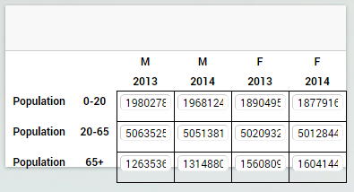
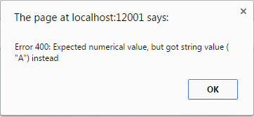

Changing data in AIMMS
======================

n this tutorial you will extend the table widget that has been built in `the previous tutorial <dev-tut-4.html>`_ with
*edit support*. This will allow the end user to change model data by changing values in the
widget.

Before we begin - Prerequisites
-------------------------------

To make the most out of this tutorial, it is important that you meet a couple of prerequisites.

First of all, we are going to assume that you already familiarized yourself a bit with the AIMMS WebUI.
Both with the end-usage and the app-development. That you have a recent AIMMS and that you have it
running in your set-up.

Since this is a (software) development tutorial, we are also assuming that you have experience in writing
software in a generic programming language and that you have a basic knowledge of HTML5 technologies
(HTML5 DOM, CSS, Javascript, and the likes). It is also beneficial, however not required, if you are
familiar with `jQuery <http://jquery.org>`_ and to a lesser extent
`jQuery UI <https://jqueryui.com>`_ as AIMMS WebUI is built on top of these technologies.

More specifically, since we will be creating an HTML table widget, we assume that you are familiar with
the basics to create an `HTML table <http://www.w3.org/wiki/HTML_tables>`_.

Finally, since this tutorial uses the concepts that have been introduced in the previous tutorials and in particular
'tutorial-4', we expect that 
you have completed the previous tutorials 
((`Writing your first custom widget <dev-tut-1.html>`_,
`Adding dynamic contents, part I: Options <dev-tut-2.html>`_, 
`Adding dynamic contents, part II: Simple data from AIMMS <dev-tut-3.html>`_, and
`Creating a custom widget with multi-dimensional data from AIMMS <dev-tut-4.hmtl>`_) first.

Sending data changes to AIMMS
-----------------------------

Whenever the option type of the *contents* has the JavaScript *type* property "datasource", its resolved value will
be an AWF datasource object. As mentioned in the previous tutorial, data that represents the actual values of the identifier is 
accessed through the *values* part of the datasource. To change identifier data the AWF datasource.values object has a 
*requestSetValues* method that should be used to send data changes to the model. For example, to change the value in cell
(0,1) of a table to 1234, the following JavaScript statement can be used:

.. code-block:: javascript
            
    dataSource.values.requestSetValues([{
        ranges: [{start:0,end:1},{start:1,end:2}],
        layerName: "values",
        value: 1234
    }], function onDone(status) {
        // handle model feedback
    });

The *requestSetValues* method can only be used on a datasource that is *up-to-date*. An because a datasource
is invalidated by a data change itself, the datasource reference needs to be refreshed by obtaining the value from the
*contents* option. Typically, this can be taken care of automatically as, after a data change, the widget will 
receive a *resolved option change* for the *contents* option with the up-to-date datasource as its value. 
This is the approach we will take in this tutorial.

Creating the input elements
---------------------------

To make sure that the user of the widget can provide input, we will update the table that has been created in the
previous tutorial. For this purpose, every :token:`<td>` HTML element will be populated with an extra
:token:`<input>` element.

First, we will add a function *createInputElQ* (in the function *_createHtmlTable* from the previous
tutorial, just beneath the function *createCellElQ*):

.. code-block:: javascript
            
    function createInputElQ(name, row, col) {
        return $(['&lt;td&gt;&lt;input type="text" class="', name, ' row'+row, ' col'+col, '"&gt;&lt;/input&gt;&lt;/td&gt;'].join(''));
    }

In addition, we change the code that build the row header and grid area to

.. code-block:: javascript

    var numColsInGrid = numColsInColHeader;
    var tbodyElQ = $('&lt;tbody&gt;');
    numRowsInRowHeader.times(function(row) {
        var trElQ = $('&lt;tr&gt;');
        numColsInRowHeader.times(function(col) {
            trElQ.append(createCellElQ('th', 'rowHeader', row, col));
        });
        numColsInGrid.times(function(col) {
        var gridElQ = 
            trElQ.append(createInputElQ('values', row, col));
        });
        tbodyElQ.append(trElQ);
    });

In addition, we need to update the *updateTableCell* function (inside the *_fillTable* function) because, 
for an :token:`<input>` element, we now need to set the *value* attribute to initialize the cell with a value.
The function should be updated as follows:

.. code-block:: javascript

    function updateTableCell(type, row, col, text) {
        var cellElQ = widget.tableElQ.find('.'+type+'.row'+row+'.col'+col);
        if ( type == "values" ) {
            cellElQ.attr('value',text);
        } else {
            cellElQ.text(text);
        }
    }

    

As shown in Figure 1 the :token:`<input>` elements do show the value but do not yet nicely fit into the 
:token:`<td>` elements. To resolve this we will remove all CSS styling from the :token:`<input>` 
elements through project specific CSS. To do so, create a CSS file	(next to the JavaScript file that contains the 
widget code) and fill it with the following CSS rules:

.. code-block:: CSS

    .tag-my-table-widget input {
        padding: 0;
        margin: 0;
        border-style: none;
    }

which will render the table as it was rendered in the previous tutorial but with extra :token:`<input>` elements.

Handling the new input in the table
-----------------------------------

It is now possible to edit the value in a cell of the table. However, the change is not yet send to the AIMMS model.
To make this happen, we will extend the :token:`<input>` elements with a *change* handler. To do so,
we extend the function *updateTableCell* as follows:

.. code-block:: javascript

    function updateTableCell(type, row, col, text) {
        var cellElQ = widget.tableElQ.find('.'+type+'.row'+row+'.col'+col);
        if ( type == "values" ) {
            cellElQ.attr('value',text);
            cellElQ.on('change',function(event){
                // TODO send data change to model
            });
        } else {
            cellElQ.text(text);
        }
    }

As documented  in the jQuery API, the jQuery `*change* <https://api.jquery.com/change/>`_
handler is called with an `*event object* <http://api.jquery.com/category/events/event-object/>`_ 
as its argument that contains a reference to the *target* element that initiated the event. 
In our case, the :token:`<input>`	element. The new value that is specified by the user is accessible 
through the <code>event.target.value</code> object. Because the :token:`<input>` element has been initialized
with *type* attribute set to *text*, all input values are retrieved as strings. The
*requestSetValues* method however expects a number whenever the underlying AIMMS identifier is numerical.
We will use the JavaScript function *parseFloat* to check whether the input is a number or not. Whenever
the *parseFloat* return the JavaScript value *NaN* (i.e. not-a-number), we will pass the new value as
a string. To check for the JavaScript *NaN* value, we use the *isNaN* function from the 
`lodash <https://lodash.com/>`_ library, which is bundled with the WebUI.

The data change handler in this tutorial is implemented as follows:

.. code-block:: javascript
        
    function(event){
        var newValue = parseFloat(event.target.value);
        if ( _.isNaN(newValue) ) { 
            // newValue is not-a-number, it will be passed as a string
            newValue = event.target.value;
        }
        dataSource.values.requestSetValues([{
            ranges: [{start:row,end:row+1},{start:col,end:col+1}],
            layerName : "values",
            value: newValue
        }],function onDone(status) {
            // TODO handle error
        });
    });

Error handling
--------------

The *onDone* method has a *status* object as its argument. Any *status code* other than
the number 200 indicates an error. In case of an error, the *status description* contains a description
of the error. The following *onDone* handler will, in case of an error, show a dialog box with the error code 
and description. In addition, the *value* attribute of the cell will be restored to its original value
(which is still in scope) and the jQuery *blur* method will be called to remove the focus from the
cell element.
            
.. code-block:: javascript

    function onDone(status) {
        if ( status.code !== 200 ) {
            alert('Error '+status.code+': '+status.description);
            // revert value
            cellElQ.attr('value',text);
            cellElQ.blur();
        }
    });

Having added the above *onDone* handler, the widget will come up with an popup whenever you try to enter
the string "A" as a new value (figure 2).

Disclaimer
----------

When working with model data, not all data may be editable in the first place. Please note that the table we
built in this tutorial does not take this into account. AWF is able to provide whether a certain cell is
*readOnly*. Based on this information, you should adjust your widget to prevent *readOnly* cells
from being editable. This however falls outside the scope of this tutorial.

When writing a widget that should be able to deal with large amounts of data, creating an :token:`<input>`
with a handler for every cell in the table might not be the best way to go. Instead you migth consider to have
one global table handler that is able to deal with generic cell changes instead.

The data change handler that is used in this widget sends a number to AIMMS whenever the input can be parsed as
a number. You migth get into troubles when you want to send a string that contains just numbers to AIMMS
(for example the string "4321"). To cover for this case you need to build in more intelligence into your
widget code.

Recap
-----

The main topics that were discussed in this tutorial were

* how to extend your widget with input fields.
* how to communicate input changes in the widget to your model.

Downloads
---------

* :download:`factory.js <resources/factory.js>`
* :download:`jquery.aimms.tutorial-table.js <resources/jquery.aimms.tutorial-table.js>`
* :download:`jquery.aimms.tutorial-table.css <resources/jquery.aimms.tutorial-table.css>`

