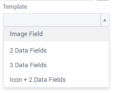
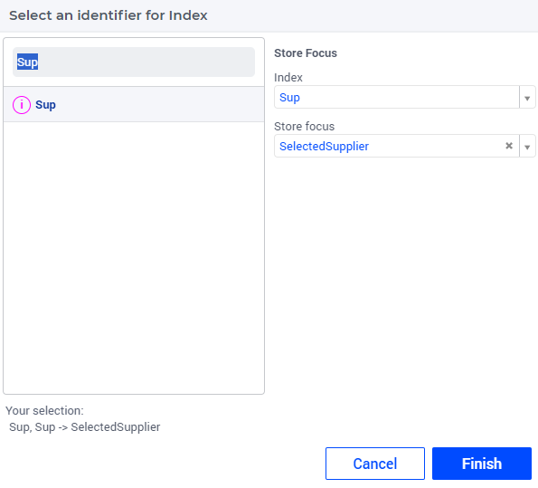
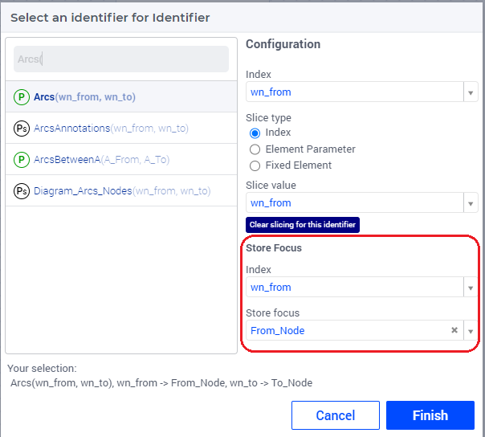
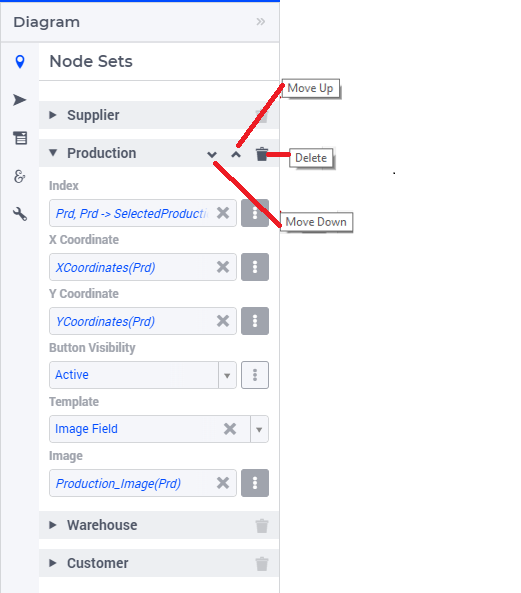

.. _diagram_widget:

Diagram Widget
========================

.. |nodeset| image:: images/Icon_NodeSet.png
.. |arcset| image:: images/Icon_ArcSet.png
.. |heatmap| image:: images/Icon_Heatmap.png
.. |miscicon| image:: images/Icon_Misc.png
.. |widgetactionicon| image:: images/Icon_WidgetActions.png
.. |advicon| image:: images/Icon_Advanced.png

| The Diagram widget offers a versatile and dynamic solution for visualizing project diagrams, encompassing network flow, pipelines, layouting, and more.
| Comparable to the Network Object widget in the WinUI, this widget type provides enhanced features and flexibility.

.. important::

    | The **Diagram widget type** was introduced in **AIMMS version 4.24.3**, available initially as an *Experimental Feature*. To utilize it, simply toggle on the **'Diagram Widget Type'** feature in the Experimental Features dialog.
    | Please note that the Diagram widget is exclusively supported on pages featuring a grid layout and is incompatible with Classic pages.
    | If a Diagram widget is placed on a page with a classic layout (e.g., through copy and paste), it becomes unusable and displays an incompatibility message.

Creating a Diagram Widget
-------------------------
	
A Diagram widget can be added to a page using the same steps as for any other widget, as outlined in the `adding a new widget <widget-manager.html>`_ section. After adding the Diagram widget type, you can access its Settings by clicking on the Settings wheel icon to bring up its options editor, as displayed in the image below.

 .. image:: images/Diagram_StartLayout.png
    :align: center

In the options editor, you will find the following sections:

*	|nodeset| Node Sets: Multiple node sets can be added here.
*	|arcset| Arc Set: Just a single arc set can be added here.
*	|widgetactionicon| Widget Extensions: Configure `Widget actions <widget-options.html#widget-actions>`_ and `Item actions <widget-options.html#item-actions>`_ here.
*	|miscicon| Miscellaneous: Control the Title, Zoom, Center X, Center Y and Visibility options here.
*	|advicon| Advanced: Advanced options for this widget are available here.

Adding Node Sets
-------------------

Navigate to the "Node Sets" section. Click on the "+" sign button located at the bottom. This action will allow you to add details for the Node Set Options:

 .. image:: images/Diagram_NodeSetsOptions.png
    :align: center
    :scale: 75

The available options to be specified are the following:
	
*   **Index:** Select the index of the node set to be displayed. While configuring this Index, you can set the Store Focus element parameter info.
*   **X Coordinate:** A 1-dimensional parameter specifying the X-coordinates for the nodes within this selected index.
*   **Y Coordinate:** A 1-dimensional parameter specifying the Y-coordinates for the nodes within this selected index.
*   **Button Visibility:** An option either controlled through a scalar string parameter or by selecting one of the three available values, to control the visibility of the "Add Node" button on the canvas of this node set. If the value of this option is "Active", the respective Node button is visible on the lower-middle of the canvas. If it is "Inactive", the respective Node button is visible but is inactive, greyed out. If it is "Hidden" or any other value, then this Node button is not visible at all on the canvas.
*	**Template:** This is an optional field. If left unspecified, the respective nodes will be shown with a default UI. This option offers four template options, each affecting how nodes are presented on the canvas:

Please note that the X- and the Y-coordinates are registered in the model when you put nodes on the diagram, or move them. This works in both directions: changing the value of these parameters from within the model will affect the actual positions of the nodes.

Templates for Nodes
^^^^^^^^^^^^^^^^^^^^^

 .. image:: images/Diagram_Templates_NoneSelected.png
    :align: center

| **None selected:** When either no template is chosen, or when a template is selected but not all of its related options are configured (yet), the nodes are displayed using the default UI.
| The image above illustrates the Supplier Node Set without a value set for its Template option, resulting in the nodes being presented on the canvas with the default UI. This default UI just displays the element names of the corresponding node set in the AIMMS model.

 .. image:: images/Diagram_Templates_Image.png
    :align: center

| **Image Field:** This template is ideal for presenting nodes with individual images. Each node can be associated with a unique image.
|   **Image:** A 1-dimensional string parameter specifying the image information for each individual node.
| 
| The image above illustrates the Production Node Set with the *Image Field* Template option selected, showcasing custom factory images set for each node in the model.

 .. image:: images/Diagram_Templates_2DataFields.png
    :align: center

| **2 Data Fields:** This template is suitable when nodes need to be presented without an image or icon, displaying only 2 data items. The data from Field 1 and Field 2 are shown.
|   **Field 1:** A 1-dimensional string parameter specifying details for the respective nodes.
|   **Field 2:** A 1-dimensional string parameter specifying details for the respective nodes.  
|
| The image above illustrates the Customer Node Set with the *2 Data Fields* Template option selected, displaying the two data items for each node.

 .. image:: images/Diagram_Templates_3DataFields.png
    :align: center

| **3 Data Fields:** This template is suitable when nodes need to be presented without an image or icon, displaying three data items. The data from Field 1, Field 2, and Field 3 are shown.
|   **Field 1:** A 1-dimensional string parameter specifying details for the respective nodes. 
|   **Field 2:** A 1-dimensional string parameter specifying details for the respective nodes.
|   **Field 3:** A 1-dimensional string parameter specifying details for the respective nodes.
|
| The image above illustrates the Customer Node Set with the *3 Data Fields* Template option selected, displaying the three data items for each node.

 .. image:: images/Diagram_Templates_Icon2DataFields.png
    :align: center

| **Icon + 2 Data Fields:** This template is ideal for nodes that require an icon along with 2 data points. It displays the data from the Icon, Field 1, and Field 2.
|   **Icon:** A literal list of Icons to choose from. Each node will include this icon in its presentation.
|   **Field 1:** A 1-dimensional string parameter specifying details for the respective nodes. 
|   **Field 2:** A 1-dimensional string parameter specifying details for the respective nodes.
|
| The image above illustrates the Warehouse Node Set with the *Icon + 2 Data Fields* Template option selected, displaying the icon and two data items for each node.

.. tip::       
    | The images themselves should be stored in the *WebUI*/*resources*/*images* `sub-folder <webui-folder.html#resouces#images>`_ of your *MainProject* directory. 
    | This sub-folder is not created by default, so you need to create it yourself the first time that you need it.
    | The styling of the image can be controlled through a custom stylesheet.
    |   
    | Please keep in mind that on Linux the casing of the image files should be correct, otherwise your images will not display.
    | Also, please remember to specify the full name of the image, including the filename extension (like .jpg, .png etc). In particular, this is important to keep in mind in case your Windows Explorer is set to hide file extensions.

.. important:: 
    | When specifying the relative path for the image source, ensure to incorporate the App-Name and App-Version. Omitting these details will result in the image failing to load within the app on the PRO environment.
    | Please find an example below of how a String parameter can be defined to specify the relative path for an image.
.. code::

    if (pro::ModelName = "undefined")
    then  ! Developer mode
        "/app-resources/resources/images/MyImage.jpg"
    else  ! PRO - end user mode
        formatString("/app-resources/%s/%s/resources/images/MyImage.jpg", pro::ModelName, pro::ModelVersion)
    endif;

Annotations for Nodes
^^^^^^^^^^^^^^^^^^^^^

| It is possible to add user-annotations in your AIMMS model, which will be used to style the corresponding nodes with CSS.
| This can be achieved by adding the :token:`webui::AnnotationsIdentifier` annotation attribute to the Set that the nodes are indexed over. For more details on supported CSS properties, please refer to the `CSS properties supported for annotations <css-styling.html#widgets-and-css-properties-supported-for-annotations>`_ section.

Store Focus, Hover and Select for Nodes
-----------------------------------------

| Nodes on the Diagram widget also support the store focus functionality. This means that you can store the value of a selected node in the diagram in an element parameter declared in the model.
| The store focus functionality opens up various interaction possibilities because the value of the element parameter may be further used by other widgets or may impact some parts of the model execution.

| While adding the index for the node set, you will notice an option for "Store Focus". Here you can specify an element parameter, which will store the value of the node selected upon clicking on it in the diagram.

	
Adding an Arc Set
-----------------
 
After selecting the "Arc Set" section in the options editor, you can add options for an Arc set:

 .. image:: images/Diagram-ArcSet-Options.png
    :align: center

The available options to be specified are as follows:

*	**Identifier:** A 2-dimensional binary parameter that defines the arcs between the respective source and destination nodes. While configuring this, you can also set the Store Focus element parameters info.
*	**Label:** A 2-dimensional string parameter that defines the label to be shown on the respective arcs. The label is displayed only when the specified text is non-empty.

The binary "Identifier" identifier defines whether an arc is present (value 1) between two nodes or not (value 0). This works both ways: when adding an arc on the diagram, the identifier is updated in the model. And if you manipulate the identifier in the model, it will affect the arcs present on the diagram.

Custom Tooltips and Annotations for Arcs
^^^^^^^^^^^^^^^^^^^^^^^^^^^^^^^^^^^^^^^^

When a user hovers over an arc, there is no tooltip displayed since the information is shown on the label. However, it is possible to also configure user-defined tooltips for the arcs by adding the :token:`webui::TooltipIdentifier`` annotation attribute to the identifier specified as the Arc "Identifier" option.

Additionally, you can add user annotations in your AIMMS model to style the corresponding arcs with CSS. This can be achieved by adding the :token:`webui::AnnotationsIdentifier` annotation attribute to the "Identifier" identifier. For more details on supported CSS properties, please refer to the `CSS properties supported for annotations <css-styling.html#widgets-and-css-properties-supported-for-annotations>`_ section.

Store Focus, Hover and Select for Arcs
--------------------------------------

Similar to the nodes, arcs also support the store focus functionality. This means that when an arc is selected by clicking it on the diagram, you can store the value of the nodes that the arc was drawn between in element parameters declared in the model.

While adding the identifier for the arc set, you will notice an option for "Store focus". Here, an element parameter can be specified for either one or both of the indices, which will store the value of the node(s) when an arc is selected upon clicking in the diagram.

Ordering and Deleting Node Sets
-----------------------------------

You can adjust the order of the configured node sets by hovering over the title bar of the set and then clicking on the respective buttons to move it up or down.
To delete an entire node set, simply click on the delete icon. These options are depicted in the image below:

The order of the node sets in the options editor determines the arrangement of the "Add Node" buttons placed on the bottom of the diagram.

Miscellaneous Options
-----------------------

In the Miscellaneous section of the options editor, you'll find several options:

 .. image:: images/Diagram-Misc-Options.png
    :align: center

Here is an explanation of each option:

*	**Visible:** Specify whether the widget should be visible on the page. This option can also be controlled using a model identifier.
*	**Title:** Define a title to be displayed at the top of the widget. This option can also be controlled using a model identifier.
*	**Center:** The "Center" option is divided into two sub-options: "Center.x" and "Center.y". By setting the Center X and Y values, the initial display will start from that specific "Center" point. This option can also be controlled via identifiers in the model.
*	**Zoom:** Set an initial zoom level or control it via an identifier. When the diagram loads for the end user, it starts off at the defined zoom level. The zoom level can range from 1 (maximum zoom out) to 10 (maximum zoom in). Use the "Fit To Zoom" button on the canvas to adjust the zoom level to neatly fit the entire diagram within the viewport.

Adding a Node on the Diagram
-------------------------------
| Nodes can be plotted on the diagram in multiple ways. They can either be driven through model data or added interactively by the user. When a user intends to add a node, he can select the appropriate Node button positioned in the bottom section of the diagram. Subsequently, by clicking and dragging the Node button, users can drop a node at its desired location on the diagram.
| The appearance of the newly added node adheres to the template configured for its Node Set.

 .. image:: images/AddingNodes.gif
    :align: center

Adding an Arc on the Diagram
------------------------------
| Similar to Nodes, Arcs can also be positioned on the canvas in multiple ways. They can either be driven through model data or added interactively by the user. When a user wants to add an arc, he can hover over one of the edges of the intended source node, start dragging to initiate the arc and drop it anywhere on the destination node. 
| It is important to note that in the current version, the path of the arcs cannot be manually controlled; instead, the underlying library automatically determines the best path for the arc. 
| The Diagram widget supports the drawing of an arc from a node to itself.

 .. image:: images/AddingArcs.gif
    :align: center

Guidelines and Recommendations
----------------------------------
    | For the Diagram widget to render arcs over nodes from different node sets, we recommend including a super set in your model that encompasses all of your Node Sets Set identifiers.
    | Ensure that the Arc-related identifiers are indexed over this super set to enable seamless rendering of arcs between nodes from different sets (so, for example, from a warehouse to a customer).
    | The Diagram widget is best added to a bigger widget area to provide ample space for the representation of nodes and arcs.
    | Ensure that nodes are adequately spaced out to prevent excessive overlapping of arcs, which can impede intuitive inspection and comprehension.
    | Editing Node information or Arc label information can be facilitated on a dialog page, which can be invoked through the item actions appearing on right-click of the respective Node/Arc.
    | The delete action for a Node or Arc can be facilitated through the right-click item actions on the respective Node/Arc.
    | When utilizing the Zoom and Center options, ensure that the values for these identifiers are defined as Initial Data and not Definitions(otherwise they would be read-only, effectively disallowing zooming and panning).  
    | It is recommended to use the "Fit To Zoom" button on the canvas to achieve the best fit for your entire diagram within the viewing area.
