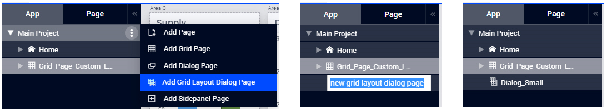
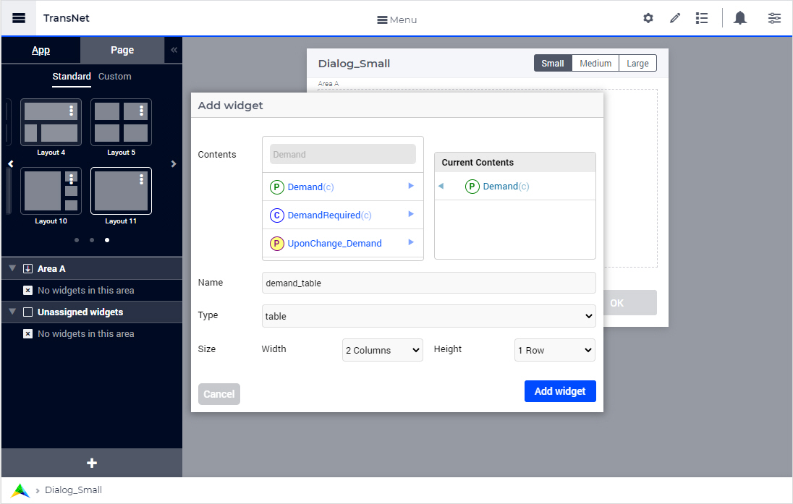
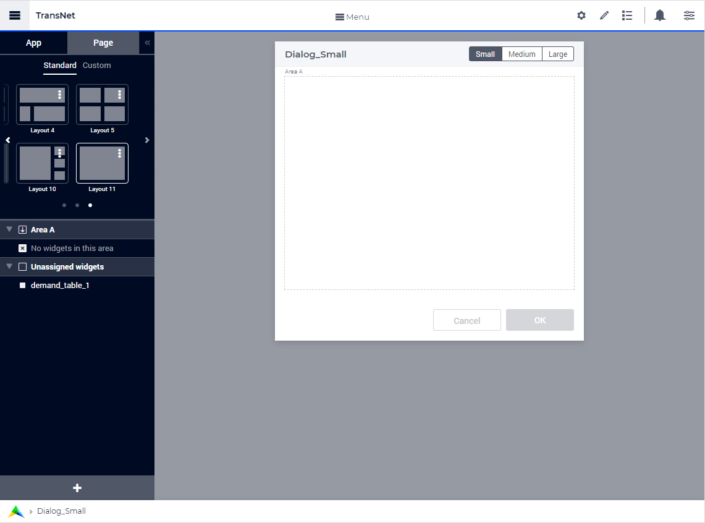
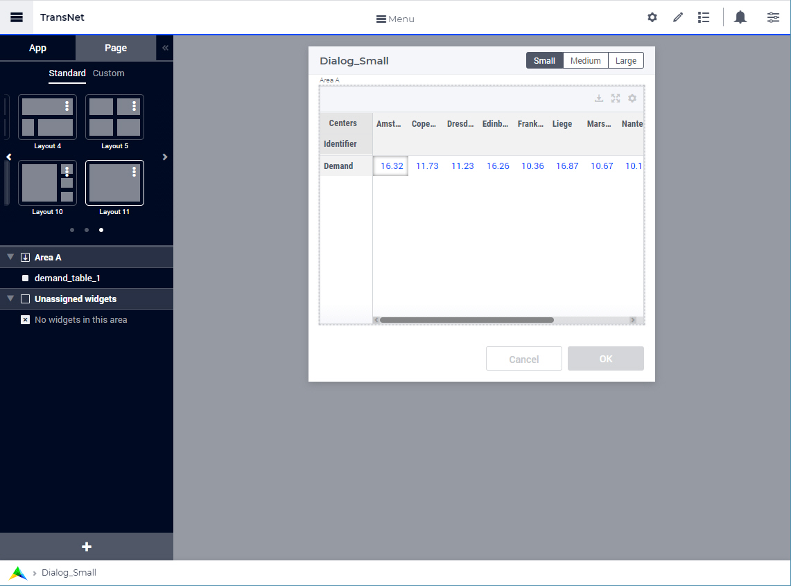
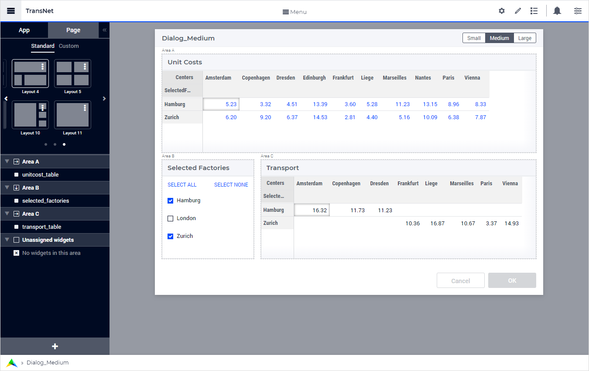
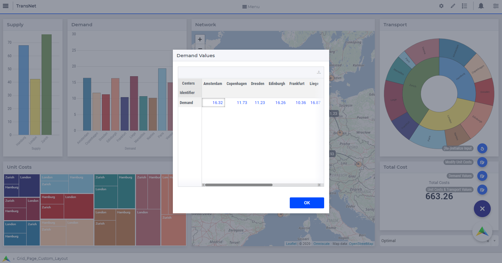
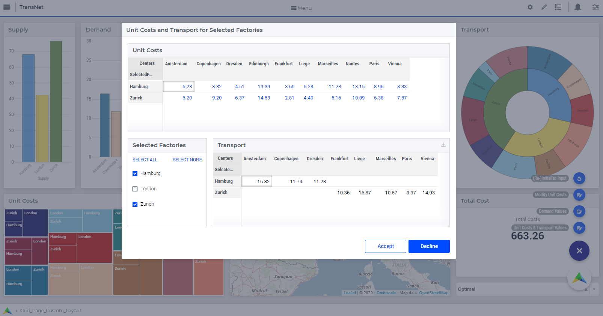
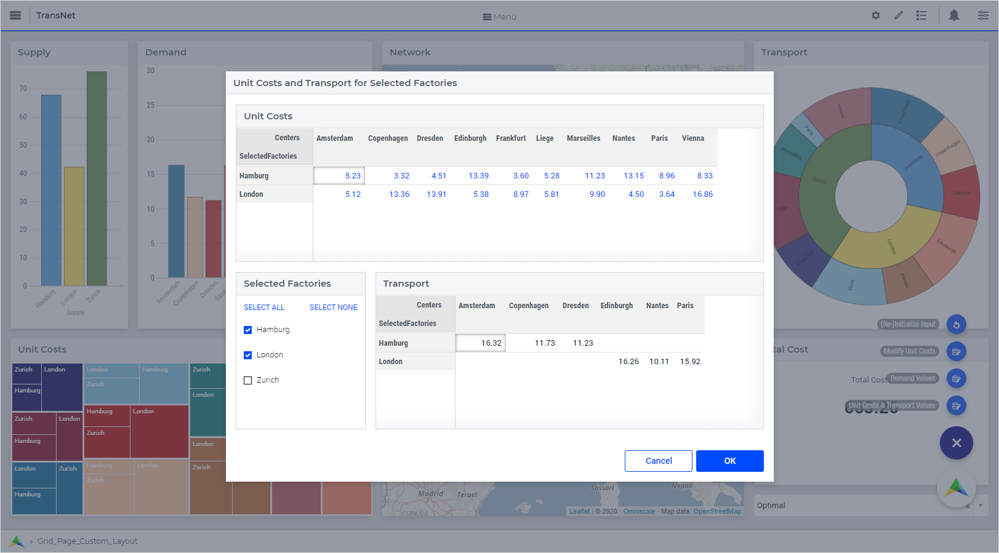
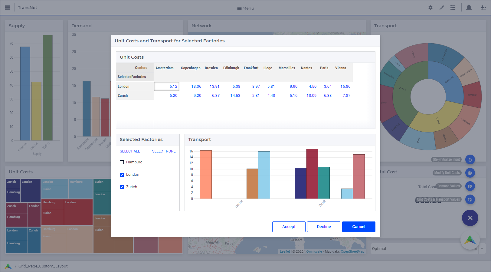

Dialog Grid Pages
=================

.. |page-manager| image:: images/PageManager_snap1.png

.. |dots| image:: images/PageManager_snap3.png

.. |pencil| image:: images/PageManager_snap3_1.png

.. |eye| image:: images/PageManager_snap3_2.png

.. |hidden| image:: images/PageManager_snap3_3.png

.. |bin| image:: images/PageManager_snap3_4.png

.. |home| image:: images/PageManager_snap3_5.png

.. |wizard| image:: images/PageManager_snap3_6.png

.. |plus| image:: images/plus.png

.. |kebab|  image:: images/kebab.png

.. |addpage|  image:: images/addpage.png

.. |sidepanel|  image:: images/sidepanel.png

.. |dialog|  image:: images/dialogicon.png 

This section describes various tasks related to the WebUI Dialog Grid Pages.

.. important:: Dialog grid pages are available in software versions from AIMMS 4.80 onwards.

Dialog Grid Pages are dialog pages with a grid layout. So, they combine the features of `Dialog Pages <dialog-pages.html>`_ and the features of `WebUI Grid Pages <webui-grid-pages.html>`_. In this respect, the explanations about the behavior provided in the dialog pages section and in the WebUI grid pages section also apply to the dialog grid pages discussed here. Therefore, we advise the reader to take a look at those two sections as well for explanations on aspects that are generally applicable. 

For example, like the regular dialog pages, dialog grid pages can also have up to 3 buttons, 2 of which are shown by default, typically Cancel and OK. The text and callback procedures for these buttons can be controlled via the OpenDialogPage function. Also, when a dialog grid page is open, the user can interact with the dialog only. The opened dialog box can only be closed by clicking on one of the action buttons on it.   

However, there are also some exceptions which are applicable to the dialog grid pages and which will be stated explicitly in this section. Moreover, there are also some features which are specific to the dialog grid pages and these will be mentioned here as well. 

For instance, a dialog grid page not only has the option for one of the three predefined sizes (Small, Medium and, Large) but also the option for a customized page size.  

Adding a Dialog Grid Page
-------------------------

Adding a dialog grid page is similar to adding a (grid) page, a regular dialog, or a side panel.

When using the `App/Page Manager <app-management.html>`_, click on the insert option "Add Grid Layout Dialog Page" and give the new dialog grid page any name you desire. Note that you cannot give it a name that you have already used for other pages, side panels or dialog pages. 

Dialog grid pages can be added to any level in the page tree, just like any other type of page. Unlike pages or grid pages, dialog (grid) pages do not appear in the navigation Menu and can only be accessed via the `App/Page Manager <app-management.html>`_, where they have the same options as a page or side panel, i.e. Rename, Delete, etc. You can also move the dialog (grid) pages at a different location within the page tree by using drag-and-drop in the usual way. 

.. note:: 
	
	Avoid adding pages under dialog (grid) pages as such pages will not be shown in the navigation menu.

By default, a newly added dialog grid page gets the standard grid "Layout 11", which has just one area for widgets.

For a dialog grid page you can choose a standard size from the three options - Small, Medium, or Large, the dimensions of which are as follows:

1.  Small: Width = 3 Columns, Height = 2. This is the default size for a dialog grid page. 

	.. image:: images/dpG_new_small.jpg
				:align: center

2.  Medium: Width = 6 Columns, Height = 3 Rows 

	.. image:: images/dpG_new_medium.jpg
				:align: center

3.  Large: Width = 8 Columns, Height = 3 Rows 

	.. image:: images/dpG_new_large.jpg
				:align: center

Besides the option for one of the three predefined sizes above, a dialog grid page also has the option for a customized page size. In this case, the height and the width may be specified respectively in the maxrows and the maxcolumns fields of the Miscellaneous section of the `Page Settings <page-settings.html>`_:

4.  Custom Size: Example: Width = 4 Columns, Height = 3 Rows  

	.. image:: images/dpG_new_customsize.jpg
				:align: center

Values must be specified for both the maxrows and the maxcolumns fields in order to define a valid custom page size.

For a dialog grid page with custom size, the maxrows option may be set between 1 and 4, while the maxcolumns option may be set between 2 and 14. If other values are specified, then they will be rounded to the nearest integer within these intervals. For example, a maxcolums value of 1 will be rounded to 2, while a maxrows value of 5 will be rounded to 4. 

The pictures above show the dialog grid pages in their preview mode. In this mode, the title and the action buttons shown are just placeholders in order to depict how the actual dialog grid page will look like when summoned. This preview also gives an idea of the usable area for adding widgets in the dialog grid page. In the same way as for regular dialog pages, the title and the action buttons applied on a dialog grid page which is summoned can be configured via the model, see further below. 

Adding widgets to a Dialog Grid Page
------------------------------------

Essentially, `adding widgets <widget-manager.html#adding-a-widget>`_ to a dialog grid page works in the same way as for a (grid) page, a regular dialog, or a side panel. Please follow the next steps.

First, select a desired dialog size by clicking on the respective button in the top right corner of the dialog grid page or by defining a custom size for it. Subsequently, you can change the current grid layout to another grid layout in the same way as for regular `Grid Pages <webui-grid-pages.html>`_ by using the `Page Configurator tab of the App Manager <webui-grid-pages.html#page-manager-with-grid-pages>`_. More specifically, the layout may be chosen as any of the available `Standard Layouts <webui-grid-pages.html#standard-layouts>`_ or `Custom Layouts <webui-grid-pages.html#custom-layouts>`_. 

Then open the widget manager and `add widgets <widget-manager.html#adding-a-widget>`_ which are needed. Please note that the "Add widget" option dialog can also be opened by clicking on the "+" button located at the bottom of the Page Configurator tab, see pictures above.

For example, for Dialog_Small declared above, we can keep the Small size and the grid Layout 11 (which has only Area A for widgets) and then add a table widget "demand_table" to this dialog grid page by using the "Add widget" option dialog:

After adding a new widget, this is initially placed in the "Unassigned widgets' section of the grid layout:

The newly added widget may be moved to one of the grid areas (in this case to Area A) by using drag-and-drop, such that the widget becomes visible on the page:

As it may be noticed in the last picture above, when a widget has more data than those which fit within the width of the assigned grid area, then the widget may get a horizontal scroll bar (and similarly, a vertical scroll bar in the case of the height). 

The dialog grid pages themselves do not have a scroll bar. Therefore, it is advisable to pick a suitable size and layout for the dialog grid page, depending on the widgets you want to place on it. You can change the size of the dialog grid page any number of times when in developer mode. However, the sizing options are not available to end users, so the sizes can no longer be changed after the application has been published.

For instance, suppose that on the Dialog_Medium page we would like to show two tables rendering the numerical values of the unit costs and the transportation amounts for a selection of factories. In this case, we can select the standard Layout 4 and add the widgets  "unitcost_table", "selected_factories", and "transport_table" to Area A, Area B, and Area C, respectively, as illustrated in the following picture:

Once all the required widgets have been added, a dialog grid page is ready to be configured/invoked as explained next.

Configuring Dialog Grid Pages
-----------------------------

The procedure `OpenDialogPage <library.html#opendialogpage>`_ needs to be used in order to configure/invoke a dialog grid page on the desired page. 

For example, we can define a procedure "Open_Dialog_Small" as

.. code::

 	empty DialogActions;

	DialogActions := data{ 'OK' };
	webui::OpenDialogPage('dialog_small_1', "Demand Values", DialogActions, 'Actions_Procedure');

and use this procedure behind a secondary page action in order to invoke the "Dialog_Small" page with just one action button on it:

In a similar way, we can define a procedure "Open_Dialog_Medium" as

.. code::

	empty DialogActions;

	DialogActions := data{ 'Accept', 'Decline' };
	webui::OpenDialogPage('dialog_medium_1', "Unit Costs and Transport for Selected Factories", DialogActions, 'Actions_Procedure');

and use this procedure behind another secondary page action in order to invoke the "Dialog_Medium" page with two action buttons on it:

Two action buttons on a dialog grid page is also the default situation when the specified set of actions is empty:

.. code::

	empty DialogActions;

	webui::OpenDialogPage('dialog_medium_1', "Unit Costs and Transport for Selected Factories", DialogActions, 'Actions_Procedure');
	
In this case the dialog shows by default the action buttons "Cancel" and "OK":

The button names are assigned from left to right in the order given by the actions set. A maximum of three buttons can be shown on the dialog, so if the actions set has more than three elements, then only the first three will become visible on the page. In case three buttons are shown on the dialog, the style of the first two buttons are the same (white background) and the third button is different (blue background).

For example, when the invoking code is:

.. code::

	empty DialogActions;

	DialogActions := data{ 'Accept', 'Decline', 'Cancel', '4th Action' };
	webui::OpenDialogPage('dialog_medium_1', "Unit Costs and Transport for Selected Factories", DialogActions, 'Actions_Procedure');

then the summoned dialog is rendered with three buttons like in the following picture:

As a reminder, the effect of pushing one button or another on a dialog (grid) page is determined by the fourth argument of the procedure `OpenDialogPage <library.html#opendialogpage>`_. This fourth argument is a procedure which should have itself a single input string parameter as an argument. When a user selects an action on the dialog (grid) page, this procedure is invoked with the action name as its argument. So, this procedure may execute different actions depending on the value of its input argument (which, in turn, is determined by the button pushed by the user).

Interacting With Dialog Grid Pages
----------------------------------

When a dialog grid page is open (invoked), the user can only interact with the widgets on the dialog grid page and with the dialog grid page itself. In particular, the user can move/drag the dialog grid page around the page which invoked it. When one dialog grid page is open, no other dialog (grid) page can be invoked from the already opened dialog. The dialog grid page can be closed only by clicking on one of its actions button.

.. note::

	For a dialog grid page with custom size, where the maxrows and maxcolumns page options are specified through scalar model parameters, it is possible to put these parameters in a widget placed on the dialog itself and attempt to change the size of the dialog dynamically, after the dialog is invoked. This works fine as long as the dialog is not moved around on the invoking page. However, if the dialog is moved around and then resized dynamically by changing the values of the maxrows and maxcolumns parameters, then some scroll bars may become visible. This latter situation should be avoided. 
  
 