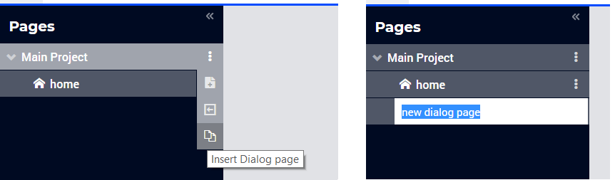
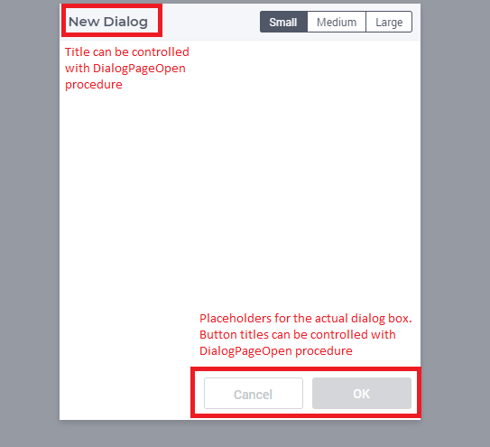
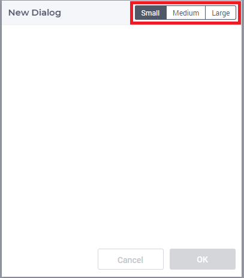
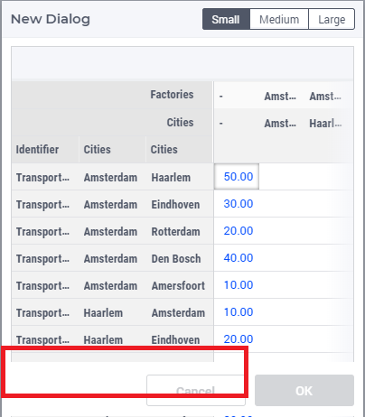
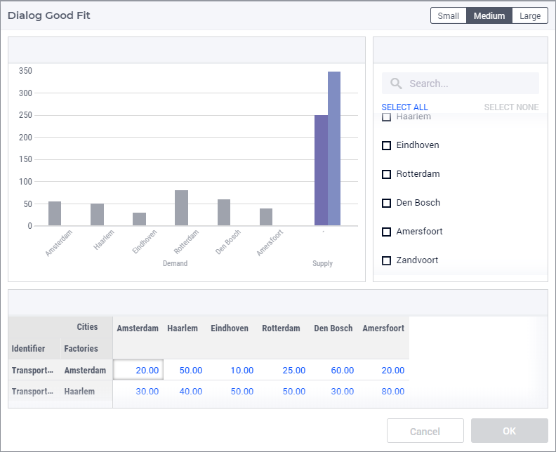
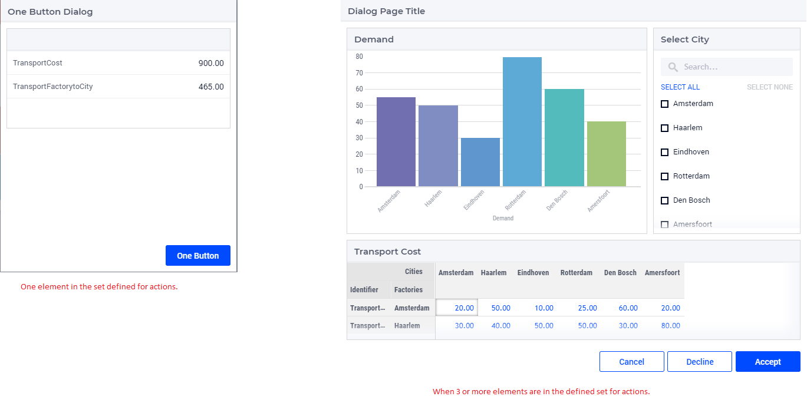

Dialog Pages
============

.. |page-manager| image:: images/PageManager_snap1.png

.. |dots| image:: images/PageManager_snap3.png

.. |pencil| image:: images/PageManager_snap3_1.png

.. |eye| image:: images/PageManager_snap3_2.png

.. |hidden| image:: images/PageManager_snap3_3.png

.. |bin| image:: images/PageManager_snap3_4.png

.. |home| image:: images/PageManager_snap3_5.png

.. |wizard| image:: images/PageManager_snap3_6.png

.. |plus| image:: images/plus.png

.. |kebab|  image:: images/kebab.png

.. |addpage|  image:: images/addpage.png

.. |sidepanel|  image:: images/sidepanel.png

.. |dialog|  image:: images/dialogicon.png 

This section describes various tasks related to WebUI Dialog Pages.

.. important:: 

  Dialog pages are available from AIMMS 4.65 onwards. Note that starting from AIMMS 4.80, dialog grid pages are available as well, so please also check the section `Dialog Grid Pages <dialog-grid-pages.html>`_. 

Dialog Pages are used for intermediate actions or steps in your workflow. You can create model interaction by calling dialog pages for the user to perform a specific action such as setting SLA's or adjusting inventory etc. In addition, you can use Dialog pages to display information about a selected item without breaking the flow by calling the `OpenDialogPage <library.html#opendialogpage>`_ function. For example, to show the detailed properties of a scheduled batch. 

Dialog pages appear as an overlay on top of content on other pages. They provide mainly two functions:

#. Preventing users from continuing until some required action is performed. For example, a user has to fill in sales forecast data before being able to continue to forecast analysis. The main content is disabled until the interaction is done.  
#. Navigating along the “z-axis” i.e. diving deeper into the data. In this use case, a user clicks on a job in a Gantt Chart to view a dialog page with more information displayed about that job.  

Especially in the first use case, the dialog page disrupts the user’s workflow and might cause them to lose track. Dialog pages should therefore be used for essential information only.

A dialog page has one of three predefined sizes: Small, Medium and Large. Dialog pages can have up to three buttons, two of which are shown by default, typically "Cancel" and "OK". The text and callback procedures for these buttons can be controlled via the OpenDialogPage procedure. 

When a dialog box is open, the user can interact with the dialog only. The dialog box can only be closed by clicking on one of the actions.   

Adding a Dialog Page
--------------------

Adding a dialog page is similar to adding a page or a side panel.

Click on the Insert Dialog page icon |dialog| and give it any name you desire. You cannot give a name that you have already used for other pages, side panels or dialog pages. 

Dialog pages can be added at any level in the page tree, just like a normal page. Unlike Pages, Dialog pages do not appear in the Menu (navigation) and can only be accessed via the page manager. Dialog pages have the same options as a page or side panel, like Rename, Delete, etc. You can also move the dialog pages in the same way as regular pages can be moved.

.. note:: 
	
	Avoid adding pages under dialog pages as such pages will not be shown in the navigation menu.

You can choose a size for the dialog page, the dimensions for which are:

#.  Small: Width = 3 Columns, Height = 2 Rows. Here you can fit widgets with dimensions that add up to 3 columns and 2 rows, e.g. 1 widget with a width of 3 columns or less and a height of 2 rows or less OR 2 widgets with a width of 3 columns or less and a height of 1 row.

	.. image:: images/dialog_diffsizes_small.png
				:align: center

#.  Medium: Width = 6 Columns, Height = 3 Rows. Here you can fit widgets with dimensions that add up to 6 columns and 3 rows. 

	.. image:: images/dialog_diffsizes_medium.png
				:align: center

#.  Large: Width = 8 Columns, Height = 3 Rows .  Here you can fit widgets with dimensions that add up to 8 columns and 3 rows.

	.. image:: images/dialog_diffsizes_large.png
				:align: center

The title and action buttons on the dialog page can be configured via the model. These are placeholders to depict how the actual dialog page will look. This also gives an idea of the usable area for adding widgets in the dialog page.

Adding widgets to a Dialog Page
-------------------------------

`Adding widgets <widget-manager.html#adding-a-widget>`_ works the same for dialog pages as for regular pages or side panels.

Select a desired size by clicking on the respective button in the top right corner of the dialog page. Open the widget manager and `add the widgets <widget-manager.html#adding-a-widget>`_ that you need. 

When the height of a widget exceeds the height of the dialog page, the widget will be clipped, as Dialog pages do not have a scroll bar. Pick a suitable size for the dialog page and the widgets you want to have on it. You can change the size of the dialog page any time in developer mode. The Small, Medium and Large buttons are not available to end users, so the sizes cannot be changed once the application is published.

Configuring Dialog Pages
------------------------

You can use the procedure `OpenDialogPage(pageId,title,actions,onDone) <library.html#opendialogpage>`_ to invoke dialog pages on the desired page. 

An `example <library.html#id4>`_ of the procedure with declarations would result in:

.. code::

	MyActions:= data { Decline, Accept };
	pageId := 'dialog_page';
	webui::OpenDialogPage(pageId, "Dialog Page Title", MyActions, 'Procedure_Actions');

.. image:: images/dialog_procedurecall.png
			:align: center

The button names are assigned from left to right from the defined set. If the set has only one element, only one button will be displayed. A maximum of three buttons can be displayed. In case three buttons are shown, the style of the first two buttons are the same and the third is different.

Interacting With Dialog Pages
-----------------------------

When a Dialog page is open, the user can only interact with the widgets on the dialog page and with the dialog page itself. The dialog page can be closed only by clicking on one of the actions. The user can move/drag the dialog page around the page.     
  
When one dialog page is open, another dialog page cannot be invoked from the open dialog. 