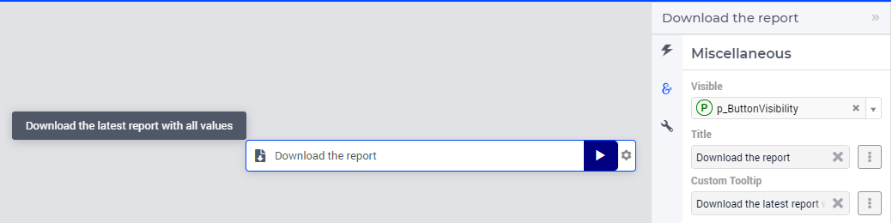
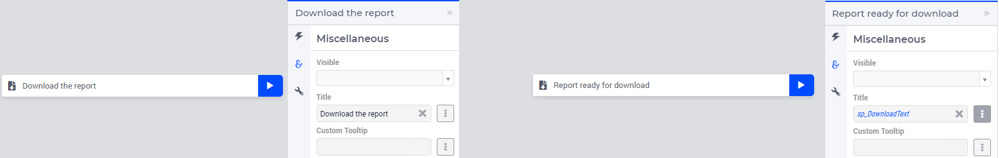
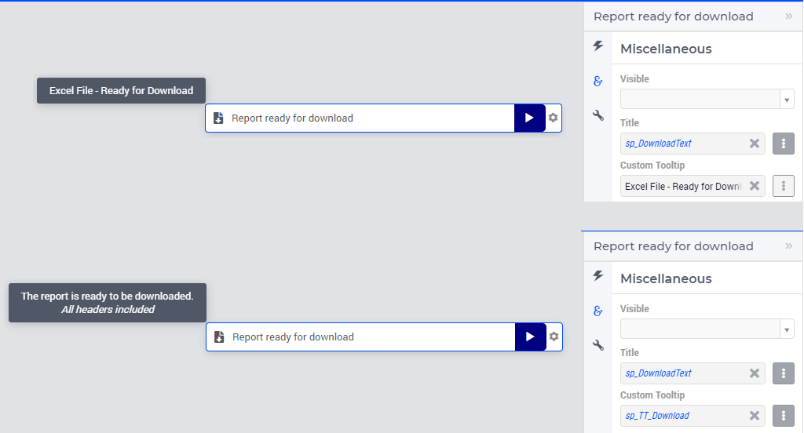

Download Widget
===============

The Download widget and the related :doc:`upload-widget` achieve complementary tasks.

.. image:: images/Download-View.png
    :align: right

The Download widget allows you to download a file created by the underlying AIMMS model (running on a PRO server) to your local computer.
In WebUI, pressing the button to the right of the download widget starts the AIMMS procedure that creates/prepares the file to be downloaded. 
When this process is finished, the default download functionality of your browser is used to let you download the file. 

.. note::
    
    In case the AIMMS procedure to create the file to be downloaded takes longer than 10 seconds, WebUI shows a 'Busy' state. 
    
By default, the status message displayed on the download widget changes from 'Prepare download' to 'File ready to download'. 
The button text changes to 'Get' and you can now start the file download by clicking on it. 

Creating a Download Widget
-------------------------------

After adding a (blank) Download widget to your WebUI page, you need to link it with an AIMMS procedure using the options editor of the Download widget. It is good to keep in mind that this procedure will be executed *right before doing the actual download*. So, you can use it to prepare a file to be downloaded. This procedure needs to have the following arguments in the exact way as shown below:

.. code::
    
    Procedure MyFirstDownloadProc {
        Arguments: (FileLocation,statusCode,statusDescription);
        StringParameter FileLocation {
            Property: Output;
        }
        Parameter statusCode {
            Property: Output;
        }
        StringParameter statusDescription {
            Property: Output;
        }
    }

FileLocation
^^^^^^^^^^^^^^

The download widget always looks for the file to be downloaded in the below listed folders depending on which AIMMS environment you are using and ``FileLocation`` contains the name of the file you want to download. 

* the root folder of the AIMMS project if in Developer mode 
* the temporary PRO folder, if the app is launched from a PRO server (or AIMMS Cloud)

However, to create a file with name ``FileLocation`` in the temporary PRO folder, you will need to know the path of that folder and append it before the filename. This can be done by using the pre-defined function :token:`webui::GetIOFilePath` after assigning a string value to ``FileLocation``.

.. code::

    webui::GetIOFilePath(FileLocation);

The above function returns a string value with the absolute path to the file ``FileLocation`` if you are using it from PRO and returns the unchanged filename if you are in Developer mode. By using this returned value as the location for the file to be created by your procedure, you will make it available for the download widget. 

In case you want to be able to download a previously created file through the download widget, you will need to copy that file into the appropriate location. You can use the :any:`FileCopy` function as below to do that 

.. code::

    FileCopy(FileLocation, webui::GetIOFilePath(FileLocation));
    

.. important::

    Please note that the following special characters should not be used in filenames - ``# * + | \ < > ? , /``. Any files with the mentioned special characters in the filename will result in an error, and the file will not be downloaded.

StatusCode
^^^^^^^^^^^^

The :token:`StatusCode` argument should be filled as follows:

.. code::

    statusCode := webui::ReturnStatusCode('CREATED');

The pre-defined function :token:`webui::ReturnStatusCode` has the below possible arguments 

    * :token:`OK`
    * :token:`CREATED` 
    * :token:`BAD_REQUEST`
    * :token:`UNAUTHORIZED` 
    * :token:`CONFLICT`
    * :token:`ERROR` 
    
As your procedure is expected to create a file, the status :token:`CREATED` is expected if all goes well. You can use one of the other status codes to signal that something went wrong when creating your file.

.. note::

    Please note that those status codes are standard HTTP status codes. For further reference, please go to https://en.wikipedia.org/wiki/List_of_HTTP_status_codes 

StatusDescription
^^^^^^^^^^^^^^^^^^^

The :token:`StatusDescription` argument can be used to display custom text as the status messages in the download widget. 

Example
----------

An example for the body of the download procedure is shown below. This particular example shows how to create a text file containing the final path of :token:`FileLocation`. An example AIMMS project which illustrates the usage of this procedure can be downloaded from :download:`here <resources/DownloadWidgetExample.7z>`.

.. code::

   ! Using a block/on error construction guarantees that any unforeseen error is handled properly
   block

        ! we want to create a file to download - MyDownloadFile.txt
        FileLocation := "MyDownloadFile.txt"; 

        ! we store the location of the file in string parameter FinalLocation
        FinalLocation := webui::GetIOFilePath(FileLocation); 

        ! writing the string parameter FinalLocation to the text file
        write FinalLocation to file FinalLocation; 

        ! checking if the previous write statement was successful or not
        if FileExists(FinalLocation) then 

            ! if successful, statusCode is set to 'CREATED' which will trigger the download widget to show the Get button
            StatusCode := webui::ReturnStatusCode('CREATED');
            ! displaying the status message as All perfect instead of the default "File ready to download"
            StatusDescription := "All perfect!"; 
        
        else
            raise error "File not found";
        endif;
       
    onerror err do
       
       ! setting the statusCode to 'ERROR' and the download widget will not show the Get button anymore
       statusCode := webui::ReturnStatusCode('ERROR'); 
       !displaying a custom error message 
       statusDescription := "Something went wrong when creating the file."; 

        errh::MarkAsHandled(err);       
    endblock;

When executed through the download widget, this procedure will let you download a file named MyDownloadFile.txt with *FinalLocation := "MyDownloadFile.txt"* as its content. If launched from PRO, the filename will still remain the same but the value for FinalLocation will be temporary PRO path + MyDownloadFile.txt.

Please note that the file is NOT automatically deleted for you when running WebUI in AIMMS developer mode. It will be in case WebUI is running under PRO, as the temporary PRO folder is deleted some time after a session is closed. Note as well that you cannot delete the file from inside the download procedure itself (at the end), as at the point of deletion, the filename would not have been passed to the WebUI yet, meaning you would be just about to start a download of a file that you have already deleted, resulting in an error. Remember, this procedure is executed *right before the actual download*.

.. tip::

	If you need to use folder names in your model, use forward slashes to separate them. This ensures that your project will be able to be executed on a Linux server

Miscellaneous
-------------

In the Miscellaneous tab of the Download widget's options editor, other options may be set that are explained below: 

\

Visibility
^^^^^^^^^^

You can control the visibility of the download widget by either specifying a literal value 1 (visible) or 0 (hidden) or a binary parameter.

Title
^^^^^

Set the display text on the download widget here. By default, the text that is displayed is "Prepare download". You can specify either a literal value like "Download the report" or a string parameter.

.. _download-widget-custom-tooltip:

\

Custom Tooltip
^^^^^^^^^^^^^^

You can specify a custom tooltip to display more information when the user hovers over a respective button. You can specify either a literal value like "Excel File - Ready for Download" or a string parameter.

The content for the string parameter can be data driven and also supports HTML. 

As illustrated below, the definition of string parameter ``sp_TT_Download`` used to specify the ``Custom Tooltip`` option.

.. code:: 
    
    "The report is ready to be downloaded.   <i> All headers included</i>"

\

Alternative to the Download Widget
----------------------------------

.. note::
    
   Starting from AIMMS 24.3 downloading a file from the AIMMS application can be achieved by using the dedicated procedure ``webui::RequestFileDownload`` declared in the `WebUI Library <library.html>`__. 
   This library procedure can be called inside a self-declared AIMMS procedure without arguments. This latter procedure can then be called in the WebUI, for example, behind a button, a page action, a widget action, or an item action. 