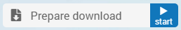

Download Widget
---------------

The Download widget allows you to download a file created by the underlying AIMMS model (running on a PRO server) to your local computer.

In WebUI, pressing the button to the right of the download widget starts the AIMMS procedure that creates/prepares the file to be downloaded. When this process is finished, the default download functionality of your browser is used to let you download the file. In case the AIMMS procedure to create the file to be downloaded takes longer than 10 seconds, WebUI shows a 'Busy' state. By default, the status message displayed on the download widget changes from 'Prepare download' to 'File ready to download'. The button text changes to 'Get' and you can now start the file download by clicking on it. 

Creating a Download Widget
++++++++++++++++++++++++++

After adding a (blank) Download widget to your WebUI page, you need to link it with an AIMMS procedure using the options editor of the Download widget. This procedure needs to have the following arguments in the exact way as below. 

.. code::

    MyFirstDownloadProc(FileLocation, statusCode, statusDescription)
    
    Procedure MyFirstDownloadProc {
    Arguments: (FileLocation,statusCode,statusDescription);
    StringParameter FileLocation {
        Property: Output;
    }
    Parameter statusCode {
        Property: Output;
    }
    StringParameter statusDescription {
        Property: Output;
    }
    }

FileLocation
^^^^^^^^^^^^

The download widget always looks for the file to be downloaded in the below listed folders depending on which AIMMS environment you are using and :token:`FileLocation` contains the name of the file you want to download. 

* the main AIMMS project folder in development mode 
* the temporary PRO folder if the project is launched from a PRO server

However, to create a file with name :token:`FileLocation` in the temporary PRO folder, you will need to know the path of that folder and append it before the file name. This can be done by using the pre-defined function :token: webui::GetIOFilePath after assigning a string value to :token:`FileLocation`.

.. code::

    webui::GetIOFilePath(FileLocation);

The above function returns a string value with the absolute path to the file :token:'FileLocation' if you using from PRO and returns the unchanged file name if you are in Developer mode. By using this returned value as the location for the file to be created by your procedure, you will make it available for the download widget. 

In case you want to be able to download a previously created file through the download widget, you will need to copy that file into the appropriate location. You can use the :token:`FileCopy` function as below to do that 

.. code::

    FileCopy(FileLocation, webui::GetIOFilePath(FileLocation));
    
StatusCode
^^^^^^^^^^

The :token:`StatusCode` argument should be filled as follows:

.. code::

    statusCode := webui::ReturnStatusCode('CREATED');

The pre-defined function :token:`webui::ReturnStatusCode` has the below possible arguments 

    * :token:`OK`
    * :token:`CREATED` 
    * :token:`BAD_REQUEST`
    * :token:`UNAUTHORIZED` 
    * :token:`CONFLICT`
    * :token:`ERROR` 
    
As your procedure is expected to create a file, the status :token:`CREATED` is expected if all goes well. You can use one of the other status codes to signal that something went wrong when creating your file.

StatusDescription
^^^^^^^^^^^^^^^^^

The :token:`StatusDescription` argument can be used to display custom text as the status messages in the download widget. 

Example
+++++++

A sample example to create a text file containing the final path of :token:`FileLocation` is shown below. You can also download the example AIMMS project that contains this procedure from :download:`here <resources/DownloadWidgetExample.7z>`.

.. code::
    
    FileLocation := "MyDownloadFile.txt"; ! we want to download a file - MyDownloadFile.txt
    
    FinalLocation := webui::GetIOFilePath(FileLocation); ! we store the location of the file in string parameter FinalLocation
    
    write FinalLocation to file FinalLocation; ! writing the string parameter FinalLocation to a text file

    if FileExists(FinalLocation) then ! checking if the previous write statement was successful or not
    
       StatusCode := webui::ReturnStatusCode('CREATED'); ! if successful, statusCode is set to 'CREATED' which will trigger the download widget to show the Get button
       StatusDescription := "All perfect!"; ! displaying the status message as All perfect instead of the default "File ready to download"
       
    else    !if previous write statement was not successful 
       
       statusCode := webui::ReturnStatusCode('ERROR'); ! setting the statusCode to 'ERROR' and the download widget will not show the Get button anymore
       statusDescription := "Something went wrong when creating the file."; !displaying a custom error message 
       
    endif;

When executed through the download widget, this procedure will let you download a file named MyDownloadFile.txt with FinalLocation := "MyDownloadFile.txt" as its content. If launched from PRO, the file name will still remain same but the value for FinalLocation will be "temporary PRO path + MyDownloadFile.txt"

Note that this generated file is NOT automatically deleted if you are running WebUI in AIMMS developer mode. If you want to delete this file after a download, you should use the function :token:`FileDelete` as below. 

.. code::

    FileDelete(FinalLocation)

This step is not required on PRO as the temporary PRO folder in which the file is created will be automatically deleted sometime after the session is ended. 

Note: If you need to use folder names in your model, use forward slashes to separate them. This ensures that your project will be able to be executed on a Linux server