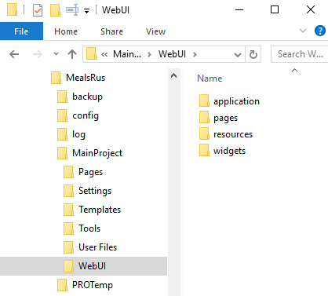
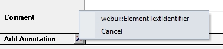
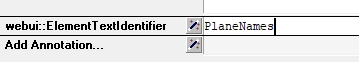

WebUI Folder
************

An AIMMS WebUI-ready application is an ordinary AIMMS application that contains a *WebUI* subfolder in the *MainProject* folder (this folder is created automatically when `starting WebUI <publishing.html>`_ for the first time). 

	
The entire application including *all pages and widgets* is stored in a single ``webui.json`` file. When opening your application in the IDE, the ``webui.json`` file will be automatically generated from your existing setup. During the conversion, only pages and their associated widgets that are actually referenced in the WebUI page manager will be included in the ``webui.json`` file. The conversion will *not* delete the contents of the existing pages, widgets and application folders on disk, allowing you to still use older AIMMS versions, which depend on the old format. If you make changes to the WebUI using older AIMMS versions, you can delete the webui.json file, in which case it will be automatically re-generated. Changes made with AIMMS 4.67 and higher will never be visible in older AIMMS versions.

If you are using version control on your WebUI project, please make sure to add the new webui.json file, and delete the pages, widgets and application folders from version control when you don't plan to use the project with AIMMS version 4.66 and lower any longer. The new format as a true json file will make the structure of the WebUI directly clear, allowing you to resolve merge conflicts in the WebUI much easier. It also makes searching where widgets are used in your WebUI application straightforward.

Via the `Widget Manager <widget-manager.html>`_ you can add widgets to your WebUI. You can add pages via the `Page Manager <page-manager.html#add-a-page>`_.

.. important::

	The information above is valid for AIMMS versions 4.67 and higher. For older AIMMS versions, the following applies:
	
	All WebUI `pages <page-manager.html>`_ and `widgets <widget-manager.html>`_ will be stored (by the WebUI Server) in the *pages* and *widgets* subfolder of the *WebUI* folder. 

	All WebUI pages are stored (by the WebUI Server) in the *pages* subfolder of the WebUI folder.

Add the **resources** folder
------------------------------

In order to use any of the following listed features, you will need to create a new folder called **resources** (case sensitive), located in:

*<.aimms Root folder> > MainProject > WebUI > resources*. 

This folder will be loaded each time the WebUI will start, or at every reload (F5) of your WebUI browser page.

.. image:: images/folderstructureresources.png
    :align: center

Images
-------

Application-specific images should be stored in the *resources/images* subfolder. This folder is not created by default, so you need to create it yourself the very first time that you need it.

Load ordering
-------------

By default, resources are loaded in alphabetical order. You can influence this loading order by putting a :token:`package.json` file in the folder alongside the resources to be loaded and specify a specific loading order in it.

An example package.json could be:

.. code-block:: JSON

    {
       "name": "my-application-specific-resource",
       "version": "0.0.1",
       "config": {
         "aimms:asr": {
           "files": [
             "b.js",
             "a.js",
             "c.css",
           ]
         }
       }
    }

.. note::

    * Your project can have multiple :token:`package.json` files.
    * All resources loaded explicitly by a :token:`package.json` file will no longer be loaded through alphabetical order.
    * The loading order of the same file specified in multiple :token:`package.json` files is undefined and is best avoided.

CSS styling
-----------

It is possible to (re)style your web application by providing a custom CSS. The home page in the "MealsRUsWebApp":{TOPIC-LINK+example-project} example shows a small drop-down button in the upper right corner of the page that lets you switch between several example styles. Please note that the class names that are referred to in the CSS might change in the future. Application-specific CSS files should be stored in the *resources/css* subfolder of the *WebUI* subfolder of your project folder. As an example of application-specific styling, the *MealsRUsWebApp* has been extended with a *theme-switch-addon* that consists of some JavaScript and CSS that result in the theme switch drop-down button being shown in the upper right corner of your web application.

For more details on this addon, please check `this thread <https://groups.google.com/forum/#!category-topic/aimms/aimms-webui/wWXT91QVNBQ>`_ on our Google Group.

For more info on CSS in general, see `this Wikipedia article <https://en.wikipedia.org/wiki/Cascading_Style_Sheets>`_.

Data-Dependent Styling
++++++++++++++++++++++

You can define user-annotations in your AIMMS model that will be used to style corresponding so-called `DOM <https://en.wikipedia.org/wiki/Document_Object_Model>`_ elements in the WebUI page. To define user annotations for an identifier :token:`X(i,j,k)` that is being displayed in a widget, you can define a string parameter defined over a valid subdomain of the original identifier. This string parameter should be a space-separated string of class-names (that will be used to decorate the DOM elements with). In the attribute form of the identifier for which you are specifying the annotations, you should add a :token:`webui::AnnotationsIdentifier` annotation and fill in the string parameter containing the annotation(s) there.

In combination with an additional project-specific `CSS <#css-styling>`_ file, you can then specify the styling on, for example, a per-table-cell basis.

.. tip:: 

    In AIMMS versions prior to 4.49.1, you had to define a string parameter called :token:`X_annotations(i,k)` (with the domain of this 'annotations' identifier being a valid subdomain of the original identifier) in order to achieve the same. This had the disadvantage that when you renamed the original identifier, the '_annotations identifier' was not automatically renamed with it, leading to unexpected effects in your WebUI widgets.

For example, the following 'user annotation'

.. code::	

    StringParameter DangerValuesOfX {
        IndexDomain: (i,k);	
        Definition: "invalid-value danger" onlyif ( Y(i,k)  >= Y_UB(i,k) );
    }

In combination with the following CSS rule

.. code-block:: CSS

    .aimms-widget td.annotation-invalid-value {
        background-color : red;
    }

will show all cells in tables (because of the :token:`.td` class), where the annotation has the value :token:`invalid-value` with a red background color. The :token:`DangerValuesOfX` shows a combination of two annotations: :token:`invalid-value` as well as :token:`danger`.

By default, all core WebUI plugins (including widgets) will prefix user annotations with :token:`annotation-` and replace whitespace characters, like spaces or tabs, with a hyphen (-). It is recommended that app developers use this as well. For more information: see `AWF.Util.getAsCSSClasses <#applying- annotations-or-flags>`_.

The WebUI uses flags to indicate whether a certain DOM element corresponds to a *readOnly* value or not. DOM elements that correspond to editable values are annotated with a :token:`flag-editable` CSS class while read-only DOM elements are annotated with a :token:`flag-readOnly` class. You can make data that is editable from a model perspective appear as read-only in the WebUI by using user-flags by defining by a new string parameter in your model :token:`X_flags(i,j)` and set its value to "readOnly" for the (updatable) values that you want to appear as read-only.

Widgets and CSS properties supported for Annotation
+++++++++++++++++++++++++++++++++++++++++++++++++++

There are several CSS properties that can be changed for each widget that support annotations. AIMMS provides limited support with respect to CSS customization. The below table denotes the supported widgets and their respective CSS properties that can be changed.

+------------------------+------------------------------------------------------------------------------+
| Widgets                | CSS Property                                                                 |
+========================+==========================+===================================================+
| Bar Chart              | fill, fill-opacity       | stroke, stroke-width, stroke-dasharray            |
+------------------------+--------------------------+---------------------------------------------------+
| Line Chart             | fill, fill-opacity       | stroke, stroke-width, stroke-dasharray            |
+------------------------+--------------------------+---------------------------------------------------+
| Pie Chart              | fill, fill-opacity       | stroke, stroke-width, stroke-dasharray            |
+------------------------+--------------------------+---------------------------------------------------+
| TreeMap Chart          | background, opacity      | font-size, font-family, font-style, font-weight   |
+------------------------+--------------------------+---------------------------------------------------+
| Gantt Chart            | fill, fill-opacity       | stroke, stroke-width, stroke-dasharray            |
+------------------------+--------------------------+---------------------------------------------------+
| Table                  | background, opacity      | font-size, font-family, font-style, font-weight   |
+------------------------+--------------------------+---------------------------------------------------+
| Bubble Chart           |  fill, fill-opacity      | stroke, stroke-width, stroke-dasharray            |
+------------------------+--------------------------+---------------------------------------------------+
| Map (Nodes)            |  fill, fill-opacity      | stroke, stroke-width, stroke-dasharray            |
+------------------------+--------------------------+---------------------------------------------------+
| Scalar                 | background, opacity      | font-size, font-family, font-style, font-weight   |
+------------------------+--------------------------+---------------------------------------------------+

.. Tip:: 
    For Line Chart, Bubble Chart and Map the radius property "r" is supported only on the Chrome browser, and not on IE 11 and Edge browsers.

The Bar Chart, Line Chart, Pie Chart, Gantt Chart, Bubble Chart and Map widget use SVG elements. AIMMS supports the use of the fill and stroke properties. 

The illustration below shows the use of SVG properties to change the fill and stroke of a bar chart when the annotation "blue" is added to the identifier.

.. code::

    .annotation-blue{
    /* fill changes */
        fill: Blue;
        fill-opacity: .5;
    /* stroke changes */
        stroke: aqua !important;
        stroke-width: 4 !important;
        stroke-dasharray: 5;
    }

.. image:: images/Bar_annotations.png
    :align: center
    :scale: 75

The Table, Treemap Chart and Scalar widget use the DIV element. AIMMS supports the use of background and font properties.

The illustration below shows the use of DIV properties to change the background and font of a table cell when the annotation "blue" is added to the identifier.

.. code::

    .annotation-blue{
    /* fill changes */
	    background: Blue;
        opacity: .5;
	/* text changes */
	    font-size: 30px !important;
        font-family: sans-serif;
        font-style: italic;
        font-weight: bold;
    }

.. image:: images/Table_annotations.png
    :align: center

Below are the illustrations for the widgets that support annotations using the annotation "blue" as defined above.

.. image:: images/Line_annotations.png
    :align: center
    :scale: 75

.. image:: images/Pie_annotations.png
    :align: center
    :scale: 75

.. image:: images/Gantt_annotations.png
    :align: center
    :scale: 75

.. image:: images/Map_annotations.png
    :align: center
    :scale: 75
    
.. image:: images/Bubble_annotations.png
    :align: center
    :scale: 75

.. image:: images/Treemap_annotations.png
    :align: center
    :scale: 75

.. image:: images/Scalar_annotations.png
    :align: center
    :scale: 75

.. Tip:: 
    There are hover and select effects on the charts and Map widgets which can be changed, but are not supported by AIMMS. If you would like to change the properties of those states as well, please look at our How To document on changing CSS effects on charts.

Highlighting (experimental)
+++++++++++++++++++++++++++

.. important:: Highlighting is available in software versions from AIMMS 4.68.5 onwards as part of Experimental Features. Please reach out to AIMMS support on how to enable Experimental Features.

Next to the annotations mechanism described above, we offer a lightweight way to responsively highlight certain tuples in the Table and the Gantt Chart widget. As opposed to former, this feature removes the need to re-render the whole widget just for highlighting a specific (small) selection of tuples, making it more responsive. To use it, you have to provide an additional string parameter in your model, which has the exact same index domain as the identifier(s) displayed in the widget, extended with an extra index :token:`indexIdentifiers`. You need to specify this identifier in the Highlight option provided in the Miscellaneous tab of the widget's options editor. For example, if you display an identifier :token:`JobDuration(i, j)` in a Gantt Chart, you need to introduce a string parameter like :token:`GanttHighlight(i, j, indexIdentifiers)`. You can choose any identifier name which suits your model.

In your model, you can determine which tuples you want to highlight in your widget, by assigning values to the additional string parameter. For example, you could write something like: 

.. code::

	if JobDuration(i, j) > max_duration then
		GanttHighlight(Selected_i, Selected_j, 'JobDuration') := "exceeds-time-limit";
	endif;

This would result in an annotation :token:`annotation-exceeds-time-limit` on the Gantt Chart's bar representing the :token:`(i, j)` tuple. In css, you could then add a rule like:

.. code-block:: CSS

	.annotation-exceeds-time-limit {
		fill: red;
	}

to color the bar red.

You are of course not restriced to highlight just a single cell. You could also write something like:

.. code::

	if JobDuration(i, j) > max_duration then
		GanttHighlight(Selected_i, j, 'JobDuration') := "exceeds-time-limit";
	endif;

In combination with the css rule above, this would result in all jobs for the :token:`Selected_i` to be colored red. Do however keep in mind that this mechanism is intended for use with a relatively low number of tuples. If you want to style a huge number of tuples, we recommend using the annotations method described above.

If you display more than one identifier in a widget, you can specify the tuples for those by using the corresponding identifier name(s) in the extra index.

Annotations or Flags in Custom Plugins
++++++++++++++++++++++++++++++++++++++

Applying annotations or flags
^^^^^^^^^^^^^^^^^^^^^^^^^^^^^

Core plugins (widgets, addons, etc.) now prefix all model annotations and flags with e.g. :token:`annotation-` or :token:`flag-` when these are used in HTML element attributes. Additionally, to ensure valid values, all sequences of whitespace are converted into single hyphens: for example, the annotation :token:`some model info` becomes :token:`annotation-some-model-info`.

Core styling has also been updated to adopt this pattern.

To properly prefix annotations or flags, use the :token:`AWF.Util.getAsCSSClasses` utility-method:

.. code-block:: js

    // More usually, these would be requested from the datasource's
    // annotations and flags layers.
    const annotations = ["foo", "bar baz"];
    const flags = ["readOnly"];

    // Generate an array of prefixed, escaped versions of the original
    // model annotations.
    const annotationsAsClasses = AWF.Util.getAsCSSClasses(annotations);

    // The default prefix is "annotation" plus a hyphen, but the second
    // argument allows alternative prefixes.
    const flagsAsClasses = AWF.Util.getAsCSSClasses(flags, "flag");

    // somePluginElQ would be defined elsewhere, and is a jQuery element.
    // This concatenates the prefixed flags and annotations arrays, joins the
    // array items with spaces, then adds them as classes to somePluginElQ.
    somePluginElQ.addClass(annotationsAsClasses.concat(flagsAsClasses).join(" "));

This will result in an element with the following :token:`class` attribute:

.. code-block:: css

    ... class="annotation-foo annotation-bar-baz flag-readOnly" ...

Manipulating and selecting elements by annotations or flags
^^^^^^^^^^^^^^^^^^^^^^^^^^^^^^^^^^^^^^^^^^^^^^^^^^^^^^^^^^^

Once an annotation or flag has been applied to an HTML element in a plugin, that element can be selected programmatically, or styled, with CSS selectors.

To achieve this, the prefixed annotation or flag should always be CSS-escaped using the standards-track `CSS.escape <https://drafts.csswg.org/cssom/#utility-apis>`_ method. A substitute for this method is provided by the WebUI runtime when the user's browser does not yet support it.

Example 1: Programmatically selecting and manipulating HTML elements by annotation or flag
^^^^^^^^^^^^^^^^^^^^^^^^^^^^^^^^^^^^^^^^^^^^^^^^^^^^^^^^^^^^^^^^^^^^^^^^^^^^^^^^^^^^^^^^^^

Example JavaScript:

.. code-block:: js

    // This selects all widgets with the class "annotation-bar-baz", and adds the
    // class "my-widget" to them.
    $(".aimms-widget." + CSS.escape(annotationsAsClasses[1]))
        .addClass("my-widget")
    ;

Example 2: Using the annotation or flag in a stylesheet
^^^^^^^^^^^^^^^^^^^^^^^^^^^^^^^^^^^^^^^^^^^^^^^^^^^^^^^

The prefixed annotation or flag should still be properly escaped for use in a selector (see `CSS.escape <https://drafts.csswg.org/cssom/#utility-apis>`_), although in these examples it is not strictly necessary. Example CSS:

.. code-block:: css

    /* This styles all text in widgets with the classes "my-widget" and "flag-readOnly" in gray. */
    .my-widget.flag-readOnly {
        color: #808080;
    }

Switching The Color Palette
+++++++++++++++++++++++++++

In order to check the color palette of your WebUI project, please read this `thread <https://groups.google.com/forum/#!category-topic/aimms/aimms-webui/RvM8E_9QIVg>`_ on our Google Group for details on how to accomplish this.

Custom Icon Sets
++++++++++++++++

Certain features like the Widget Actions or the (experimental) Page Actions may use icons. AIMMS has a predefined list of `1600+ icons <../_static/aimms-icons/icons-reference.html>`_ which can be used. Custom icons can also be used for the aforementioned features by adding the desired icon font to the CSS folder and using the class names defined in the .css file in the icon field in the model specification. The icon font folder will need to have at least the ``.ttf`` file or the ``.woff`` file and the corresponding ``.css`` file, which together define the icon.

When an icon font is downloaded it will have the CSS file with the TTF and/or WOFF files. Just add these to the Resources/CSS folder. To use the icons, open the CSS file and use the class name for the respective icon in the icon filed in the model specification.

.. image:: images/CustomIcon_Folder1.png
    :align: center

For example, the ``icofont.css`` may have classes defined for each icon as illustrated below:

.. code-block:: css

    .icofont-brand-acer:before
    {
        content: "\e896";
    }

    .icofont-brand-adidas:before
    {
        content: "\e897";
    }

    .icofont-brand-adobe:before
    {
        content: "\e898";
    }

You need to pick the name of the desired icon class and assign it to the icon field in the model specification. eg: :token:`icofont-brand-adidas` 

JavaScript
----------

Application-specific JavaScript files (e.g. `widget [addons] <own-widgets.html>`_ or Unit Support files should be stored in the *resources/javascript* subfolder.

Unit Support
++++++++++++

In the WebUI, units from your AIMMS model will per default be displayed in the Table, Scalar and Slider widgets. These widgets have an option 'Show Units' in the 'Miscellaneous' tab of their options editor where you can overrule this. For all widget types, the units will be displayed in the tooltips as well.

The units that are displayed follow the Convention identifier in your model that is specified in the Convention attribute of you Main model.

.. tip:: 

    In AIMMS 4.50 and lower versions, unit support was handled in the manner described below. When opening your WebUI in AIMMS 4.51 or higher, you will automatically get a warning dialog if this 'old-style' unit support is detected. You are encouraged to adapt your model to the new standard.

.. code-block:: js

    IdentifierUnitMap = {
		"Distance" : "km"
	};

will display the distance values in 'km'. Input for the 'Distance' identifier will also be interpreted in terms of 'km'. Please note that you can only specify display units for which there exists a valid conversion to the base unit of the identifier in your model.

Multi-Language Support
----------------------

WebUI offers multi-language support. Depending on the language settings of your browser, all strings that are displayed in the WebUI will be checked against a language specific translation table. If a translation is available, the translation is displayed. Otherwise, the original string is displayed.

Project-Specific Translations
+++++++++++++++++++++++++++++

In addition to the built-in translations in WebUI, you can add your own translation files to your WebUI applications. Model identifier names can then be translated according to the browser's language.

Please note that you can translate not only from one language to another, but also from model abbreviations to strings that are more readable by the end-user, e.g.:

.. code-block:: js

   F_X_EGG = Egg

Translation files should be placed anywhere below your project's `resources <folder.html#resources>`_ folder, and must use the following naming-conventions:

* :token:`<anything>.properties`: Default translations, also used as fallbacks when a specific translation is unavailable in another language. These translations should not be duplicated in a separate language-specific file, but may be overridden to provide translations for a particular locale.
* :token:`<anything>_xx.properties`: Translations for a specific language, using an `ISO 639 language-code <https://en.wikipedia.org/wiki/List_of_ISO_639-1_codes>`_, e.g. :token:`xx` becomes :token:`nl` for Dutch.
* :token:`<anything>_xx-YY.properties`: Translations for a specific language-and-country combination, using an `ISO 639 language-code</a> and an <a href="https://en.wikipedia.org/wiki/ISO_3166-1_alpha-2">ISO 3166 country-code <https://en.wikipedia.org/wiki/List_of_ISO_639-1_codes>`_, e.g. :token:`xx-YY` becomes :token:`pt-BR` for Brazilian Portuguese.

.. tip::

    Please note that you can create as many translation files as you like. This allows you to keep a clear topic/subject per file.

To provide a default translation in English for your WebUI app, create a file :token:`<anything>.properties` with your translation pairs:

.. code-block:: js

    org_name = Organi***z***ation name

To provide a translation for another language, e.g. :token:`nl`, create a file :token:`<anything>_nl.properties` with your translation pairs:

.. code-block:: js    

    org_name = Organisatienaam

To provide a translation for a language-locale, e.g. :token:`en-GB`, create a file :token:`<anything>_en-GB.properties` with your translation pairs:

.. code-block:: js

    org_name = Organi***s***ation name

Element Text
++++++++++++

In addition to the project-specific translations, you can also use string parameters from your model to provide translations for set elements in your WebUI applications. You have to specify these through so-called _annotations_ in AIMMS. To do so, open the attribute form of a Set identifier and click on the 'Add Annotation' wizard button below the comment attribute:

Select the :token:`Webui::ElementTextIdentifier` annotation type and specify the name of the 1-dimensional string parameter which holds the translated element values:

Please be aware that AIMMS does not provide syntax checking in the annotations field, so make sure you type the identifier name correctly. Furthermore, please also note that you should not add the index to the identifier name (so, in the example above, :token:`PlaneNames` is specified rather than :token:`PlaneNames(p)`).

The effect of this will be that wherever the element names would normally be displayed in your WebUI widgets, the corresponding string values will be displayed instead. This allows you to provide your users with clearer text than the 'raw' element names as they exist in your AIMMS model.

Please note that when you display elements of a subset in the WebUI, it will automatically use the element text as specified in its rootset. However, you are allowed to override the element text for each (sub) subset of a set. The WebUI will use the most specific text. So, if you have :token:`SetA`, :token:`SetB` and :token:`SetC`, where :token:`SetC` is a subset of :token:`SetB` and :token:`SetB` is a subset of :token:`SetA`, and you display elements from :token:`SetC`, the WebUI will use the translation specified for :token:`SetC`. If this is not available, it will use the translation specified for :token:`SetB`. If that is not available, it will use the translation specified for :token:`SetA`. 

.. important::

    The above mechanism is featured in AIMMS 4.46 and later. If you are still using an older version of AIMMS, the following applies:

For now, the element text identifiers need to be specified in a project-specific JavaScript resource (located in the :token:`resources` subfolder) that lists the string parameter on a per-index level. For example, a project specific resource with the following contents

.. code-block:: js

    ElementTextMap = {
         "i" : "ItemDescription"
    };

will display :token:`ItemDescription` instead of the element :token:`i` in your widgets. Please note, that the string parameters that are specified in the *ElementTextMap* need to be declared as one-dimensional identifiers over the associated index in your AIMMS model.

.. important:: 

    In AIMMS versions lower than 4.46, this feature does not work properly when used in combination with the selectionbox widget.

