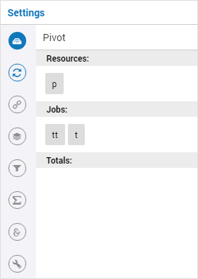
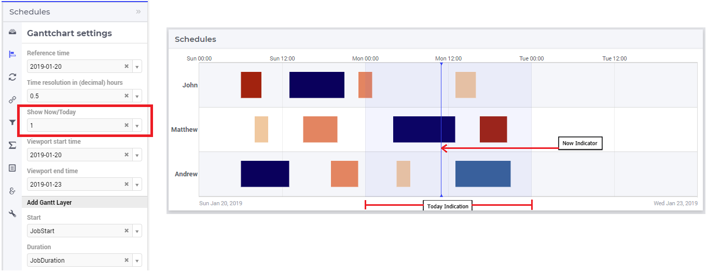
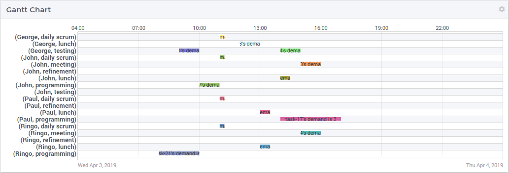
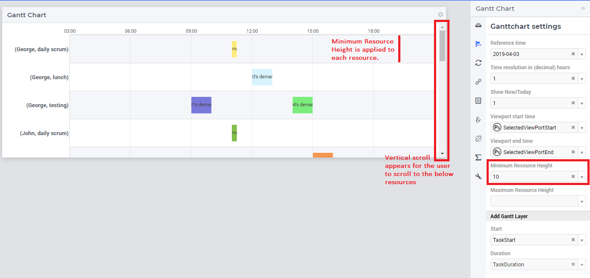
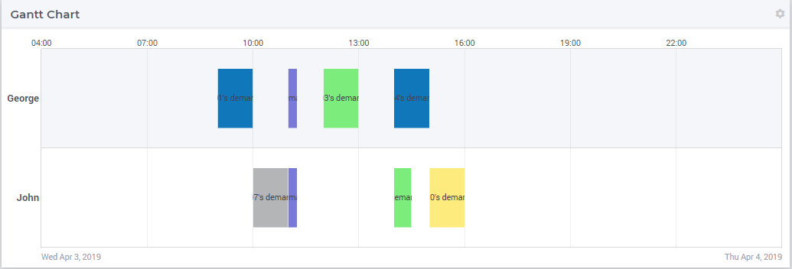
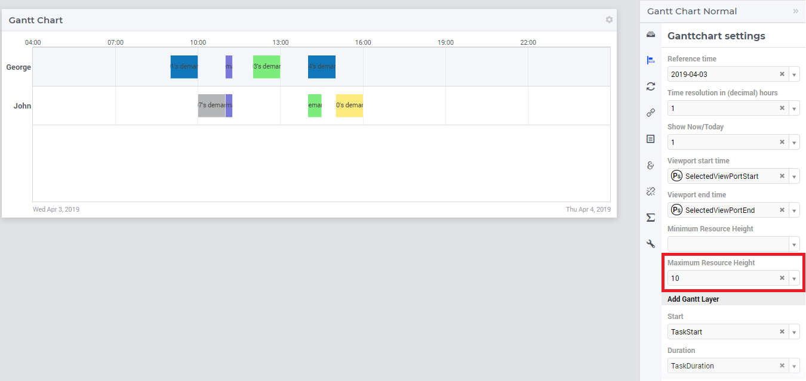
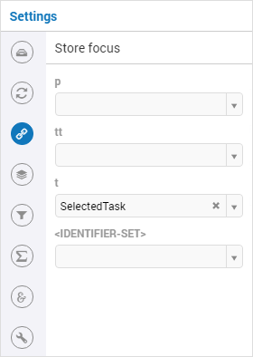
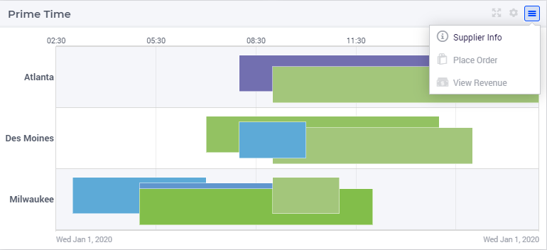
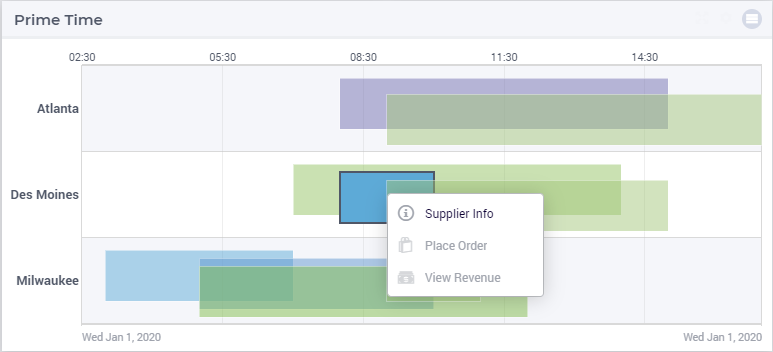
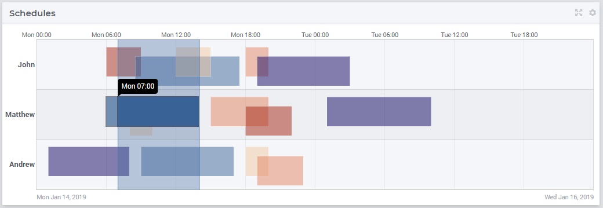

Gantt Chart Widget
==================

The Gantt chart widget allows you to visualize a planning: the horizontal axis of the Gantt chart shows a time scale and the vertical axis typically shows a set of resources. Each bar in the Gantt chart represents a task (or job).

.. image:: images/gantt-chart.png
    :align: center

In the example Gantt chart displayed in the picture above, a number of features of this widget are visible:

* The rows of the chart are alternately colored white and light gray, to make it easier for the user to distinguish between consecutive rows.
* Overlapping or partly overlapping bars in the chart are always displayed in such a way that it is unambiguously clear that they do.
* The default or `custom tooltip <widget-options.html#adding-tooltips>`_, appearing when you hover over a specific bar, shows detailed information about the task.
* The ability to add `additional text <widget-options.html#additional-identifier-properties>`_ in the bars to provide additional clarity about the task. Please note that the text will be clipped when it is too large for the task at hand.
* The top X-axis annotation intelligently shows the points in time, based on the total time duration displayed in the chart. In this case, it displays hours. If, for example, you have a chart displaying data over a few months, the top X-axis will show dates instead of hours.
* The bottom X-axis always shows the begin date on the left and the end date on the right. If you have a chart only showing hours on the top X-axis, the bottom X-axis makes it clear to which days these hours refer.
* In case of a transition to or from Daylight Saving Time, the X-axis annotations make this clear by a reference to the relevant UTC time. For example 'Sun 02:00 (UTC+2)' and 'Sun 07:00 (UTC+1)' for a Gantt chart that shows October 30, 2016, 03:00 (which is the time DST ended in the Netherlands).

Gantt chart Settings
--------------------

To specify a Gantt chart in WebUI you need to specify the *start* and the *duration* of each task in the Gantt Chart Settings tab of the options editor (see image below), in the **Add Gantt Layer** section.

.. image:: images/ganttoptionseditor.jpg
    :align: center

* The *start* and *duration* identifiers in your model need to share the same index domain which should have at least one task index.
* The *start* identifier should represent the number of *hours* relative to the Gantt Chart reference time.
* The *duration* identifier should represent the amount of *hours* that the corresponding job takes.
* To support vertical dragging, the *duration* identifier in the AIMMS model must be updatable.
* To support vertical dragging and task modification (using forms), the *start* and *duration* identifiers can have at most one non-zero data entry for every task.

The following code snippet is taken out of the WebUI Gantt chart example.

.. code::

    Set Tasks {
        Index: t;
    }

    Set Persons {
        Index: p;
    }

    Set TaskTypes {
        Index: tt;
    }

    Parameter TaskStart {
        IndexDomain: (t,tt,p);
        Unit: hour;
    }

    Parameter TaskDuration {
        IndexDomain: (t,tt,p);
        Unit: hour;
    } 

.. image:: images/gantt-chart-contents.png
    :align: center

Below is an overview of all the Gantt Chart options, which can also be found on the Gantt Chart Settings tab of the options editor:

* *Reference time* (required): This represents the reference time of the Gantt Chart, i.e. the time at which the Gantt Chart X-axis starts. The reference time of the Gantt Chart needs to be a string representing of an `RFC2822 <https://datatracker.ietf.org/doc/html/rfc2822#page-14>`_ or `ISO 8601 <http://www.w3.org/TR/NOTE-datetime>`_ date. These standards accept many date formats. Examples of valid formats are AIMMS formats like :token:`2015-04-02`, :token:`2015-04-02 13:04:12`, but formats like :token:`April 2, 2015 03:04:12`, :token:`Thu Apr 2, 2015`, :token:`2015/04/02 13:04:12.345`, :token:`2015/4/2`, :token:`04/02/2015`, :token:`2-4-15`, :token:`2015-04-02T13:04`, :token:`Thu Apr 05 2015 13:04:12 GMT-0400` are also accepted. Please note that there may be date formats used in other applications' context, but which do not comply with the accepted standards mentioned here, For example, a format like :token:`2019.08.21 10:31:00` might be usable elsewhere, but is not accepted in the current context of the Gantt chart widget. Finally, when entering a literal date value for the reference time, *please make sure NOT to use quotes or double quotes around the date*.
* *Time resolution in (decimal) hours* (required): With this option you can determine precisely at which position or size the dragging or resizing of a bar will end. If you set this to, for example, 1, you can drag and resize in whole hours. So, a drag action to the left will place the bar at the nearest whole hour preceding the current position of the bar. Similarly, a resize action makes sure that the duration will be set in whole hours. You are not limited to multiples of whole hours here, though. By specifying 0.25, you can set the resolution to quarters of an hour, for example.
* *Viewport start time* (optional): With this option you can specify what time the leftmost part of the Gantt Chart displays. In combination with the *Viewport End Time* option, you can specify a 'time window' over your displayed data.
* *Viewport end time* (optional): With this option you can specify what time the rightmost part of the Gantt Chart displays. In combination with the *Viewport Start Time* option, you can specify a 'time window' over your displayed data.
* *Minimum Resource Height* (optional): With this option you can specify the minimum height of a resource. If your resources are condensed and not readable, when the Minimum Resource Height is specified, the resources resize to the specified value. If the resources exceed the height of the chart a vertical scroll appears. 
* *Maximum Resource Height* (optional): With this option you can specify the maximum height of a resource. If your resources are limited, the height of the resources is spread over the height of the Gantt chart. When the Maximum Resource Height is specified, the resources resize to the specified value.

Pivoting
----------

The Gantt chart will display a task for every index (or better: combination of indices) that has been put in the *jobs* part. The task index needs to be present in the *jobs* part.

The Gantt chart will display a row for every index (or better: combination of indices) that has been put in the *resources* part. The Gantt chart will display a single row if no index is present in the *resources* part.

	
.. note::

    For large data sets the Gantt chart widget may display an error like in the following picture:
	
    .. image:: images/GanttChart-DataOverloadError.png
        :align: center
	
    This happens if:
	
    the number of resources 
	
    multiplied by
	
    (the cardinality of Start identifier plus the cardinality of the Duration identifier)

    exceeds 50000. The number of resources (or “rows”) is the cardinality of the set(s) present in the Resources attribute in the Pivot section of the widget’s options editor.
	
Viewport control
------------------

By using AIMMS string parameters to specify the *viewport start time* and *viewport end time*, you can write procedures that implement custom scrolling or zooming behavior. What you typically need to do in such a procedure is to transfer the string into a *moment*, do some math and convert the *moment* back into a string. The following example shows some identifiers and procedures that add support for scrolling the Gantt chart to the left or to the right.

.. code::

    StringParameter ViewportStart;

    StringParameter ViewportEnd;

    Procedure MoveDate {
        Arguments: (dateString,numHours);
        Body: {
            moment := StringToMoment("%m-%d-%c%y %H:%M", [hour], "2016-01-01 00:00", dateString);
            moment += numHours;
            dateString := MomentToString("%m-%d-%c%y %H:%M", [hour], "2016-01-01 00:00", moment);
        }
        StringParameter dateString {
            Property: InOut;
        }
        Parameter numHours {
            Unit: hour;
            Property: Input;
        }
        Parameter moment {
            Unit: hour;
        }
    }

    Procedure ScrollViewport {
        Arguments: (numHours);
        Body: {
            MoveDate(ViewportStart,numHours);
            MoveDate(ViewportEnd,numHours);
        }
        Parameter numHours {
            Unit: hour;
            Property: Input;
        }
    }

    Procedure ViewportScrollToTheRight {
        Body: {
            ScrollViewport(1[hour]);
        }
    }

    Procedure ViewportScrollToTheLeft {
        Body: {
            ScrollViewport(-1[hour]);
        }
    }

Please note that the AIMMS function :any:`StringToMoment` is used to convert a date string into a number. The number is then used to easily perform date calculations. After that, the number is converted back to a date string using the AIMMS function :any:`MomentToString`.

Indication of Today and Now
^^^^^^^^^^^^^^^^^^^^^^^^^^^

Starting from AIMMS 4.62, the Gantt chart widget can give an indication of "today" and "now" with reference to time in the chart, which helps the user identify the day and time of a task relative to the present moment. This feature can be toggled in the Gantt chart settings under “Show Now/Today” using either 0/1 values or a scalar identifier from the model:

.. note::
   The "Now/Today" indication listens to the (local) browser time, which is based on the system time of the user's machine.
   
   The "Now/Today" background indication will be shown only if the horizon of the Gantt chart is more than 24 hours. 

Minimum and Maximum Resource Height
-------------------------------------

Starting from AIMMS 4.67, the resource height of the Gantt chart can be set with the Minimum and Maximum Resource Height options which makes it easier for viewing or interacting with the bars. By default, the Gantt chart calculates a height for the resources and fits them in the height which is set for the chart. The default behaviour either condenses the resources (and makes it difficult to read or interact with) when the number of resources is high or uses the area to spread out the resources when they are few.

Minimum Resource Height
^^^^^^^^^^^^^^^^^^^^^^^
When the number of resources is high, by default the Gantt chart condenses all the resources to fit within the height of the chart.

In this case, you can assign a value to the Minimum Resource Height option and the chart will adjust the resource height to the set value. When the height of all resources exceeds the height of the Gantt chart widget, a vertical scroll bar appears on the right and the user can scroll down in order to see the resources below.

If you define a value that is less than the default value of a resource, there will be no change in the resource height. Only when the Minimum Resource Height is greater than the default height, the resource height changes accordingly.

Maximum Resource Height
^^^^^^^^^^^^^^^^^^^^^^^
When the number of resources are few, the Gantt chart will spread the resources to fit the height of the chart by default. This may make the resource heights quite large.

In this case, you can assign a value to the Maximum Resource Height option, which will condense the resources to the set value.

If you define a value that is greater than the default value of a resource, there will be no change in the resource height. Only when the Maximum Resource Height is les than the default height, the resource height changes accordingly.

When both the Minimum and Maximum Resource Height are defined, the resource height is calculated as:

.. math::
    
    ResourceHeight = Max(Minimum Resource Height, Min(Maximum Resource Height, Default Height))

To understand the possible scenarios please refer to the table below:  

+----------------+-------------------------+--------------------------+------------------+
| Default Height | Minimum Resource Height | Maximum Resource Height  | Resulting Height |  
+================+=========================+==========================+==================+
|       10       |            5            |        Not defined       |        10        |
+----------------+-------------------------+--------------------------+------------------+
|       10       |           15            |        Not defined       |        15        | 
+----------------+-------------------------+--------------------------+------------------+
|       10       |        Not defined      |            5             |        5         | 
+----------------+-------------------------+--------------------------+------------------+
|       10       |        Not defined      |            15            |        10        | 
+----------------+-------------------------+--------------------------+------------------+
|       10       |           15            |            5             |        5         | 
+----------------+-------------------------+--------------------------+------------------+
|       10       |            5            |            15            |        10        | 
+----------------+-------------------------+--------------------------+------------------+
|       10       |            5            |            5             |        5         | 
+----------------+-------------------------+--------------------------+------------------+
|       10       |            15           |            15            |        15        | 
+----------------+-------------------------+--------------------------+------------------+

Store focus
------------------------------

To be able to create a detail view in which the properties of the clicked task are displayed, the Gantt chart has been extended with a store focus option. This option allows you to specify a mapping between the indices that play a role in the Gantt chart and some element parameters in your model. Whenever the user clicks on a task in the Gantt chart, the associated elements are stored in the corresponding element parameters.

Please note that a selected task may be deselected by clicking on it a second time. Moreover, in such a case please beware of the following: 
	
.. note::
    When a selected task is deselected, the values of the element parameters which used to store the values for the selected task will not be emptied, but will keep storing those values. This behavior is by design.

Widget Extensions
-----------------

In the Widget Extensions tab, it is possible to add the string parameters configured for the `Widget Actions <widget-options.html#widget-actions>`_ and the `Item Actions <widget-options.html#item-actions>`_ for the widget.

.. note:: 
    When configuring the string parameter for the Item Actions, the actions should be added to the identifier that is used as the Duration property in the Gantt chart settings in the Add Gantt Layer section.
	
Adding, deleting and modifying tasks
------------------------------------

Modifying a task by drag-and-drop
^^^^^^^^^^^^^^^^^^^^^^^^^^^^^^^^^

Horizontal dragging
"""""""""""""""""""

As an end-user of the Gantt chart you can adjust the start time of a task by horizontally dragging the task to another position. You can adjust the duration of a task by dragging the right end of the task to another position. While dragging, the chart displays a small tooltip to make it clear at which position (in time) the bar will be placed when you release the mouse.

Vertical dragging
"""""""""""""""""

In addition, you can allocate the task to another resource by vertical dragging. In order for vertical dragging to work properly, you should make sure that the duration identifier is editable. Also note, that if you drag the last remaining bar of a row to another row, the originating row will disappear (as the WebUI displays its data in a sparse manner).

Snapping to time resolution while dragging
""""""""""""""""""""""""""""""""""""""""""

During both horizontal and vertical dragging the time resolution as specified in the corresponding property is taken into account.

Support lines/backdrop or time indicators
"""""""""""""""""""""""""""""""""""""""""

This feature is available from AIMMS 4.62 onwards (and since then, a default feature for the Gantt chart). 

When you drag or resize a job, there will be a "backdrop" in the background which helps dragging the job with reference to other jobs. 
This makes it easier for the user to either line up jobs from different tasks/resources, or schedule jobs one after the other as illustrated by the following picture:

Making some or all tasks read-only in the Gantt Chart
^^^^^^^^^^^^^^^^^^^^^^^^^^^^^^^^^^^^^^^^^^^^^^^^^^^^^^^

1. All tasks read-only: remove the identifier from the :any:`CurrentInputs` built-in AIMMS Set

.. code::

    CurrentInputs := CurrentInputs - 'TaskStart' - 'TaskDuration';

where ``TaskDuration`` and ``TaskStart`` are your task duration parameter and your task start parameter respectively.

2. cherry-pick read-only tasks

You may rely on the same process as for the `table widget <table-widget.html#creating-read-only-cells>`_.

You can use an extra string parameter in your model, which has the same name and index domain as the identifier which defines the content of the table, only post-fixed with "_flags". In order to actually make some cells read-only, you have to set the value of the right index combination(s) to "readonly".

.. code::
    
    TaskStart_flags(t,tt,'some_value_for_p') := "readonly";

.. tip::
    
    The flag should be created on the TaskStart parameter, not on the TaskDuration (it will have no effect)

.. tip::
    
    You can use the modern workflow features to enhance the user experience of creating, modifying, or deleting a task. For example:    
          * Create - Pop up a dialog page with the Gantt Chart widget actions or with the page actions.        
          * Modify - Use an item action (perhaps popping up a dialog page)                  
          * Delete - Use an item action (perhaps popping up a dialog page)                                   

Example
--------------------------------------------

The fully functional Gantt chart example that is discussed in this document can be downloaded from the `AIMMS WebUI example repository at GitHub <https://github.com/aimms/WebUI-Examples>`_. In order for this example to run, you need AIMMS version 4.24 or higher.