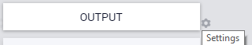
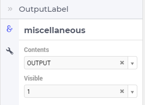

Label Widget
============

The Label widget allows the user to add some text in a "Button-like" widget, but without any action behind it. 

Whether or not the label is visible may be controlled by a constant or by a model parameter:

