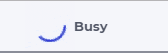
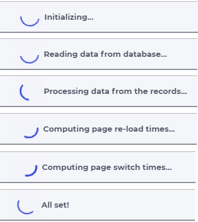
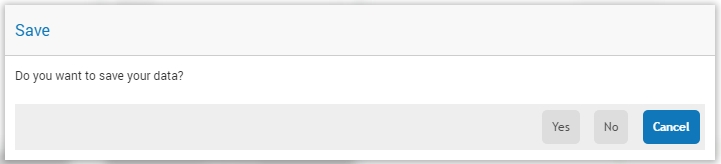
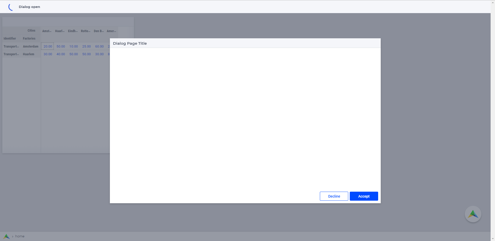
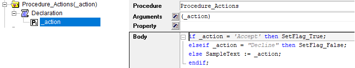
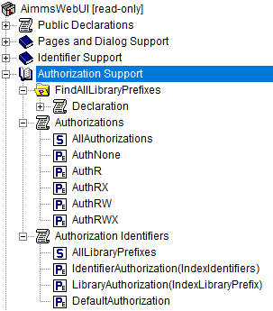

.. aimms:module:: webui

WebUI System Library
********************

When preparing your AIMMS model for use with the WebUI, you have to add the WebUI system library (as described in the :doc:`getting-started` section). This library offers functionality that you can call yourself from your AIMMS model. This library uses the prefix :token:`webui`.

Pages and Dialog Support section
================================

Pages and Dialog Support has been added to the AimmsWebUI library to be able to configure the :doc:`list-widget` , :doc:`workflow-panels` , :doc:`status-bar` , :doc:`side-panels` , :doc:`dialog-pages` , `Page Actions <page-settings.html#page-actions>`_ , `Widget Actions <widget-options.html#widget-actions>`_ , `Item Actions <widget-options.html#item-actions>`_ and some useful procedures in AIMMS. This section can also be used to identify the different page types, their PageId's and Paths. 

.. image:: images/pageanddialogsupportsection.png
			:align: center
    
.. _public-pages-support-declarations:

Public Pages Support Declarations 
-------------------------------------

.. aimms:set:: AllPageIDs 
    
  This set includes all the page ID for all page types added to the :doc:`page-manager` (page tree). 
  
  .. aimms:index:: indexPageId

.. aimms:set:: AllPageTypes
  
  This set includes the different page types, currently page, side panel and dialog. 
  
  .. aimms:index:: apt

.. aimms:set:: AllSidePanelPages

  :SubsetOf: :any:`AllPageIDs` 
  
  This set includes all the side panel pages added to the Page Manager. 
  
  .. aimms:index:: aspp

.. aimms:set:: AllDialogPages 

  :SubsetOf: :any:`AllPageIDs`

  This set includes all the dialog pages added to the Page Manager.

  .. aimms:index:: adp

.. aimms:elementparameter:: PageType(indexPageId) 
  
  :Range: :any:`AllPageTypes`

  This element parameter indexed on :any:`AllPageIDs` set maps which page type applies to which page id.

.. aimms:stringparameter:: PagePath(indexPageId)

  This string parameter indexed on :any:`AllPageIDs` set maps the path for each page created.

.. aimms:stringparameter:: PageName(indexPageId)
  
  This string parameter indexed on :any:`AllPageIDs` set maps the path for each page created.

.. _public-page-and-widget-specification-declarations:

Public Page and Widget Specification Declarations
-------------------------------------------------------

.. aimms:set:: SidePanelSpecification 

	This set is the specification for the side panel pages. The string parameters used to `configure the side panels <side-panels.html#configuring-side-panels>`_ on pages are indexed on this set. 

  .. aimms:index:: indexSidePanelSpec

.. aimms:set:: WidgetActionSpecification 

	This set is the specification for adding `widget actions <widget-options.html#widget-actions>`_ . The string parameters used to configure the widget actions on certain widgets are indexed on this set.

  .. aimms:index:: indexWidgetActionSpec

.. aimms:set:: PageActionSpecification 

	This set is the specification for adding `page actions <page-settings.html#page-actions>`_. The string parameters used to configure the primary action and secondary actions on certain pages are indexed on this set.

  .. aimms:index:: indexPageActionSpec

.. _public-webui-frontend-state-support-declarations:

Public WebUI Frontend State Support Declarations 
-------------------------------------------------------

(note: this section was introduced with AIMMS 4.72, as the 'webui state support' :doc:`experimental-features`.)

.. aimms:set:: AllOpenWebUITabs 

	This set contains one element for each WebUI tab currently open. The element has the form of a UUID. 

.. aimms:elementparameter:: LastActiveWebUITab 

	An element parameter in :any:`AllOpenWebUITabs`, which contains the UUID of the currently open WebUI tab in the browser (if any, it is empty otherwise).

.. aimms:stringparameter:: CurrentPageId 

	This string parameter contains the currently loaded page ID for all open tabs.

.. aimms:stringparameter:: CurrentSidePanelPageId 

	This string parameter contains the page ID for all open currently loaded side panels.

.. _workflowspecification:

.. _public-workflow-support-declarations:

Public Workflow Support Declarations
-------------------------------------------------------

.. _workflowspecificationset: 

.. aimms:set:: WorkflowSpecification

  This set is used to configure the number of :doc:`workflow-panels` and their respective titles. The string parameter used to `configure Workflows <workflow-panels.html#configuring-workflows>`_ are indexed on this set. The elements of this set (defining workflow properties) are the following:

  * ``title`` - The title for the workflow to be displayed on top of the Workflow Panel
  * ``style`` - A defined style for the workflow (This property is not in use currently. We have made the provision to incorporate different styles that we expect will be available in the future.)

.. _workflowpagespecification:

.. aimms:set:: WorkflowPageSpecification 

  This set is used to `configure the steps for each workflow <workflow-panels.html#configuring-steps-of-workflows>`_. The string parameter used to configure Workflow's steps are indexed on this set. The elements of this set (defining workflow properties) are as follows:

  * ``displayText`` - The label you want to give to the workflow step
  * ``icon`` - The icon you want to associate with the step. You can select from a list of 1600+ icons, the reference can be found in the `icon list <../_static/aimms-icons/icons-reference.html>`_. `Custom icons <css-styling.html#custom-icon-sets>`_ can also be used if required.
  * ``pageId`` - The page Id of the Page this step should be associated with. Ideally, every page in a workflow is a step in the Workflow Panel. The page Ids can be referred from the pre-declared ``AllRegularPages`` set. Using page Ids of Side Panel or Dialog page will result in unwanted behaviour. **This is a required field.**
  * ``tooltip`` - The text to be displayed when the user hovers over the step
  * ``workflowPageState`` - The workflow state of the page, which may be Active (displayed and clickable), Inactive (displayed and not clickable) or Hidden (not visible). If not defined, by default the state is Hidden. 
  * ``pageDataState`` - The data state of the page, which may be Complete, Incomplete or Error. The specification of this state is optional. If not defined, by default it has an Empty state.
  * ``redirectPageId`` - The page Id of the page the user should be redirected to when the ``workflowPageState`` is Inactive or Hidden. When the user tries to navigate to an Inactive or Hidden workflow step they are redirected to this page. The page Id's can be referred from the elements of the pre-declared set ``AllRegularPages``.
  * ``parentPageId`` - This attribute is available from AIMMS 4.92 onwards. It can be used in order to indicate a parent step for some step in the workflow, so, actually making the latter a child step in the panel.

.. _extensionorder:

.. aimms:set:: ExtensionOrder 

  This is a sub-set of the pre-declared set of :any:`Integers`, which has several pre-declared indices. This set was created to make it easier to create and configure string parameters and also differentiate them for Workflows, Page and Application Extensions. The pre-declared indices:

  * ``indexWorkflowOrder`` and ``indexNoOfPages`` are used as dimensions of the string parameters which will configure the Workflows and the steps of the Workflows in the application.
  * ``indexPageExtension`` is used as a dimension of the string parameter which will configure the Page Actions(Primary and Secondary), Side Panels and Widget Actions on pages and widgets respectively.
  * ``indexApplicationExtension`` is used as a dimension of the string parameter which will configure the Status Bar messages in the application. 
  
  .. aimms:index:: indexWorkflowOrder
  
  .. aimms:index:: indexNoOfPages

  .. aimms:index:: indexPageExtension
  
  .. aimms:index:: indexApplicationExtension

.. _public-statusbar-support-declarations:

Public StatusBar Support Declarations
-------------------------------------------------------

.. aimms:set:: StatusBarSpecification

  This set is the specification used to configure Status Messages on the :doc:`status-bar` that appears on the footer. You will need to create string parameters indexed over this set.

.. _public-list-support-declarations:

Public List Support Declarations
-------------------------------------------------------

.. _listgroupspecification:

.. aimms:set:: ListGroupSpecification 

  This set is the specification used to `configure List Groups <list-widget.html#configuring-list-groups>`_ in the :doc:`list-widget`. You will need to create string parameters indexed over this set. The elements of this set (defining list groups) are the following:

  * ``title`` - The title for the list group to be displayed in the List widget.
  * ``tooltip`` - Tooltip to be displayed when the user hovers over the respective list group's title.

.. _listgroupitemsspecification:

.. aimms:set:: ListGroupItemsSpecification 

  This set is used to `configure the list items <list-widget.html#configuring-items-for-lists>`_ in a specific list group. You will need to create a string parameter indexed over this set. The elements of this set (defining list group items) are the following:

  * ``icon`` - The icon you want to display for the respective list item. You can select from a list of 1600+ icons, the reference can be found in the `icon list <../_static/aimms-icons/icons-reference.html>`_. `Custom icons <css-styling.html#custom-icon-sets>`_ can also be used if required.
  * ``color`` - The color you want to display for the icon configured, e.g., Blue, Red, etc. Browsers support around 140 color names. This is an optional field. You can also use Hex codes e.g., #FF0000 for Red.
  * ``text`` - The text you want to display for the list item. This is a required field.
  * ``tooltip`` - Tooltip to be displayed when the user hovers over the respective list item.
  * ``procedure`` - The procedure you want to call when the respective list item is clicked.
  * ``external`` - Boolean value to indicate the list item procedure leads to an external link. By default, this option is 0/false.
  * ``state`` - Active (displayed and clickable), Inactive (displayed and not clickable) and Hidden (not displayed). By default, the state is Hidden.

Request Queue Declarations is used to manage the number of requests from WebUI. 

.. _public-pages-support-procedures:

Public Pages Support Procedures
-------------------------------------------------------

.. aimms:procedure:: GetAllPages 

	This procedure runs every time a page, side panel or dialog page is added to the page manager, which in turn updates the sets and identifiers in the `Public Pages Support Declarations`_.

.. aimms:procedure:: OpenSidePanel(pageId) 

	This procedure is used to open side panels via the model with respective ``pageIds`` as the argument. 

.. aimms:procedure:: OpenPage(pageId) 

	This procedure is used to open/navigate to other pages in the application via the model, by passing the respective ``pageId`` as the argument. 

.. aimms:procedure:: OpenExternalLink(url) 

	This procedure is used to open external links, by passing the URL as the argument. These links will open in a new tab in the browser.

.. aimms:procedure:: ResetRequestQueue 

	This procedure empties the ``RequestQueue`` and the Requests set in the Request Queue Declarations.
  
.. aimms:procedure:: SetProgressMessage(message) 

  This procedure allows one to overwrite the "Busy" message in the top left corner of the Menu bar by a customized message, which can better inform the user in case the AIMMS session is in "working/busy" state (i.e., some code execution is going on in the background). 
  
  See `SetProgressMessage`_ below.

.. aimms:procedure:: RefreshAllWidgets

  This procedure can be called to force all widgets in your WebUI to be updated. Normally, WebUI widgets are updated only after an AIMMS procedure has been fully executed. In case of long(er) running procedures, you may want to provide your user with up-to-date info in any of your widgets before finishing the procedure already. In such cases, a call to ``webui::RefreshAllWidgets`` does exactly that. In order to get a clearer view of this data, you may want to use the ``webui::UseTransparentVeil`` procedure described below.

  Please know that this procedure uses a delay to allow for the widgets to actually refresh. Per default, this delay is set to 500 milliseconds. Should you encounter situations where you feel that a longer (or a shorter) delay is needed, you can adjust it by adapting the ``webui.refreshallwidgets-sleep-milliseconds`` option in the optional ``webui-options.conf`` file.

  The current implementation of this procedure is still in an experimental phase. Based on any feedback by our users, we may decide to add arguments to it or to change the default delay, which would require you to adapt your models accordingly.

.. aimms:procedure:: UseTransparentVeil

  Calling this procedure has the effect that the veil which is applied to your WebUI page if the AIMMS session is in a "working/busy" state, will be transparent. In combination with the ``webui::RefreshAllWidgets`` procedure described above, you can use this to keep your users fully up-to-date while executing long(er) running procedures. The effect of the procedure ceases when its calling procedure has finished executing, so it is not a procedure that affects your whole further WebUI session. Please note that, although the veil is transparent, user interaction with any widget on the page (e.g. clicking a button, changing a value, etc.) is (by design) not possible.

.. _public-dialog-support-procedures:

Public Dialog Support Procedures
-------------------------------------------------------

.. aimms:procedure:: RequestPerformWebUIDialog(title,message,actions,onDone) 

  This procedure is used to display dialog message, such as alerts or warnings. 
  
  See `RequestPerformWebUIDialog`_ below.

.. aimms:procedure:: OpenDialogPage(pageId,title,actions,onDone) 

  This procedure is used to open `dialog pages <page-manager.html#dialog-pages>`__ via the model, either by clicking on a button or some interaction in the model. 
  
  See `OpenDialogPage`_ below.

.. aimms:procedure:: IsWebUIDialogOpen() 

  This procedure is used to check whether a dialog is currently open on the WebUI. It can be used to assert that no dialog is currently open before starting a new one.

.. note::

    The procedures :any:`OpenSidePanel`, :any:`OpenPage`, :any:`OpenExternalLink` and :any:`OpenDialogPage` currently do not work as expected when called on a page load procedure. This issue will be expected to be fixed in the coming releases.

Public Identifier Support
-------------------------------------------------------

.. aimms:stringparameter:: webui::IdentifierElementText 

	This string parameter can be used to translate identifier names that are displayed in your WebUI. For full details, please see `this section <table-widget.html#webui-identifierelementtext>`_.

SetProgressMessage
==================

In case that some longer code execution is going on in the background, your AIMMS WebUI session may be in "working/busy" state and the top left corner of the Menu bar may display the "Busy" message (instead of the application name
shown normally): 

	
In order to inform the user better on what is going on in such a situation, you can call the procedure :any:`SetProgressMessage` and overwrite the "Busy" message by a customized message depending on the current phase of the underlying code execution. 

Argument
--------

The ``message`` argument of this procedure is a constant string or a string parameter which may be adjusted programmatically during the code execution.

Example
-------

In case the application uses several procedures for executing first some initialization steps, then reading a substantial amount of data from a database and finally processing the data and computing some derived data, the procedure :any:`SetProgressMessage` may be called several times displaying in turn some customized messages such as:

Remark
------

Note that when the procedure :any:`SetProgressMessage` is called with an empty string argument, then the displayed message will be set back to the default "Busy" message.

RequestPerformWebUIDialog
=========================

You can call the procedure :any:`webui::RequestPerformWebUIDialog` to display a message dialog in a WebUI page. Along with the message you can also display buttons which you can bind to custom actions.

Arguments
---------

This procedure has the following arguments:

* ``title``: A string parameter which contains the text to be displayed as the title of the dialog box.
* ``message``: A string parameter which contains the message to be displayed in the dialog box.
* ``actions``: A set containing custom actions. The elements of this set are represented as buttons in the message dialog and their text is the same as the action names. When an action is selected (i.e. its corresponding button is clicked), it invokes the ``onDone`` procedure with the corresponding action as an argument.
* ``onDone``: A reference to a procedure in the predeclared set :any:`AllProcedures`. The procedure should have a single input string parameter as argument. When a user selects an action, the ``onDone`` procedure is invoked with the action name as its argument.

Example
-------

As an example, the following code will display the dialog in the picture below it and will call the procedure ``PerformAction(TheAction)`` upon clicking one of its buttons (with ``TheAction`` being an input string parameter argument):

.. code::

    MyActions := data { Yes, No, Cancel };
    webui::requestPerformWebUIDialog("Save", "Do you want to save your data?", MyActions, 'PerformAction');

Remarks
-------

* When you just want to send a message to the user, you should provide a single action (e.g. ``Actions := {'OK'}``) and you can use ``''`` for the ``onDone`` argument. In this case, no procedure is called, and the user can just close the 'dialog' by pressing the single action (or pressing the return/space key, which will press the default (last, highlighted) button).
* You can use a translation file (e.g. ‘WebUI/resources/languages/<dialog_actions>.properties’) to provide translations for the various internal action names, containing, for example: ``discard-and-continue = Discard and continue``. 
  
  Translation files are described in more details in :doc:`multi-language`

Starting from AIMMS 24.2 the WebUI library contains a parameter ``webui::RequestQueueSize`` defined as the cardinality of the set ``webui::Requests``, which is present in the public Interface of the WebUI library. 
So, its value may be accessed from outside the library and may be used to check from within the AIMMS language whether there is currently a dialog opened by a call to the procedure :any:`webui::RequestPerformWebUIDialog`.
This way the app developer may prevent another call to the procedure :any:`webui::RequestPerformWebUIDialog` while a dialog is already open in the WebUI.

OpenDialogPage
==============

You can call the procedure :any:`OpenDialogPage` to invoke a `dialog page <page-manager.html#dialog-pages>`_ in a WebUI page. Along with opening the dialog page you can also configure the title and the buttons with a specific callback.

Arguments
---------

This procedure has the following arguments:

* ``pageId``: An element parameter (with range :any:`AllDialogPages`) which should contain the ``pageId`` of the dialog page you want to open. When a dialog page is created, an entry is added to the set :any:`AllDialogPages` under the `Public Pages Support Declarations`_ with a unique ``pageId`` in the `Pages and Dialog Support section`_. Case sensitivity applies to ``pageId`` mapping.   
* ``title``: A string parameter which contains the text to be displayed as the title of the dialog box. If this is left blank, i.e "", it will display the dialog page name given during creation by default.
* ``actions``: A set of custom actions. The elements of this set are represented as buttons in the message dialog and their text is the same as the action names. When an action is selected (button is clicked), it invokes the ``onDone`` procedure with the corresponding action as an argument. If this set is empty, the buttons will have "Cancel" and "OK" by default respectively. 
* ``onDone``: A reference to a procedure in the set AllProcedures. The procedure should have a single input string parameter as argument. When a user selects an action, the ``onDone`` procedure is invoked with the action name as its argument.

Example
-------

As an example, the following code will display the dialog in the picture below it and will call the procedure ``Procedure_Actions(TheAction)`` upon clicking one of its buttons (with ``TheAction`` being an input string parameter argument):

.. code::

	MyActions:= data { Decline, Accept };
	pageId := 'dialog_page';
	webui::OpenDialogPage(pageId, "Dialog Page Title", MyActions, 'Procedure_Actions');

The declaration of the procedure Procedure_Actions in the example is 

When the user clicks either button, the callback sends the respective button's text back to the string parameter. In the example we use the response to set a Flag to true or false based on which button is clicked. 

Authorization Support
=====================

The WebUI System Library includes a section called "Authorization Support" containing identifier declarations which can be used to introduce authorization into your WebUI app:

The usage of these identifiers is discussed in the :doc:`creating` section of this documentation.