Line Chart Widget
=================

The Line Chart widget is a X-Y plot and represents data as a graph with lines and dots. A typical situation is when a 1-dimensional identifier such as the Demand(c) of a distribution center c in the TransNet application 
(see the "Quick Start: My First WebUI" section) is displayed like in the following picture:

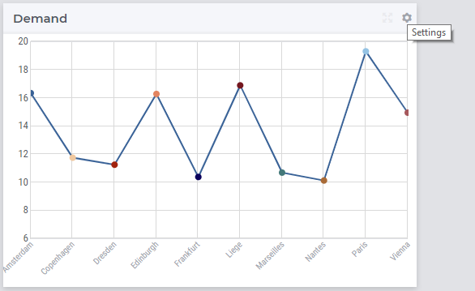

More generally, a line chart widget offers the possibility to display multi-dimensional data in your model by displaying a dot for each data point in the X/Y-plane. 
The Y-coordinate of a dot provides information about the value of the corresponding data point. The dots may be linked by lines in between rendering the graph. 
For example, in the TransNet application, the unit transport costs for every combination (factory, center) may be represented using a line chart widget
like illustrated in more details in the sequel. More specifically, we discuss and illustrate below one-by-one the tabs in the line chart's options editor 
which may be accessed through the Settings wheel as shown in the picture above.

Contents and Pivoting
----------------------

In order to determine the information to be rendered by a line chart, first one has to specify the data identifier(s) in the Contents tab of the widget's options editor, where one may search 
for the available model data using the corresponding functionality at the bottom:

.. image:: images/LineChart-Contents.png
    :align: center
	
Next, in the Pivot tab of the options editor, one can specify how the data dimensions are to be organized in the chart. 
For example, if both the factory index f and the center index c are specified in the X-axis section and the <IDENTIFIER-SET> in the Totals section then the resulting bar chart looks like 
in the picture below on the right:

.. image:: images/LineChart-View0.png
    :align: center

One may move some data indexes in the Overlays section of the Pivot tab. In our example, moving the factory index f to the Overlays section results in the following line chart view:

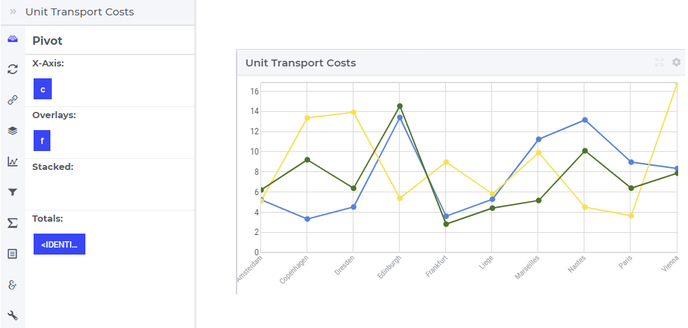

So, now for every factory f there is a line in the chart with a different color. The three lines are drawn independent of each other.

If one moves the center index f to the Overlays section and the factory index f back to the X-axis, then the line chart view shows a line for every center:

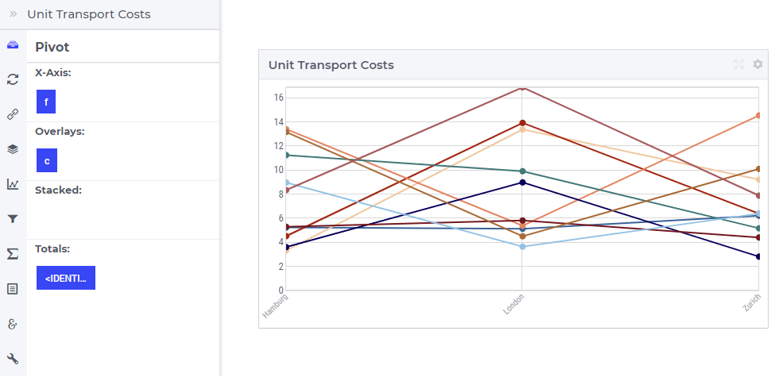
	
Similarly, one may move some data indexes in the Stacked section of the Pivot tab. In our example, moving the center index f to the Stacked section results in a line chart view like below:

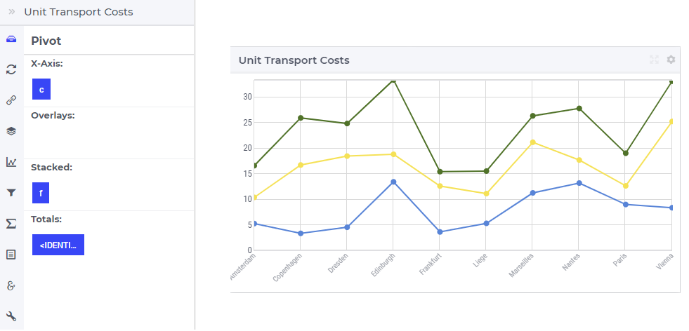

Again, for every factory f there is a line in the chart with a different color, but the three lines are now drawn on the top of each other.

.. note::
    Negative values cannot be stacked in the line chart.

In software versions prior to AIMMS 4.74, the values that were outside the domain were plotted with a default value (most probably 0 if not defined in the default attribute of the identifier).

From version 4.74 onwards, these points are not plotted when the values are outside the domain, potentially resulting in a discontinuous line, as illustrated below:

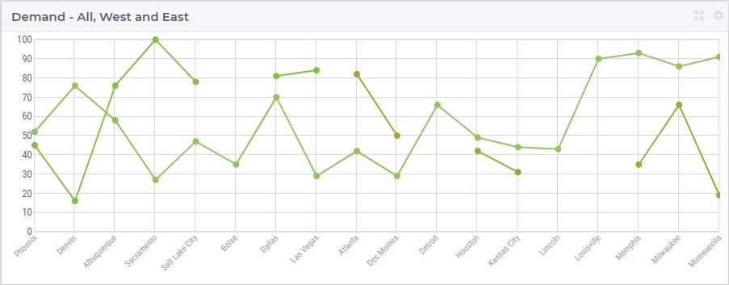

The following snippet is taken out of the above example. The identifiers DemandWest and DemandEast were sliced over index 'l'.

.. code::

    Set AllLocations {
		Index: l;
		Definition: {
			data 
			    { Phoenix         , Denver          , Albuquerque     , Sacramento      , 'Salt Lake City', Boise           , Dallas          ,
			      'Las Vegas'     , Atlanta         , 'Des Moines'    , Detroit         , Houston         , 'Kansas City'   , Lincoln         ,
			      Louisville      , Memphis         , Milwaukee       , Minneapolis     }
		}
	}
	Set WestLocations {
		SubsetOf: AllLocations;
		Index: w;
		Definition: data { Phoenix, Denver, Albuquerque, Sacramento, 'Salt Lake City', Dallas, 'Las Vegas' };
	}
	Set EastLocations {
		SubsetOf: AllLocations;
		Index: e;
		Definition: data { Atlanta, 'Des Moines', Houston, 'Kansas City', Memphis, Milwaukee, Minneapolis };
	}
	Parameter DemandAll {
		IndexDomain: l;
		Definition: {
			data 
			{ Phoenix          : 85,  Denver           : 61,  Albuquerque      : 55,  Sacramento       : 53,  'Salt Lake City' : 23,
			  Boise            : 70,  Dallas           : 38,  'Las Vegas'      : 97,  Atlanta          : 81,  'Des Moines'     : 31,
			  Detroit          : 60,  Houston          : 27,  'Kansas City'    : 56,  Lincoln          : 79,  Louisville       : 85,
			  Memphis          : 71,  Milwaukee        : 28,  Minneapolis      : 92 }
		}
	}
	Parameter DemandWest {
		IndexDomain: w;
		Definition: data { Phoenix : 45,  Denver : 16,  Albuquerque : 76,  Sacramento : 100,  'Salt Lake City' : 78,  Dallas : 81,  'Las Vegas' : 84 };
	}
	Parameter DemandEast {
		IndexDomain: e;
		Definition: data { Atlanta : 40,  'Des Moines' : 36,  Houston : 74,  'Kansas City' : 44,  Memphis : 18,  Milwaukee : 72,  Minneapolis : 97 };
	}

Change Type
-------------

In the Change Type tab of the widget's options editor, one can switch from the line chart type to some other representation type. 
In the example at hand, one can switch e.g.. from the line chart to the table, resulting in the tabular view of the same data values:

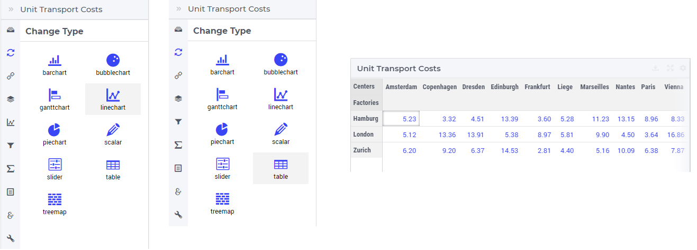

Linechart Settings
--------------------

In the Linechart Settings tab of the widget's options editor, a minimum and a maximum bound for the Y-axis may be specified, either as constants or as scalar identifiers from the model.
Additionally, one may also specify a step size which determines the distance between the horizontal grid lines drawn in the chart:

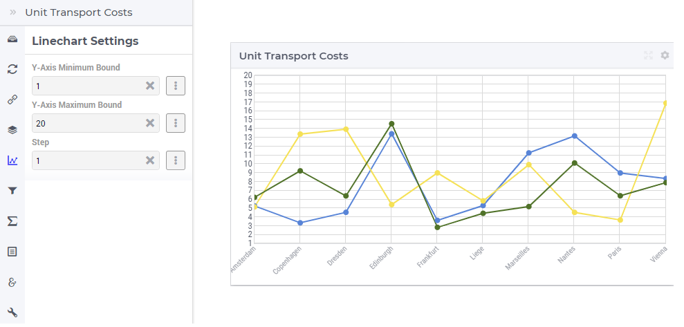
	
To depict the line chart as an area chart, one can switch the "Show Area" option on. This property can also be controlled via identifiers. 

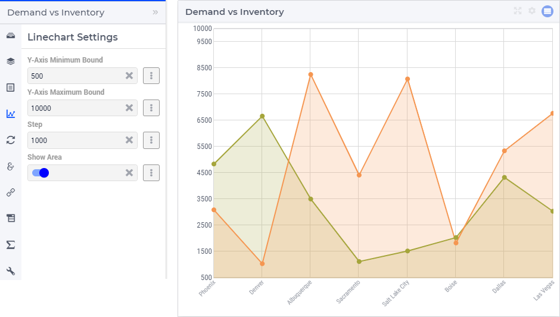

Totals
--------

In the Totals tab of the widget's options editor, aggregated values such as sum, mean, count, min, or max computed over one of the data indexes my be added to the chart. 
In our example, suppose we change the pivoting to the situation where the factory index f is in Overlays section, the center index c is in the X-axis section 
and the <IDENTIFIER-SET> in the Totals section. In this case, if we add the mean over the centers c to our example line chart, then three additional dots representing 
the aggregated values become visible in the chart: 

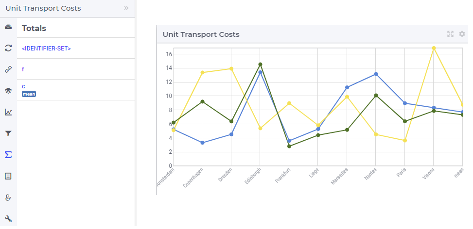
	
Identifier Settings
--------------------

In the Identifier Settings tab of the widget's options editor, one can apply a display domain or some slicing to the data identifier(s).

The "Set display domain" section works in the same way as for e.g.. the bar chart.

In the "Set slicing per index" section it is possible to slice one index to another index of a subset, to an element parameter or to a fixed element in the corresponding set.
For instance, we can slice our factory index f to the fixed element 'Hamburg' in the Factories set, resulting in the line chart view as shown here: 

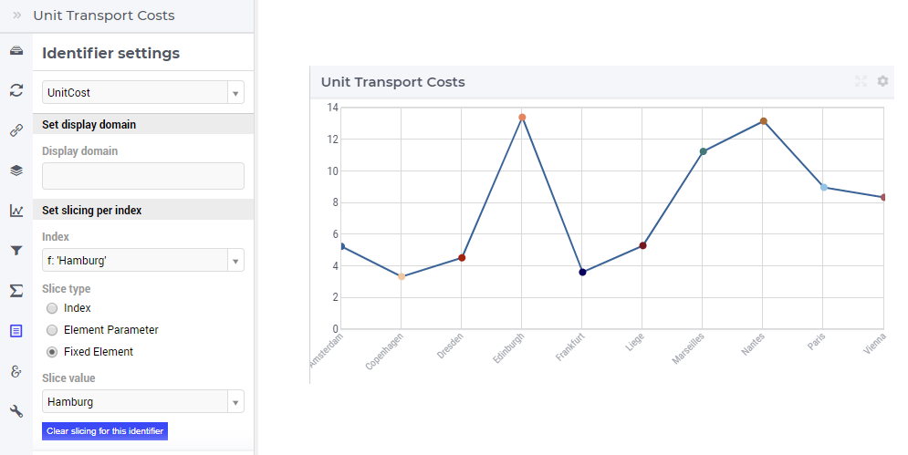

Similarly, one could slice the index f to an element parameter CurrentFactory having the declared range the set Factories (where the value of CurrentFactory may be determined from within the model
or by a choice made through another widget in the user interface). 

Store Focus, Hover and Select
-------------------------------

In the Store Focus tab of the widget's options editor, for each index it is possible to specify an element parameter in the same set which will store the corresponding value when the user sets the
focus on a specific dot in the chart. For example, we can specify SelectedFactory for the index f and SelectedCenter for the index c, where SelectedFactory and SelectedCenter are element parameters 
in our application at hand with ranges Factories and Centers, respectively. The values of SelectedFactory and SelectedCenter may be displayed for inspection in some other widgets outside the line chart.
When the user sets the focus on a specific dot, the corresponding factory and center values are stored in SelectedFactory and SelectedCenter, respectively. In this case, the selected dot is highlighted
by a visible (gray) contour, while the rest of the dots and lines are somewhat faded away. The picture below depicts this situation:

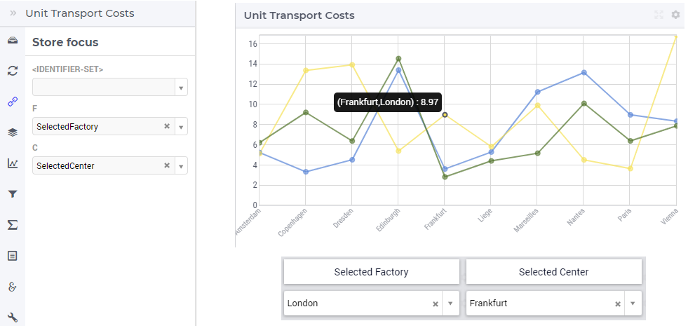

When a dot has been selected, the user may still hover over another dot and inspect the tooltip information, in the same way as the hovering works when no dot has been selected 
(remark: a selected dot may be unselected by clicking again on it):

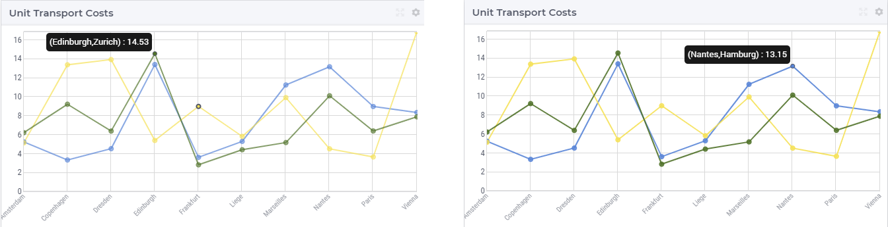

It is also possible to select a line by clicking on it, in which case the selected line is highlighted by a visible (gray) color, while the rest of the dots and lines are somewhat faded away: 

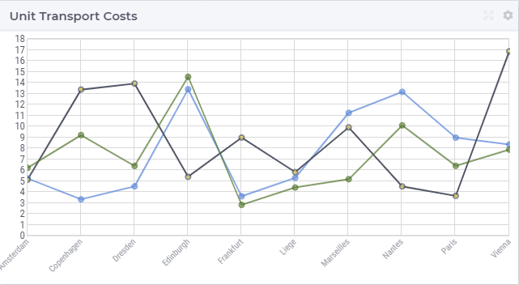

However, in this case the store focus cannot be applied, because such a selection does not determine a unique pair of values for the element parameters (SelectedFactory, SelectedCenter).
Again, as a remark: a selected line may be unselected by clicking again on it.

Similar to the dots and the line, the area also has a hover and selected state, as illustrated below:

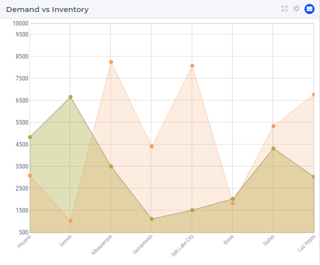

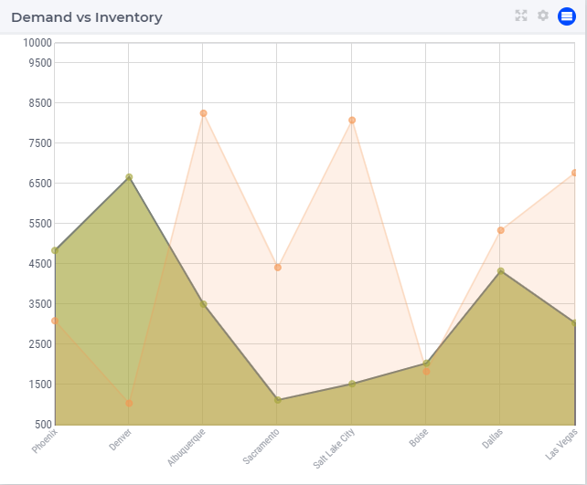

.. note::

    In the Line Chart widget the Hover and Select visual functionalities are available. However, when selecting a line, the line itself does not set any store focus elements as this cannot be uniquely determined. Only the nodes selections can set such store focus identifiers.

Widget Extensions
-----------------

In the Widget Extensions tab, it is possible to add the string parameters configured for the `Widget Actions <widget-options.html#widget-actions>`_ and the `Item Actions <widget-options.html#item-actions>`_ for the widget.

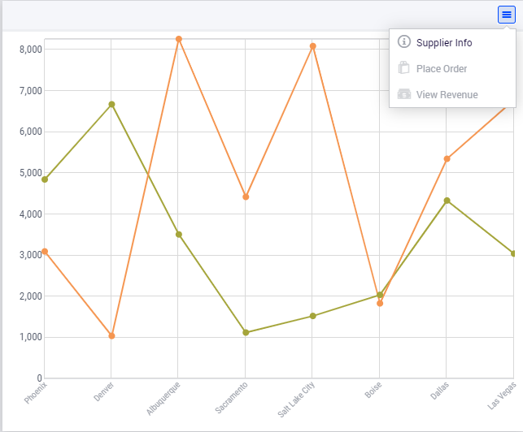

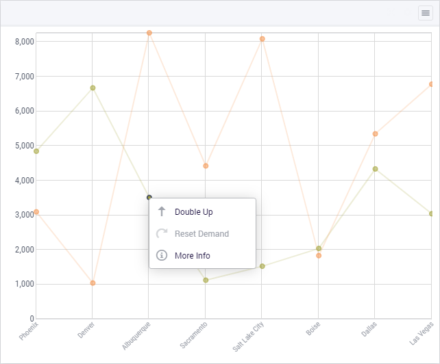

Item Actions also are available on the respective area of the identifier.

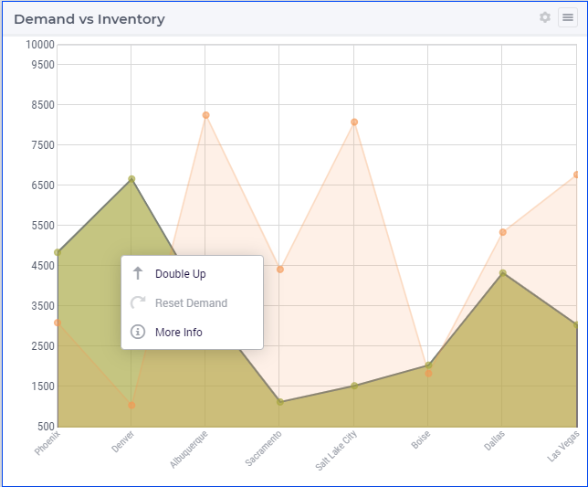

Miscellaneous
--------------

In the Miscellaneous tab of the line chart's options editor, other options may be set such as the title of the widget, whether or not the widget is visible (this may be determined by a model parameter)
or the number of decimals for the values displayed in the chart.
