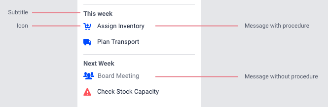
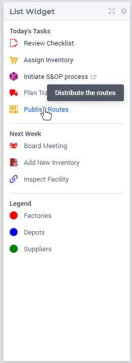
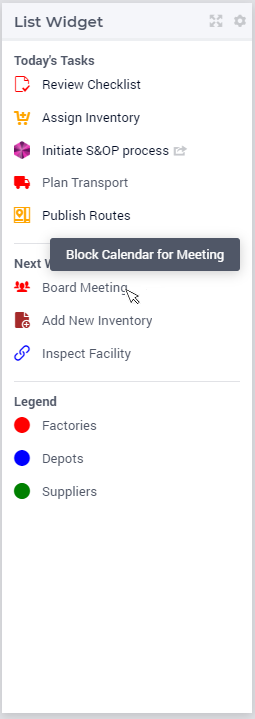
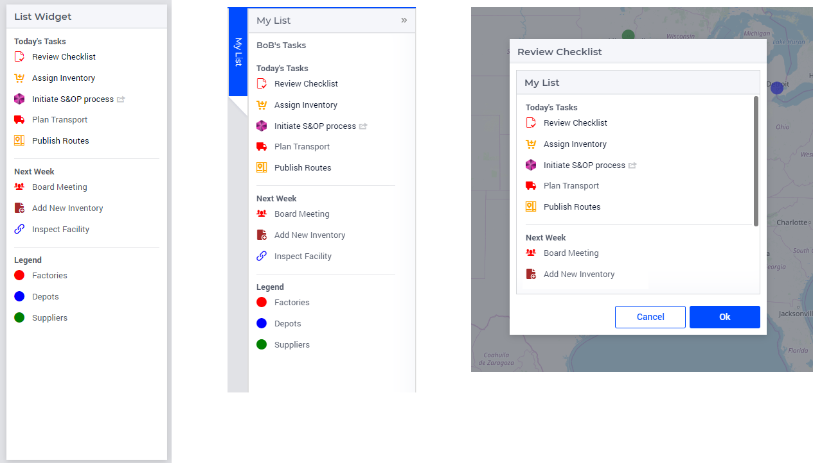
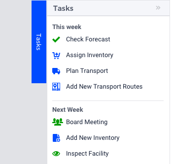
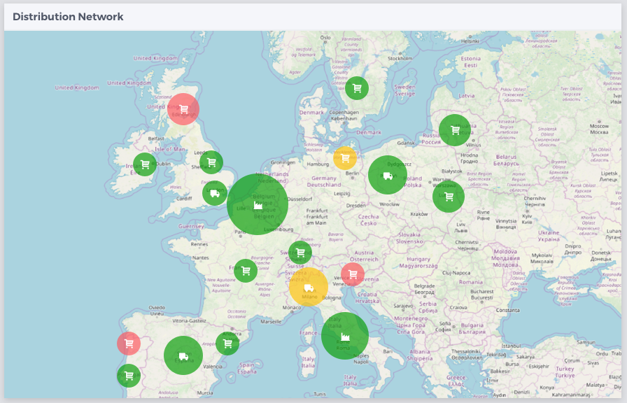
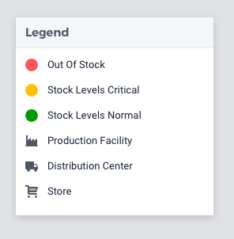

List Widget
===========

.. important:: The List Widget is available in software versions from AIMMS 4.74 onwards.

The List Widget allows you to show a generated list of (grouped) items and associate these with actions, if required. These items can e.g. represent a set of tasks, or a custom legend. Each group of items can have a title that is shown as a header. The items in the list can be interactive, meaning that some procedures can be configured to be executed upon clicking them.

.. image:: images/List_ListWidget.png
    :align: center

The list widget is a versatile widget that can serve a number of different purposes. It is essentially a list of items consisting of an icon, a text and a procedure. The procedure is optional. The list can be subdivided with subtitles.

Creating a List Widget
----------------------

The List widget can be added to a page using the same steps as for any other widget, see `adding a new widget <widget-manager.html>`_. 
After adding the list widget in the Widget Manager, you can click on its Settings wheel in order to configure it.

In the settings options editor, the following sections are available:

*	List Settings: List Groups and the List Group Items can be configured here.
*	Widget Actions: Widget Actions for the list widget can be configured here.
*	Miscellaneous: Title and Visibility can be controlled here.
*	Advanced: Advanced options for this widget are available here.

To configure list groups and their items in the widget you will need to create two string parameters. The first string parameter will configure the list groups with titles and tooltips, whereas the second string parameter will configure the items for each of these list groups.

Configuring List Groups
-----------------------

For illustration, let's call the first string parameter 

.. code:: 
    
    MyListsGroups(webui::indexListGroupOrder,webui::indexListGroupSpec) 

This string parameter is indexed by the `ExtensionOrder <library.html#extensionorder>`_ set with the index :token:`indexListGroupOrder` and the `ListGroupSpecification <library.html#listgroupspecification>`_ set with the index :token:`indexListGroupSpec`. It is used to define the number of list groups, their respective titles and their tooltips. The values of this string parameter may be initialized in the Initial Data attribute, in a procedure or manually, by right clicking it in the AIMMS Model Explorer and clicking on the Data option in order to open its data page. There you can add the details for the list groups, their titles and their tooltips:

.. image:: images/List_ListGroupDeclaration.png
    :align: center

The values in the example above indicate that there are 3 list groups.

Configuring Items for Lists
---------------------------

Create the second string parameter, let's call it

.. code:: 
    
    MyListGroupItems(webui::indexListGroupOrder,webui::indexNoOfListItems,webui::indexListGroupItemsSpec)

indexed over both indices of the `ExtensionOrder <library.html#extensionorder>`_ set and over the index of the `ListGroupItemsSpecification <library.html#listgroupitemsspecification>`_ set. It is used to define the items for all list groups which have been defined in the ``MyListsGroups`` string parameter.

.. image:: images/List_ListGroupItemsDeclaration.png
    :align: center

.. Note::

    The indices must follow the same order as described in the string parameter 
    
    .. code::
        
        MyListGroupItems(webui::indexListGroupOrder,webui::indexNoOfListItems,webui::indexListGroupItemsSpec)
    
There is no limit for the number of items each list group may have. As a guideline, AIMMS recommends no more than ten items per list group. 

In order to inspect the values, right click on the MyListGroupItems string parameter and click on the Data option in order to open its Data page:

.. image:: images/List_TodayDeclaration.png
    :align: center

The data entered in the above illustration is for the first List Group which was configured in the ``MyListsGroups`` string parameter, that is, the "Today" list group (with five items defined).

In order to configure the items for the other list groups, you can just select the respective value for ``indexListGroupOrder`` at the top in the Data page.

For instance, 3 items can be configured for the 2\ :sup:`nd`\  list group "Next Week" as follows:

.. image:: images/List_NextWeekDeclaration.png
    :align: center

Similarly, an example of configuring 3 items for the 3rd list group "Legend" is illustrated here:

.. image:: images/List_LegendDeclaration.png
    :align: center

Configuring the string parameters in the List Widget
----------------------------------------------------

To display the configured List Groups and their respective items in the list widget, click on the widget settings and add the configured string parameters to the respective fields as illustrated below:

.. image:: images/List_ListWidgetSettings.png
    :align: center

Once the string parameters are added in their respective fields, the items will appear under their respective list groups.

.. image:: images/List_ListWidget.png
    :align: center

If the list groups and items exceed the widget's height, a scroll bar will appear.

For list group items that are configured with a procedure and state "Active", the text will be highlighted in blue and the cursor will change to a pointer indicating to the user that an action can be executed, when the user hovers over it.

For list group items that are configured with a procedure and state "Inactive", the text will be grey, the cursor does not change and clicking will not execute the procedure.

The list widget can be added on all page types (i.e. Regular pages, Side Panels and Dialog Pages).

Slicing the List Group and List Group Items
+++++++++++++++++++++++++++++++++++++++++++

You can also create lists for different users and then slice the data based on the current user. You can simply extend the string parameter with an additional index of the Users set and then slice the data based on the element parameter for the selected user.

Let's say we have a set :token:`Users` with the index :token:`indexUsers`. You can add this index to the ``MyListsGroups`` and the :token:`MyListGroupItems` string parameters as illustrated below.

.. code::

    MyListsGroups(indexUsers,webui::indexListGroupOrder,webui::indexListGroupSpec)
    MyListGroupItems(indexUsers,webui::indexListGroupOrder,webui::indexNoOfListItems,webui::indexListGroupItemsSpec)

You can then slice these string parameters on :token:`indexUsers` with an element parameter that determines the current user.

.. Note::

    It is currently not possible to slice on the key indices, i.e. :token:`webui::indexListGroupOrder`, :token:`webui::indexNoOfListItems`, :token:`webui::indexListGroupSpec` and :token:`webui::indexListGroupItemsSpec` defined in the string parameters.

Examples of usage of the List Widget
------------------------------------

Use as a task-list
++++++++++++++++++

Users may need to keep eyes on a number of different applications. Having a to-do list for various applications in one place helps them tame the chaos.

Users may also have periodically repeating tasks that happen every quarter, month or week. Having these to-dos in one list creates a cadence of tasks that makes it easier to maintain them.

Since a to-do list is usually something users do not need to see all the time, a sidepanel will be the most obvious place for it.

Use as a legend
+++++++++++++++

With the introduction of icons and colored nodes, much data can be displayed on a map. For example:

* Icons indicate the type of asset, like Distribution Center, Production Facility and Stores.
* Color could indicates stock levels, like green for "in stock" and red for "out of stock".
* Node sizes to indicate the volumes in a product flow.

To easily understand this information, users need a good legend. This is an important use case for the list widget.

Creating a legend for icons is straightforward: just use the appropriate icon and text. Making a legend for colors can be done by using a circle icon (``aimms-circle2``) and give it the right color.

Often one type of visualization is used per information category. For example, icons represent a type of asset and colors represent stock levels. Using two types (both a color and an icon to visualize a type of asset) can be useful if:

* Users need to scan a map very quickly.
* Better accessibility for users with colorblindness is needed.

Be aware however that using multiple types of visualization for the same information may be confusing to users. Green and red for example have strong connotations with positive and negative and using these colors for type of asset may cause users to read meaning where there is none.

A few best practices on using icons/colors
------------------------------------------

* Using many different colors for icons can make the List Widget too busy and increase the user's cognitive load.
* Be sparse with colors: consider if it is needed to give an icon a different color. When in doubt, it is probably wise to remember the saying “less is more” and keep colors the same.
* Colors can be used to create categories, for example to-do items with an action required are blue. The number of colors that work well on screens and can easily be differentiated by users is limited however. With more than about ten colors the differences become hard to distinguish.
* Colors can communicate meaning, like green for OK and red for error. One of the most common forms of color blindness is red-green color blindness. It is therefore good practice to not rely on color only to communicate meaning, but shape as well, like a check mark or a warning-triangle.
* Avoid using colors with not enough contrast. This makes it hard to see for users, especially when using a lower-quality screen or a projector.
* When using different colors for icons, try to use a harmonious set of colors with matching lightness/saturation. This makes the interface calmer and helps users feel in control. `This website <https://flatuicolors.com/>`_ has useful sets of colors that work together.
