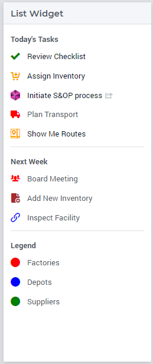
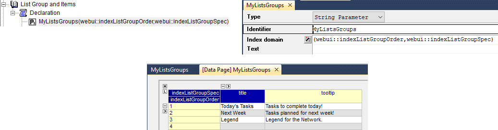
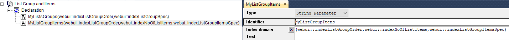
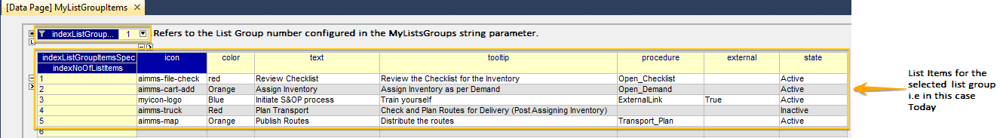
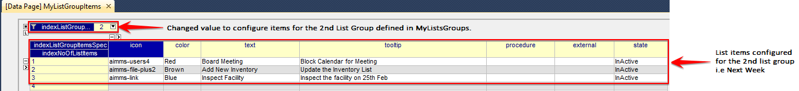
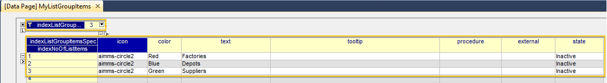
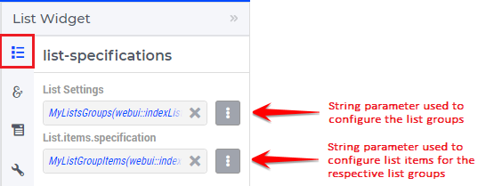

List Widget
===========

.. important:: The new List Widget is available in software versions from AIMMS 4.72 onwards as part of Experimental Features. Please reach out to User Support on how to enable Experimental Features.

The List Widget allows you to show a generated list of (grouped) items and connect those, if required, with actions. These items can e.g. represent a set of tasks, or a custom legend. Each group of items can have a title that is shown as a header. The items in the list can be interactive, meaning that some procedures can be configured to be executed upon clicking the items. As shown below in the examples and specification, each item has various properties to give the end user guidance such as a text description and an icon with color.

Creating a List Widget
----------------------

The List widget can be added to a page using the same steps as for any other widget, see `adding a new widget <widget-manager.html>`_. 
After adding the list widget in the Widget Manager one can click on its Settings wheel in order to configure the widget.

In the settings options editor one can find the following sections:

*	List Settings: List Groups and the List Group Items can be configured here.
*	Widget Actions: Widget Actions for the list widget can be configured here.
*	Miscellaneous: Title and Visibility can be controlled here.
*	Advanced: Advanced options for this widget are available here.

To configure list groups and their items in the widget you will need to create two string parameters. The first string parameter will configure the number of list groups, while the second string parameter will configure the items for each of these list groups.

Configuring List Groups
-----------------------

For illustration, let's call the first sting parameter :token:`MyListsGroups(webui::indexListGroupOrder,webui::indexListGroupSpec)`. This string parameter is indexed by the `ExtensionOrder <library.html#extensionorder>`_ set with the index :token:`indexListGroupOrder` and the `ListGroupSpecification <library.html#listgroupspecification>`_ set with the index :token:`indexListGroupSpec`. This string parameter is used to define the number of list groups, their respective titles and tooltips. The values of this string parameter may be initialized in the Initial Data attribute, in a procedure or manually, by right clicking the string parameter and clicking on the Data option in order to open its data page. There you can add the details for the list groups, their titles and their tooltips:

The values in the example above indicate that there are 3 list groups.

Configuring Items for Lists
---------------------------

Create the second string parameter, let's call it :token:`MyListGroupItems(webui::indexListGroupOrder,webui::indexNoOfListItems,webui::indexListGroupItemsSpec)` indexed over both indices of the `ExtensionOrder <library.html#extensionorder>`_ set and over the index of the `ListGroupItemsSpecification <library.html#listgroupitemsspecification>`_ set. This string parameter is used to define the items for each list group which has been defined in the MyListsGroups string parameter.

.. Note::

    The indices must follow the same order as described in the string parameter :token:`MyListGroupItems(webui::indexListGroupOrder,webui::indexNoOfListItems,webui::indexListGroupItemsSpec)`

There is no limit for the number of items each list group may have. As a guideline, AIMMS recommends no more than 10 items per list group. 

In order to inspect the values, right click on the MyListGroupItems string parameter and click on the Data option in order to open its Data page:

The data entered in the above illustration is for the 1st List Group which was configured in “MyListsGroups” string parameter, that is, the "Today" list group (with 5 items defined).

In order to configure the items for the other list groups, one may just select the respective value for indexListGroupOrder at the top in the Data page.

For instance, 3 items may be configured for the 2nd list group "Next Week" as follows:

Similarly, an example of configuring 3 items for the 3rd list group "Legend" is illustrated here:

Configuring the string parameters in the List Widget
----------------------------------------------------

To display the configured List Groups and their respective items in the list widget, click on the widget settings and add the configured string parameters to the respective fields as illustrated below:

Once the string parameters are added in their respective fields, the items will appear under their respective list groups.

If the list groups and items exceed the widgets height, a scroll bar will appear.

The list widget can be added on all page types, i.e Regular pages, Side Panels and Dialog Pages.