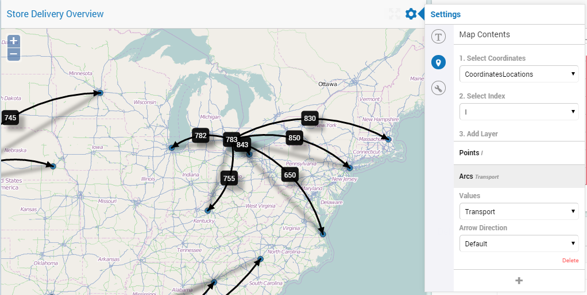

Map Widget old style
--------------------

This section applies only to the old style Map widget, ie the map widget type before the release og AIMMS 4.61. 

The Map widget allows you to display a map with arcs and/or (dynamically sized) nodes on top of it if you want. In the WebUI you need an identifier indexed over two indices: the index related to the locations and one extra index. The set belonging to that second index should contain 2 elements. The first element will be related to the longitudes and the second element to the latitudes. 

.. note::
    Please note that the naming of the indexes of the LonLat set is exactly as you should name them too.
    
See also screen capture below and supportive snippet of AIMMS Model Code. 

.. code::

    Set Locations {
        Index: l;
        Text: "All Stores and Depots together";
        Definition: Stores + Depots;
    }

    Set LonLat {
        Index: iLonLat;
        Text: "The set of Longitude and Latitude to support Web UI";
        Definition: data { 'Lon', 'Lat' };
    }

    Parameter CoordinatesLocations {
        IndexDomain: (l,iLonLat);
        Text: "The coordinates of Location l";
        Definition: if ( iLonLat = 'Lon' ) then XCoordinate(l) else YCoordinate(l) endif;
    }

    Variable Transport {
        IndexDomain: (d,s);
        Text: "Delivery from Depot d to Store s where d and s are Locations l";
        Range: [0, TransportMax];
    }

along with the following data:

.. code::

    CoordinatesLocations:=
    data 
    { ( Seattle         , Lon ) : -122.330,  ( Seattle         , Lat ) :   47.603,  ( Houston         , Lon ) :  -95.370,
      ( Houston         , Lat ) :   29.760,  ( Detroit         , Lon ) :  -83.048,  ( Detroit         , Lat ) :   42.332,
      ( Denver          , Lon ) : -104.992,  ( Denver          , Lat ) :   39.740,  ( Portland        , Lon ) : -122.676,
      ( Portland        , Lat ) :   45.512,  ( 'Las Vegas'     , Lon ) : -115.140,  ( 'Las Vegas'     , Lat ) :   36.172,
      ( 'Los Angeles'   , Lon ) : -118.245,  ( 'Los Angeles'   , Lat ) :   34.053,  ( Dallas          , Lon ) :  -96.796,
      ( Dallas          , Lat ) :   32.778,  ( Chicago         , Lon ) :  -87.632,  ( Chicago         , Lat ) :   41.884,
      ( Cleveland       , Lon ) :  -81.690,  ( Cleveland       , Lat ) :   41.504,  ( 'Carson City'   , Lon ) : -119.767,
      ( 'Carson City'   , Lat ) :   39.165,  ( 'San Antonio'   , Lon ) :  -98.495,  ( 'San Antonio'   , Lat ) :   29.424,
      ( 'Virginia Beach', Lon ) :  -76.059,  ( 'Virginia Beach', Lat ) :   36.755,  ( 'New York'      , Lon ) :  -74.007,
      ( 'New York'      , Lat ) :   40.715,  ( Miami           , Lon ) :  -80.237,  ( Miami           , Lat ) :   25.729,
      ( Boston          , Lon ) :  -71.057,  ( Boston          , Lat ) :   42.359,  ( Helena          , Lon ) : -112.021,
      ( Helena          , Lat ) :   46.590,  ( Boise           , Lon ) : -116.193,  ( Boise           , Lat ) :   43.607,
      ( 'San Jose'      , Lon ) : -121.886,  ( 'San Jose'      , Lat ) :   37.338,  ( 'Salt Lake City', Lon ) : -111.888,
      ( 'Salt Lake City', Lat ) :   40.760,  ( Albuquerque     , Lon ) : -106.649,  ( Albuquerque     , Lat ) :   35.084,
      ( Phoenix         , Lon ) : -112.076,  ( Phoenix         , Lat ) :   33.448,  ( Tucson          , Lon ) : -110.970,
      ( Tucson          , Lat ) :   32.221,  ( 'San Diego'     , Lon ) : -117.162,  ( 'San Diego'     , Lat ) :   32.716,
      ( Lincoln         , Lon ) :  -96.708,  ( Lincoln         , Lat ) :   40.814,  ( 'St Paul'       , Lon ) :  -93.093,
      ( 'St Paul'       , Lat ) :   44.944,  ( Jackson         , Lon ) :  -87.895,  ( Jackson         , Lat ) :   31.508,
      ( Jacksonville    , Lon ) :  -81.656,  ( Jacksonville    , Lat ) :   30.331,  ( Charlotte       , Lon ) :  -80.838,
      ( Charlotte       , Lat ) :   35.222,  ( Frankfort       , Lon ) :  -84.879,  ( Frankfort       , Lat ) :   38.195,
      ( Atlanta         , Lon ) :  -84.391,  ( Atlanta         , Lat ) :   33.748 }

.. important:: After you have set up your coordinates, points and arcs in the options editor of your Map widget, the map doesn't automatically move/scale such that all your points are in the visible area. You may have to scroll and zoom before you actually see your data on the map. After that, your zoom level and your position is automatically saved.

Dynamic Node Sizing
+++++++++++++++++++

It is possible to specify the size of the nodes that are displayed in your Map widget. You can do so by specifying a one-dimensional parameter in the Contents options editor, indexed over the locations. You can use any size you want; the Map widget will automatically scale the sizes provided relatively to each other. There are two special cases:

#. A node size can be 0;
#. A node size can be <0.

It is up to the app developer to use `(blank) annotations <#data-dependent-styling>`_ on the node set in order to treat these special cases differently (or not, whatever he chooses).