Map Widget
==========

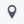
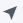
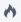
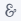
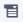
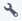

.. important:: This section applies to the new style Map widget, i.e. the map widget available in software versions from AIMMS 4.73 onwards. Most of this section also applies to the map widget available in software versions from AIMMS 4.61 upto 4.72. Maximum Relative Size, Icons for Nodes, Store Focus with hover and select for arcs, Heatmap and Custom HTML Tooltips for nodes and arcs are available only from version 4.73 onwards.    

The Map widget allows you to display a map in the background and show a network with nodes and arcs on top of the map.
A simple situation is for example when a transport identifier indexed over factories f and centers c in the TransNet application 
(see the "Quick Start: My First WebUI" section) is displayed like in the following picture:

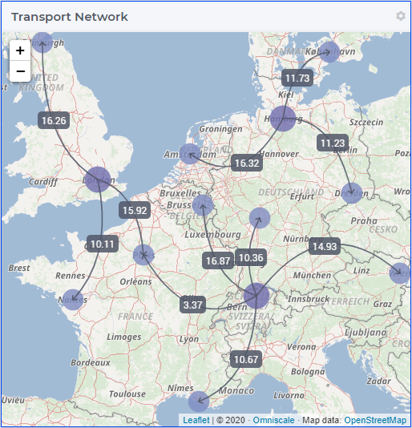

The Map widget in WebUI can display many different types of data on a map. For example:

* Icons for the type of asset, like Distribution Center, Production Facility and Stores.
* Color for stock levels, like green for in stock and red for out of stock.
* Node sizes for capacity of the asset
* Arc width for volume of product flow (with optional labels to display the value in text)
* Heatmap for geographical distribution of demand

The map displayed in the background is provided by `Omniscale <https://maps.omniscale.com/en/>`_, when the application is running on localhost (developer mode, or on a local AIMMS PRO setup) and also when the application is deployed on the AIMMS PRO cloud. If the application has been deployed on-premise using a different domain the map server will roll back to OpenStreetMaps. 
An Internet connection is required for rendering the map. Assuming the connection is available, the map may be zoomed at various levels (see also the Zoom option mentioned further below):

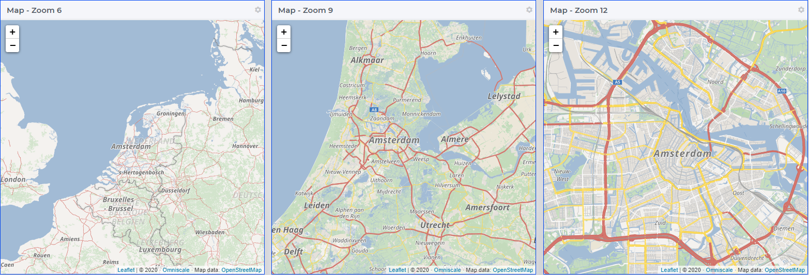

The network with nodes and arcs on top of the map must be defined in terms of identifiers declared in the AIMMS model.

In this section we illustrate how to create, configure, and use such a map widget rendering a network in the AIMMS WebUI. 

.. important:: We also provide some guidelines and best practices for the map widget usage at the end of this section, please consider them before employing the map widget within your application.

Creating a map widget
-----------------------
	
A map widget can be added to a page using the same steps as for any other widget, see `adding a new widget <widget-manager.html>`_. 
After adding the map widget in the Widget Manager one can click on its Settings wheel in order to configure the widget.

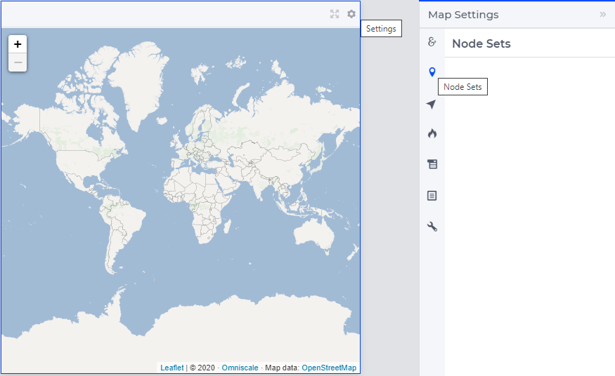

In the settings options editor one can find the following sections:

*	|nodeset| Node Sets: Multiple node sets can be added here.
*	|arcset| Arc Sets: Multiple arc sets can be added here.
*	|widgetactionicon| Widget Extensions: `Widget actions <widget-options.html#widget-actions>`_ and `Item actions <widget-options.html#item-actions>`_ can be configured here.
*	|heatmap| Heatmap: A heatmap can be added here. 
*	|miscicon| Miscellaneous: Title, Zoom, Center Latitude, Center Longitude and Visibility can be controlled here.
*	|advicon| Advanced: Advanced options for this widget are available here.

Adding node sets
-------------------

After selecting the "Node Sets" section and clicking on the "+" sign at the bottom, one can add options for the first node set:

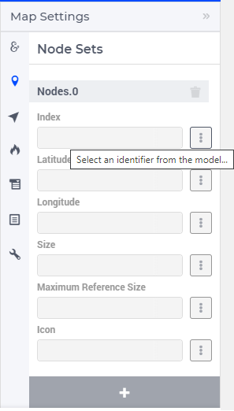

The available options to be specified are the following:
	
*	Index: Select the index of the node set to be displayed
*	Latitude: A 1-dimensional parameter specifying the latitude coordinates for the nodes set with the selected index
*	Longitude: A 1-dimensional parameter specifying the longitude coordinates for the node set with the selected index
*	Size: A 1-dimensional parameter specifying the dynamic sizes for the node set with the selected index. Nodes which have an undefined size or 0 will not be drawn on the map.
*	Maximum Reference Size: A scalar parameter that is used to relative size the nodes based on a fixed value when Size is specified. When undefined, the nodes are relatively sized based on the maximum value in the Size identifier. This option is applicable only when the Size has also been specified for the node set.
*	Icon: The icon you want to associate with a node set. You can select from a list of 1600+ icons, the reference can be found in the `icon list. <../_static/aimms-icons/icons-reference.html>`_

.. tip:: 
    If you find it difficult to browse the icon list, navigate to `IcoMoon List <https://icomoon.io/#preview-ultimate>`_ and find an icon. Hover over the desired icon and write down the icon name. Append ``aimms-`` to the selected icon name when adding it to the model. For example: if the icon name is "calculator", then in AIMMS it needs to be ``aimms-calculator``.

    `Custom icons <webui-folder.html#custom-icon-sets>`_ can also be used if required.

.. note::

    * The Latitude and Longitude must be specified by two separate identifiers declared in the model.
	
    * The values of the Latitude and the Longitude parameters must be within the geographical bounds, i.e. between (-90,90) and (-180,180), respectively. Not keeping the Latitude and the Longitude within these bounds can lead to unexpected or unresponsive behavior of the Map widget. In order to avoid such undesirable behavior, one can specify the bounds intervals in the Range attributes of the corresponding identifiers in the model.	
	
    * The default node size radius is 2 px. One can set a dynamic node size to each node set by selecting an appropriate identifier for the Size parameter in the desired node set (the index domain of such a parameter must be the same as the index of the node set).

Adding identifiers to node option fields
^^^^^^^^^^^^^^^^^^^^^^^^^^^^^^^^^^^^^^^^^^^

When clicking on the identifier selector of the Index field (as shown above), a pop-up dialog is shown where the index of the node set may be selected:

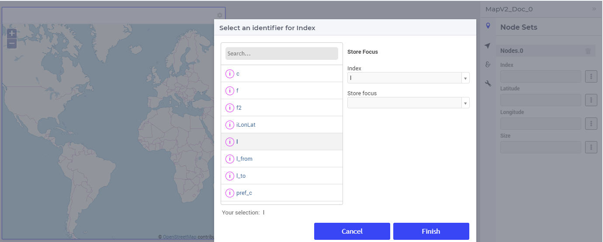

Next, when clicking on the identifier selector of the Latitude, a 1-dimensional parameter indexed over the selected index may be selected in the corresponding pop-up dialog:

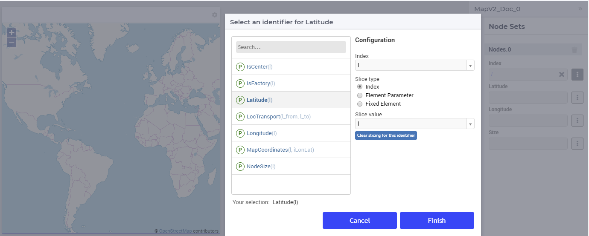

Similarly, one can follow the steps for the Longitude and the Size fields. Once all fields have been assigned, the nodes will be drawn on the map:

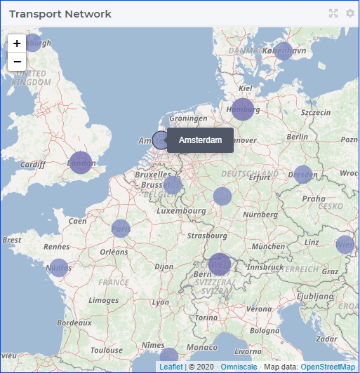

Multiple node sets
^^^^^^^^^^^^^^^^^^^^^^^^^^^^^^^^

As mentioned above, multiple node sets may be added to the map widget. For instance, suppose that in the TransNet application we would like to add the factories f and the centers c
as separate node sets. After having added first the node set f, one can again select the Latitude parameter as discussed above, but in this case one may need to slice the parameter
to only the set f as a subset of the Locations set with index l. This can be achieved using the slicing options in the pop-up dialog as follows:

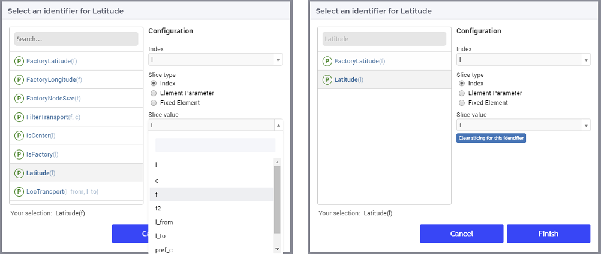

The same type of slicing can be applied to the Longitude and Size parameters. Moreover, one may repeat all these steps and add the centers c as a second node set with similar options.
These actions result in a map widget with 2 node sets:

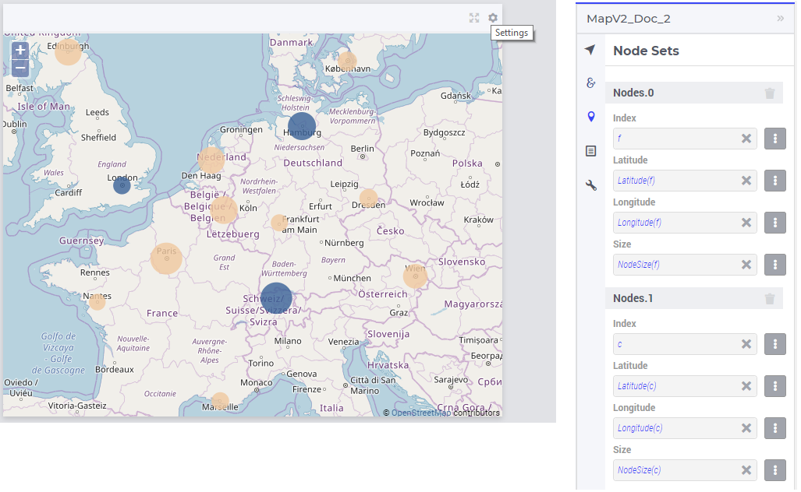

Relative Node Sizing
^^^^^^^^^^^^^^^^^^^^

Sizes of nodes for a node set are relative to their surface area, with the largest value of the size identifier taking the largest area on the map. The areas of the other nodes are calculated with reference of the largest value. Hence, the area of one node is twice as big or small if the node size value is twice as large or small from another node in the same set. Consider the below illustration:

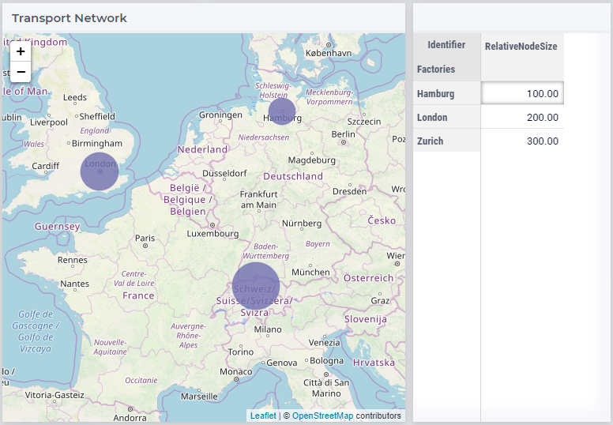

Since Zurich has the largest value it is assigned the largest area on the map. All the other nodes are relatively sized with Zurich as the reference. Hence, Hamburg is three times smaller than Zurich in area.

Maximum Reference Size
^^^^^^^^^^^^^^^^^^^^^^

Maximum Reference Size is a scalar parameter used when you want to relatively size the areas of the nodes in a node set based on a user defined value. When defined, the areas of all the nodes will be calculated based on the maximum reference size, rather than the largest value of the Size identifier. For example:

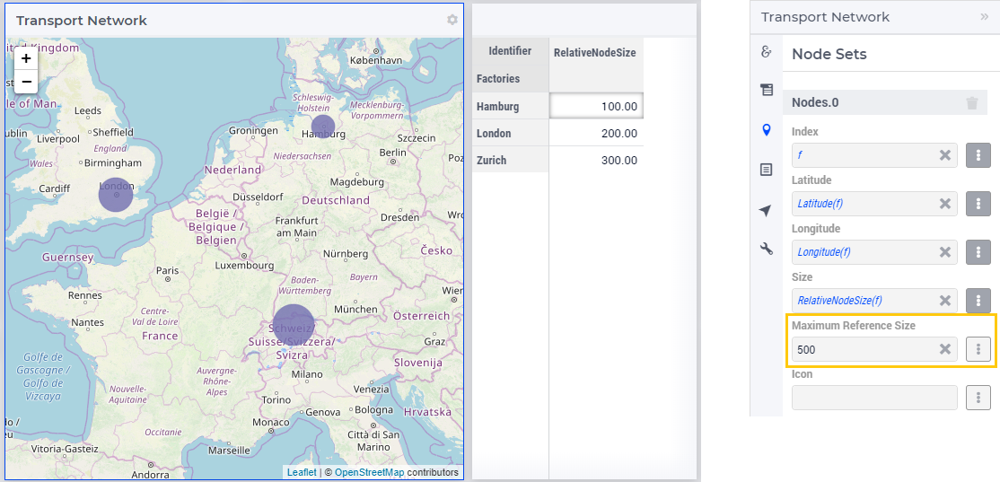

The areas of the nodes are now calculated with the Maximum Reference Size of 500. Hence, the areas are now smaller as compared to the illustration in the Relative Node Sizing section.

Another illustration is when the Maximum Reference Size is smaller than the highest value in the Size identifier. 

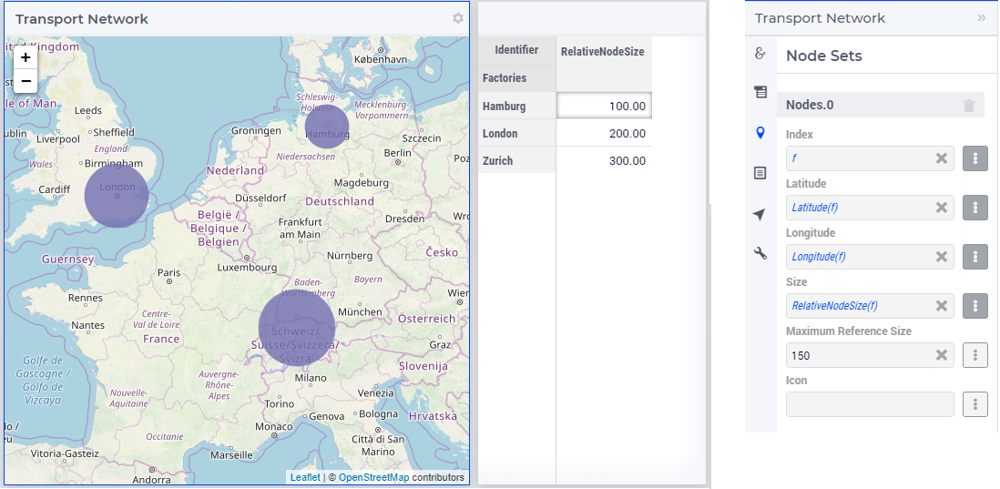

The areas are now larger since the reference value is now 150.

This also allows you to relatively size nodes from different node sets with the same reference value.

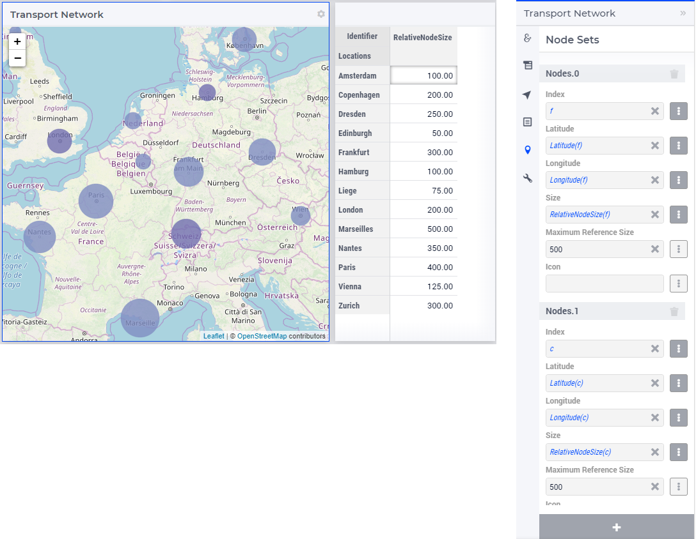

Icons for nodes
^^^^^^^^^^^^^^^

You can add icons within nodes to represent a node set, e.g., Factories or Centers. To configure icons for a node set, create a string parameter that is indexed by the index of the respective node set. Define an icon name that you selected from the list of icons available, as illustrated below.   

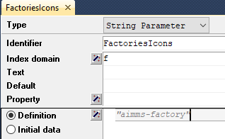

Add this string parameter in the Icon option of the node set. The icon will appear in the nodes. 

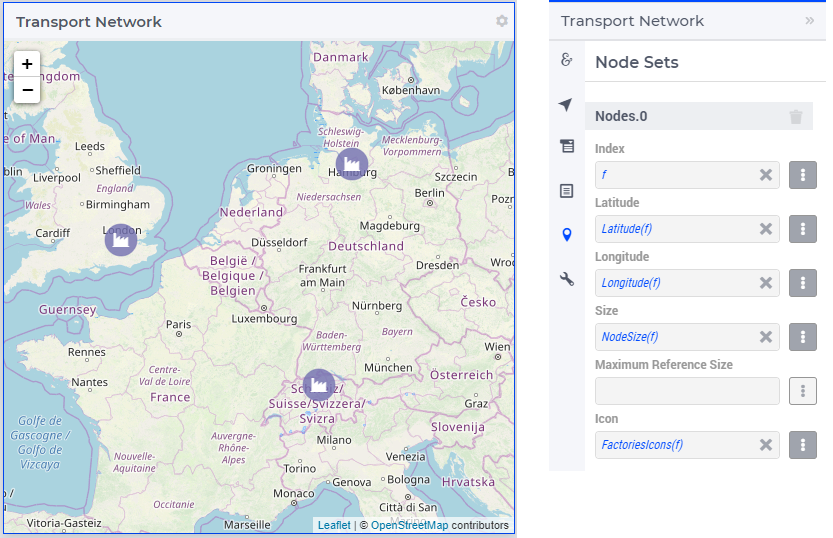

You can also define different icons for each individual node. Right click the string parameter and click on the Data option to open the data page and add icons for each location:

.. image:: images/MapV3_DifferentFactoryIcon.png
    :align: center

Similarly, you can define different icons for different node sets.

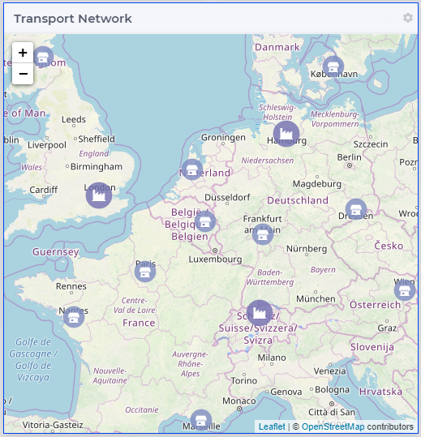

To view icons you might have to also configure the Size identifier. The icons are scaled as per the node size. If you do not configure the Size parameter, the icons will not be visible. However you can also control the size via annotations.

Custom Tooltips and Annotations for nodes
^^^^^^^^^^^^^^^^^^^^^^^^^^^^^^^^^^^^^^^^^

When a user hovers over a node a tooltip displays the name of the node. It is also possible to override the defalut tooltips for these node by adding the :token:`webui::TooltipIdentifier` annotation attribute to the identifier that was specified as the "Size" for the respective node set. You can find further details in `Tooltips for nodes section <map-widget.html#tooltips-for-nodes>`__ on this page.

It is also possible to add user-annotations in your AIMMS model which will be used to style the corresponding node styles with CSS. This can be achieved by adding the :token:`webui::AnnotationsIdentifier` annotation attribute to either the Set that the nodes are indexed over or the Size identifier. We suggest adding the :token:`webui::AnnotationsIdentifier` annotation attribute to the Size identifier, and if the size is not speficied to add it to the Set. You can find more details with the supported CSS properties in the `CSS properties supported for annotations section <css-styling.html#widgets-and-css-properties-supported-for-annotations>`_.

Store Focus, Hover and Select for nodes
-----------------------------------------

Nodes on the map widget also have the functionality to store focus. This means that one can store the value of a selected node in the network in an element parameter declared in the model.
The store focus functionality opens up various interaction possibilities, because the value of the element parameter may be further used by other widgets or may impact
some parts of the model execution.

While adding the index for the node set, one will notice an option for “Store focus”. 
Here an element parameter may be specified which will store the value of the node selected upon clicking in the network.

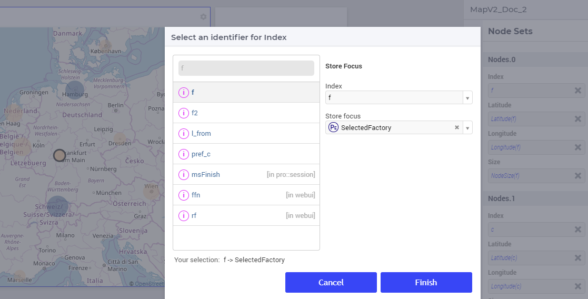

Once the element parameter has been specified, one is able to see this reflected in the Index field of the corresponding node set in the options editor. 
For example, we can specify SelectedFactory for the index f and SelectedCenter for the index c, where SelectedFactory and SelectedCenter are element parameters 
in our application at hand with ranges Factories and Centers, respectively.
Furthermore, the values of these element parameters may also be displayed for inspection in other widgets outside the map.
When the user sets the focus on a specific node, the corresponding factory or center value is stored in SelectedFactory or SelectedCenter, respectively. 
In this case, the selection effect is that the selected node is highlighted on the map (i.e., it gets a thick outline), while the other nodes are faded away. 
The picture below depicts this situation:

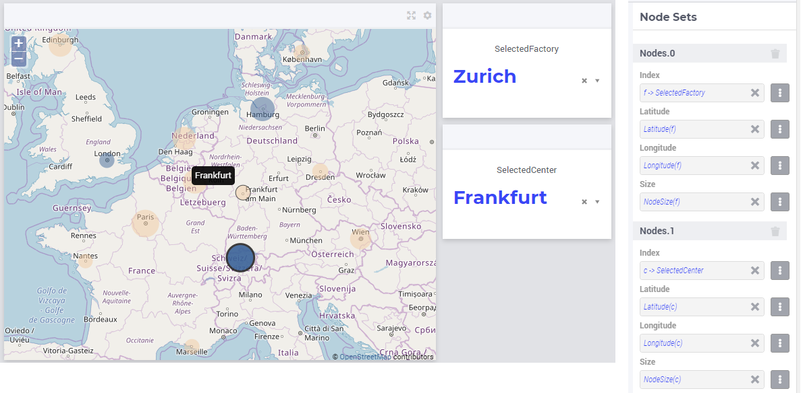

Note that, when a node has been selected, the user may still hover over another node and inspect the tooltip information, in the same way as the hovering works when no node has been selected 
(remark: a selected node may be unselected by clicking on it again). The hover effect is that the node which is hovered over has a thin outline.
	
Adding arc sets
-----------------
 
After selecting the "Arc Sets" section in the options editor and clicking on the "+" sign at the bottom, one can add options for an arc set:

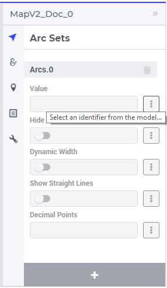

The available options to be specified are the following:

*	Value: Select the 2-dimensional identifier which defines the arc set. The arcs will be drawn and the labels with the values will be displayed for each arc.
*	Hide Labels: Switch this on in order to hide the arc labels.
*	Dynamic Arc Width: This option controls whether the arc width is fixed or dynamic. Dynamic arc width accounts for the values that are defined in the “Value” field of the current arc set.
*	Show Straight Lines: Switch this on in order to turn the curved arcs into straight lines.
*   Decimal Points: Specify the number of decimals to be shown for the values of the arc labels.

.. note::
    The arc identifier must be a 2-dimensional identifier like ArcFlow(i,j) where i and j are indexes of some node sets or subsets thereof.
	
    Note that, except for the “Value” field, all other options can be controlled either by constant values or by using scalar parameters declared in the model.

Adding identifiers to arc option fields
^^^^^^^^^^^^^^^^^^^^^^^^^^^^^^^^^^^^^^^

We illustrate first the addition of an arc set for the example at hand where only the root set Locations with index l has been added as node set. 
In this example, let's assume that l_from and l_to are two alias indexes spanning the same Locations set as the index l.
When clicking on the identifier selector of the Value field (as shown above), a pop-up dialog is shown where the arc identifier may be selected:

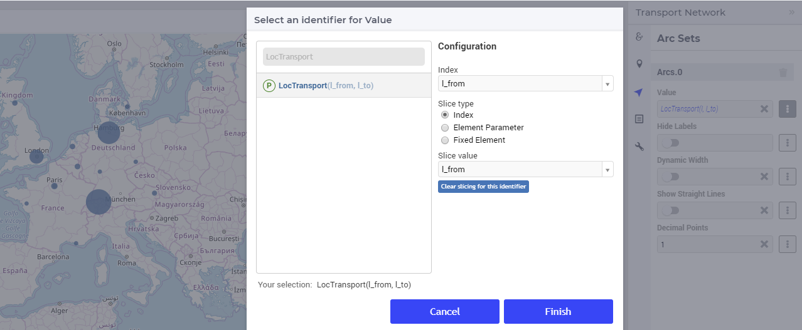

Once the arc identifier has been properly specified, the arcs will be drawn on the map:	

Arcs are drawn in a clockwise manner. Meaning, arcs that are drawn from North to South or West to East will be drawn with an upward curve, and arcs that are drawn from South to North or East to West will be drawn with a downward curve.

Arcs that have a positive value will be drawn with a solid line whereas arcs that have a negative value will be drawn as a dot-dashed line, as illustrated below:

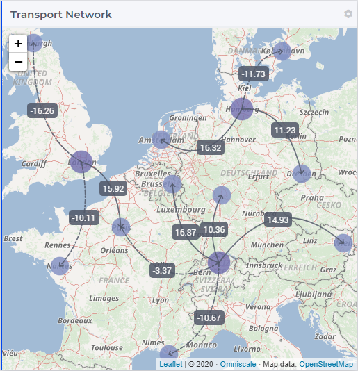
 
When the "Hide Labels" option is turned on, the map is drawn as follows:

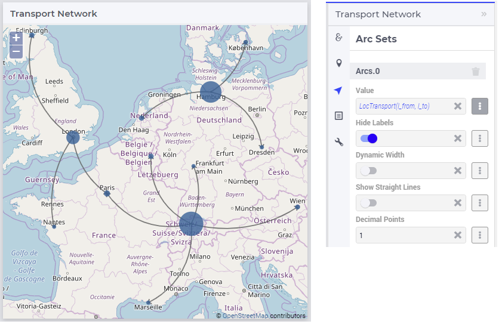

When the "Dynamic Arc Width" option is turned on, the values of the identifier specified in the "Values" field are accounted for in the width:

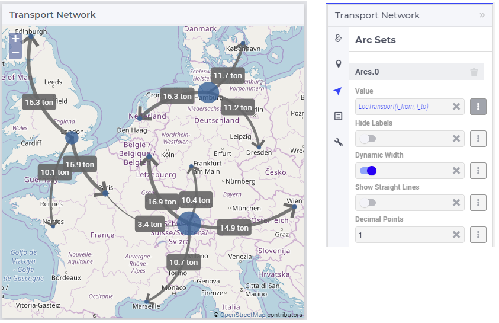

When the "Show Straight Lines" option is turned on, the arcs are drawn like in the following picture:

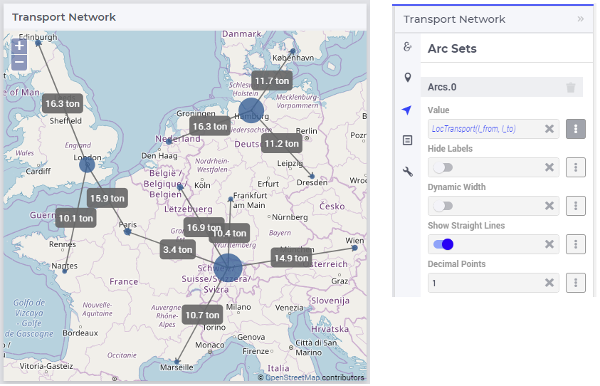

Adding an arc set for map widgets with multiple node sets works in a similar way. For instance, in our example at hand, the situation with both 
the factories f and the centers c in the node sets and with the variable Transport(f,c) added as an arc set results in a map view as follows:

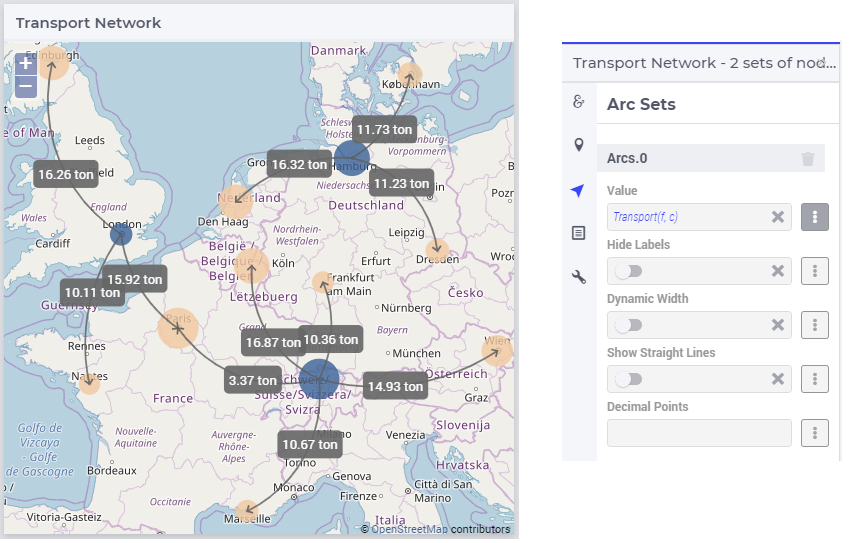

So, in this latter case the arcs are drawn between nodes belonging to two different node sets. 

.. Note::
    While specifying an identifier for the Value field for an arc set, it is possible to `slice <widget-options.html#id6>`_ the identifier to display part of the dimensions/data. If you use a sliced identifier, the resulting dimension for the identifier needs to be at least 2. Please refer to the `Slicing <widget-options.html#id6>`_ section for more details.
	
Multiple arc sets
^^^^^^^^^^^^^^^^^^^^^^^^^^^

As mentioned in the beginning of this section, multiple arc sets may be added to the map. Suppose that in an example as ours we may distinguish several subsets of the
Locations set: a (sub)set of Plants with index p, a s(sub)set of DistributionCenters with index d, and a subset of CustomerRegions with index r. Moreover, suppose 
our model contains two identifiers: PlantToDC_Flow(p,d) with product flow values from plants to distribution centers and DCtoRegion_Flow(d,r) with product flows
from distribution centers to customer regions. In such a case, one could define a map widget with, for example, 3 sets of nodes and 2 sets of arcs as follows:

The sets of nodes:

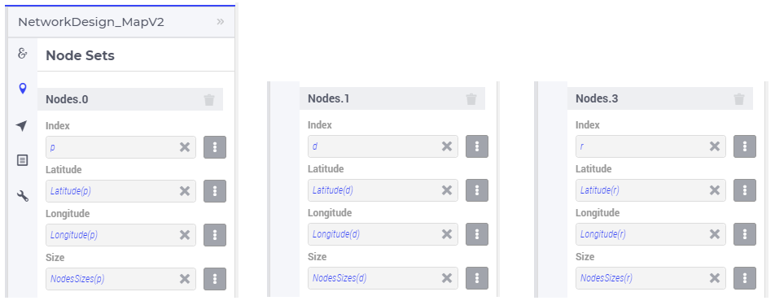

The sets of arcs:  

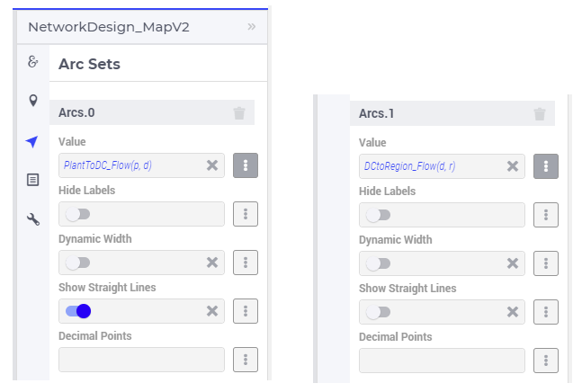

Such option specifications can result in a map view like in the following picture (where the arcs in first set are drawn as straight lines and the arcs in the second set
are drawn as curved lines):

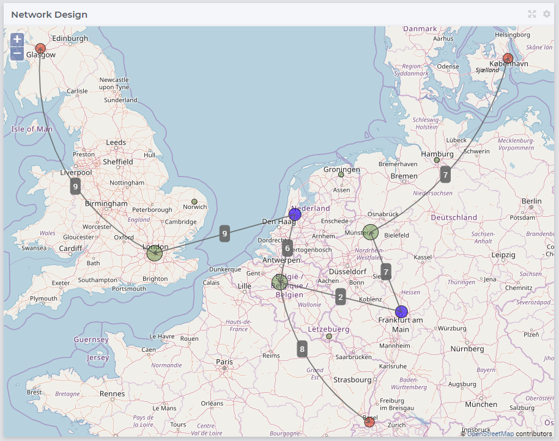

.. note::
    For the map widget in order to be able to render multiple arc sets correctly the conditions in this note must be satisfied. For any two different arc sets, with their sets of source 
    nodes originating in different node sets (as specified in the "Node Sets" section of the widget options), these node sets should not contain any elements with the same element names. 
    The same should hold true for sets of destination nodes of any two different arc sets.	

Applying this note to the source nodes in our example here at hand means that the set of plants p and the set of distribution d centers should not contain any elements with the same element names.
In the same vein, when considering the destinations nodes, the set of distribution centers d and the set of customer regions r should not contain any elements with the same element names.

Custom Tooltips and Annotations for arcs
^^^^^^^^^^^^^^^^^^^^^^^^^^^^^^^^^^^^^^^^

When a user hovers over an arc there is no tooltip that displayed, since the information is displayed on the label. It is possible to configure user-defined tooltips for these arcs by adding the :token:`webui::TooltipIdentifier` annotation attribute to the identifier that was specified as the "Value" for the respective arc set. You can find further details in `Tooltips for nodes section <map-widget.html#tooltips-for-arcs>`__ on this page.

It is also possible to add user-annotations in your AIMMS model which will be used to style the corresponding arc styles with CSS. This can be achieved by adding the :token:`webui::AnnotationsIdentifier` annotation attribute to the Value identifier. You can find more details with the supported CSS properties in the `CSS properties supported for annotations section <css-styling.html#widgets-and-css-properties-supported-for-annotations>`_.

Store Focus, Hover and Select for arcs
--------------------------------------

Similar to the nodes, arcs also have the functionality to store focus. This means that when an arc is selected by clicking it, you can store the value of the nodes that the arc was drawn between, in element parameters declared in the model.

While adding the identifier for the arc set, one will notice an option for “Store focus”. Here an element parameter may be specified for either one or both of the indices, which will store the value of the node(s) when an arc is selected upon clicking in the network.

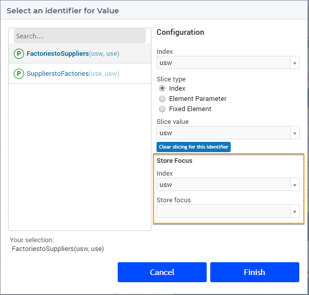

Once the element parameter has been specified, you will be able to see this reflected in the "Value" field of the corresponding arc set in the options editor. For example, while specifying the Value of the arc set with the identifier :token:`FactoriestoSuppliers(usw,use)`, you can specify :token:`SelectedFactory` for the index :token:`usw` and :token:`SelectedSupplier` for the index :token:`use`, where :token:`SelectedFactory` and :token:`SelectedSupplier` are element parameters in our application at hand with ranges Factories and Suppliers, respectively.

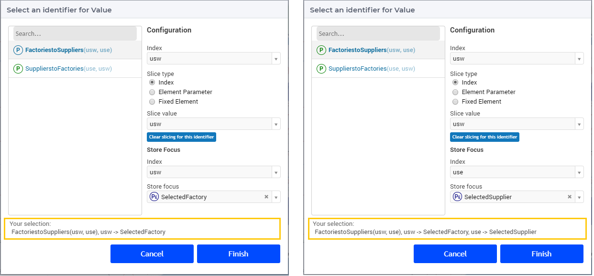

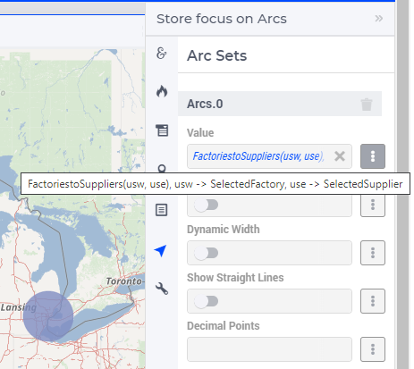

When the user hovers over a certain arc, the arc darkens so that the user can easily identify the complete arc. Incidentally, the other arcs become slightly lighter. When the user clicks on the arc, in order to select it, that arc stays dark and the other arcs become even lighter. This allows the user to identify which arc has been selected even when the focus is not on the map widget. 

When no arcs are hovered or selected.

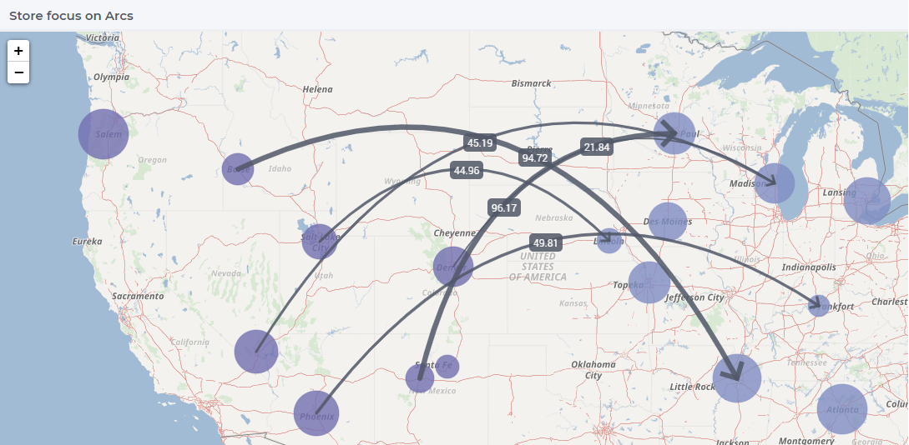

When the user hovers over an arc.

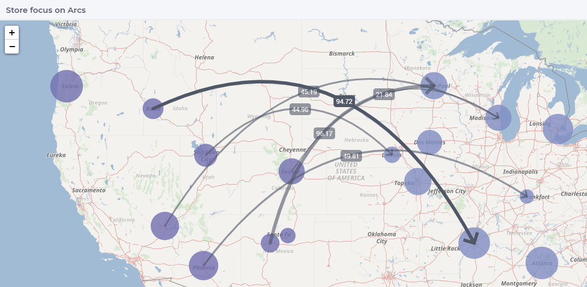

When the user selects that arc.

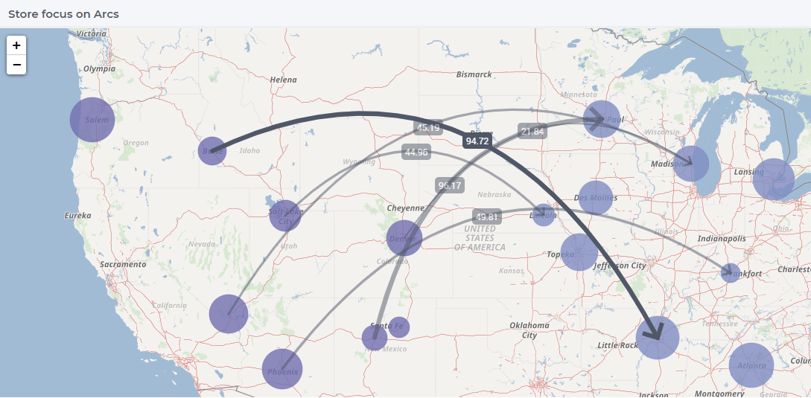

These effects are specific to arcs that belong to the same arc set. Arcs that belong to other arc sets are not effected.

Ordering and deleting node/arc sets
-----------------------------------

The ordering of the added node/arc sets may be changed by hovering over the title bar of the set and then clicking on the respective button, to move up or down. 
An entire node/arc set may be deleted by clicking on the bin icon. These options are illustrated in the following picture:

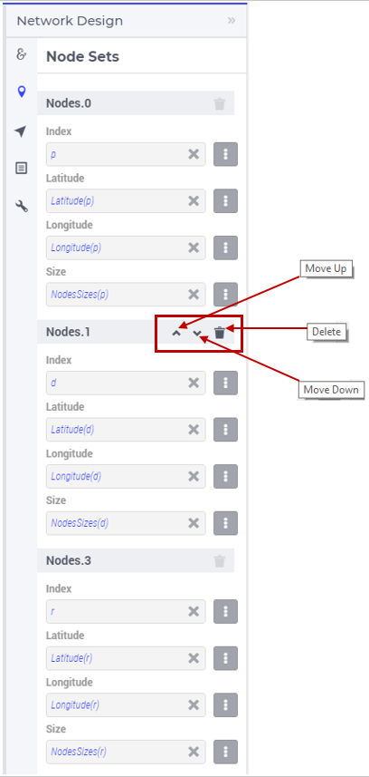

The order of nodes sets determines which node sets should be drawn on top of others in case there are overlapping nodes.

Heatmap
-------

The heatmap is a type of data visualization that shows the magnitude of data as a color value on a map. This gives users an easy way to see the geographical distribution of a phenomenon. The heatmap visualizes data values on grid of lat-lon coordinates and blurs the colors in between. This means that a heatmap is more for getting an overview of how data is clustered and varies than for exact values. Heatmaps make it easy to visualize complex data in a simple manner and understand it in a glance.

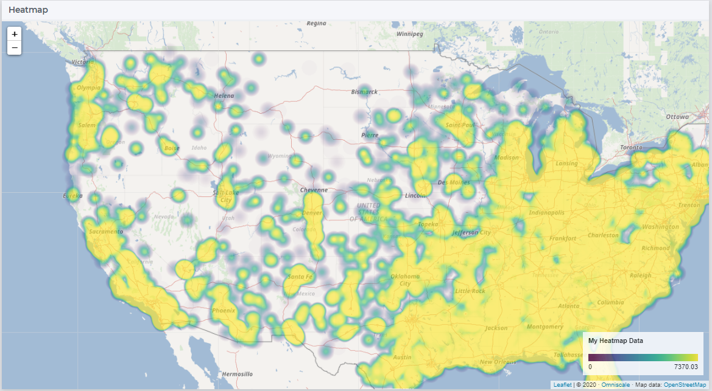

Heatmap Coloring
^^^^^^^^^^^^^^^^

The heatmap uses a default coloring scheme called Viridis, developed for `Matplotlib <https://www.youtube.com/watch?v=xAoljeRJ3lU>`_. The advantages of this scheme are:

* Colorful
* Pleasant to look at
* Sequential (as opposed to Diverging or Categorical)
* Perceptually uniform (It accurately represents data without sudden jumps in perception)
* Works when printed in black and white
* Accessible to colorblind users

Below is an illustration of below data visualized with different color scheme’s

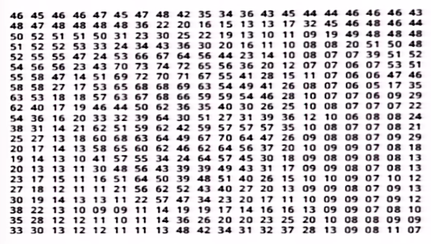

+-------------------------------------------+-------------------------------------------+
| .. image:: images/Map_Rainbow.jpg         | .. image:: images/Map_Virilis.jpg         |
|    :align: center                         |    :align: center                         |
+-------------------------------------------+-------------------------------------------+
| .. image:: images/Map_RainbowScale.png    | .. image:: images/Map_ViridisScale.png    |
|    :align: center                         |    :align: center                         |
+-------------------------------------------+-------------------------------------------+

Further reading on coloring for heatmaps: 

https://cran.r-project.org/web/packages/viridis/vignettes/intro-to-viridis.html  
https://matplotlib.org/3.1.1/tutorials/colors/colormaps.html

Adding a Heatmap
^^^^^^^^^^^^^^^^

To configure a Heatmap in AIMMS you will require the set of locations, the latitude and longitude for those locations and the data for each of the locations.

After selecting the “Heatmap” section and clicking on the “+” sign at the bottom, one can add options for the the heatmap:

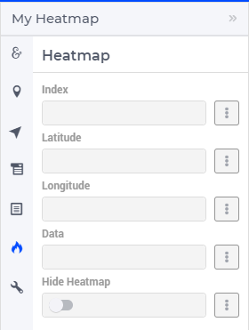

The available options to be specified are the following:
	
*	Index: Select the index of the set to be displayed
*	Latitude: A 1-dimensional parameter specifying the latitude coordinates for the heatmap with the selected index
*	Longitude: A 1-dimensional parameter specifying the longitude coordinates for the heatmap with the selected index
*	Data: A 1-dimensional parameter specifying the data for the heatmap with the selected index.
*	Hide Heatmap: A boolean value to hide the heatmap. Switch this option on to hide the heatmap.

Similar to how `identifiers are added to node option fields <map-widget.html#adding-identifiers-to-node-option-fields>`_, add identifiers for the Index, Latitude, Longitude and Data. Once all fields have been assigned, the heatmap will be drawn on the map.

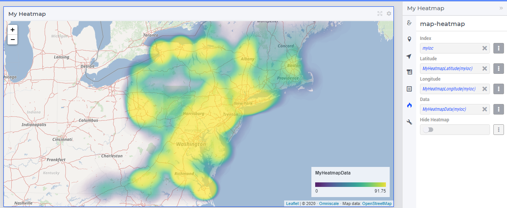

A legend is also displayed inside the map widget. The legend shows the identifier name that was speficied as the Data for the heatmap as the title. It also displays the minimum value (on the left) and maximum value (on the right) of the data set and how the gradient is spread betwen those values, as illustrated in the above example.

You can configure only one heatmap for a map widget.

.. Note::
    If node sets and arc sets are also configured along with the heatmap, the nodes and arcs will overlap the heatmap.

    If the number of locations on the heatmap exceed 5000, there might be a slight delay in rendering the heatmap.

Miscellaneous options
-----------------------

In the Miscellaneous section of the options editor one can find several options:

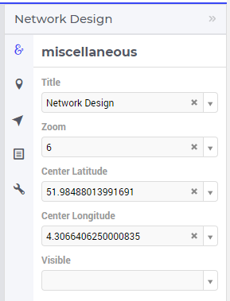

Here are more explanations about the meaning of these options:

*	Title: Specify a title to be shown at the top of the widget
*	Zoom:  One can set a zoom level to start with or control this via an identifier. When the map loads for the end user it starts off at the defined zoom level. The zoom level can be set between 2 (max zoom out) to 18 (max zoom in). One can also have max zoom out level as 0 or 1, but only when the size of the map is smaller than 5 columns in width.
*	Center: The “center” option is split into 2 options, “Center Latitude” and “Center Longitude”. Similarly to the zoom option, if one sets the Center Latitude and Center Longitude, then the initial load will start from that “center” point. One can also control this option via identifiers in the model.
*	Visible: Specify whether or not the widget is visible on the page. This option may also be controlled using a model identifier.

.. note:: When using the Zoom and Center options, ensure that the values for these identifiers are defined as Initial Data and not Definitions.  

.. important:: If your widget has been created in the past by using an older type Map widget, you may continue to use this widget as is, but it is not possible to upgrade the widget from an older Map type to the current Map type by just changing the widget type in the Advanced options. In order to use the current Map type, the node and arc sets have to be added explicitly to the widget using the style described in this section.

Custom HTML tooltips for Nodes and Arcs
---------------------------------------

As described in the `Widget Options <widget-options.html#html-tooltips>`_ section, in order to create user-defined tooltips, in the attribute form of the identifier you can add the :token:`webui::TooltipIdentifier` annotation attribute and then fill in the auxiliary string parameter containing the desired tooltips there.

Tooltips for Nodes
^^^^^^^^^^^^^^^^^^

To display user-defined tooltip for nodes, you will have to add the :token:`webui::TooltipIdentifier` annotation attribute to the identifier that was specified as the "Size" for the respective node set. As illustrated below, :token:`SupplyUSAWest(usw)` is specified as the Size for the node set and the string parameter :token:`SupplyUSAWestTooltip(usw)` added to the :token:`webui::TooltipIdentifier` annotation attribute:

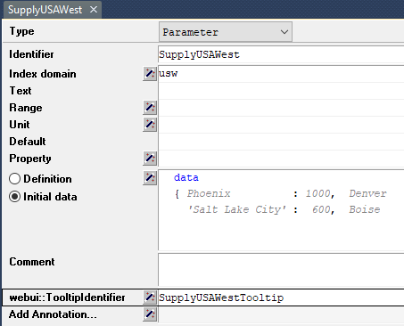

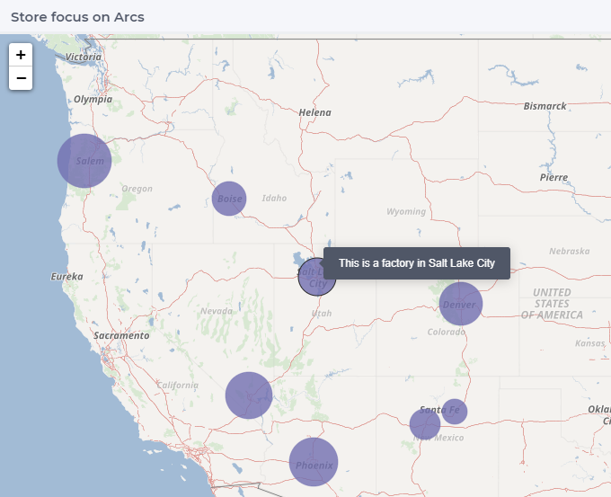

In the illustration above, you can see the result of using the following definition for the string parameter :token:`SupplyUSAWestTooltip(usw)`:

.. code::

    formatstring("This is a factory in %e",usw);

Similary, you can add user-defined tooltips to each node set.

Tooltips for Arcs
^^^^^^^^^^^^^^^^^

To display user-defined tooltip for arcs, you will have to add the :token:`webui::TooltipIdentifier` annotation attribute to the identifier that was specified as the "Value" for the respective arc set. As illustrated below, :token:`FactoriestoSuppliers(usw,use)` is specified as the Value for the arc set and the string parameter :token:`FactoriestoSuppliersTooltips(usw,use)` added to the :token:`webui::TooltipIdentifier` annotation attribute:

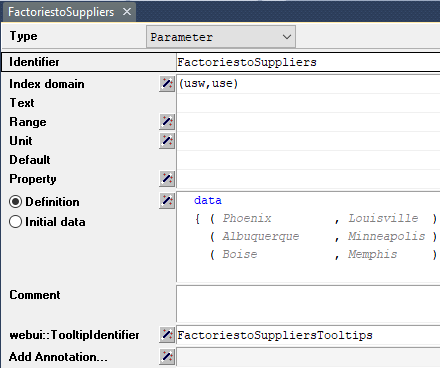

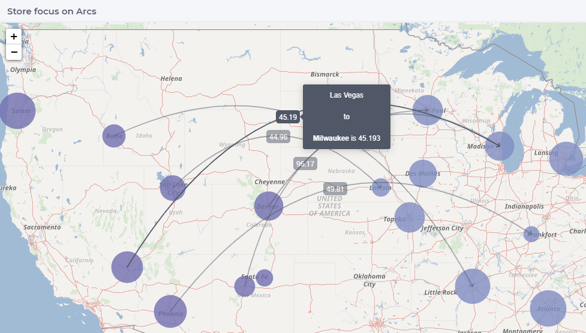

In the illustration above, you can see the result of using the following definition for the string parameter :token:`FactoriestoSuppliersTooltips(usw,use)`:

.. code::

    formatstring("%e %s %e %s %n",usw,"  to  <strong>",use,"</strong> is",FactoriestoSuppliers(usw, use));

Similary, you can add user-defined tooltips to each node set.

Using Google Maps with API key 
------------------------------

If you already use services from Google Maps, it is possible to override the default map provider in AIMMS with Google Maps, by adding an `Application Specific Resource <resources-subwebui-folder.html#webui-resources>`_ file. 

Create a .js file, lets call it GoogleAPI.js, in the resources/js folder. In the GoogleAPI.js, add the below code with your valid Google API key. Ensure you replace YOUR_API_KEY with your actual API key within the quotes.

.. code::

    global.googleMapId = '[YOUR_API_KEY]';

Once this is done, all the map widgets in your application will serve Google maps.

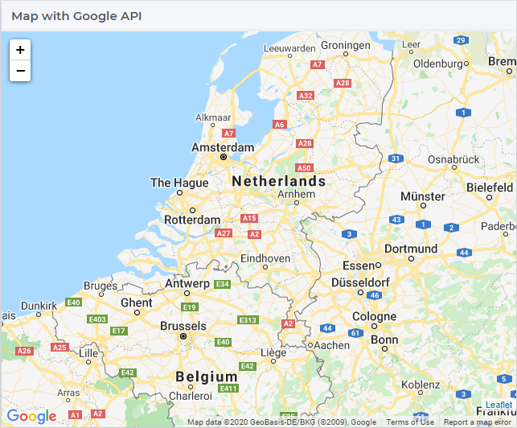

Please note, if the API key does not have the correct permissions, the map will not render the background and you may get an error as illustrated below:

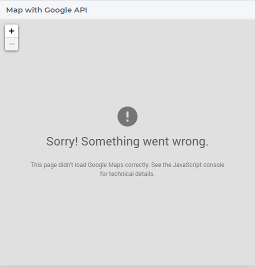

.. Important::

    **Disclaimer**

    All usage of a Google API key is subjective to license terms set forth by the holders of this API key. AIMMS shall not be responsible or liable for any misuse of such API keys. Furthermore, it is the user's responsibility to be compliant with securing the API keys and the license agreement of the respective providers; see e.g. https://developers.google.com/maps/api-key-best-practices.

Guidelines and best practices
----------------------------------

While using the map widget, there are some pointers on how to leverage the features in order to represent data efficiently.

With every widget there is always some limitation on how much data can be rendered at a time. As a general guideline, the map widget can handle networks with a total number of nodes and arcs up to (about) 4000. 
At the same time, please note the following:

.. note::
   The capacity and performance of the map widget is dependent on the specifications of your user’s machine, server and database speed, and the browser being used, among other factors.
  
A good practice is to show (only) slices of the data which may be visualized comfortably by the end-user, who should be able to grasp the meaning of data and derive information from it.
 
Some ways to achieve that are: 

*	Use selections to control the (sub)sets for the shown data
*	Use domain identifiers to display data which is relevant

Although the Map widget has several features, using them all together would make the map very cluttered. Which data is visualized how therefore needs to be carefully considered in a way that creates the most value.

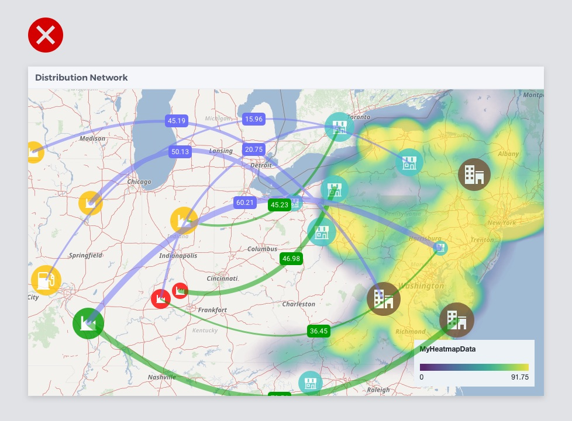

* All features used, making it difficult to understand the data
* Too light colors (especially yellow) making it low contrast with the map
* Colored arcs don’t add value