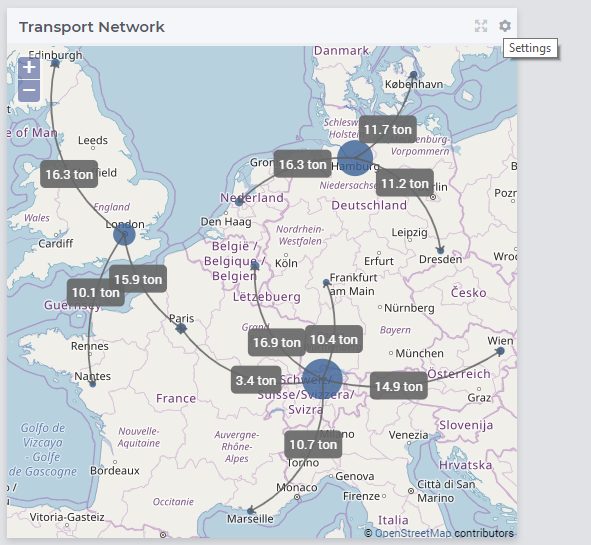
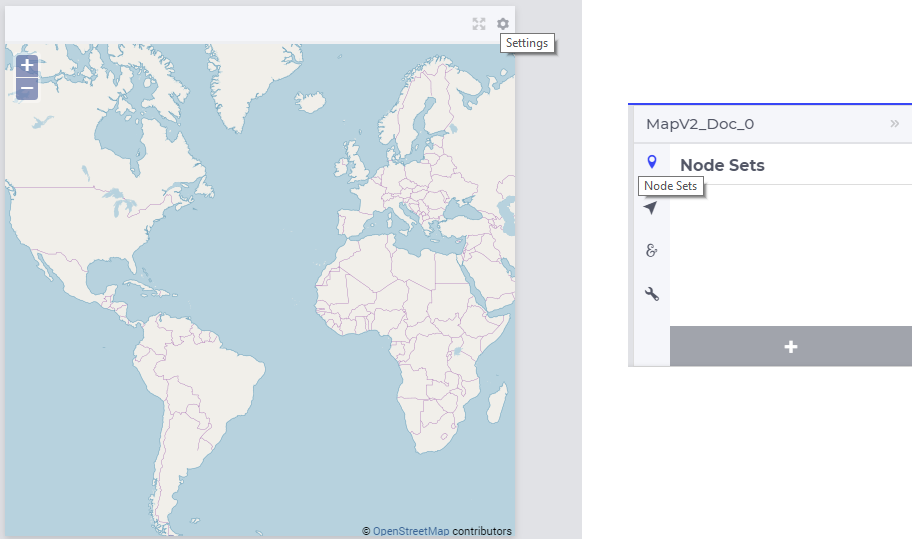
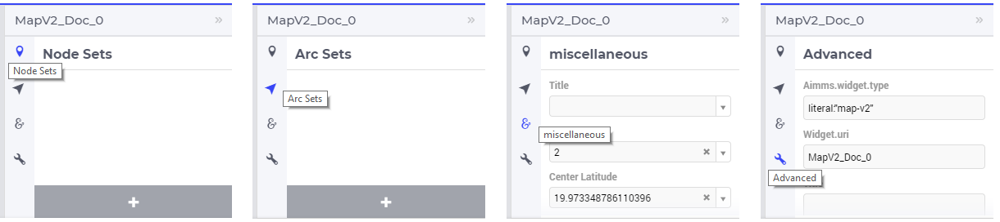
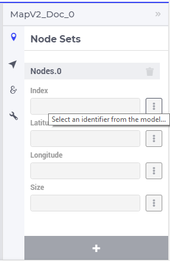
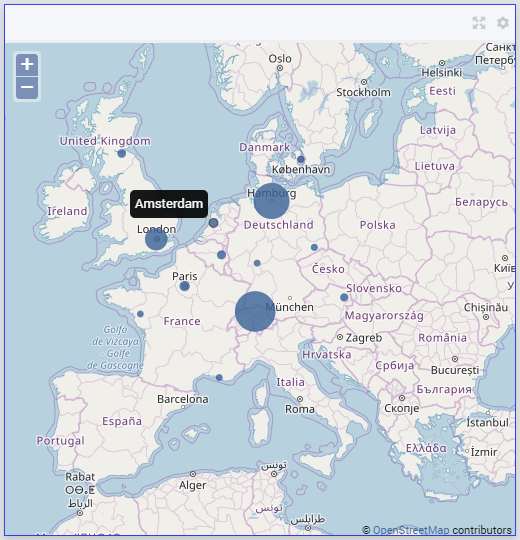

Map Widget
----------

The Map widget allows you to display a map in the background and show a network with nodes and arcs on top of the map.
A simple situation is for example when a transport identifier indexed over factories f and centers c in the TransNet application 
(see the "Quick Start: My First WebUI" section) is displayed like in the following picture:

The map displayed in the backgroud is provided by the OpenStreetMap organization, see the `openstreetmap.org web site <https://www.openstreetmap.org>`_. 
Since one must be able to reach OpenStreetMap online, an Internet connection is required for rendering the map. Assuming the connection is available, 
the map may be zoomed at various levels (see also the Zoom option mentioned further below):

.. image:: images/MapV2-ZoomLevels.png
    :align: center

The network with nodes and arcs on top of the map must be defined in terms of identifiers declared in the AIMMS model.

In this section we illustrate how to create, configure, and use such a map widget rendering a network in the AIMMS WebUI. 

.. important:: We also provide some guidelines and best practices for the map widget usage at the end of this section, please consider them before employing the map widget within your application.

Creating a map widget
+++++++++++++++++++++
	
A map widget can be added to a page using the same steps as for any other widget, see `adding a new widget <widget-manager.html>`_. 
After adding the map widget in the Widget Manager one can click on its Settings wheel in order to configure the widget.

In the settings options editor one can find the following sections:

*	Node Sets: Multiple node sets can be added here.
*	Arc Sets: Multiple arc sets can be added here.
*	Miscellaneous: Title, Zoom, Center Latitude, Center Longitude and Visibility can be controlled here.
*	Advanced: Advanced options for this widget are available here.

Adding node sets
++++++++++++++++

After selecting the "Node Sets" section and clicking on the "+" sign at the bottom, one can add options for the first node set:

The available options to be specified are the following:
	
*	Index: Select the index of the node set to be displayed
*	Latitude: A 1-dimensional parameter specifying the latitude coordinates for the nodes set with the selected index
*	Longitude: A 1-dimensional parameter specifying the longitude coordinates for the node set with the selected index
*	Size: A 1-dimensional parameter specifying the dynamic sizes for the node set with the selected index

.. note::
    The Latitude and Longitude must be specified by two separate identifiers declared in the model.
	
    The values of the Latitude and the Longitude parameters must be within the geographical bounds, i.e. between (-90,90) and (-180,180), respectively. Not keeping the Latitude and the Longitude within these bounds can lead to unexpected or irresponsive behavior of the Map widget. In order to avoid such undesirable behavior, one can specify the bounds intervals in the Range attributes of the corresponding identifiers in the model.	
	
    The default node size radius is 3 px. One can set a dynamic node size to each node set by selecting an appropriate identifier for the Size parameter in the desired node set (the index domain of such a parameter must be the same as the index of the node set).

Adding identifiers to node option fields
++++++++++++++++++++++++++++++++++++++++

When clicking on the identifier selector of the Index field (as shown above), a pop-up dialog is shown where the index of the node set may be selected:

.. image:: images/MapV2-Nodes0-Index.png
    :align: center

Next, when clicking on the identifier selector of the Latitude, a 1-dimensional parameter indexed over the selected index may be selected in the corresponding pop-up dialog:

.. image:: images/MapV2-Nodes0-Latitude.png
    :align: center

Similarly, one can follow the steps for the Longitude and the Size fields. Once all fields have been assigned, the nodes will be drawn on the map:

Maps with multiple node sets
++++++++++++++++++++++++++++

As mentioned above, multiple node sets may be added to the map widget. For instance, suppose that in the TransNet application we would like to add the factories f and the centers c
as separate node sets. After having added first the node set f, one can again select the Latitude parameter as discussed above, but in this case one may need to slice the parameter
to only the set f as a subset of the Locations set with index l. This can be achieved using the slicing options in the pop-up dialog as follows:

.. image:: images/MapV2-NodesF-Latitude.png
    :align: center

The same type of slicing can be applied to the Longitude and Size parameters. Moreover, one may repeat all these steps and add the centers c as a second node set with similar options.
These actions result in a map widget with 2 node sets:

.. image:: images/MapV2-NodesFC.png
    :align: center

Store Focus, Hover and Select for nodes
+++++++++++++++++++++++++++++++++++++++

Nodes on the map widget also have the functionality to store focus. This means that one can store the value of a selected node in the network in an element parameter declared in the model.
The store focus functionality opens up various interaction possibilities, because the value of the element parameter may be further used by other widgets or may impact
some parts of the model execution.

While adding the index for the node set, one will notice an option for “Store focus”. 
Here an element parameter may be specified which will store the value of the node selected upon clicking in the network.

.. image:: images/MapV2-StoreFocus-Select.png
    :align: center

Once the element parameter has been specified, one is able to see this reflected in the Index field of the correspoding node set in the options editor. 
For example, we can specify SelectedFactory for the index f and SelectedCenter for the index c, where SelectedFactory and SelectedCenter are element parameters 
in our application at hand with ranges Factories and Centers, respectively.
Furthermore, the values of these element parameters may also be displayed for inspection in other widgets outside the map.
When the user sets the focus on a specific node, the corresponding factory or center value is stored in SelectedFactory or SelectedCenter, respectively. 
In this case, the selection effect is that the selected node is highlighted on the map (i.e., it gets a thick outline), while the other nodes are faded away. 
The picture below depicts this situation:

.. image:: images/MapV2-StoreFocus-View.png
    :align: center

Note that, when a node has been selected, the user may still hover over another node and inspect the tooltip information, in the same way as the hovering works when no node has been selected 
(remark: a selected node may be unselected by clicking on it again). The hover effect is that the node which is hovered over has a thin outline.
	
Adding arc sets
+++++++++++++++
 
After selecting the "Arc Sets" section in the options editor and clicking on the "+" sign at the bottom, one can add options for an arc set:

.. image:: images/MapV2-Arcs0-Options.png
    :align: center

The available options to be specified are the following:

*	Value: Select the 2-dimensional identifier which defines the arc set. The arcs will be drawn and the labels with the values will be displayed for each arc.
*	Hide Labels: Switch this on in order to hide the arc labels.
*	Dynamic Arc Width: This option controls whether the arc width is fixed or dynamic. Dynamic arc width accounts for the values that are defined in the “Value” field of the current arc set.
*	Show Straight Lines: Switch this on in order to turn the curved arcs into straight lines.
*   Decimal Points: Specify the number of decimals to be shown for the values of the arc labels.

.. note::
    The arc identifier must be a 2-dimensional identifier like ArcFlow(i,j) where i and j are indexes of some node sets or subsets thereof.
	
    Note that, except for the “Value” field, all other options can be controlled either by constant values or by using scalar parameters declared in the model.

Adding identifiers to arc option fields
+++++++++++++++++++++++++++++++++++++++

We illustrate first the addition of an arc set for the example at hand where only the root set Locations with index l has been added as node set. 
In this example, let's assume that l_from and l_to are two alias indexes spanning the same Locations set as the index l.
When clicking on the identifier selector of the Value field (as shown above), a pop-up dialog is shown where the arc identifier may be selected:

.. image:: images/MapV2-Arcs0-ValuesId.png
    :align: center

Once the arc identifier has been properly specified, the arcs will be drawn on the map:	

.. image:: images/MapV2-Arc0-View1.png
    :align: center

When the "Hide Labels" option is turned on, the map is drawn as follows:

.. image:: images/MapV2-HideLabels-View.png
    :align: center

When the "Dynamic Arc Width" option is turned on, the values of the identifier specified in the "Values" field are accounted for in the width:

.. image:: images/MapV2-DynamicSize-View.png
    :align: center

When the "Show Straight Lines" option is turned on, the arcs are drawn like in the following picture:

.. image:: images/MapV2-StraightLine-View.png
    :align: center

Adding an arc set for map widgets with multiple node sets works in a similar way. For instance, in our example at hand, the situation with both 
the factories f and the centers c in the node sets and with the variable Transport(f,c) added as an arc set results in a map view as follows:

.. image:: images/MapV2-2Node1Arc-View.png
    :align: center

So, in this latter case the arcs are drawn between nodes belonging to two different node sets. 
	
Maps with multiple arc sets
+++++++++++++++++++++++++++

As mentioned in the beginning of this section, multiple arc sets may be added to the map. Suppose that in an example as ours we may distinguish several subsets of the
Locations set: a (sub)set of Plants with index p, a s(sub)set of DistributionCenters with index d, and a subset of CustomerRegions with index r. Moreover, suppose 
our model contains two identifiers: PlantToDC_Flow(p,d) with product flow values from plants to distribution centers and DCtoRegion_Flow(d,r) with product flows
from distribution centers to customer regions. In such a case, one could define a map widget with, for example, 3 sets of nodes and 2 sets of arcs as follows:

The sets of nodes:

.. image:: images/MapV2-3Nodes-Options.png
    :align: center

The sets of arcs:  

.. image:: images/MapV2-3Nodes2Arcs-Options.png
    :align: center

Such option specifications can result in a map view like in the following picture (where the arcs in first set are drawn as straight lines and the arcs in the second set
are drawn as curved lines):

.. image:: images/MapV2-3Nodes2Arcs-View.png
    :align: center

Ordering and deleting node/arc sets
+++++++++++++++++++++++++++++++++++

The ordering of the added node/arc sets may be changed by hovering over the title bar of the set and then clicking on the respective button, to move up or down.
An entire node/arc set may be deleted by clicking on the bin icon. These options are illustrated in the following picture:

.. image:: images/MapV2-Nodes-UpDownDelete.png
    :align: center

	
Miscellaneous options
+++++++++++++++++++++

In the Miscellaneous section of the options editor one can find several options:

.. image:: images/MapV2-Misc-Options.png
    :align: center

Here are more explanations about the meaning of these options:

*	Title: Specify a title to be shown at the top of the widget
*	Zoom:  One can set a zoom level to start with or control this via an identifier. When the map loads for the end user it starts off at the defined zoom level. The zoom level can be set between 2 (max zoom out) to 18 (max zoom in). One can also have max zoom out level as 0 or 1, but only when the size of the map is smaller than 5 columns in width.
*	Center: The “center” option is split into 2 options, “Center Latitude” and “Center Longitude”. Similarly to the zoom option, if one sets the Center Latitude and Center Longitude, then the initial load will start from that “center” point. One can also control this option via identifiers in the model.
*	Visible: Specify whether or not the widget is visible on the page. This option may also be controlled using a model identifier.

.. important:: If your widget has been created in the past by using an older type Map widget, you may continue to use this widget as is, but it is not possible to upgrade the widget from an older Map type to the current Map type by just changing the widget type in the Advanced options. In order to use the current Map type, the node and arc sets have to be added explicitly to the widget using the style described in this section.

Some guidelines and best practices
++++++++++++++++++++++++++++++++++

While using the map widget, there are some pointers on how to leverage the features in order to represent data efficiently.

With every widget there is always some limitation on how much data can be rendered at a time. As a general guideline, the map widget can handle networks with a total number of nodes and arcs up to (about) 4000. 
At the same time, please note the following:

.. note::
   The capacity and performance of the map widget is dependent on the specifications of your user’s machine, server and database speed, and the browser being used, among other factors.
  
A good practice is to show (only) slices of the data which may be visualized comfortably by the end-user, who should be able to grasp the meaning of data and derive information from it.
 
Some ways to achieve that are: 

*	Use selections/filters to control the (sub)sets for the shown data
*	Use domain identifiers to display data which is relevant
