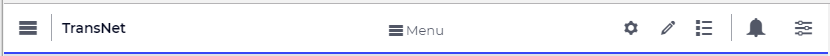

WebUI Menu Bar
**************

All pages in your WebUI (except for Wizards) have a *Menu Bar*, consisting of several buttons and text:

|webui-menu-bar|

On the left:
 
* |page-manager| `Page Manager <page-manager.html>`_ (available in AIMMS developer mode, not in PRO)
* The name of your project, followed by the current page path.
* |page-settings| `Page Options <page-options.html>`_ 
* |pencil-blue| `Widget Manager <widget-manager.html>`_
* |data-manager| `Data Manager <data-manager.html>`_ 

Second line:

* The `Page Menu <page-menu.html>`_

On the right:

* Messages 
* Help 
* About AIMMS
* `Application Settings <application-settings.html>`_

.. |page-settings| image:: images/page-settings_v1.png

.. |pencil-blue| image:: images/pencil-blue_v1.png

.. |data-manager| image:: images/data-manager_v1.png

.. |page-manager| image:: images/pagemanager-button.png

All pages in your WebUI (except for Wizards) have a *Menu Bar*, consisting of several buttons and text:

|webui-menu-bar|

On the left:
 
* |page-manager| `Page Manager <page-manager.html>`_ (available in AIMMS developer mode, not in PRO)
* The name of your project, followed by the current page path.
* |page-settings| `Page Options <page-options.html>`_ 
* |pencil-blue| `Widget Manager <widget-manager.html>`_
* |data-manager| `Data Manager <data-manager.html>`_ 

Second line:

* The `Page Menu <page-menu.html>`_

On the right:

* Messages 
* Help 
* About AIMMS
* `Application Settings <application-settings.html>`_

Detailed description of all menu bar related topics:

.. toctree::

   page-menu
   page-manager
   page-options
   widget-manager
   widget-types
   widget-options
   data-manager
   application-settings
