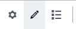
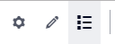
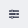
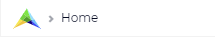
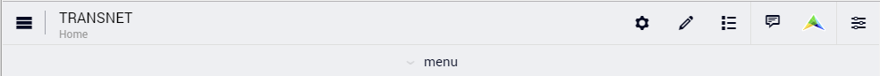

WebUI Menu Bar
**************

.. |menu-bar-new| image:: images/page_menu_new.png

.. |page-manager-new| image:: images/page_manager_new.png

.. |page-settings-new| image:: images/page_options_new.png

All pages in your WebUI (except for Wizards) have a *Menu Bar*, consisting of several buttons and text:

|menu-bar-new|

On the left:
 
* |page-manager-new| `Page Manager <page-manager.html>`_ (available in AIMMS developer mode, not in PRO)
* The name of the application

In the middle:

* |menu-button-new| `Page Menu <page-menu.html>`_

On the right:

* |page-settings-new| `Page Settings <page-settings.html>`_ 
* |pencil-blue-new| `Widget Manager <widget-manager.html>`_
* |data-manager-new| `Data Manager <data-manager.html>`_ 
* |menu-messages-new| Messages 
* |application-settings-new| `Application Settings <application-settings.html>`_

.. |webui-menu-bar| image:: images/menubar.png

.. |page-settings| image:: images/page-settings_v1.png

.. |pencil-blue| image:: images/pencil-blue_v1.png

.. |data-manager| image:: images/data-manager_v1.png

.. |page-manager| image:: images/pagemanager-button.png

The page breadcrumb at the bottom of the page shows the "About AIMMS" icon followed by the current page path:

|page-breadcrumb-new|

Please note that for AIMMS versions between 4.53 and 4.58 the information above has been rendered differently in the page menu as illustrated here:

|menu-bar-453| 

Furthermore, for AIMMS versions older than 4.53 the old *Menu Bar* (corresponding to the old default theme) had a similar representation, but a different look-and-feel as illustrated below:

|webui-menu-bar|

On the left:
 
* |page-manager| `Page Manager <page-manager.html>`_ (available in AIMMS developer mode, not in PRO)
* The name of your project, followed by the current page path.
* |page-settings| `Page Settings <page-settings.html>`_ 
* |pencil-blue| `Widget Manager <widget-manager.html>`_
* |data-manager| `Data Manager <data-manager.html>`_ 

Second line:

* The `Page Menu <page-menu.html>`_

On the right:

* Messages 
* Help 
* About AIMMS
* `Application Settings <application-settings.html>`_

The detailed description of all menu bar related topics can be accessed using the following navigation scheme:

.. toctree::

   page-menu
   page-manager
   page-settings
   widget-manager
   widget-types
   widget-options
   data-manager
   application-settings

