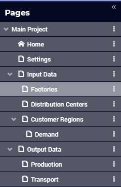

Page Manager 
============

.. |bin| image:: images/PageManager_snap3_4.png

.. |plus| image:: images/plus.png

A WebUI app can consist of multiple pages. In order to see the list of available pages, the WebUI developer  can press the ‘hamburger’ icon |page-manager| on the top left position of the browser window. Then the Page Manager will open on the left rendering the page tree structure: 

You can add your pages here and structure them in a tree. You can access your pages by clicking on their name 

* in the Page Manager, or 
* in the `Page Menu <page-menu.html>`_

.. note:: In AIMMS versions up to 4.77, besides the developer mode, the Page Manager could also be used when running an WebUI app on AIMMS PRO. Starting from AIMMS 4.78 onwards, the Page Manager is no longer available in PRO (end-user) mode.

You can expand a subtree by clicking on the 'arrow' ">" in front of a parent page. You can collapse it by clicking on the "v" in front of the parent page. The pages in the Page Manager will always be visible in the `Page Menu <page-menu.html>`_, unless the `visibility of a page <#change-the-visibility-of-a-page>`_ is set to either 'false' or 0. 

The Page Manager can be used in combination with the Page Menu, but there are a number of settings in the Application Options editor with which you can define how you want this to work:

* *Sidebar Open By Default* Use this option to specify whether the Page Manager sidebar should be visible upon opening the WebUI app.
* *Page Manager Hidden* Use this option to specify whether you want to offer the Page Manager to your end users or not.
* *Page Menu Hidden* Use this option to specify whether you want to offer the (horizontal) Page Menu to your end users or not.

.. note:: When running an app on PRO using an AIMMS version up to 4.77, only the add/rename/delete options were offered to the end-user (i.e. the visibility-toggling and the wizard-creation options were left out). Starting from AIMMS 4.78 onwards, the entire Page Manager is disabled in PRO (end-user) mode.

Details on creating and managing various pages can be accessed using the following scheme: 

.. toctree::

   webui-classic-pages
   webui-grid-pages
   side-panels
   dialog-pages
   dialog-grid-pages