Page Manager
============

.. |page-manager| image:: images/pagemanager-button.png

.. |plus| image:: images/plus.png

.. |pencil| image:: images/pencil.png

.. |eye| image:: images/eye.png

.. |hidden| image:: images/hidden.png

.. |bin| image:: images/bin.png

.. |home| image:: images/home.png

.. |wizard| image:: images/wizard.png

.. |kebab|  image:: images/kebab.png

.. |addpage|  image:: images/addpage.png

.. |sidepanel|  image:: images/sidepanel.png

Just like in WinUI, you can add multiple pages to your WebUI. To see the list of available pages in your WebUI, press the ‘hamburger’ icon |page-manager| on the top left position of your browser window. The Page Manager (a page tree) will open. 

.. image:: images/pagemanager-tree.png
    :align: center

You can add your pages here and structure them in a tree. You can access your pages by clicking on their name 

* in the Page Manager, or 
* in the `Page Menu <page-menu.html>`_

Please note that the *new* Page Menu and Page Manager are available in AIMMS 4.40+. From AIMMS 4.45 onwards, the Page Manager can also be used when running your WebUI app on PRO.

You can expand a subtree by clicking on the 'arrow' ">" in front of a parent page. You can collapse it by clicking on the "v" in front of the parent page. The pages in the Page Manager will always be visible in the `Page Menu <page-menu.html>`_, unless the `visibility of a page <#change-the-visibility-of-a-page>`_ is set to either 'false' or 0. 

The Page Navigator can be used in combination with the Page Menu, but there are a number of settings in the Application Options editor with which you can define how you want this to work:

* *Sidebar Open By Default* Use this option to specify whether the Page Manager sidebar should be visible upon opening the WebUI app.
* *Page Manager Hidden* Use this option to specify whether you want to offer the Page Manager to your end users or not.
* *Page Menu Hidden* Use this option to specify whether you want to offer the (horizontal) Page Menu to your end users or not.

When running on PRO, only the add/rename/delete options are offered to the end-user (i.e. the visibility-toggling and the wizard-creation options are left out).

Adding a Page
-------------

To add a new root page to your AIMMS WebUI:  

* Press the ‘hamburger’ icon |page-manager| on the top left position of your browser window. A page tree sidebar will open.

  .. image:: images/pagemanager-onlyhome.png
    :align: center

  By default, one page is available, called 'home', located in the 'Main Project'. 
* Press the plus button behind 'Main Project'.  
* Specify a name for your new page and press the Enter key to add the new page to the list of available pages. Press the Escape key if you want to cancel the creation of the new page. 

To add a new subpage to your AIMMS WebUI:

* Press the ‘hamburger’ icon |page-manager| on the top left position of your browser window. 
* Press the dots button behind the parent page of your new subpage. 
* A list of page control buttons appears. Press the plus button |plus|  to add the subpage. 
* Specify a name for your new subpage and press the Enter key to add the new subpage to the list of available pages. Press Escape if you want to cancel the creation of the new subpage.

.. tip:: 
    
    When entering the new name, a red line around the name input field can appear, meaning that the current name will not be accepted. E.g. when a page name already exists at this level in the page tree.

To navigate to the newly created page, press the page in the list of available pages in the Page Manager or in the `Page Menu <page-menu.html>`_.

After adding a page, you can `add widgets <widget-manager.html#adding-a-widget>`_ to it.

.. important::

	There are some changes made to the page manager with the introduction of `Sidepanels <page-manager.html#id6>`_ from software version 4.64. The changes are explained in :ref:`adding a sidepanel page`.

Renaming a Page
---------------

To rename a page in your AIMMS WebUI:  

* Press the ‘hamburger’ icon |page-manager| on the top left position of your browser window.    A page tree sidebar will open. 

    
  .. image:: images/pagemanager-treeandcontrols.png
    :align: center
  
* Press the dots button behind the page that you want to rename. 
* A list of page control buttons appears. Press the pencil button |pencil|  to rename the page. 
* Specify a name for your new page and press the Enter key to commit the new page name. Press the Escape key if you want to cancel renaming the page.

.. tip::

    When entering the new name, a red line around the name input field can appear, meaning that the current name will not be accepted. E.g. when a page name already exists at this level in the page tree.

Moving a Page
-------------

To move a page to a new position in your page tree in the AIMMS WebUI:  

* Press the ‘hamburger’ icon |page-manager| on the top left position of your browser window. A page tree sidebar will open. 

  .. image:: images/pagemanager-tree.png
    :align: center
    
* Click on the page that you want to move and hold your mouse button down. 
* Move your mouse to the new position in the tree. Subtrees will automatically expand when hovering over them. A little triangle will indicate the new position of your page. If the triangle is on top of another page name, your page will end up just above this page. If it is at the bottom of another page name, your page will end up just below this page. If it is in the middle, your page will become a subpage of the other page.
* Release your mouse button to perform the move to the new position.

Changing the Visibility of a Page
---------------------------------

By default, all pages in your page tree are visible for all users of your WebUI app. However, sometimes you may want to hide certain pages. E.g. when they should only be visible for certain users of your WebUI app, or only after certain actions are performed. In such cases, you can change the visibility of a page in the following way:  

* Press the ‘hamburger’ icon |page-manager| on the top left position of your browser window. A page tree sidebar will open. 

  .. image:: images/pagemanager-treeandcontrols.png
    :align: center
    
* Press the dots button behind the page for which you want to change the visibility. 
* A list of page control buttons appears. Press the eye button |eye|  to open the visibility option for the page. 
* Specify a value for the visibility option and press the Enter key to commit it. 

Possible values are 'true' or 1 (visible), 'false' or 0 (hidden), or an AIMMS identifier that contains one of these values.

By specifying an AIMMS identifier for the visibility option of a page, you can dynamically control from within the AIMMS model, which pages should be visible on a certain moment. 

When a page is hidden, it will not show up in the `Page Menu <page-menu.html>`_. In the `Page Manager <page-manager.html>`_, hidden pages are 'greyed out' and they have a 'hidden' icon |hidden| behind their name.

Deleting a Page
---------------

To delete a page:  

* Press the ‘hamburger’ icon |page-manager| on the top left position of your browser window. A page tree sidebar will open.   

  .. image:: images/pagemanager-treeandcontrols.png
    :align: center
    
* Press the dots button behind the page that you wish to delete.
* A list of page control buttons appears. Press the bin button |bin| to delete the page.

Setting the Home Page
---------------------

In the `Page Manager <page-manager.html>`_, the first page in the *Main Project* has a home icon |home|. This means that when opening your WebUI app (in develop mode or in PRO) you are automatically being navigated to this first page.

.. image:: images/pagemanager-tree.png
    :align: center
    
By default, there is one page in your WebUI app called *home*. This is the first page and thus the 'startup' page. However, as an app developer you can make another page the startup page if you want, by `moving another page to the first position <#move-a-page>`_. This automatically makes this page the new startup page. Of course, if you just want to give the default home page another name, you can do so by `renaming the page <#rename-a-page>`_.

Wizards
-------

In AIMMS WebUI it is possible to create so-called *Wizards*. A *Wizard* is a set of pages that an app user should follow in a certain order. On every page in a wizard, the user can click on Next or Previous,

.. image:: images/wizard-step2.png
    :align: center

or Start wizard/Finish wizard in case of the first/last page.
 
.. image:: images/wizard-step1.png
    :align: center
    
Example
+++++++

To illustrate what a *wizard* could look like, let's look at this example: Processing your shopping cart in a webshop. After having added some items to your shopping cart, you can access your Shopping Cart wizard. By clicking on it, you'll get:

* an overview of the items in your shopping cart that you can still change (start page), click 'start wizard',
* an option to login or register as new user and provide the necessary information (page 2), click 'next',
* fields to enter your contact information and delivery address (page 3), click 'next',
* fields to specify how you want to pay (last page), click 'finish',
* a confirmation page that provides some information about what will happen next (result page).

During this process, the user can cancel the process.

Such a shopping cart wizard will guide the user through a set of pages and it will make sure that all the necessary data is provided and handled in the way it should. E.g. no order is placed when the user is still unknown. 

Create, Update or Delete a Wizard
++++++++++++++++++++++++++++++++++

To create, update or delete a wizard:

* Press the ‘hamburger’ icon |page-manager| on the top left position of your browser window. 
* Press the dots button behind the page that should be the start page of your wizard. 
* A list of page control buttons appears. Press the wizard button !{IMAGE-LINK+wizard}! to create or update the wizard. 
* The Wizard editor will pop up. 

  .. image:: images/wizard-example.png
    :align: center

After having made your changes, you can press the Create wizard/Update wizard button at the bottom of the Wizard editor. To delete a wizard, use the Delete wizard button at the top of the Wizard editor.

The Wizard editor allows you to select the pages that should be part of this wizard. If you want to select more than three pages, you can use the *Add page to wizard* button. For every page, you can specify a `start and end procedure <#procedures-in-a-wizard>`_. You can move the pages up or down to change their order in the wizard. You can delete them from the wizard by using the little bin icon behind the page row in the Wizard editor. 

Update list from page tree
^^^^^^^^^^^^^^^^^^^^^^^^^^

In case all the pages for a certain wizard are subpages of the first wizard page, you can also change the order of the pages by using the *Update list from page tree* button. When you change the order of the pages in the page tree, this button allows you to easily apply these changes to the wizard page order as well.

Cancel procedure
^^^^^^^^^^^^^^^^

In the Wizard editor, you can also specify a cancel procedure that will be run when the user presses the Cancel button when going through a wizard. 

Result page
^^^^^^^^^^^

When the user presses the Finish wizard button on the last page of the wizard, the user will be directed to the Result page specified in the Wizard editor.

Procedures in a Wizard
++++++++++++++++++++++

A wizard contains a set of pages that the user should follow in a certain order. Each of these pages can have its own `page procedure <page-options.html>`_, which will always be run when the page is opened, also when the page is opened without using a wizard. Furthermore, when creating a wizard, the app developer can specify a start and end procedure for every page that is part of the wizard. These procedures are automatically run, *only when the user is following the wizard* (i.e.: when opening the same page(s) outside of the wizard, they will not be run). The exact order of execution of procedures for a wizard page is: 

#. Start procedure 
#. Page procedure
#. All the interactivity that the user can do on the wizard page followed by clicking 'Start wizard', 'Next', or 'Finish wizard'
#. End procedure
#. Repeat step 1 for the next page in the wizard (or the 'Result page' in case of 'Finish wizard', see below)

When the user cancels the wizard, a Cancel procedure is called that can also be specified in the Wizard dialog. When the user finishes the wizard by pressing 'Finish wizard' on the last page, the user is directed to the 'Result page', which can also be specified in the Wizard dialog.

Arguments
^^^^^^^^^

The start/end/cancel procedures for pages in a wizard can have 2 arguments (this is optional): 

.. code::

    Parameter statusCode {
        Property: Output;
    }

    StringParameter statusDescription {
        Property: Output;
    }

Inside the procedures, the app developer can assign values to these arguments. E.g.

.. code:: 

    statusDescription := "You need to make a selection first.";
    statusCode := webui::ReturnStatusCode('ERROR');

or

.. code:: 

    statusDescription := "OK.";
    statusCode := webui::ReturnStatusCode('OK');

The statusCode value at the end of the end/cancel procedure will decide whether or not to continue. This means that in case the statusCode is *not* 200 ('OK'), the user will remain on the current page. The WebUI will display the statusDescription string to provide the user with extra information. In case the statusCode *is* 200 ('OK'), the user will continue to either the next page (in case of an end procedure) or the wizard will be canceled (in case of the cancel procedure). The statusDescription in such a case will only be displayed when it is not equal to "OK" or "". 

Sidepanels
-----------

.. important:: Sidepanels are available in software versions from AIMMS 4.64 onwards.

Sidepanels are 2 column width pages that can be configured with different widgets and accessed on different/all pages in an application via tabs on the right-hand side of the page.  
Sidepanels help build model interactions. These help to free up real estate on pages, or also duplicate widgets that are required on different pages, such as filters.

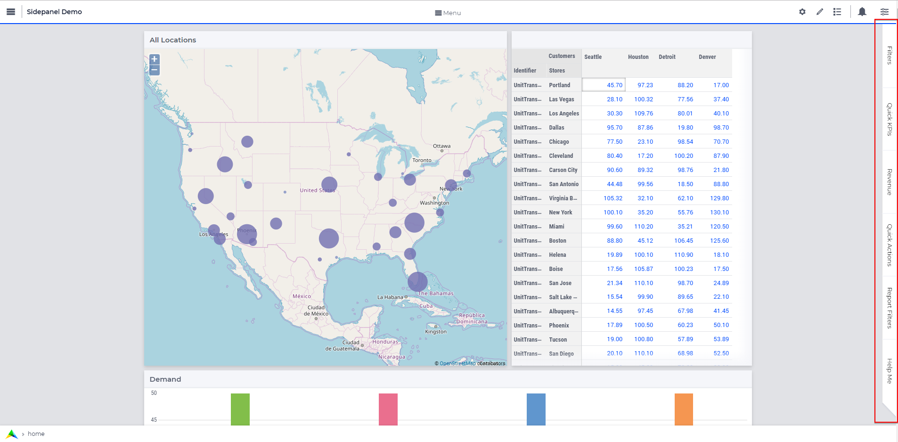
			
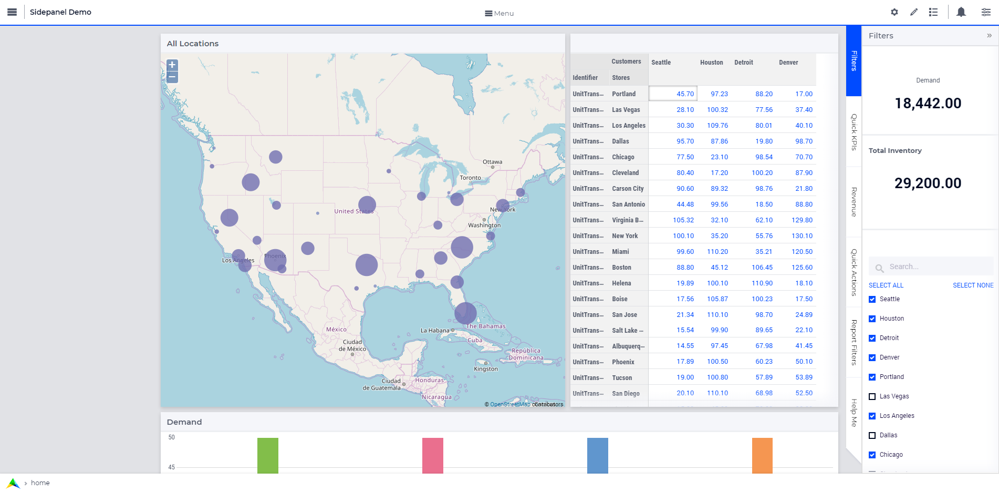
		
What can sidepanels be used for?
+++++++++++++++++++++++++++++++++

Sidepanels can be used for various purposes, such as filters, displaying KPIs, making quick notes, showing help text.

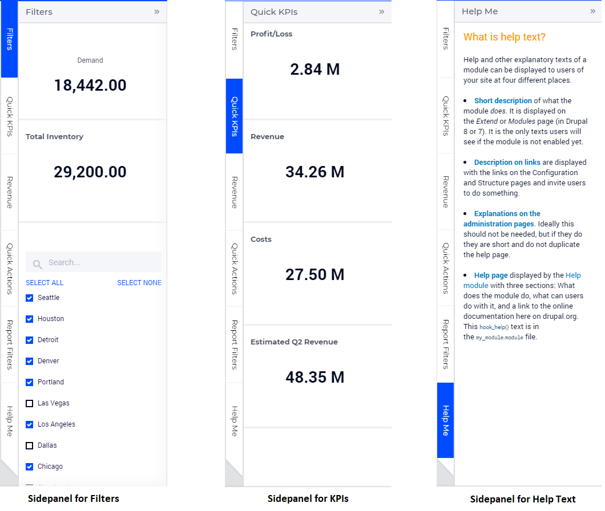

.. _adding a sidepanel page:

Adding a Sidepanel Page
++++++++++++++++++++++++

Adding a sidepanel page is similar to adding a page.

In the page manager you will notice a few changes. The |plus| icon for the Main project and in the |kebab| menu for other pages has been replaced. The main project now has a |kebab| menu, which when clicked, shows 2 options, i.e. Add New Page |addpage| and Add Sidepanel |sidepanel|.

The |plus| icon for pages has been removed and 2 new 
icons have been introduced |addpage| and |sidepanel|, as in the 
main project add options.

Click on the Insert sidepanel page icon and give it any name you desire. You cannot give a name that you have already used for other pages or sidepanels. 

.. image:: images/SP_addandname.png
			:align: center

You can differentiate between pages and sidepanels by the icons that represent each type.

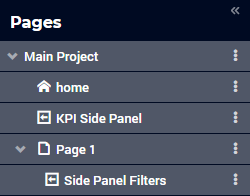
			
Sidepanels can be added to any level in the page tree, just like any normal page. Unlike Pages, Sidepanels do not appear in the Menu (navigation) and can only be accessed via the page manager. Sidepanels has the same options of a page i.e Rename, Delete, etc. You can also move the sidepanel the same way pages can be moved.

.. note:: 
	
	Avoid adding pages under sidepanel pages. These pages will not be shown in the navigation menu.

Adding widgets to a sidepanel page
+++++++++++++++++++++++++++++++++++

Adding widgets to a sidepanel page is the same as adding widgets to any other page. 

Step 1: Click the sidepanel page you want to add widgets to in the page manager

.. image:: images/SP_Addwidget1toSP1.png
			:align: center
			:scale: 50
			
Step 2: You will see a 2-column width page. Open the Widget Manager.

.. image:: images/SP_Addwidget1toSP2.png
			:align: center
			:scale: 50

Step 3: Add desired widgets to the page.

.. image:: images/SP_Addwidget1toSP3.png
			:align: center
			:scale: 50

.. image:: images/SP_Addwidget1toSP4.png
			:align: center
			:scale: 50

.. note:: 
	
	* Changing the width of a widget will not have any effect as the page is restricted to only 2 columns. You can change the height of the widget as required.
	* If the widgets added exceed the page height a scroll will appear in the sidepanel. 

.. _Configuring Sidepanels:

Configuring Sidepanels
+++++++++++++++++++++++

Sidepanels can be configured via the model. 
First create 1 set for the order of sidepanels to be displayed on the page.
Let’s call the set “SidePanelOrder”, index SP_order. 

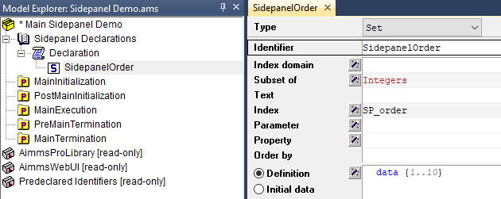

You can give the name and index of your choice. 
This set determines the order in which the sidepanels tabs will appear from top to bottom. This is an integer set. 
A new section has been added to the AimmsWebUI library called `Pages Support <library.html#pages-support-section>`_, used to configuring sidepanels.

SidePanelSpecification is what will be used to in the coming steps to configure the sidepanels. 

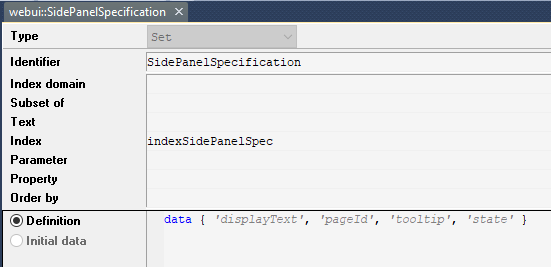

This set has 4 properties: 

#.  *displayText*: Is the text/label you would like the sidepanel tab and header to have. 
#.  *pageId*: When a page or sidepanel is created it is has a unique pageId.  You can find all the sidepanel pageIds in the set AllSidePanelPages. 

	.. image:: images/Allsidepanelpagesdata.png
			:align: center
			:scale: 75
						
	.. image:: images/SP_AllsidePanelPages_data.png
			:align: center
			:scale: 75
			
#. *tooltip*: The text here would be displayed when the user hovers over that respective sidepanel tab.
#. *state*: This is the state for the sidepanel, i.e Active and Hidden.

.. note:: 
	
	* If you don't see all the sidepanel pages run the procedure GetAllPages. You can find this procedure in Page Support under Public Pages Support Procedures. 
	* The "state" property is not yet in use, but will be applicable in future releases. In sidepanels it is considered as Active by default. You can use domain conditions to show or hide sidepanels on a page.
	
To configure sidepanels on a page, create a string parameter indexed on the SidePanelOrder and SidePanelSpecification. Eg: homepageSP(SP_order,webui::indexSidePanelSpec).

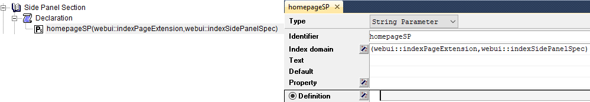

Right click the string paramter and click on data, you will see:

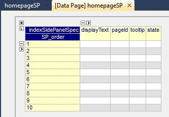

Add the details for the sidepanels you wish to show on this page. For example if your page tree has 5 pages and 7 sidepanels

.. image:: images/SP_pagetree.png
			:align: center
			:scale: 75

And you want 3 sidepanels on the "home" page: 

#. Filters
#. Quick Notes
#. Help

Data in the string parameter would have.

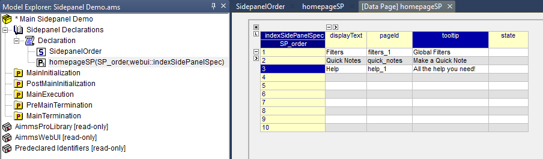

.. note:: 

	* Sidepanels appear in the same order from top to bottom as they appear in the data of the string parameter.
	* If you enter the wrong pageId, then the sidepanel tab will not be shown.
	
Configuring the string parameter on respective pages
++++++++++++++++++++++++++++++++++++++++++++++++++++

In the WebUI, navigate to the respective page. In the page settings you will see Sidepanel Settings.

.. image:: images/SP_configuresidepanel.png
			:align: center
			:scale: 75
			
Add the string parameter created for that respective page in the sidepanels field. 

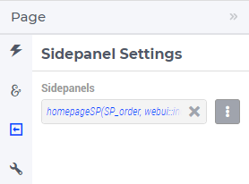

Once you have added the string parameter, the respective sidepanel tabs will appear on that page.

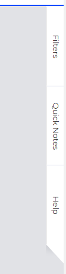

			
Create other string parameters similarly for other pages and configure them respectively.

You can configure as many sidepanels that you require. Since there is limited screen space, **we display only the top 6 sidepanels.**

Interacting with Sidepanels
++++++++++++++++++++++++++++

A sidepanel can be opened and closed by clicking on the respective tab. 
Hovering over a sidepanel will show you the tooltip that was configured in the model. 

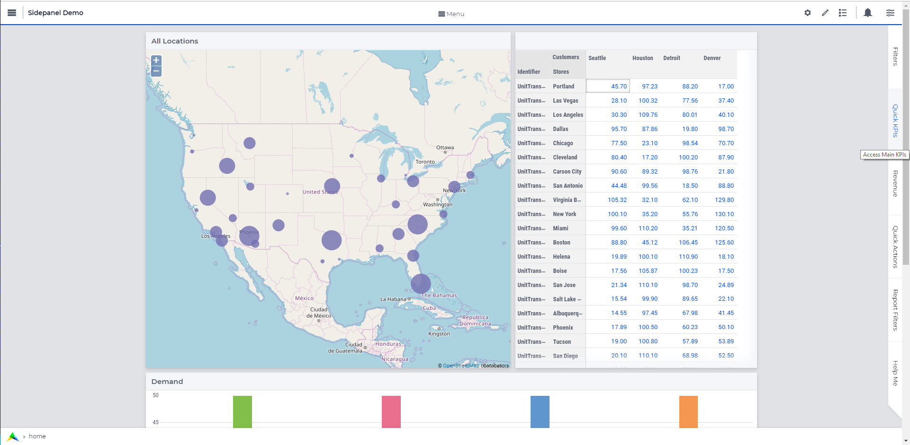

Clicking on the tab, highlights that tab and slides opens with the widgets that were added to that respective sidepanel page.

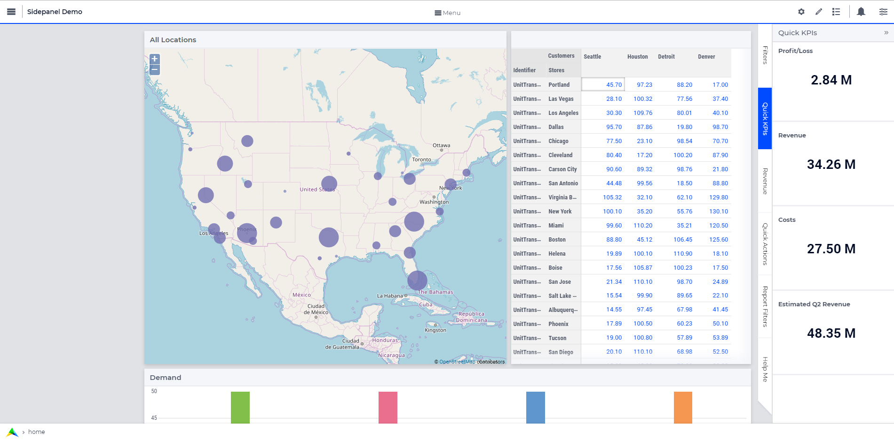