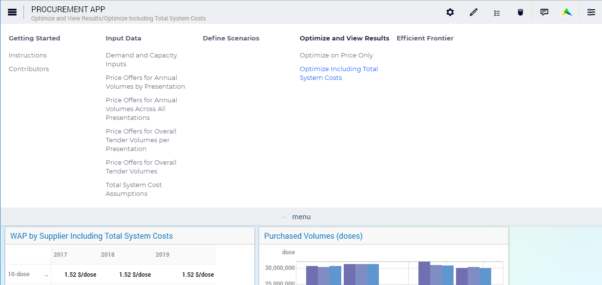

Page Menu
*********

From AIMMS 4.53.1 onwards, we offer a newly designed Page Navigation Menu. This menu helps you find your way around AIMMS Apps and get a general overview much more easily. As this new menu will become the new default, your existing Apps will change automatically. The menu looks like this:

The menu supports up to a maximum of six columns on one row (width 1024 pixels). AIMMS recommends using no more than that, but the menu does support it if needed by introducing a second row; even adding a 7th column if possible due to wider screen usage. The menu supports up to 10 menu items and five levels of hierarchy. However, AIMMS recommends using no more than three giving you a theoretical 600 pages (6x10x10). If more are needed it could be wise to reconsider the app architecture. We also provide a short `demonstration video <https://gitlab.aimms.com/public-repos/disable-ux-2.0-menu/blob/master/UX2.0-%20New%20MenuBar%20Demo.mp4>`_ of the new menu.

Specifying the Content
======================

The developer of a WebUI app can create a page tree by using the `Page Manager <page-manager.html>`_, which determines the content of the Page Menu.

Custom Positions for Widgets
============================

If you have defined custom position for widgets, that you had placed right at the top with the old menu style, those widgets might be partially overlapped with the new menu bar. To fix this, just move these widgets slightly, so they don’t overlap anymore. This change is a one time change.

Adapting Your Custom CSS
========================

If you already use custom CSS code to style your app, you might find out that things do not look as expected with the new menu. In order to fix that, we lay out the steps for that in `this document <https://gitlab.aimms.com/public-repos/disable-ux-2.0-menu/blob/master/AIMMS.NewMenu.Support.pdf>`_.

The Old Style Menu
==================

The old Page Menu (available from AIMMS 4.40 to 4.52) that is visible in the `Menu Bar <menu-bar.html>`_ also contained all the pages that a user currently has access to, but was more restricted:

.. image:: images/pagemanager-menu.png
    :align: center

* By clicking on the page names, you can visit the pages. 
* Little triangles indicate that there were subpages available. By hovering over the parent page name, the subtree will appear.

Reverting to the Old Style Menu
--------------------------------

Realizing not everybody is immediately ready for this change, or possibly has custom CSS that needs changing, we provide a way of going back to the old menu style in AIMMS 4.53+. In `this repository <https://gitlab.aimms.com/public-repos/disable-ux-2.0-menu/tree/master/disable-ux-2.0-menu-asr>`_, you can find 2 .css files and 1 .js file, which you need to download and copy into your :token:`MainProject\\WebUI\\resources\\css` folder. After restarting your WebUI, you will have the old style menu back.
