Page Menu 
**********

From AIMMS 4.53.1 onwards, we offer a newly designed Page Navigation Menu. This menu helps you find your way around AIMMS Apps and get a general overview much more easily. As this new menu will become the new default, your existing Apps will change automatically. The menu looks like this:

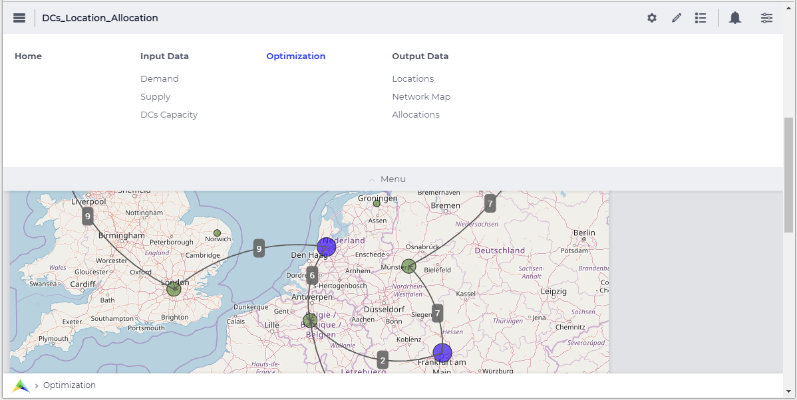

The Menu Bar is the primary tool for navigation through AIMMS applications. It consists of two parts: the Top Menu bar and the Bottom Menu Bar.

The menu supports up to a maximum of six columns on one row (width 1024 pixels). AIMMS recommends using no more than that, but the menu does support it if needed by introducing a second row; even adding a 7th column if possible due to wider screen usage. The menu supports up to 10 menu items and five levels of hierarchy. However, AIMMS recommends using no more than three giving you a theoretical 600 pages (6x10x10). If more are needed it could be wise to reconsider the app architecture. We also provide a short `demonstration video <https://gitlab.aimms.com/public-repos/disable-ux-2.0-menu/blob/master/UX2.0-%20New%20MenuBar%20Demo.mp4>`_ of the new menu.

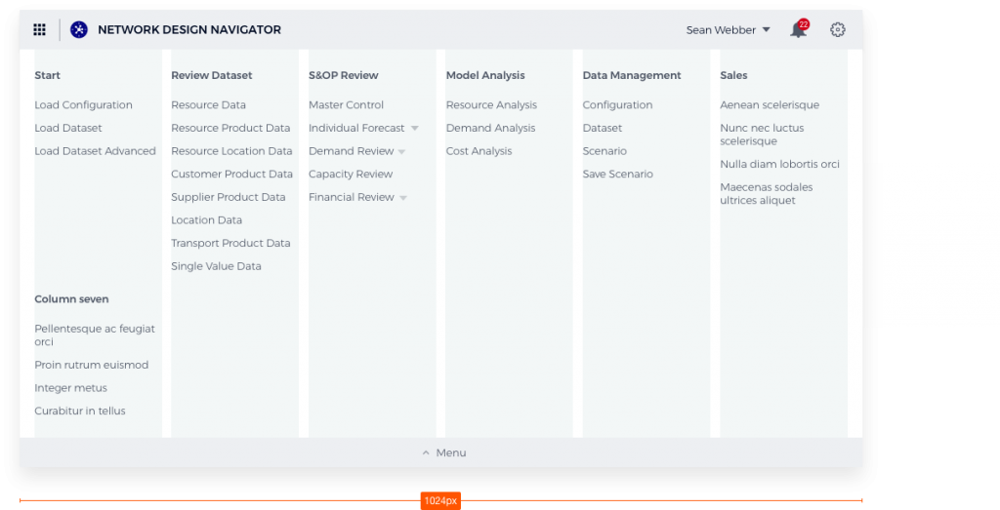

Top Menu Bar
=============

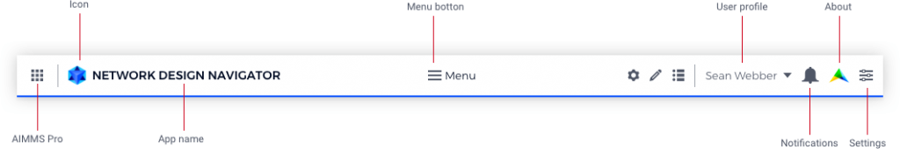

The Top Menu Bar gives users app-level information. From left to right:

* Button to AIMMS PRO. In the future, this will be the button for the Launchpad and AIMMS Store.
* Icon for the app.
* Name of the app.
* Menu button
* Name of the user with a drop-down. Content of the drop-down is to be determined.
* Notifications with the number of unread items and a drop-down.
* Settings icon with a drop-down

States of the Menu Bar
----------------------

Menu items that fold open are one shade darker and have a blue icon.

The current page is colored blue.

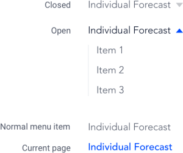

Menu Grid
---------

The menu has a maximum of 7 columns, with gutters of 12 pixels. Margins on either side are 2%, with a total max-width of the menu of 1200px (minus margins).

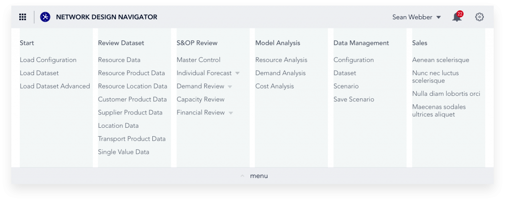

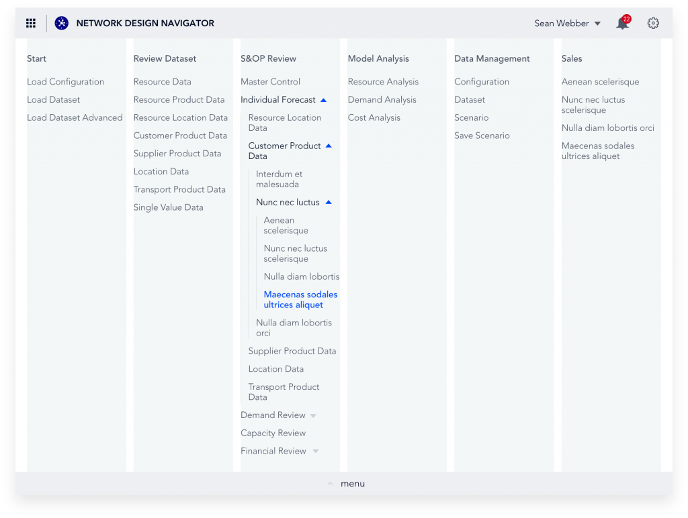

Narrow viewport
---------------

The menu is designed to fit well on a viewport of a minimum of 1024px. When the viewport is smaller than that, the columns that do not fit move to the next row.

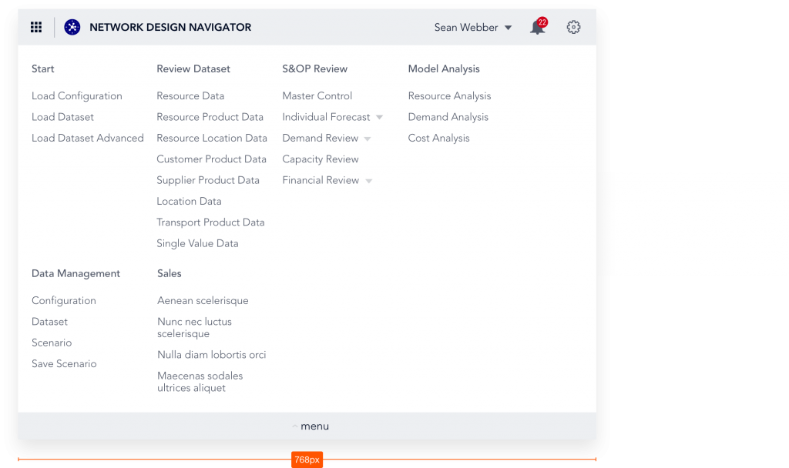

Wide viewport
-------------

The menu is designed with max 6 columns in mind, however it supports up to 7 columns next to each other on viewports wider than 1024px.

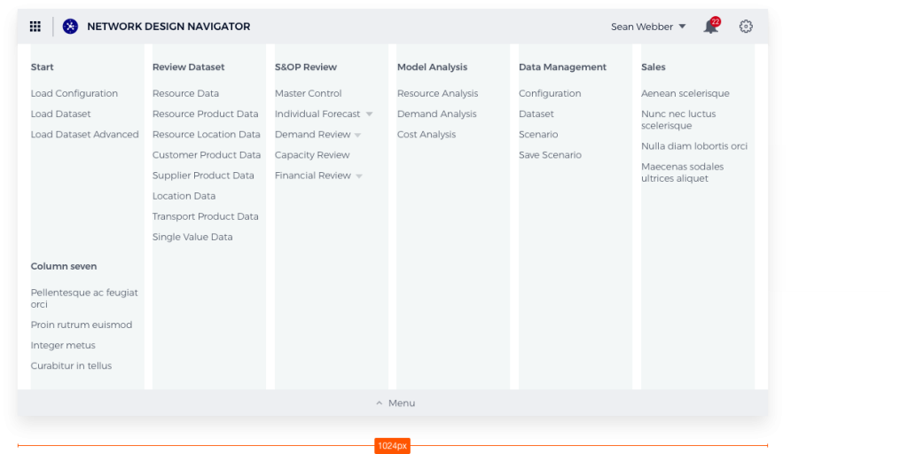

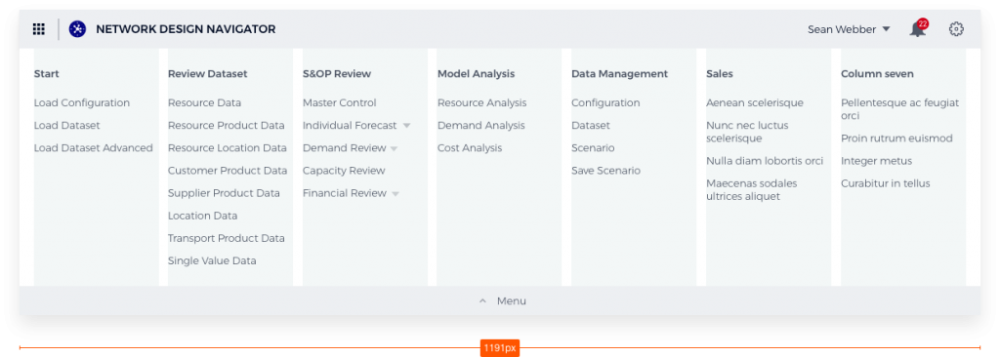

Vertical overflow
-----------------

When the height of the menu is higher than the viewport, the Close button becomes sticky at the bottom of the page, and the content becomes scrollable. (The scroll bar does not cause the menu elements to shift horizontally.)

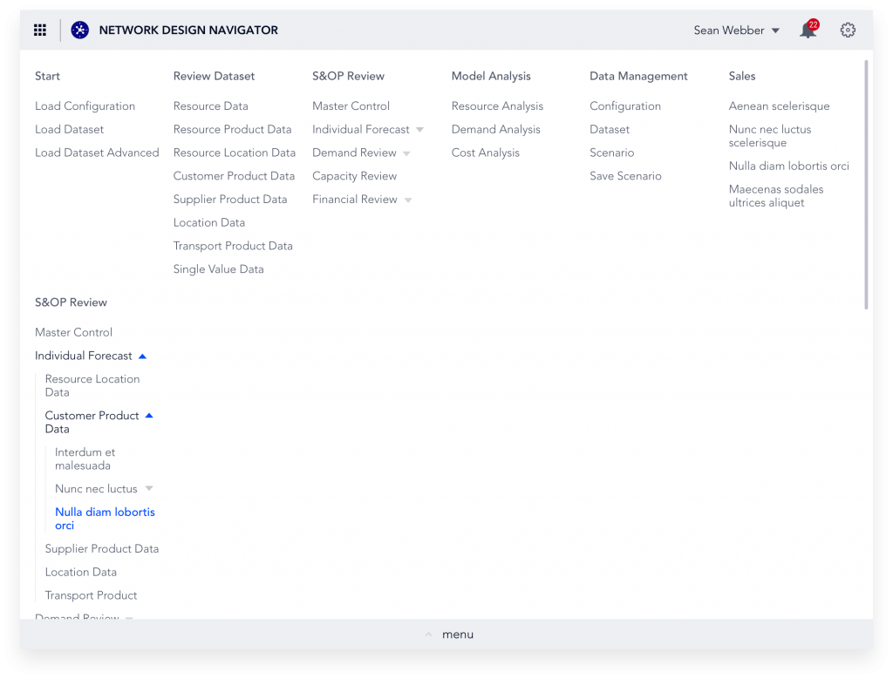

Bottom Menu Bar
===============

The Bottom Menu Bar show the AIMMS logo with a link to the AIMMS homepage and a breadcrumb to the current page. It is “sticky” (remains in view at the bottom of the viewport)

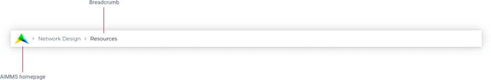

The bottom menu bar also includes the `Status Bar <status-bar.html>`_ and the `Time Zone Settings <time-zone-setting.html>`_ when these components are configured.

Specifying the Content
======================

The developer of a WebUI app can create a page tree by using the `Page Manager <page-manager.html>`_, which determines the content of the Page Menu.

Custom Positions for Widgets
============================

If you have defined custom position for widgets, that you had placed right at the top with the old menu style, those widgets might be partially overlapped with the new menu bar. To fix this, just move these widgets slightly, so they don’t overlap anymore. This change is a one time change.

Adapting Your Custom CSS
========================

If you already use custom CSS code to style your app, you might find out that things do not look as expected with the new menu. In order to fix that, we lay out the steps for that in `this document <https://gitlab.aimms.com/public-repos/disable-ux-2.0-menu/blob/master/AIMMS.NewMenu.Support.pdf>`_.

The Old Style Menu
==================

The old Page Menu (available from AIMMS 4.40 to 4.52) that is visible in the `Menu Bar <menu-bar.html>`_ also contained all the pages that a user currently has access to, but was more restricted:

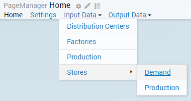

* By clicking on the page names, you can visit the pages. 
* Little triangles indicate that there were subpages available. By hovering over the parent page name, the subtree will appear.

Reverting to the Old Style Menu
--------------------------------

Realizing not everybody is immediately ready for this change, or possibly has custom CSS that needs changing, we provide a way of going back to the old menu style in AIMMS 4.53+. In `this repository <https://gitlab.aimms.com/public-repos/disable-ux-2.0-menu/tree/master/disable-ux-2.0-menu-asr>`_, you can find 2 .css files and 1 .js file, which you need to download and copy into your :token:`MainProject\\WebUI\\resources\\css` folder. After restarting your WebUI, you will have the old style menu back.

Hiding Sidepanels in the Old Style Menu
---------------------------------------

With the introduction of `Sidepanels <page-manager.html#sidepanels>`_ from AIMMS version 4.64, any sidepanels added to the page manager will also show in the old style menu.

To hide the sidepanel pages in the menu, please add the below HTML code to the “header-override.css“ file that you had copied into your CSS folder, as mentioned above.

.. code::

    .menu .sidepanel, header .menu .sidepanel li.hasChildren ul li{
	    display: none !important;
    }
