**************
Page Settings
**************

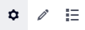

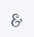

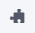

.. |workflow-items| image:: images/workflowitems-icon.png

You can access the Page Settings via the 'options wheel' |cog-grey| in the `WebUI Menu Bar <menu-bar.html>`_ :

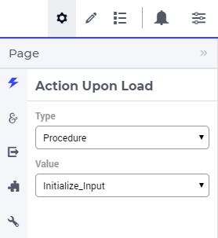

Currently, the following options for a page are available:

* Action Upon Load (for specifying a procedure that should be run upon opening the page)
* Action Upon Leave (for specifying a procedure that should be run before navigating to another page). The application developer can also run a `procedure that can restrict page navigation <#procedure-for-restricting-page-navigation>`_ based on certain conditions.
* `MaxColumns <#maximum-number-of-columns>`_
* Page Extensions for `Side Panel Settings <page-manager.html#configuring-the-string-parameter-on-respective-pages>`_ (configuring `Side Panels <page-manager.html#id6>`_ described in the Page Manager section) and for Page Action Settings (described further below)
* A number of advanced options (not documented here).

Procedure for Restricting Page Navigation
=========================================

A procedure that can be called when a page change is requested. It should determine whether or not a user can navigate to another page. 

The  procedure should have three arguments, in the exact order below:

* An Output string parameter called :token:`requestId` that should contain the return value of the parameter RequestCounter.
* An Output parameter called :token:`statusCode` representing the return value of the procedure.
* An Output string parameter called :token:`statusDescription` that should contain a return message for the end-user.

Please note that the arguments should have the exact names as stated, as they are treated in a special way in the underlying procedure call mechanism.

The requestId and statusCode arguments should be filled as follows:

:token:`requestId := webui::OpenDialogPage or webui::RequestPerformWebUIDialog`

:token:`statusCode := webui::ReturnStatusCode('OK');`  

The requestId helps in identifying if a Dialog page or Message Dialog is open. This allows interaction when the user is not allowed to leave that page. 

The pre-defined function :token:`webui::ReturnStatusCode` has a number of possible arguments (OK, CREATED, BAD_REQUEST, UNAUTHORIZED, CONFLICT and ERROR). Because your procedure is expected to handle the navigation, the status OK is expected if the user is allowed to navigate to the next page successfully. You can use one of the other status codes to signal that the user still needs to stay on the same page. The preferred statuses are OK and ERROR.

The value given for the :token:`statusDescription` will be displayed in the webUI when the returned statusCode is any other than "OK".

Creating the procedure:
^^^^^^^^^^^^^^^^^^^^^^^

Create a procedure and add the 3 aforementioned arguments using the wizard.

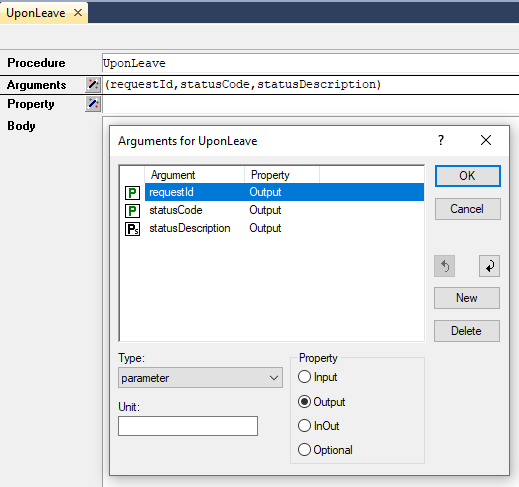

The text representation of the procedure would be the following.

.. code::

    Procedure UponLeave {
    Arguments: (requestId,statusCode,statusDescription);
        StringParameter requestId {
            Property: Output;
        }
        Parameter statusCode {
            Property: Output;
        }
        StringParameter statusDescription {
            Property: Output;
        }
    }

Example
+++++++

For illustration, we have a binary parameter PageChange_Flag which determines if the user is permitted to navigate to the next page or must stay on the same page. We set the value of this flag based on some validation or action performed on the page accordingly. The UponLeave procedure would then have the following condition.

.. code::

    If PageChange_Flag then
	    statusCode := webui::ReturnStatusCode('OK'); 
	    statusDescription := "Good to go";
    else
        statusCode := webui::ReturnStatusCode('ERROR');
        statusDescription := "Error on page please complete step";
        MyActions := data {'OK','Cancel'};
    	requestId := webui::RequestPerformWebUIDialog("Error on Page", "There is an error on page and you can't navigate to the next page.",MyActions,'Procedure_Actions');
    endif;

When the PageChange_Flag is 0, the statusCode returned is ERROR, which keeps the user on the same page. Then the message dialog opens to display the message. When the PageChange_Flag is 1, the user can navigate to the respective page.

Maximum Number of Columns
=========================

You may find that when you change your window size, the widgets re-arrange too often. A simple way to prevent this is to limit the maximum number of columns. You can do this via the 'page settings' icon |cog-grey| on the app menu bar. At the *miscellaneous* tab |page-misc| of the page settings you can edit the maxcolumns value (the maximum value that this setting may have is 14 columns):

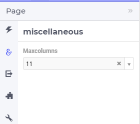

Page Actions
============

In the bottom right corner of the page you can find the “Page Actions” menu. It is used for the “Primary Action" and “Secondary Actions” and largely replaces buttons on the canvas. The position of the Page Actions is fixed in the bottom right and floats above all other elements of the page.

The reason behind the Page Actions is to have key actions easily available for the users and to reduce clutter on the pages.

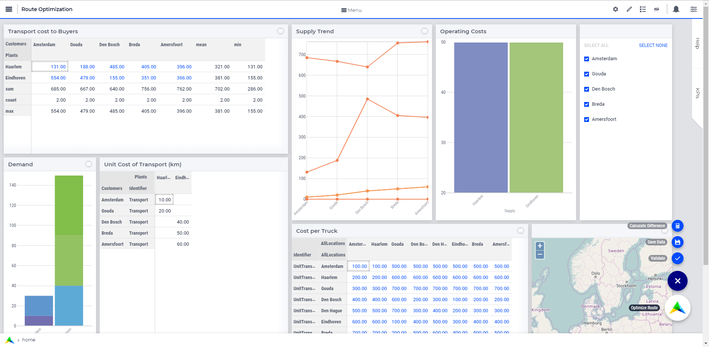

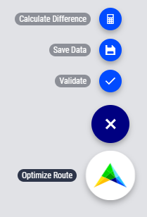

Primary Action
^^^^^^^^^^^^^^

The Primary Action is mainly used for actions that use the power of the AIMMS product.  These actions are often called Optimize, Calculate or Solve and do mathematical calculations in some form. It is what separates AIMMS from your standard Business Intelligence application, and therefore features the AIMMS logo by default.

Each page can have only one Primary Action. If there is a need for more than one Primary Action, developers should first consider if this is beneficial to the user: often it is wise to focus on one key task per page. If more than one Primary Action per page is absolutely needed, only one should be considered the most important. Other Primary actions can be placed in Secondary Actions. There is no maximum to the number of Primary Action you can add, but we display the first Active (clickable) action. In case there are no Active actions, we display the first Inactive (not clickable) action as the Primary Action, with the associated style.

Secondary Action
^^^^^^^^^^^^^^^^

Besides the Primary Action, the Page Actions consist of “Secondary Action” buttons. These are buttons that serve important functions on the page, for example, “Commit Changes” or “Calculate Difference”.

Secondary Action buttons consist of a label and an icon that can be configured in the model. When there are multiple Secondary Actions on a page, they are grouped together in a button with a hamburger icon. This expands to reveal all page actions. There is no maximum to the number of Secondary Actions you can add, but we display the top 10  Active and/or Inactive ordered action buttons on a page. AIMMS advises using ideally no more than five.

Configuring Page Actions
^^^^^^^^^^^^^^^^^^^^^^^^

The Page Actions can be configured by the application developer via the AIMMS model. In the `Pages and Dialog Support <library.html#pages-and-dialog-support-section>`_ section, the set PageActionSpecification is declared which is used for configuring Page Actions as illustrated in the next steps.

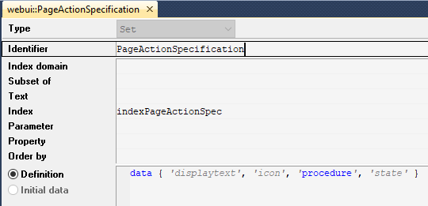

This set has 4 elements representing page action properties:

* :token:`displayText` : The Title/Label to be displayed for the action.
* :token:`icon` : The icon you want to associate with the respective action. You can select from a list of 1600+ icons, the reference can be found in the `icon list <../_static/aimms-icons/icons-reference.html>`_ . `Custom icons <folder.html#custom-icon-sets>`_ can also be used if required.
* :token:`procedure` : The procedure to be called when the action is clicked.
* :token:`state` : The display state for the action, i.e. Active (displayed and clickable), Inactive (displayed and not clickable) and Hidden. By default, the state is Hidden.

Configuring the Primary Action
++++++++++++++++++++++++++++++

Create a string parameter indexed by PageActionSpecification. Let's call this :token:`MyPrimaryActions(webui::indexPageActionSpec)`. Right click the string parameter and click on the Data option to open the data page. Add the details for the Primary Action you would like to show for the respective page(s). For example:

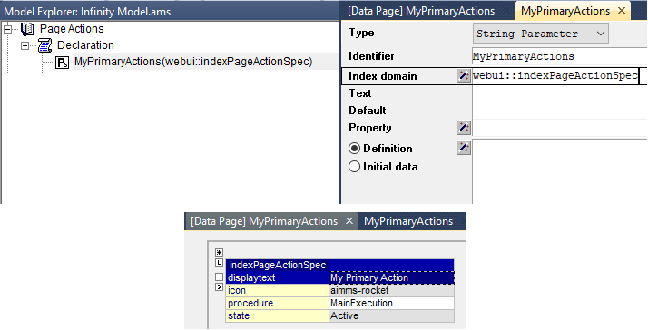

The result of the illustrated example will be

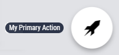

By default, when the :token:`displayText` is not defined the Primary Action label will be "OPTIMIZE". When the :token:`icon` is not defined the AIMMS logo will be displayed.

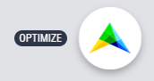

Configuring Actions on Pages
++++++++++++++++++++++++++++

In the WebUI, navigate to the respective page. In the Page Settings under the Page Extensions |page-extensions| you will find the Primary Action and Secondary Actions fields. Add the respective string parameters in the fields that were configured for that page.

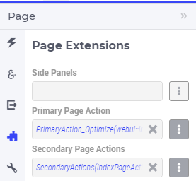

Once you have added the string parameter, the respective page actions buttons will appear on that page.

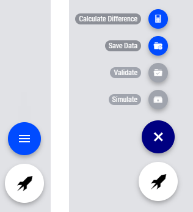

Similarly, you can create other string parameters for other pages and configure them using the same steps.
    
Configuring Secondary Actions
+++++++++++++++++++++++++++++

First, create a set for the order of actions to be displayed on the page. For illustration, let’s call this set “PageActionOrder” with index :token:`indexPageActionOrder` (as a developer, you can give this set a name and an index of your choice). This set determines the order in which the Secondary Actions will appear from top to bottom. This set must be a subset of the pre-declared set of Integers. 

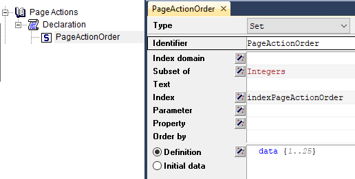

Create a string parameter indexed by PageActionOrder and PageActionSpecification. Let's call this :token:`MySecondaryActions(indexPageActionOrder,webui::indexPageActionSpec)`. Right click the string parameter and click on the Data option to open the data page. Add the details for the Secondary Actions you would like to show for the respective page(s). For example:

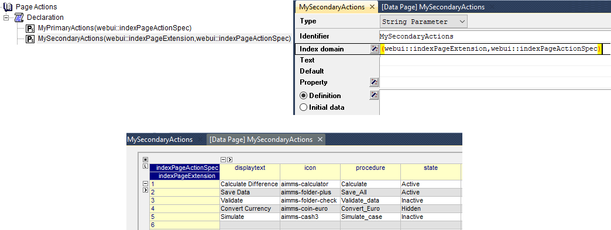

In the illustrated example, we have defined 5 Secondary Actions with different states. We display the Active and Inactive actions.  

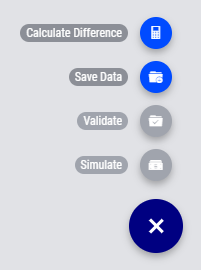

Possible combinations of action states
++++++++++++++++++++++++++++++++++++++++

The different combinations and possibilities with the states are illustrated below:

* Default Primary Action

    .. image:: images/PageActions_DefaultPrimary.png
        :align: center

* One Primary Action

    .. image:: images/PageActions_PrimaryActiveInactive.png
        :align: center

* One Secondary Action 

    .. image:: images/PageActions_SecondaryActiveInactive.png
        :align: center

* Multiple Secondary Actions

    .. image:: images/PageActions_MultipleSecondary.png
        :align: center

* Primary Action with one Secondary Action

    .. image:: images/PageActions_PrimaryAndSecondary.png
        :align: center

* Primary Action with multiple Secondary Actions

    .. image:: images/PageActions_PrimaryAndMultipleSecondary.png
        :align: center

The labels for the Primary Action and single Secondary Action are shown when the user hovers the respective buttons.