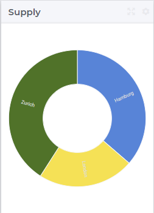
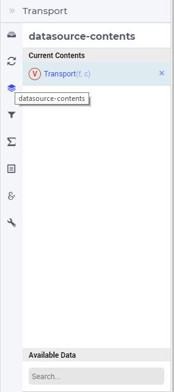
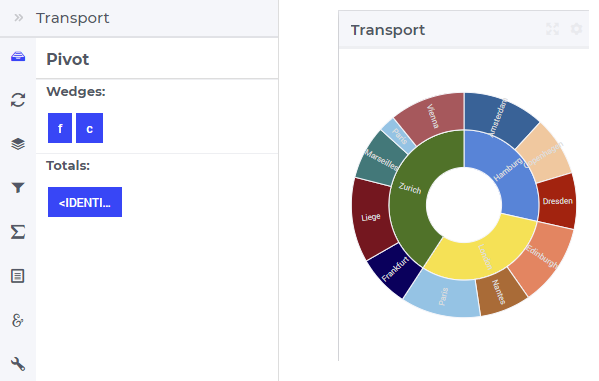
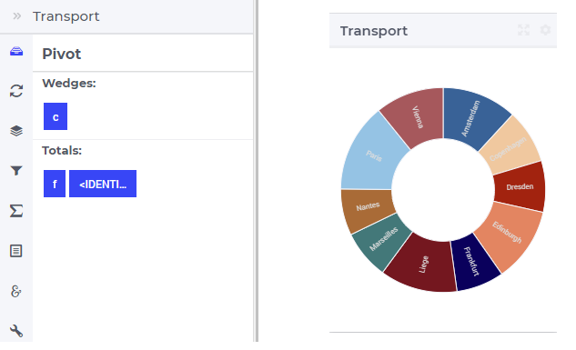
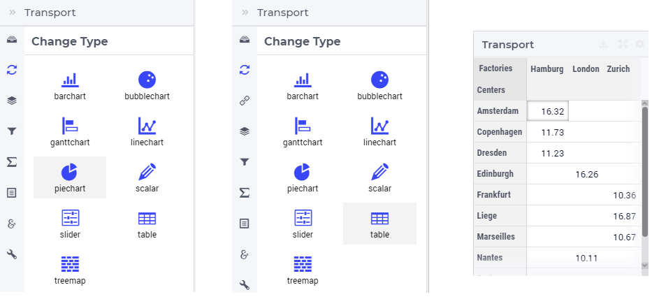
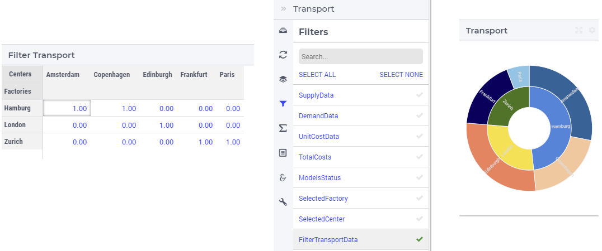
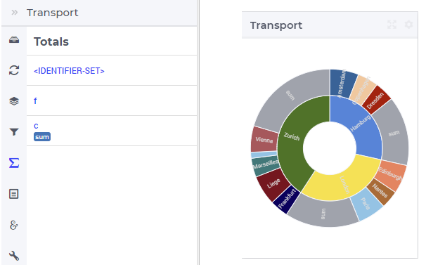
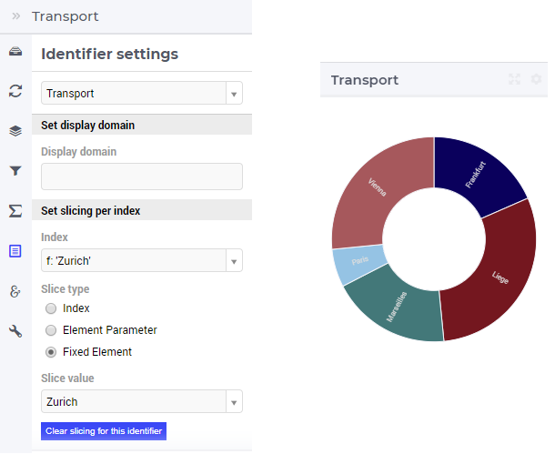
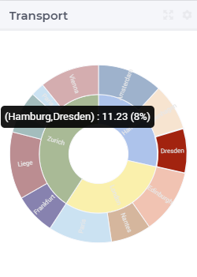
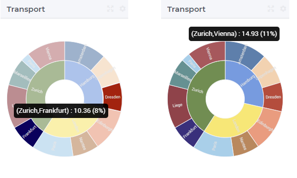

Pie Chart Widget
----------------

The Pie Chart widget is a graphical representation of data by means of pie wedges. A simple situation is when a 1-dimensional identifier such as the Supply(f) of a factory f in the TransNet application 
(see the "Quick Start: My First WebUI" section) is displayed like in the following picture:

More generally, a pie chart widget offers the possibility to display multi-dimensional data in your model by displaying a wedge for each data point. 
The surface of a wedge provides information about the value of the correspoding data point.  
For example, in the TransNet application, the transport amounts for every combination (factory, center) may be represented using a pie chart widget
like illustrated in more details in the sequel. More specifically, we discuss and illustrate below one-by-one the tabs in the pie chart's options editor.

Contents and Pivoting
+++++++++++++++++++++

In order to determine the information to be rendered by a pie chart, first one has to specify the data identifier(s) in the Contents tab of the widget's options editor, where one may search 
for the available model data using the correspoding functionality at the bottom:

	
Next, in the Pivot tab of the options editor, one can specify how the data dimensions are to be organized in the chart. 
For example, if both the factory index f and the center index c are specified in the Wedges section and the <IDENTIFIER-SET> in the Totals section then the resulting pie chart looks like 
in the picture below on the right:

One may move some data indexes in the Totals section of the Pivot tab. In our example, moving the center index f to the Totals section results in the following pie chart view:

So, now for every center c there is one wedge in the chart representing the total transport to this center from all factories.
		
Change Type
+++++++++++

In the Change Type tab of the widget's options editor, one can switch from the pie chart type to some other representation type. 
In the example at hand, one can switch eg. from the pie chart to the table, resulting in the tabular view of the same data values:

Filters
+++++++

In the Filters tab of the widget's options editor, some of the other widgets on the same page may be chosen for filtering the data points shown in the pie chart. 
In our example, suppose we change the pivoting back to the initial situation where both the factory index f and the center index c are in the Wedges section and 
the <IDENTIFIER-SET> in the Totals section. Also, suppose we declared in our model an additional parameter FilterTransport(f,c) with values as in the FilterTransportData
table widget as shown in the picture below. In this case, chosing FilterTransportData widget as a filter results in a confined pie chart view as only those data points 
are shown for which the FilterTransportData widget shows non-default values: 

Totals
++++++

In the Totals tab of the widget's options editor, aggregated values such as sum, mean, count, min, or max computed over one of the data indexes my be added to the chart. 
In our example, if we add the sum over the centers c to our example pie chart, three additional (gray) wedges representing the aggregated values become visible in the chart: 

Identifier Settings
+++++++++++++++++++

In the Identifier Settings tab of the widget's options editor, one can apply a display domain or some slicing to the data identifier(s).

The "Set display domain" section works in the same way as for eg. the bar chart.

In the "Set slicing per index" section it is possible to slice one index to another index of a subset, to an element parameter or to a fixed element in the corresponding set.
For instance, we can slice our factory index f to the fixed element 'Zurich' in the Factories set, resulting in the pie chart view as shown here: 

Similarly, one could slice the index f to an element parameter CurrentFactory having the declared range the set Factories (where the value of CurrentFactory may be determined from within the model
or by a choice made through another widget in the user interface). 

Hover and Select
++++++++++++++++

In the pie chart one may select one wedge by clicking on it. In this case, the selected wedge is highlighted, while the other wedges are faded away. The picture below depicts this situation:

When a wedge has been selected, the user may still hover over another wedge and inspect the tooltip information, in the same way as the hovering works when no wedge has been selected 
(remark: a selected wedge may be unselected by clicking again on it):

Miscellaneous
+++++++++++++

In the Miscellaneous tab of the pie chart's options editor, other options may be set such as the title of the widget, whether or not the widget is visible (this may be determined by a model parameter)
or the number of decimals for the values displayed in the chart.
