Quick Start: My First WebUI App
===============================

This section illustrates how to create quickly a first Web-based User Interface (WebUI) for a simple Transport Network (TransNet) application using a set of locations divided in two (disjoint) subsets of factories and distribution centers. Each factory has an amount of supply of a product and each distribution center has some demand for that product. Decisions have to be made on how much to transport from a factory to a distribution center in order to satisfy demand, while not exceeding the available supply. Unit transport costs are associated with any pair of factory and distribution center and the transport decisions aim to minimize the total transport cost for the entire network. 

A first WebUI for such an AIMMS optimization application may look like in the following picture:

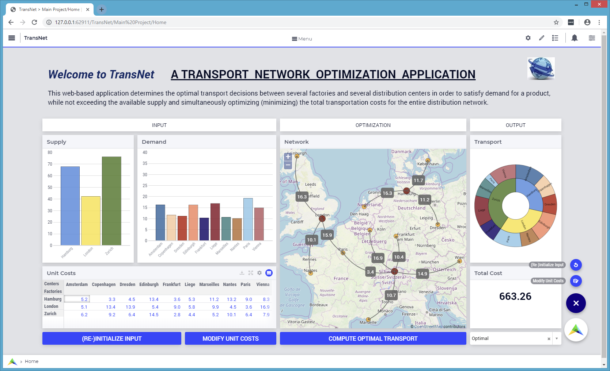

In order to build such a WebUI, one needs to add and configure step-by-step a number of widgets on the Home application page opened in a browser tab. Most widgets reference data of identifiers or run procedures present in the AIMMS model. The underlying mathematical optimization model used in this application is essentially the one described in the `AIMMS tutorial for beginners <https://download.aimms.com/aimms/download/references/AIMMS_tutorial_beginner.pdf>`_. 

Underlying model
----------------

In the sequel, some code snippets from the underlying AIMMS model show identifiers from the model declarations. The declarations for the network locations look as follows:

.. code::

    DeclarationSection Network_Locations {
        Set Locations {
            Index: l;
        }
        Parameter Latitude {
            IndexDomain: l;
        }
        Parameter Longitude {
            IndexDomain: l;
        }
        Parameter IsFactory {
            IndexDomain: l;
            Range: binary;
        }
        Parameter IsCenter {
            IndexDomain: l;
            Range: binary;
            Definition: 1 - IsFactory(l);
        }
    }

Subsequently, the following model declarations concern the input data for the model:

.. code::

    DeclarationSection Input_Data {
        Set Factories {
            SubsetOf: Locations;
            Index: f;
            Definition: {
                { l | IsFactory(l) }
            }
        }
        Set Centers {
            SubsetOf: Locations;
            Index: c;
            Definition: {
                { l | IsCenter(l) }
            }
        }
        Parameter Supply {
            IndexDomain: f;
        }
        Parameter Demand {
            IndexDomain: c;
        }
        Parameter UnitCost {
            IndexDomain: (f,c);
        }
    } 

In the use case at hand, there are 3 factories (Hamburg, London, and Zurich) and 10 distribution centers (Amsterdam, Copenhagen, Dresden, Edinburgh, Frankfurt, Liege, Marseille, Nantes, Paris, and Vienna). The input data may be initialized upon the application start-up by using some simple procedures. The *Latitude* and *Longitude* parameters, as well as the *IsFactory* binary indicator parameter may be initialized in a procedure by using e.g., a composite table (or, alternatively, by reading in their values from an external source):

.. code::

    Procedure Initialize_Network {
        Body: {
            COMPOSITE TABLE:
            l                Longitude      Latitude     IsFactory          
            !-----------------------------------------------------
            Amsterdam          4.88           52.38                               
            Copenhagen        12.54           55.66          
            Dresden           13.74           51.05   
            Edinburgh         -3.19           55.95          
            Frankfurt          8.71           50.17          
            Hamburg            9.98           53.54           1   
            Liege              5.58           50.63   
            London            -0.16           51.50           1         
            Marseille	       5.38           43.29        
            Nantes            -1.55           47.22                 
            Paris              2.34           48.86            
            Vienna            16.37           48.20                
            Zurich             8.54           47.37           1     ;
        }
    }

The *Supply* and *Demand* parameters may be initialized e.g., by using some random draws from uniform distributions, while the parameter *UnitCost* may be initialized e.g., based on the (straight line) distance between two locations (see further below).

Creating an empty WebUI
-----------------------

One may start by opening the Home page of the WebUI application in the browser (see `Create a WebUI <creating.html>`_ section for details):

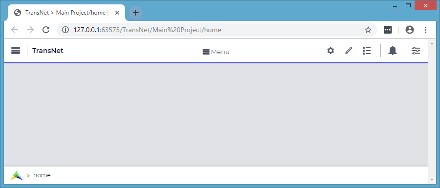

Adding the widgets for input data
---------------------------------

On this page one can `add widgets <widget-manager.html#add-a-widget>`_ for rendering the data of the input parameters *Supply* and *Demand*. For example, one can add a table widget named "SupplyData" with sizes of 2 columns and 2 rows, rendering the data of the parameter *Supply*. In the `Widget Manager <widget-manager.html>`_, pressing the "+" sign at the bottom opens the "Add widget" pop-up window, where the fields can be filled in as shown below, resulting in a widget like here on the right hand side:  

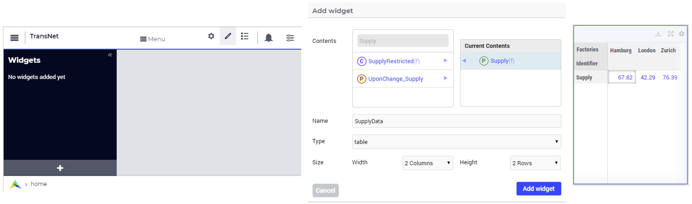

The SupplyData widget can be further configured in its Settings window, for example by swapping indexes in the Pivot section or by typing the title Supply in the Miscellaneous section, as illustrated below. After these steps, the SupplyData table should look like in the last picture on the right hand side below:

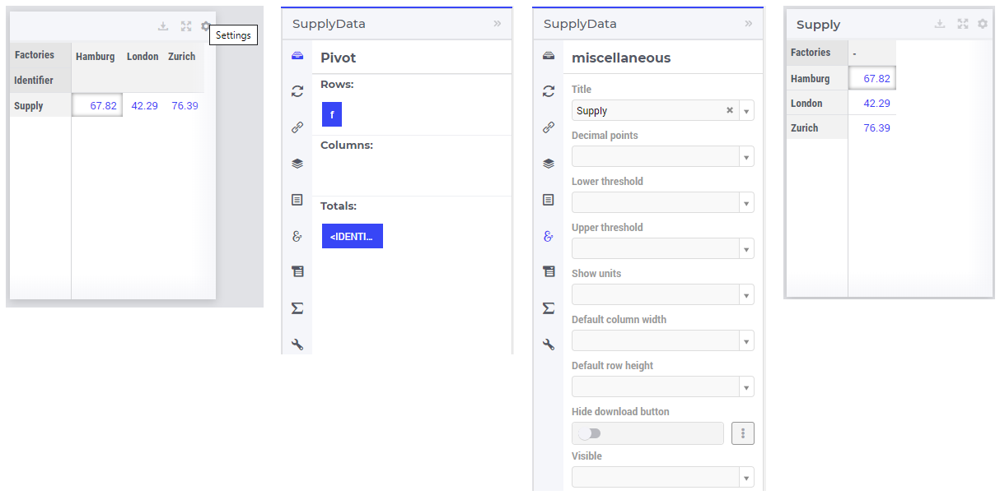
 
In a very similar manner, one can undertake steps as above for adding and configuring a second table widget named "DemandData" with sizes of 3 columns and 2 rows (title Demand), rendering the data of the parameter *Demand*. The two added table widgets should now look like in the following picture:

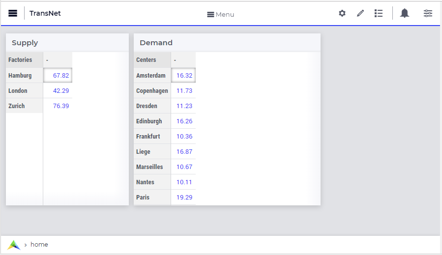

Next one can add a map widget with 4 columns and 3 rows (title Transport Network) in order to show the locations of the network. The map widget can be added by using the same "Add widget" window as discussed before. Then in the Settings window of the map widget the Node Sets and the Miscellaneous sections can be filled in as shown below, resulting in a map widget as here on the right:

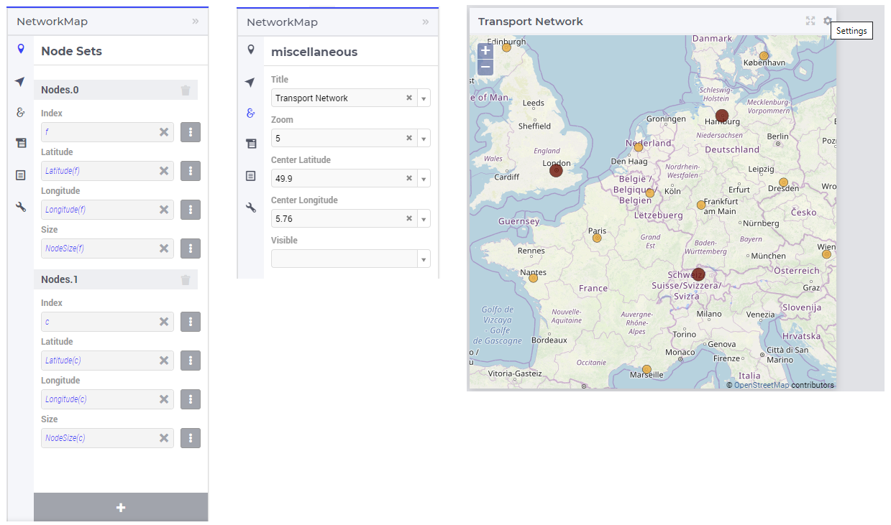

As shown in the snapshots above, two types of nodes have been added explicitly to the network in the map widget: one type for the factories f and one other type for the distribution centers c. Please note that for specifying the Latitude, the Longitude and the NodeSize correspoding to each of the indexes f and c, the slicing functionality (as described in the `Slicing section <widget-options.html#id8>`_) can be used. 
	
Another table widget with 5 columns and 1 row (title Unit Costs) may be added for showing the unit transport costs between a factory and a distribution center. The widget tile may be added in the same way as above, while the splitting of indexes of this parameter between the row area and the  column area may be configured in the Pivot section of the Settings window as illustrated below:

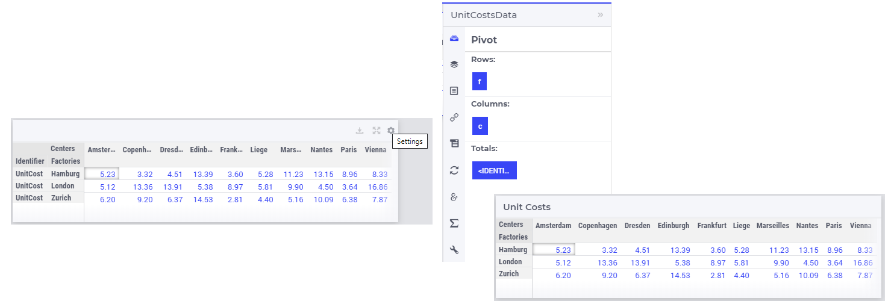

In the Miscellaneous section of Page Setting window, one can set a maximum number of 11 columns for the page as shown here:

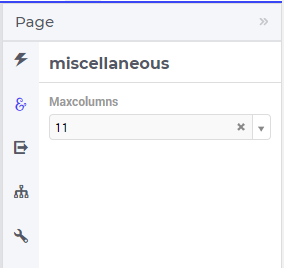

After performing all the steps so far, the WebUI should look like in the following picture:

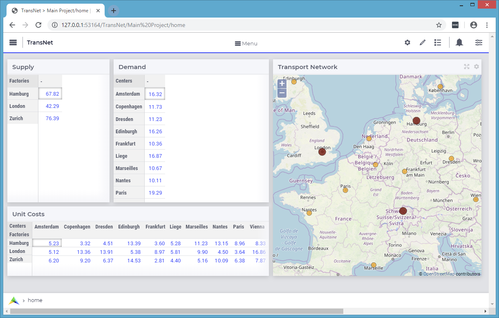

Including widgets for optimization and output data
--------------------------------------------------

The mathematical optimization declarations in the AIMMS model look as follows:

.. code::

    DeclarationSection Optimization_Model {
        Variable Transport {
            IndexDomain: (f,c);
            Range: nonnegative;
        }
        Variable TransportCost {
            Range: free;
            Definition: sum[ (f,c) , UnitCost(f,c) * Transport(f,c) ];
        }
        Constraint SupplyRestricted {
            IndexDomain: f;
            Definition: sum[ c, Transport(f,c) ] <= Supply(f);
        }
        Constraint DemandRequired {
            IndexDomain: c;
            Definition: sum[ f, Transport(f,c) ] >= Demand(c);
        }
        MathematicalProgram TransportModel {
            Objective: TransportCost;
            Direction: minimize;
            Constraints: AllConstraints;
            Variables: AllVariables;
            Type: Automatic;
        }
    }

Some additional declarations for the model output can be added as follows:

.. code::

    DeclarationSection Output_Data {
        Parameter IsTheModelSolved {
            Range: binary;
        }
        Set LP_ModelStatuses {
            SubsetOf: AllSolutionStates;
            Definition: data{ 'Optimal', 'Infeasible', 'Unbounded', 'SolverNotCalled' };
        }
        ElementParameter TransportModelStatus {
            Range: LP_ModelStatuses;
            Definition: {
                if IsTheModelSolved
                   then TransportModel.ProgramStatus
                   else 'SolverNotCalled'
                endif;
            }
        }
    }
 
For output data one may add to the Home page in the WebUI a table widget with 2 columns and 2 rows (title Transport) showing the data of the Transport variable and a scalar widget with 2 columns and 1 row  (tile Total Transport Cost) rendering the data of the variable TransportCost. The Settings of these two widgets may be configured as shown in the following two pictures, respectively:

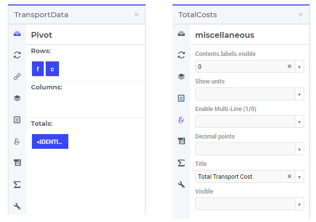

The last two widgets have no data to be shown before the model is solved, so, after performing also the last steps, the WebUI should look as follows:

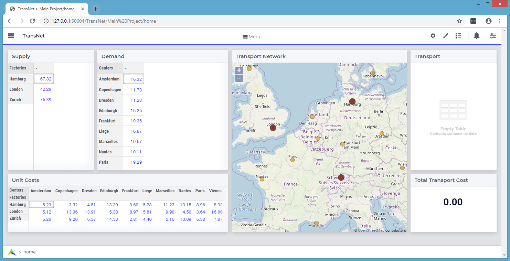

Adding buttons
--------------

The procedures which initializes the input state before solving the model may be declared for example like here:

.. code::

    Procedure Initialize_Input {
        Body: {        
            option seed = 1234;
            
            Supply(f) := Round( Uniform(40,80), 2 );
            Demand(c) := Round( Uniform(10,20), 2 );
            
            Initialize_UnitCosts;
            
            Empty_Variables;
        }
    }

    Procedure Initialize_UnitCosts {
        Body: {        
                    UnitCost(f,c) := Round( Sqrt(Sqr(Latitude(f)-Latitude(c)) + Sqr(Longitude(f)-Longitude(c))), 2 );
        }
    }

where the procedure Empty_Variables called above simply empties the output state:

.. code::

    Procedure Empty_Variables {
        Body: {
            
            empty Transport, TransportCost, IsTheModelSolved;
        }
    }

On the WebUI page one can now add a button widget with 3 columns and 1 row (tile (RE-)INITIALIZE INPUT) and configure it in the Action section of its Settings window in order to run upon click the procedure *Initialize_Input* as illustrated below:

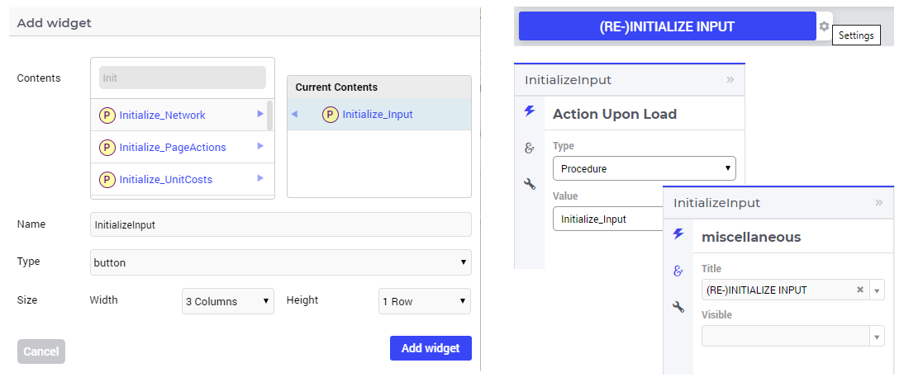

In order to experiment using other unit transport costs than the initial ones, a procedure as the following may be used:

.. code::

    Procedure Modify_UnitCosts {
        Body: {
            
            Initialize_UnitCosts;
            
            option seed = 5678;
            
            UnitCost(f,c) *= Uniform(0.3,2.5);
            
            Empty_Variables;
        }
    }

Similarly as before, one can add another button widget with 2 columns and 1 row (title MODIFY UNIT COSTS) running upon click the last procedure mentioned above. After performing all the steps so far, the WebUI page should look like shown below:

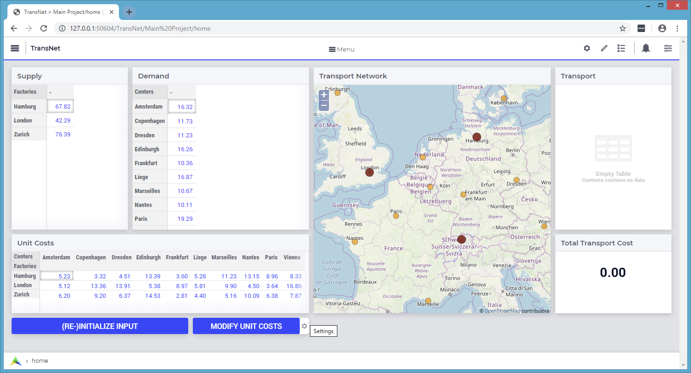

Solving the optimization model
------------------------------

Now it is time to actually solve the optimization model and show the resulting output data in the WebUI. In developer model, solving the model normally requires a simple procedure as the following:

.. code::

    Procedure Solve_Model {
        Body: {
            
            solve TransportModel;
            
            IsTheModelSolved := 1;
            
            !If the problem was not solved to optimality, make sure that the decision variables
            !are emptied, because they do not correspond to an actual solution.
            
            if ( TransportModelStatus <> 'Optimal' ) then
                empty Transport, TransportCost  ;
            endif ;
        }
    }

However, in case the application is run on AIMMS PRO, the WebUI client needs to delegate the optimization procedure to the solver session running on the PRO server using a procedure as the following:

.. code::

    Procedure Solve_Delegate {
        Body: {
            
            if pro::DelegateToServer( waitForCompletion : 1, completionCallback : 'pro::session::LoadResultsCallback' ) 
               then return 1;
            endif ;
            
            SolveModel;
        }
    } 

So, the overall solving procedure which addresses all situations (developer mode and deployment PRO mode) can be declared like shown below:

.. code::

    Procedure Solve_Procedure {
        Body: {
            
            if ProjectDeveloperMode then
            
                   Solve_Model;
            
            elseif pro::GetPROEndPoint() then
            
                    if pro::IsRunningAtServer then
            
                       Solve_Model;
					   
                    else
					
                       Solve_Delegate;
					   
                    endif;
            endif ;
        }
    }

After making sure that the above declarations are present in the AIMMS model, one can add to the WebUI a new button widget with 4 columns and 1 row (title COMPUTE OPTIMAL TRANSPORT) running upon click the last procedure mention above, which actually solves the transport optimization model. 

So, after pushing this button the output data is filled in for the Transport table and the Total Transport Costs scalar. However, the Transport amounts are not yet shown in the map widget. In order to achieve this, one needs to open the Settings window of the map widget and add the arcs in the Map Contents section of as follows:

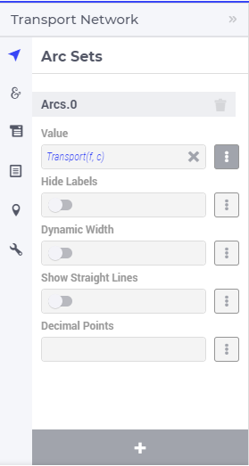

So, after performing all the steps so far the WebUI should look as shown here:

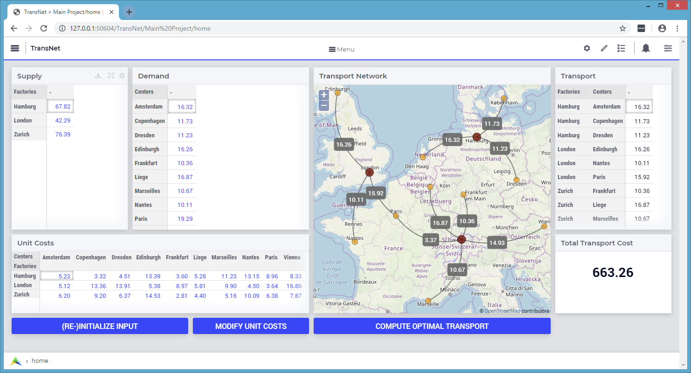

One may add to the WebUI a selectionbox widget with 2 columns and 1 row showing the value of the element parameter *TransportModelStatus*. After pushing the "MODIFY UNIT COSTS" button and then solving the model again by using the "COMPUTE OPTIMAL TRANSPORT" button, the WebUI overview should now show the new solution (with visible model status Optimal ) as in the following picture:

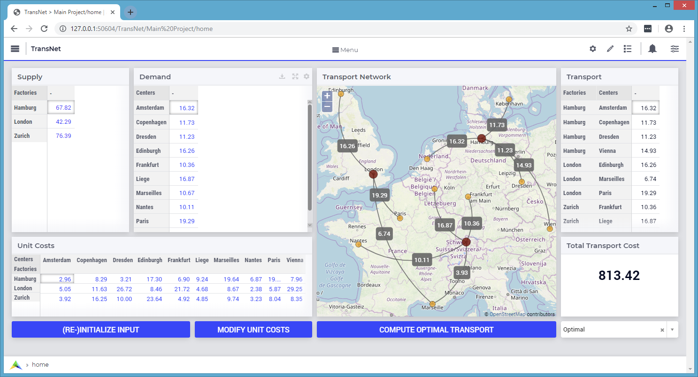

Providing more structure to the WebUI
-------------------------------------

In order to indicate more clearly the input, the optimization, and the output parts in the WebUI, one may add 3 label widgets called InputLabel (contents INPUT), OptimizationLabel (contents OPTIMIZATION), and OutputLabel (contents OUTPUT), in this order. All labels can have 1 row, while the columns sizes may be 5 columns, 4 columns, and 2 columns, respectively. The label widgets may be moved up (by drag-and-drop) as the first 3 widgets in the Widgets Manager, in the same order, while the rest of the widgets may follow up by keeping their relative order in which they have been added. Furthermore, a new text widget with 11 columns and 1 row may also be added as the very first widget in the Widget Manager in order to show a title / introduction section for the entire application (like the one shown in the first overview picture in the very beginning of this documentation section). Formatting the contents of such a text widget is self-explanatory in its Edit window by using the options on the top:

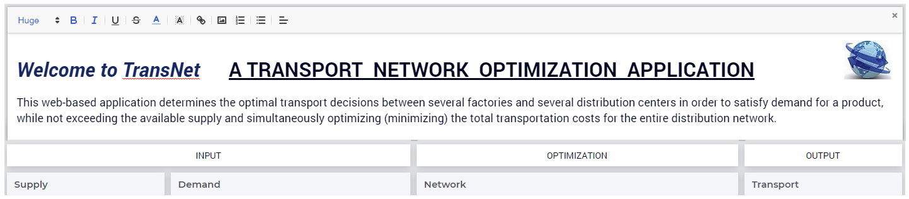

The final Widget Manager showing all widgets and their relative order looks like shown here:

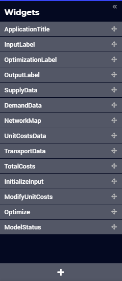

After pushing again the input initialization button and the optimization button, one should retrieve the initial solution and the WebUI should look as follows:

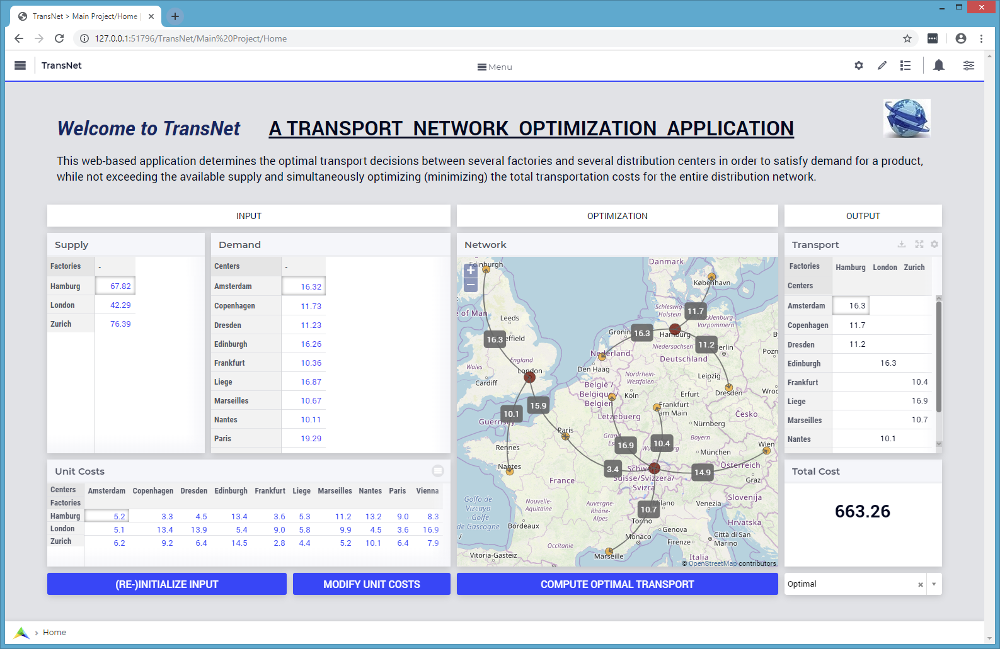

Adding What-If analysis
-----------------------

One can perform a "What-If" type of analysis by changing values for Supply, Demand, or UnitCosts, and subsequently re-solving the model. When input data changes, it may be handy to empty right away the output data resulted from the previous runs. This can be achieved by declaring procedures with names starting with "UponChange\_" followed by the name of the identifier which incurs a change, similar to the ones below:

.. code::

    Procedure UponChange_Supply {
        Body: {
                    Empty_Variables;
        }
    }

    Procedure UponChange_Demand {
        Body: {
                    Empty_Variables;
        }
    }

    Procedure UponChange_UnitCost {
        Body: {
                    Empty_Variables;
        }
    }

One may change for example, the Demand value in Amsterdam to 50 and this action will also empty the widgets for output data and show in the model status that the solver has not been called yet:

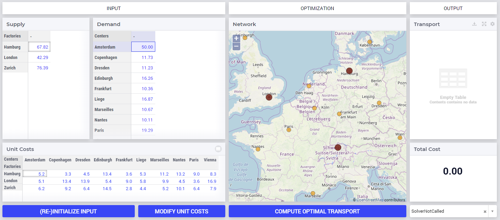

After pushing again the "COMPUTE OPTIMAL TRANSPORT" button, the new solution is shown and the model status becomes Optimal again:

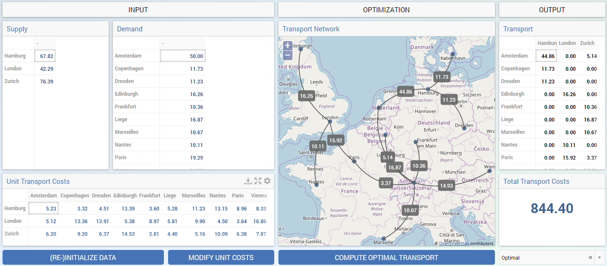

One may try and repeat the experiment for the scenario in which Demand value in Amsterdam would increase, for example, to 70. In this case the model becomes infeasible, because the total demand exceeds the total available supply. So, the output data stays empty and the model status is set to Infeasible:

.. image:: images/transnet-whatif-supplya70-inf.png
    :align: center

Of course, one may experiment with several scenarios by altering (also simultaneously) several values in Supply, Demand, and UnitCosts, re-solving the model and observing the impact of the new input to the model status and the solution, in case the model is feasible.

Modifying widget types
----------------------

Now let's say we push again the data initialization button followed by the optimization button, such that we move back to the initial situation. However, one would like to visualize the inputs and outputs in a more graphical way. Some widgets allow to change type and show the data differently without defining a new widget for that. For example, in the Settings window of the table widgets for Supply or Demand, in the Change Type section the type may be changed, e.g., to "bar chart", while for Transport to, e.g., "pie chart", as shown below:

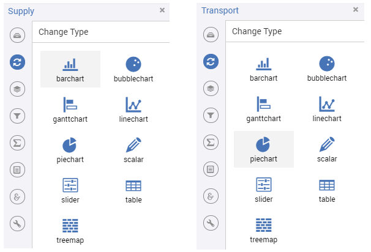

The final result
----------------

These changes lead to a WebUI as the one illustrated in the very beginning of this documentation section. Moreover, other visualizations are possible as well. For example, if the type of the table for UnitCosts is changed to tree-map and the indexes are swapped in the order (c,f), then the final WebUI may look like in this picture:

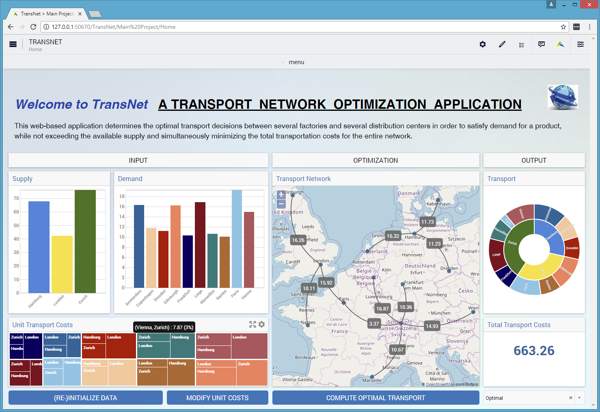

Hopefully this quick tour will give the reader a good understanding of how to start using the AIMMS WebUI. The next sections of this manual provide all the details required for building full-scope, professionally looking  Web-based User Interfaces for the AIMMS applications.
