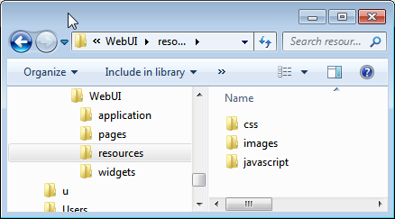

WebUI Resources
================

This section describes the various application specific resources (ASR).

Adding the **resources** folder
-------------------------------

In order to use any of the following listed features, you will need to create a new folder called **resources** (case sensitive), located in:

*<.aimms Root folder> > MainProject > WebUI > resources*. 

This folder is loaded each time the WebUI starts up or at every reload (F5) of your WebUI browser page.

Images
------

Application-specific images should be stored in the *resources/images* subfolder. This folder is not created by default, so you need to create it yourself the very first time that you need it.

JavaScript
----------

Application-specific JavaScript files (e.g. `widget [addons] <own-widgets.html>`_ or Unit Support files should be stored in the *resources/javascript* subfolder.

CSS
---

It is possible to (re)style your web application by providing custom Cascading Style Sheets (CSS). Application-specific CSS files should be stored in the *resources/css* subfolder of the *WebUI* subfolder of your project folder. 

For more info on CSS in general, see `this Wikipedia article <https://en.wikipedia.org/wiki/Cascading_Style_Sheets>`_.

Load ordering
-------------

.. important:: The feature described in this section was available in AIMMS versions up to 4.77. Starting from AIMMS 4.78 this feature is no longer supported.

By default, resources are loaded in alphabetical order. You can influence this loading order by putting a :token:`package.json` file in the folder alongside the resources to be loaded and specify a specific loading order in it.

An example package.json could be:

.. code-block:: JSON

    {
       "name": "my-application-specific-resource",
       "version": "0.0.1",
       "config": {
         "aimms:asr": {
           "files": [
             "b.js",
             "a.js",
             "c.css",
           ]
         }
       }
    }

.. note::

    * Your project can have multiple :token:`package.json` files.
    * All resources loaded explicitly by a :token:`package.json` file will no longer be loaded through alphabetical order.
    * The loading order of the same file specified in multiple :token:`package.json` files is undefined and is best avoided.
