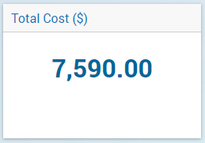
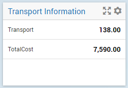
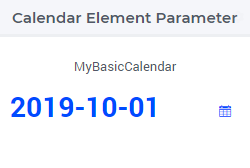

Scalar Widget
=============

The Scalar Widget allows you to show one or more scalar values in your WebUI. A scalar value can be 

* the data of a scalar identifier in AIMMS
* a multi-dimensional identifier that is automatically aggregated (summed up) for all its dimensions
* a multi-dimensional identifier that is sliced to one of the above.

Just like most of the other widgets, the Scalar Widget has a set of `Widget Options <widget-options.html>`_. At the Miscellaneous tab of the option editor, the following Scalar Widget specific options are available:

* ``contents.labels.visible``: By default, the labels (e.g. identifier name) of the scalar values are displayed. By setting this option to 0, the labels are no longer displayed. This is especially useful when you display a single scalar value and you already use the Title of the widget to explain what value is displayed.
* ``Enable Multi-Line (1/0)``: By default, the scalar values (also strings) are displayed on a single line (edit) field. If you set this option to 1, string values are displayed in multi-line mode. This allows the user to read and write values that use more than one line. E.g. when a description is displayed/edited. If you want to add line breaks to your string value, you can do this in the Scalar Widget by using the Enter key. From within the AIMMS code, you can use the newline character '\n' (without quotes), like described in the AIMMS Language Reference.

.. warning::
    
    The default behavior of the scalar widget (when specifying no value ``Display domain : <empty>`` ) is ``Display domain : 1``, whereas it is ``Display domain : 0`` in every other widget. This enables you to see by default every identifier added in the scalar widget. 

Examples
------------

Here are some examples of the scalar widget that show you some typical usage.

* Scalar widget displaying a single scalar value.

* Multiple scalar values in the Scalar Widget. Note that you can have strings, numbers, binary values and element values.
    
.. image:: images/scalar-examplecontactdetails_v1.png
    :align: center

* Transport is a 2-dimensional identifier. In the Scalar Widget it is automatically aggregated to the total sum of transport.
    

* Scalar displaying a single string parameter that contains multiple lines of data.
    
.. image:: images/scalar-multiline.png
    :align: center

.. note::

   In a scalar widget showing an element parameter you can open the drop-down list in focus in order to change its value (to one of the values in its range).
   
   Starting from AIMMS 4.93, if a dropdown cell in a scalar widget corresponds to an indexed element parameter which has as range an indexed (sub-)set, then upon clicking that cell only the entries (elements) from the specific indexed set at hand will be shown in the dropdown list.

Starting from AIMMS 4.95, the predeclared identifier :token:`webui::IdentifierTooltip` (ranging over the predeclared set :token:`AllIdentifiers`) has been added to the WebUI library.
This supports custom tooltips for identifiers names in the scalar widget.
If values are assigned to this string parameter (through any of the usual methods), then when hovering over the name of the identifiers in the scalar widget, the tooltips will show 
the values of the string parameter :token:`webui::IdentifierTooltip` for those identifiers.

Date and Time picker for element parameters with a calendar range
-----------------------------------------------------------------

.. Important:: 
    The Date and Time picker is available in software versions from AIMMS 4.77 onwards.

A Data and Time picker icon is displayed when an element parameter that is ranged over a Calendar is configured in the Contents of the scalar widget:

For more information on how to configure and user the date and time picker, please refer to `Date and Time picker for Calendar elements <table-widget.html#date-and-time-picker-for-calendar-elements>`_.
