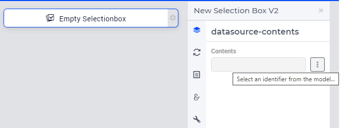
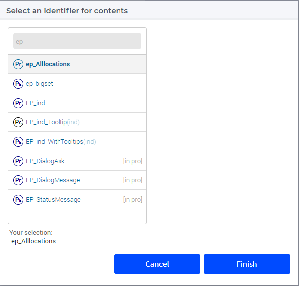
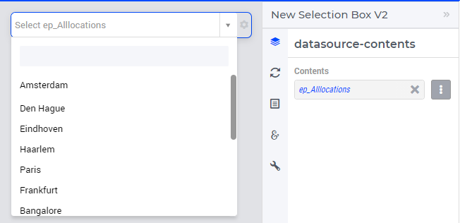
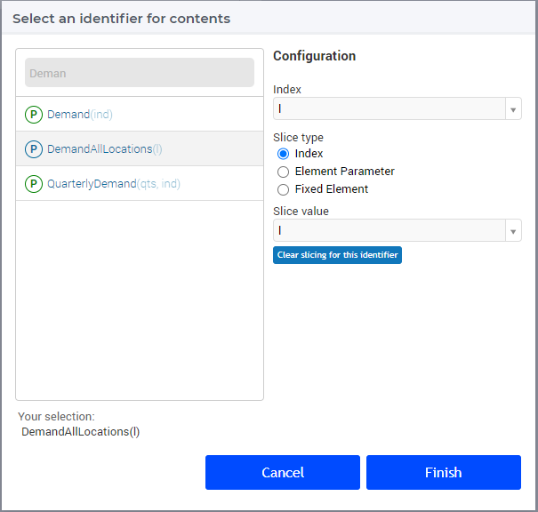
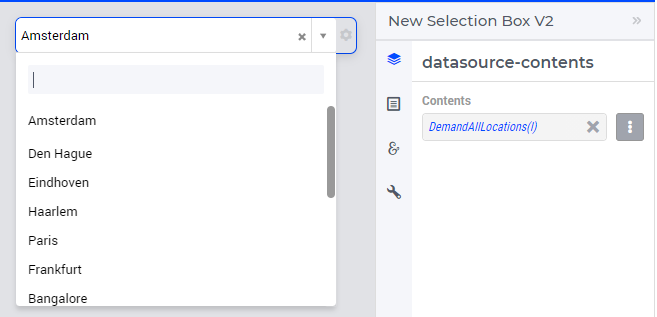

Selection Box V2 Widget
=======================

.. important::

	The Selection Box V2 widget is available starting from the AIMMS software version 4.79 onwards as part of `Experimental Features <experimental-features.html>`_. Please visit the `Experimental Features <experimental-features.html>`_ page on how to enable the feature.

The Selection Box V2 widget allows the user to select an element in a set or a subset of elements in a set by using an element parameter or a 1-dimensional parameter. 

Selection Box V2 is identical to the Selection Box widget in terms of functionality and result, but has a few enhancements namely:

#. Users can scroll the complete list of elements. The list of elements does not load at once and is loaded only when the user scrolls. This improves the performance of the widget.
#. When searching for items using the search box from the list of elements, the search is executed on the server instead of in the browser. This brings performance benefits, regardless of the number of elements in the list. 
#. Built with new technology.

.. note :: The Selection Box V2 is available only in the Grid Layout. 

Specifying an Element Parameter
-------------------------------

It is possible to specify an element parameter as a data identifier in the Contents tab of the widget's options editor by opening the Identifier Selector by clicking the icon next to the contents field.

In our example, we have selected the element parameter ``ep_Alllocations`` ranged over the set ``AllLocations``.

Specifying a 1-dimensional Parameter
------------------------------------

It is also possible to specify a 1-dimensional parameter as a data identifier in the Contents tab of the widget's options editor.

In our example, the parameter ``DemandAllLocations(l)`` is declared with the index domain of the set ``AllLocations``.

Identifier Settings
-------------------

In the Identifier Settings tab of the widget's options editor, one can apply a `Display Domain <widget-options.html#id5>`_ in the "Set display domain" section, which works in the same way as for other widgets.

In the case of a specifying a 1-dimensional binary parameter, in the "Set slicing per index" section it is possible to `slice <widget-options.html#id6>`_ the underlying index to another index of a subset.
	
Miscellaneous options
---------------------------

In the Miscellaneous tab of the widget's options editor you can set the Visibility option for the widget.