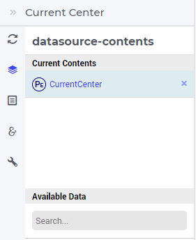
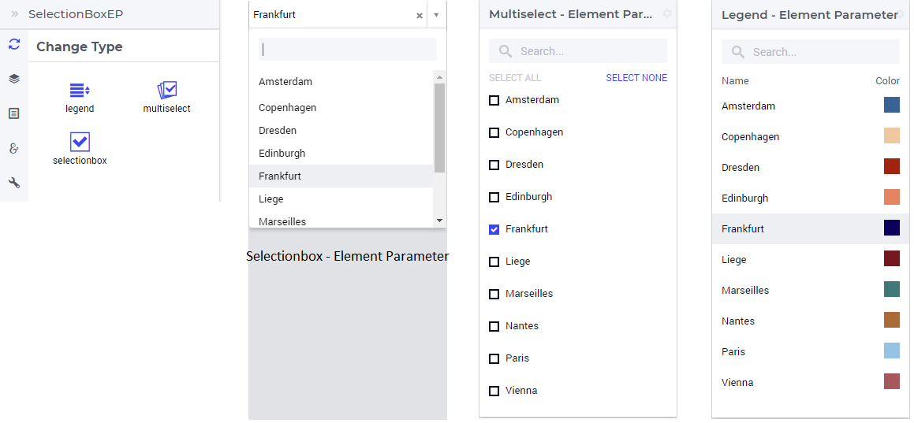
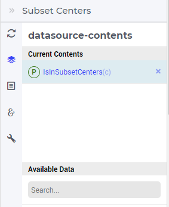
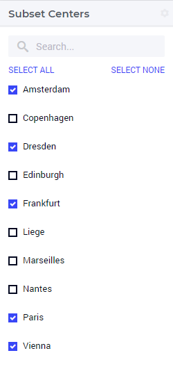
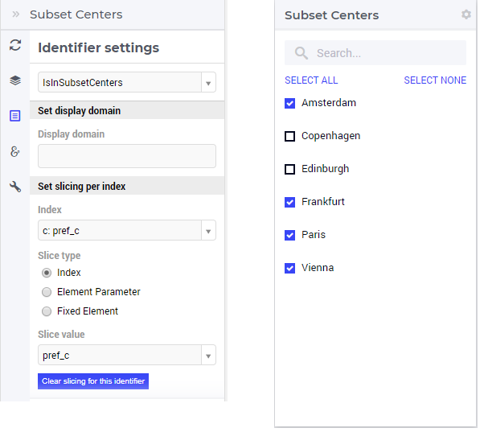

Selection Widgets
-----------------

Selection widgets allow the user to select one element in a set or a subset of elements in a set by using an element parameter or an 1-dimensional binary indicator parameter,
respectively. The available types of selection widgets are selectionbox, multiselect, and legend (see further below).

Selection Widgets with Element Parameter
++++++++++++++++++++++++++++++++++++++++

It is possible to specify an element parameter as data identifier in the Contents tab of the widget's options editor, where one may search 
for the available model data using the corresponding functionality at the bottom:

In our example (see the "Quick Start: My First WebUI" section), CurrentCenter is declared as an element parameter with the range the set Centers. 
The value of this element parameter may be viewed using a selectionbox, a multiselect, or a legend type, according to the choice made in the Change Type tab 

Selection Widgets with an 1-dimensional Binary Parameter
++++++++++++++++++++++++++++++++++++++++++++++++++++++++

It is also possible to specify a 1-dimensional binary parameter as data identifier in the Contents tab of the widget's options editor, where one may search 
for the available model data using the corresponding functionality at the bottom:

In our example, the binary parameter IsInSubsetCenters(c) is declared with the index domain the set Centers. In this case, it is appropriate to use a multiselect
type of widget which allows to select several elements from the underlying set:

Note that, in this case it is still possible to switch to other representation type, e.g.. to selectionbox, but then the selection is restricted to just one element
from the underlying set. 

Identifier Settings
+++++++++++++++++++

In the Identifier Settings tab of the widget's options editor, one can apply a display domain in the "Set display domain" section, which works in the same way as for other widgets.

In the case of a selection widget with an 1-dimensional binary parameter, in the "Set slicing per index" section it is possible to slice the underlying index to another index of a subset.
For instance, we can slice our center index c to the index pref_c of a subset PreferredCenters of the root set Centers. Assuming that the subset PreferredCenters set has the elements 
{Amsterdam, Copenhagen, Edinburgh, Frankfurt, Paris, Vienna}, this results in a possible multiselection view for IsInSubsetCenters(c) as shown here: 

So, in such a case the multiselect widget may modify only those values of IsInSubsetCenters which correspond to some center which belongs to the PreferredCenters (sub)set.
	
Miscellaneous options
+++++++++++++++++++++

In the Miscellaneous tab of the widget's options editor, other options may be set such as the title of the widget and whether or not the widget is visible (this may be determined by a constant 
or by a parameter from the model).
