Side Panel Grid Pages
=====================

.. |kebab|  image:: images/kebab.png

.. |addpage|  image:: images/addpage.png

.. |sidepanel|  image:: images/sidepanel.png

.. |page-manager| image:: images/PageManager_snap1.png

This section describes various features and tasks related to WebUI Side Panel Grid Pages.

.. important::

	 Side Panel Grid Pages are available in software versions from AIMMS 4.80 onwards.

	 When running an AIMMS project which was created with AIMMS 4.80 (or with a newer version) and that has Side Panel Grid Pages added, in AIMMS 4.79.3 (or an older version) you might face an invalid schema error. Please contact support if you face such issues.

.. note:: 
	 When running an AIMMS project which was created with AIMMS 4.80 (or with a newer version) by using AIMMS 4.79 (or an older version), the side panel grid pages created in AIMMS 4.80 may be treated as regular pages in AIMMS 4.79, because side panel grid pages are not available in AIMMS 4.79 or in older AIMMS versions. Before upgrading your AIMMS project to a new AIMMS version, please create a backup of your project which may still be run with the older AIMMS versions.

	 Currently, if you assign a fixed height widget like the button, compact scalar, label, etc. to a grid area with "``gridAutoFlow``": "``row``" and when the visibility of the widget is toggled from visible to hidden, other widgets assigned to the respective grid area will not be distributed correctly. Until this matter is addressed in future software versions, the usage of hidden widgets in this specific scenario is not recommended for the time being.

Side Panel Grid Pages are Side Panel pages with a grid layout. So, they combine the features of the `Side Panels <side-panels.html>`_ and the features of `WebUI Grid Pages <webui-grid-pages.html>`_. In this respect, the explanations about the behavior provided in the side panels section and the WebUI grid pages section also apply to the side panel grid pages discussed here. Therefore, we advise the reader to take a look at those two sections as well for explanations on aspects which are generally applicable.

Side panels are special pages with a fixed width which can be accessed on various regular pages in an application by using tabs on the right-hand side of the page (see illustrations bellow). Side panels can be configured with widgets and can help building model interactions. Also, they can hold widgets (such as filters) which are required by several pages, preventing the need to duplicate such widgets on each individual page. This way, side panels help to free up space on regular pages.

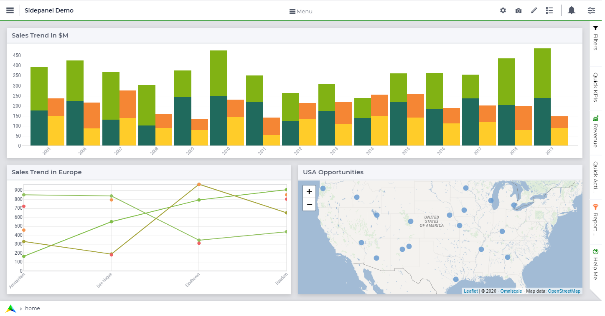
			
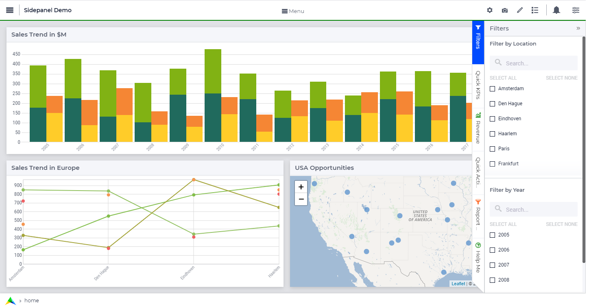
		
What can side panels be used for?
---------------------------------

Side panels can be used for various purposes, such as filters, displaying KPIs, making quick notes, showing help text, etc.

Side panels give developers the possibility to add extra widgets to a page that are always easily accessible in a collapsible panel on the right. In this vein, a side panel is a good place for filters or help text, for example.

Please avoid adding core functionalities on side panels; e.g. steps to achieve (initial) output on the page. Also, using buttons on side panels should be limited as buttons are usually a key function for a regular page. Moreover, widget-specific procedures may be put in `widget actions <widget-options.html#widget-actions>`_. 

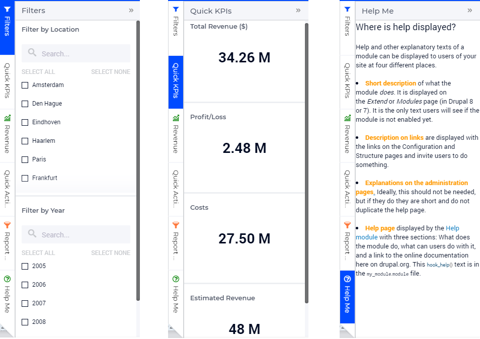

Adding a Side Panel Grid Page
-----------------------------

Adding a side panel grid page is similar to adding any other page.

When using the `Application Manager <app-management.html>`_, in the App tab click the |appmanager_kebab| icon for the page under which want to add the side panel grid page and select the "Add Side Panel Page". Give the new side panel grid page any name of your choice. Note, however, that you cannot give it a name which you have already used for other pages, side panels, or dialog pages. 

+----------------------------------------------+-----------------------------------+
| With Application Management                  | Without Application Management    |
+----------------------------------------------+-----------------------------------+
| .. image:: images/SPGL_Add_AppManager.png    | .. image:: images/SPGL_Add.png    |
|    :align: center                            |    :align: center                 |
+----------------------------------------------+-----------------------------------+
| .. image:: images/SPGL_GiveName.png                                              |
|    :align: center                                                                |
+-------------------------------------------+--------------------------------------+

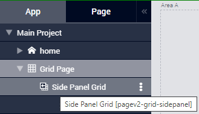

You can differentiate between other types of pages and a side panel grid page by the icons representing each type. The side panel grid page is represented by the icon |sidepanelgrid|.
			
Side panel pages can be added to any level in the page tree, just like any other page. However, unlike regular pages, side panel pages do not appear in the app navigation Menu and can be accessed only through the Application Manager (Page Manager). In the flyout menu in the pages tree, the side panel grid pages have the same options as any other page, i.e. Rename, Delete, etc. You can also move the side panel to a different location in the pages tree by using drag-and-drop in the same way as regular pages can be moved.

.. note:: 
	
	Avoid adding regular pages under side panel pages as such pages will not be shown in the app navigation Menu.

Adding widgets to a Side Panel Grid Page
----------------------------------------

Essentially, adding widgets to a side panel grid page works in the same way as for a grid page. 

Step 1: Click the side panel grid page you want to add widgets to, in the application tree:

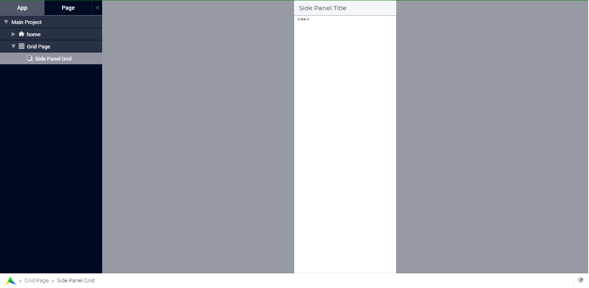
			
Step 2: You will see a narrow fixed width page. Switch to the "Page" tab, notice that ``Layout 11`` is assigned by default:

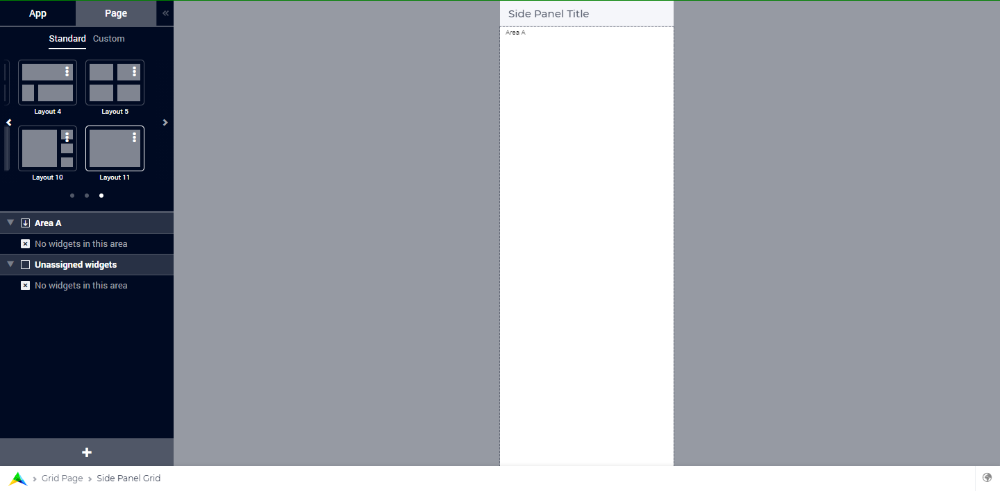

The Side Panel Title on the side panel page's header can be configured via the model. This is a preview and acts as a placeholder to depict how the actual side panel tab will look. This also gives an idea of the **usable area** for adding widgets in the side panel grid page. Side Panel Title is replaced with the `displayText` value specified in the string parameter used to configure the side panels.

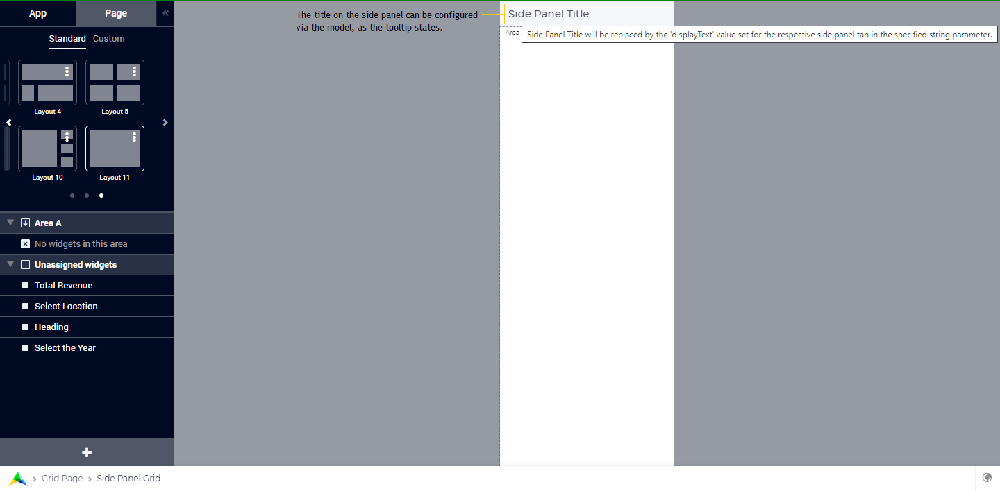

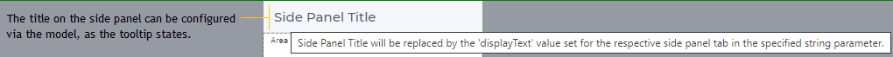

Step 3: Click the "+" button at the bottom of the Page Configuration tab in order to open the widget addition wizard and add a widget:

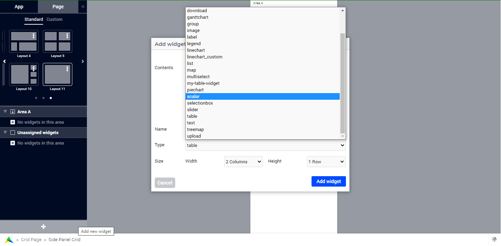

Step 4: Any new widget added appears in the "Unassigned widgets" area. Drag-and-drop the widget into "Area A":

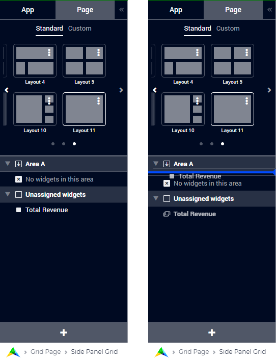

Step 5: Once the widget appears in the designated area, you can configure the widget as required:

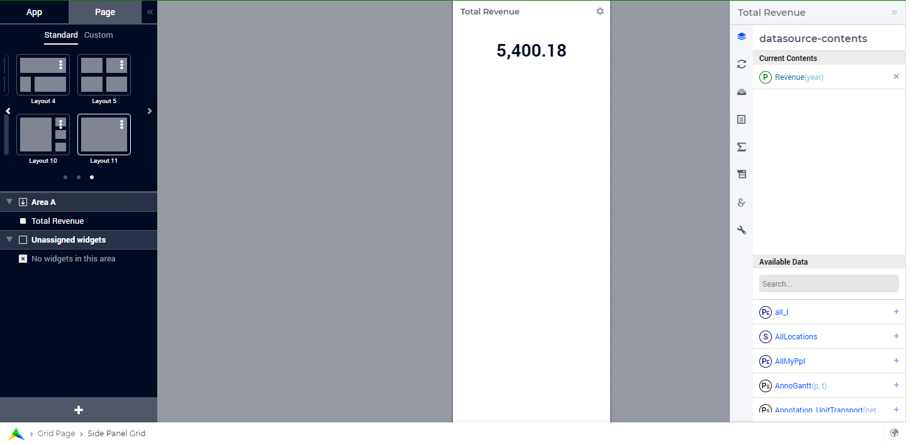

Step 6: Repeat steps 3 to 5 to add more widgets to the side panel. Since ``Layout 11`` is the assigned layout (by default), all widgets added to the "Area A" will be distributed equally in this case:

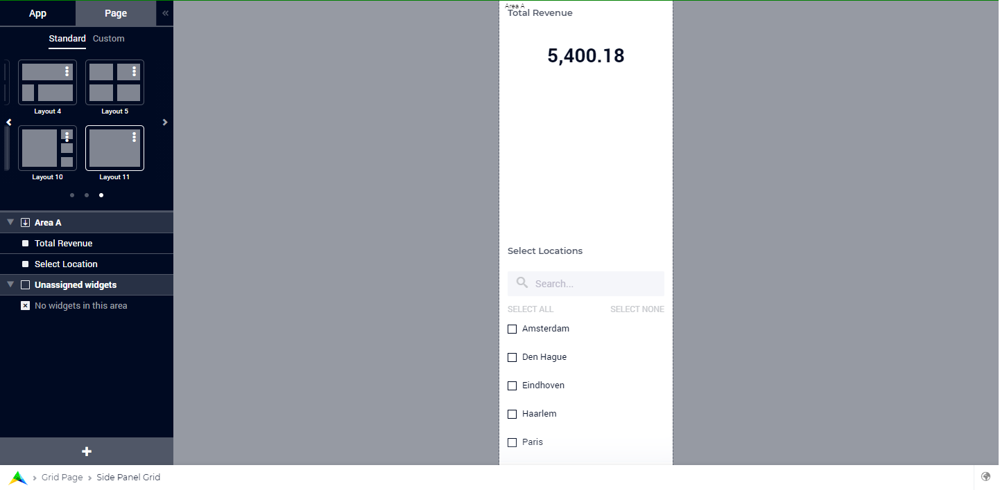

Creating a Custom Layout 
------------------------

As illustrated above, when a new side panel grid page is added, ``Layout 11`` is assigned by default. If you do not want the widgets to be distributed equally but in different proportions, you may also choose another standard layout. However, since the side panel is restricted to a certain fixed width, almost all the standard layouts may not be suitable in practice. In this case, you can create a custom layout for a side panel page as well.

Please follow the steps below in order to create your custom layouts which can be assigned to side panel grid pages.

Step 1: Clone ``Layout 11`` by clicking the |kebab| icon and clicking "Clone to Custom" (or, alternatively, click on the "Custom" tab and then "Add a layout" option):

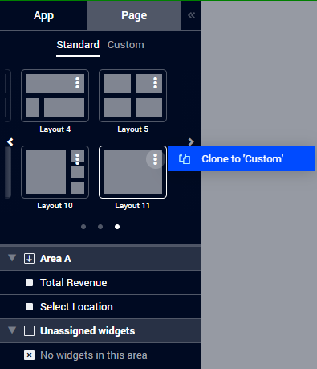

Step 2: This opens the Layout Editor where you can give the template a desired name:

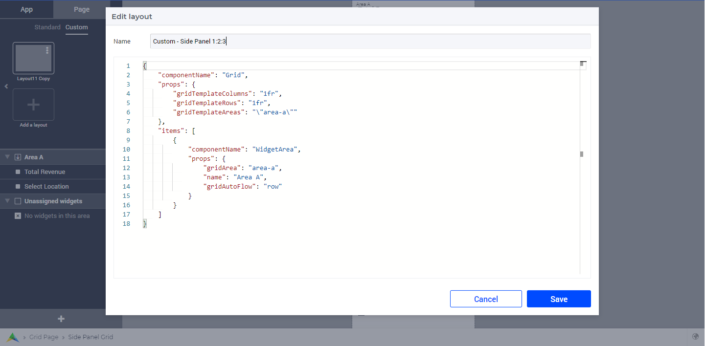

Step 3: Since the side panel itself has a confined width, we advise you to configure/modify only the values in the ``gridTemplateRows`` property. For example, divide the rows into three areas which are distributed in the ratio 1:2:3, namely Area-A, Area-B, and Area-C: 

.. code ::

		{
			"componentName": "Grid",
			"props": {
				"gridTemplateColumns": "1fr",
				"gridTemplateRows": "1fr 2fr 3fr",
				"gridTemplateAreas": "\"area-a\" \"area-b\" \"area-c\""
			},
			"items": [
				{
					"componentName": "WidgetArea",
					"props": {
						"gridArea": "area-a",
						"name": "Area A",
						"gridAutoFlow": "row"
					}
				},
				{
					"componentName": "WidgetArea",
					"props": {
						"gridArea": "area-b",
						"name": "Area B",
						"gridAutoFlow": "row"
					}
				},
				{
					"componentName": "WidgetArea",
					"props": {
						"gridArea": "area-c",
						"name": "Area C",
						"gridAutoFlow": "row"
					}
				}
			]
		}

You can also change the ``gridTemplateColumns`` property in order to add more columns, but please be aware that the columns will be adjusted in the space which is available in the fixed width of the side panel itself, as illustrated below:

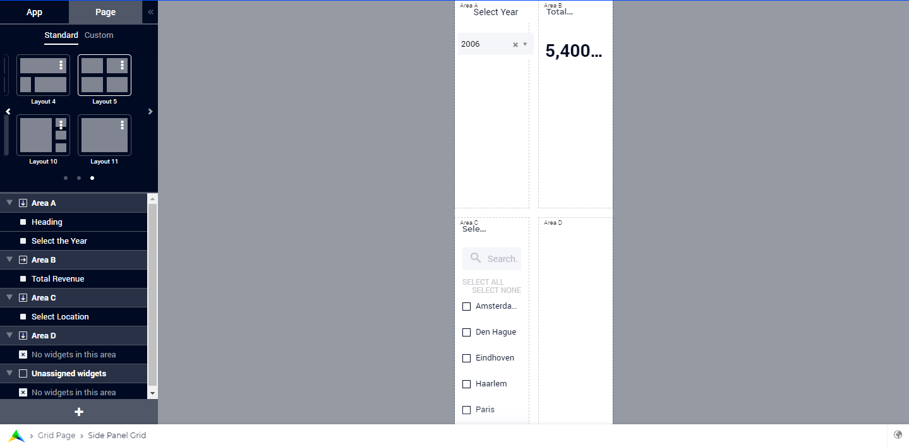

.. note::
   This latter situation should be avoided whenever possible. Please use as much as possible only one column in the property ``gridTemplateColumns`` of the custom grid.

Step 4: Once created, the custom grid layout can be applied to a side panel and the desired widgets can be assigned to the available grid areas as required.

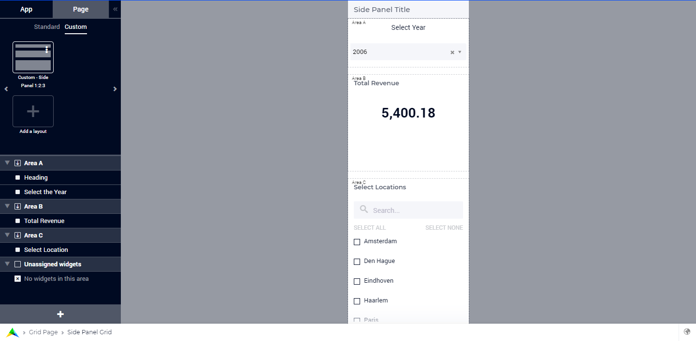

If you need more information about defining custom layouts, please read more on `Creating Grid Definitions <webui-grid-pages.html#creating-grid-definitions>`_. All layout properties described there apply to side panels as well. One exception is that using the property ``runIntoGridGap`` of a ``GridArea`` may lead to undesired visual side-effects in case of side panels. The grid layout property ``runIntoGridGap`` was designed to make full-screen-like pages (like for a map) which need to overlap the natural internal padding any page has. For side panels the padding inside the 'page' (which the sidepanel actually is) has been taken away. So, if you define an area to 'run into the padding' (which is not there) then you end up outside the page or below the edge. Therefore, using the property ``runIntoGridGap`` of a ``GridArea`` should be avoided for side panels with grid layout.

In case the widgets being assigned require more space, you can introduce a vertical scroll by dividing the areas `using percentages <webui-grid-pages.html#using-percentages>`_, the sum of which should exceed 100%.

Horizontal scrolling is not supported in Side Panels.

Configuring side panels
-----------------------

Side panels can be configured by the application developer via the AIMMS model. 
A new declaration for configuring side panels has been added to the AimmsWebUI library called Public Page and Widget Specification Declarations under the `Pages and Dialog Support <library.html#pages-and-dialog-support-section>`_ section. More specifically, the set SidePanelSpecification declared inside Public Page and Widget Specification Declarations may be used for configuring side panels as illustrated in the next steps below. 

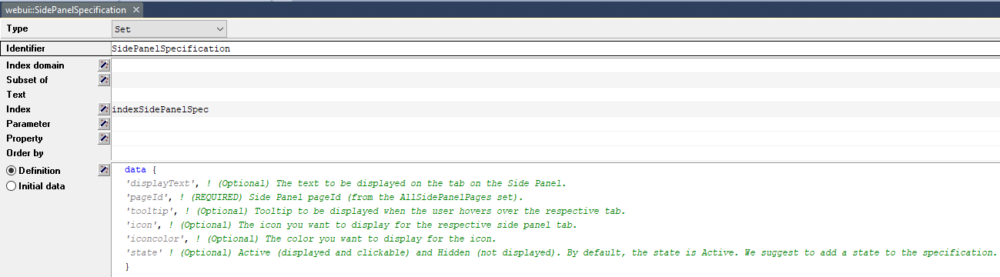

This set has the following elements representing side panels properties: 

#.  ``displayText``: This is the text/label you would like the side panel tab to have and it is an optional field. If left empty, no text will be displayed on the tab.
#.  ``pageId``: When a page or side panel is created it is has a unique page Id. You can find all the side panel page Id's in the set :any:`webui::AllSidePanelPages`. This is a required field.

	.. image:: images/Allsidepanelpagesdata.png
			:align: center
						
	.. image:: images/SP_AllsidePanelPages_data.png
			:align: center
			
#. ``tooltip``: The text specified here is displayed when the user hovers over that respective side panel tab. This is an optional field and if left empty, no tooltip is displayed.
#. ``icon``: This is the icon you want to display on the side panel tab. You can select from a list of 1600+ icons, the reference can be found in the `icon list <../_static/aimms-icons/icons-reference.html>`_. Moreover, `custom icons <webui-folder.html#custom-icon-sets>`_ can also be used, if required. This is an optional field and if left empty, no icon will be displayed.
#. ``iconcolor``: This is the color you want to display for the configured icon, e.g., 'blue', 'red', etc. Browsers support around `140 color names <https://www.w3schools.com/colors/colors_names.asp>`_. You can also use Hex codes e.g., #FF0000 for Red. This is an optional field; if left empty, the icon will be blue when the tab is collapsed. The icon color changes to white when the side panel tab is expanded since the tab's color becomes blue and most of the other colors blend in making it difficult to view the icon.
#. ``state``: The state determines the visibility of the side panel tab, i.e ``Active`` (displayed and clickable) and ``Hidden`` (not displayed). This is an optional field, but we suggest you specify one of the values. However, if not specified the default is considered as ``Active``.

.. note:: 
	
	If the set AllSidePanelPages is not yet filled with all side panel pages, please run the procedure GetAllPages. You can find this procedure in Page Support section under Public Pages Support Procedures. 
	
To configure side panels on a page, create a string parameter indexed on the `ExtensionOrder <library.html#extensionorder>`_ set with the ``webui::indexPageExtension`` index and the SidePanelSpecification set with the ``webui::indexSidePanelSpec`` index; for example, a string parameter like ``HomePageSidePanel(webui::indexPageExtension,webui::indexSidePanelSpec)``. 

.. Note::

    When creating the string parameter to configure side panels, the first index needs to be in a subset of integers. You can create your subset of integers and use the respective index as well. To make it convenient you can use the index from the pre-declared set `ExtensionOrder <library.html#extensionorder>`_ for this purpose i.e. ``indexPageExtension``.

Right click the string parameter and click on the Data option in order to open the data page:

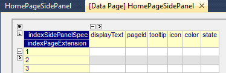

Add the details for the side panels you would like to show on this page. For example, if your page tree has 5 pages and 7 side panels, like here

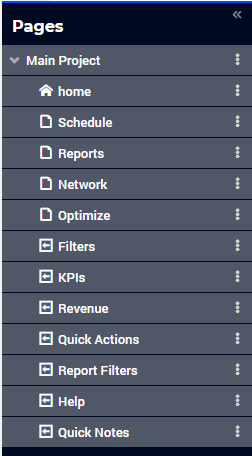

and you want 3 side panels on the "home" page, namely: 

#. Filters
#. Quick Notes
#. Help

then the data in the configuration string parameter may be filled in as follows:

.. code:: 

	 data 
		{ ( 1, displayText ) : "Filters"             ,  ( 1, pageId      ) : "filters_1"             ,
		( 1, tooltip     ) : "Global Filters"        ,  ( 1, icon        ) : "aimms-filter3"         ,
		( 1, state       ) : "Active"                ,  ( 2, displayText ) : "Quick Notes"           ,
		( 2, pageId      ) : "quick_notes"           ,  ( 2, tooltip     ) : "Make a Quick Note"     ,
		( 2, state       ) : "Active"                ,  ( 3, displayText ) : "Help"                  ,
		( 3, pageId      ) : "help_1"                ,  ( 3, tooltip     ) : "All the help you need!",
		( 3, icon        ) : "aimms-question"        ,  ( 3, iconcolor   ) : "green"                 ,
		( 3, state       ) : "Active"                 }
		
Note that in the above example data we have defined both the icon and its color for the "help_1" tab, but we did not defined values for the color of the icon for the Filters tab and neither the icon nor its color for the Quick Notes tab.

.. note:: 

	* Side panels appear in the same order from top to bottom as they appear in the data of the string parameter.
	* If you enter an incorrect ``pageId``, then the corresponding side panel tab will not be shown.
	* Case sensitivity applies to ``pageId`` mapping.
	* When a side panel tab is open in the WebUI and if the ``displayText``, ``tooltip``, ``icon``, or ``iconcolor`` are changed/updated the side panel does not collapse in the WebUI. Only when the ``pageId`` or ``state`` are changed/updated an open side panel will collapse.
	
Configuring the string parameter on regular pages
-------------------------------------------------

In the WebUI, navigate to a regular page, open its Page Settings and locate the Page Extensions option:

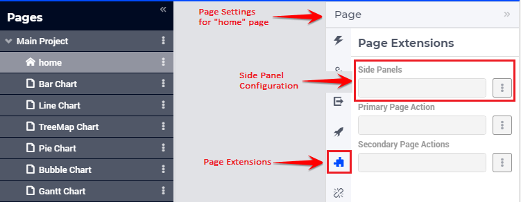
			
Add the string parameter created for that respective page in the "Side Panels" field: 

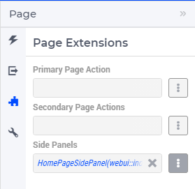

Once you have added the string parameter, the respective side panel tabs will appear on that page:

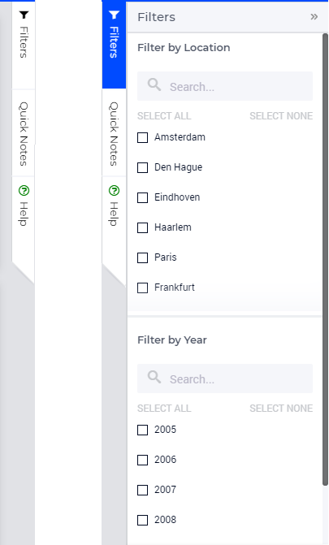
			
Similarly, you can create some (other) string parameters for other pages and configure them using the same steps. You can configure as many side panels as you need in your application. 

.. note::
	Please note that, since there is limited screen space, **AIMMS WebUI only displays the first 6 side panel tabs on each (regular) page**. So, even though the string parameter used for configuring the side panel may have data for 7 or more tabs, only the first 6 valid tabs will become visible. For consistency, the size of the tabs is always the same, i.e. 1/6\ :sup:`th`\  of the available height, no matter how many tabs are shown or how long the title text of a tab is.

Interacting with side panels
----------------------------

A side panel can be opened and closed by clicking on the respective tab. 
Hovering over a side panel will show you the tooltip which was configured in the model: 

Clicking on a tab highlights that tab and slides it open with the widgets which have been added to that respective side panel page:

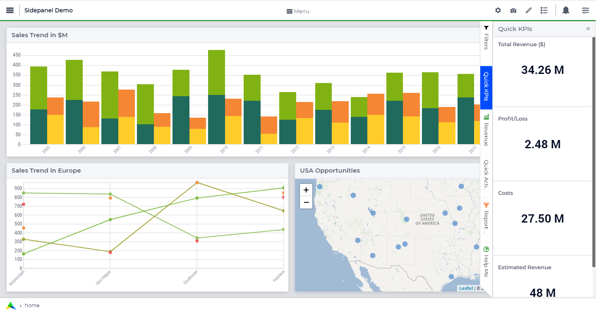

.. spelling::

    flyout