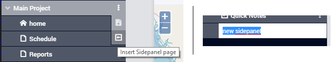
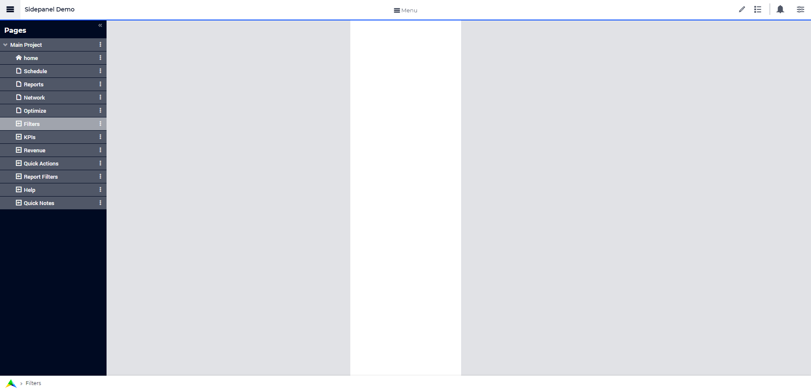
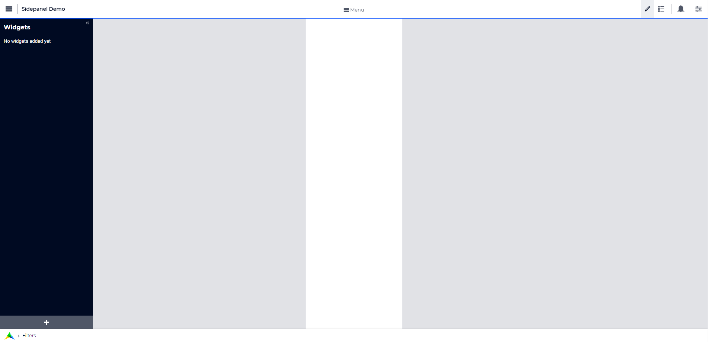
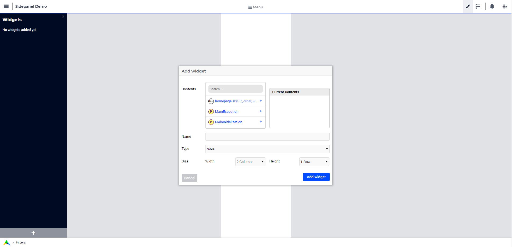
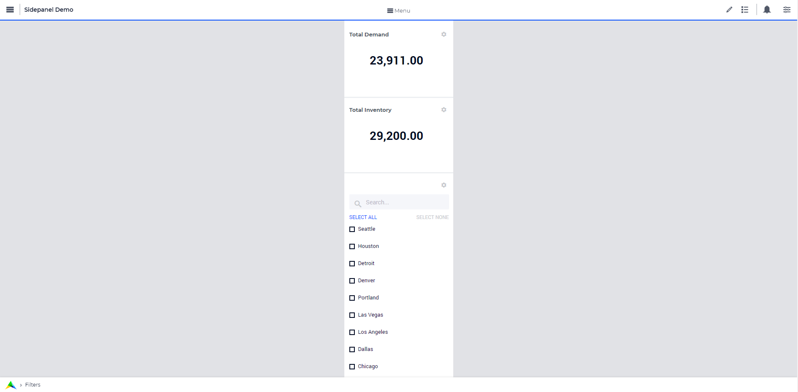

Side Panels 
===========

.. |plus| image:: images/plus.png

.. |kebab|  image:: images/kebab.png

.. |addpage|  image:: images/addpage.png

.. |sidepanel|  image:: images/sidepanel.png

This section describes various tasks related to WebUI side panels.

.. important:: 

  - Side panels are available in software versions from AIMMS 4.64 onwards.
  - A Side panels tutorial is available in the `WebUI Advanced User Interactions <https://academy.aimms.com/course/view.php?id=57>`__ course on `the AIMMS Academy <https://academy.aimms.com/>`__.

	The feature of configuring icons and icon colors on a side panel tab is available in software versions from AIMMS 4.80 onwards.

Side panels are special pages with a fixed width of two columns which can be accessed on various regular pages in an application by using tabs on the right-hand side of the page (see illustrations bellow). Side panels can be configured with widgets and can help building model interactions. Also, they can hold widgets (such as filters) which are required by several pages, preventing the need to duplicate such widgets on each individual page. This way, side panels help to free up space on regular pages.

.. image:: images/SidePanel_HomeExample1.png
			:align: center
			
.. image:: images/SidePanel_HomeExample2.png
			:align: center
		
What can side panels be used for?
---------------------------------

Side panels can be used for various purposes, such as filters, displaying KPIs, making quick notes, showing help text, etc.

Side Panels give developers the possibility to add extra widgets to a page that are always easily accessible in a collapsible panel on the right. The Side Panel is a good place for filters or help text.

Avoid core functionalities in side panels. E.g. steps to achieve (initial) output on the page. Avoid buttons in side panels. Buttons are probably a key function for the page. Put widget-specific procedure in `widget action <widget-options.html#widget-actions>`_. 

.. image:: images/SidePanel_Examples.png
			:align: center

Adding a Side Panel
-------------------

Adding a side panel page is similar to adding a page.

In the page manager you will notice a few changes. The |plus| icon for the Main project and in the |kebab| menu for other pages has been replaced. The main project now has a |kebab| menu, which when clicked, shows 2 options, i.e. Add New Page |addpage| and Add Side panel |sidepanel|.

The |plus| icon for pages has been removed and 2 new 
icons have been introduced |addpage| and |sidepanel|, as in the 
main project add options.

Click on the Insert side panel page icon and give it any name you desire. You cannot give a name that you have already used for other pages or side panels. 

You can differentiate between pages and side panels by the icons that represent each type.

.. image:: images/pageside paneldiff.png
			:align: center
			
Side panels can be added to any level in the page tree, just like any normal page. Unlike Pages, Side panels do not appear in the Menu (navigation) and can only be accessed via the page manager. Side panels has the same options of a page i.e Rename, Delete, etc. You can also move the side panel the same way pages can be moved.

.. note:: 
	
	Avoid adding other pages under side panels as such pages will not be shown in the app navigation Menu.

Adding widgets to a Side Panel
------------------------------

Adding widgets to a side panel page is the same as adding widgets to any other page. 

Step 1: Click the side panel page you want to add widgets to in the page manager

			
Step 2: You will see a 2-column width page. Open the Widget Manager.

Step 3: Add desired widgets to the page.

.. note:: 
	
	* Changing the width of a widget will not have any effect as the page is restricted to only 2 columns. You can change the height of the widget as required.
	* If the widgets added exceed the page height a scroll will appear in the side panel. 

.. _Configuring Side panels:

Configuring side panels
-----------------------

Side panels can be configured by the application developer via the AIMMS model. 
A new declaration has been added to the AimmsWebUI library called Public Page and Widget Specification Declarations under the `Pages and Dialog Support <library.html#pages-and-dialog-support-section>`_ section, used to configuring side panels. The set SidePanelSpecification declared inside Public Page and Widget Specification Declarations is used for configuring the side panels as illustrated here in the next steps. 

.. image:: images/SidePanel_Specification.png
			:align: center

This set has the following elements representing side panels properties: 

#.  ``displayText``: Is the text/label you would like the side panel tab to have. This is an optional field. If left empty, no text will be displayed on the tab.
#.  ``pageId``: When a page or side panel is created it is has a unique page Id.  You can find all the side panel page Ids in the set AllSidePanelPages. This is a required field.

	.. image:: images/Allsidepanelpagesdata.png
			:align: center
						
	.. image:: images/SP_AllsidePanelPages_data.png
			:align: center
			
#. ``tooltip``: The text here would be displayed when the user hovers over that respective side panel tab. This is an optional field and if left empty, no tooltip is displayed.
#. ``icon``: The icon you want to display on the side panel tab. You can select from a list of 1600+ icons, the reference can be found in the `icon list <../_static/aimms-icons/icons-reference.html>`_. `Custom icons <webui-folder.html#custom-icon-sets>`_ can also be used if required. This is an optional field and if left empty, no icon will be displayed.
#. ``iconcolor``: The color you want to display for the icon configured, e.g., Blue, Red, etc. Browsers support around `140 color names <https://www.w3schools.com/colors/colors_names.asp>`_. This is an optional field. You can also use Hex codes e.g., #FF0000 for Red. This is an optional field; if left empty, the icon will be blue when the tab is collapsed. The icon color changes to white when the side panel tab is expanded since the tab's color becomes blue and most of the other colors blend in making it difficult to view the icon.
#. ``state``: The state determines the visibility of the side panel tab, i.e ``Active`` (displayed and clickable) and ``Hidden`` (not displayed). This is an optional field, but we suggest you specify one of the values. However, if not specified the default is considered as ``Active``.

.. note:: 
	
	If the set AllSidePanelPages is not yet filled with all side panel pages, please run the procedure GetAllPages. You can find this procedure in Page Support section under Public Pages Support Procedures.
	
To configure side panels on a page, create a string parameter indexed on the `ExtensionOrder <library.html#extensionorder>`_ set with ``webui::indexPageExtension`` and SidePanelSpecification set with ``webui::indexSidePanelSpec`` indices, for example ``HomePageSidePanel(webui::indexPageExtension,webui::indexSidePanelSpec)``. 

.. Note::

    When creating the string parameter to configure side panels, the first index needs to be in a subset of integers. You can create your subset of integers and use the respective index as well. To make it convenient you can use the index from the pre-declared set `ExtensionOrder <library.html#extensionorder>`_ for this purpose i.e. ``indexPageExtension``.

Right click the string parameter and click on the Data option in order to open the data page:

.. image:: images/SidePanel_StringParameterData.png
			:align: center

Add the details for the side panels you would like to show on this page. For example, if your page tree has 5 pages and 7 side panels, like here

.. image:: images/SP_pagetree.png
			:align: center

and you want 3 side panels on the "home" page, namely: 

#. Filters
#. Quick Notes
#. Help

then the data in the configuration string parameter may be filled in as follows:

.. code:: 

	 data 
		{ ( 1, displayText ) : "Filters"             ,  ( 1, pageId      ) : "filters_1"             ,
		( 1, tooltip     ) : "Global Filters"        ,  ( 1, icon        ) : "aimms-filter3"         ,
		( 1, state       ) : "Active"                ,  ( 2, displayText ) : "Quick Notes"           ,
		( 2, pageId      ) : "quick_notes"           ,  ( 2, tooltip     ) : "Make a Quick Note"     ,
		( 2, state       ) : "Active"                ,  ( 3, displayText ) : "Help"                  ,
		( 3, pageId      ) : "help_1"                ,  ( 3, tooltip     ) : "All the help you need!",
		( 3, icon        ) : "aimms-question"        ,  ( 3, iconcolor   ) : "green"                 ,
		( 3, state       ) : "Active"                 }
		
In the above data we have not defined values for the color of the icon for the Filters tab and the icon and its color for the Quick Notes tab.

.. note:: 

	* Side panels appear in the same order from top to bottom as they appear in the data of the string parameter.
	* If you enter an incorrect ``pageId``, then the corresponding side panel tab will not be shown.
	* When a side panel tab is open in the WebUI and if the ``displayText``, ``tooltip``, ``icon``, or ``iconcolor`` are changed/updated the side panel does not collapse in the WebUI. Only when the ``pageId`` or ``state`` are changed/updated an open side panel will collapse.
	
Configuring the string parameter on respective pages
----------------------------------------------------

In the WebUI, navigate to the respective page. In the Page Settings you can locate the Page Extensions option:

.. image:: images/SP_configuresidepanel.png
			:align: center
			
Add the string parameter created for that respective page in the "Side Panels" field. 

.. image:: images/SidePanel_SpecifyingStringParameter.png
			:align: center

Once you have added the string parameter, the respective side panel tabs will appear on that page.

.. image:: images/SidePanel_Result.png
			:align: center
			
Similarly, you can create some (other) string parameters for other pages and configure them using the same steps.

You can configure as many side panels as you need in your application. However, please note that, since there is limited screen space, **AIMMS WebUI only displays the top 6 side panels on each page.**

Interacting with side panels
----------------------------

A side panel can be opened and closed by clicking on the respective tab. 
Hovering over a side panel will show you the tooltip that was configured in the model. 

.. image:: images/SidePanel_TabInteraction.png
			:align: center

Clicking on the tab highlights that tab and slides opens with the widgets that were added to that respective side panel page.

.. image:: images/SidePanel_TabInteraction_Open.png
			:align: center
