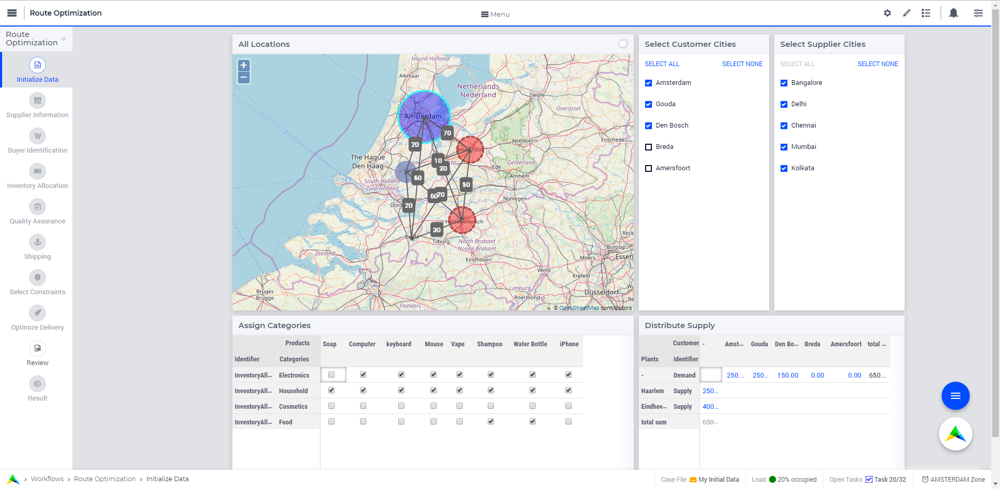
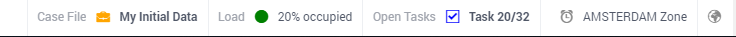
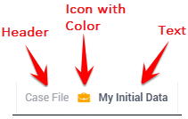
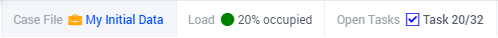
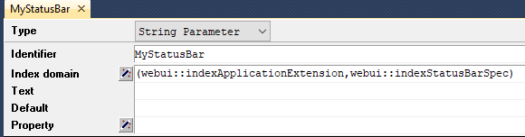
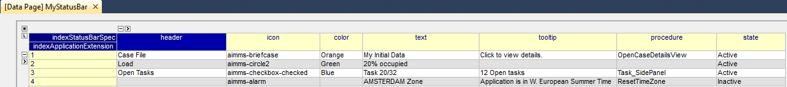

Status Bar
==========

.. |applicationsettings-icon| image:: images/applicationsettings-icon.png

.. |application-settings-open| image:: images/app_settings_open_new.png

.. |use-classic-theme-on| image:: images/use_classic_theme_on.png

.. |workflowicon| image:: images/workflowicon.png

.. |ApplicationExtension| image:: images/ApplicationExtensionIcon.png

This section describes various tasks related to the application status bar.

.. important:: Status Bar is available in software versions from AIMMS 4.70 onwards.

The Status Bar is used to display custom messages i.e status messages, like the dataset that is currently in use or the connection status to a database to users. The Status Bar is displayed in the footer across the application, on all pages. These status messages can be updated when necessary or as required.

A status message typically has a header or title, an icon with a color and the actual message. A tooltip is display when the user hovers over the message, if configured. A procedure can also be configured for each status message such that it is executed when the user clicks on the specific message.

If a procedure is configured for a status message, when the user hovers over the message the text is highlighted in blue and the pointer changes to indicate to the user that they can click and execute a procedure.

Messages in the Status Bar can be configured by the application developer via the AIMMS model and defined in the Application Settings under the Application Extensions section. 

A new section, StatusBar Support, has been defined in the AIMMS WebUI system library to configure the Status Bar and the messages.

StatusBarSpecification - This set is used to configure messages in the Status Bar. The attributes of this set are the following:

* :token:`header` - The Header/Title text you want to display for the status message. This is an optional field. If left empty, no value is displayed.
* :token:`icon` - The icon you want to associate with the message. You can select from a list of 1600+ icons, the reference can be found in the `icon list <../_static/aimms-icons/icons-reference.html>`_. `Custom icons <folder.html#custom-icon-sets>`_ can also be used if required. This is an optional field and if left empty, no icon will be displayed.
* :token:`color` - The color you want to display for the icon configured, eg: Blue, Red, etc. Browsers support around `140 color names <https://www.w3schools.com/colors/colors_names.asp>`_. This is an optional field. You can also use Hex codes eg: #FF0000 for Red.
* :token:`text` - The text you want to display for the status message. This is a required field.
* :token:`tooltip` - The text to be displayed when the user hovers over the status message. This is an optional field and if left empty, no tooltip is displayed.
* :token:`procedure` - The procedure you want to execute when the respective status message is clicked. This is an optional field.
* :token:`state` - This property holds three values, Active (displayed and clickable if procedure is configured), Inactive (displayed and not clickable) and Hidden (not displayed). By default, the state is Hidden. This is an optional field and if left empty, the state is hidden.

Configuring messages in the Status Bar
--------------------------------------

Create a string parameter indexed by the ExtensionOrder and StatusBarSpecification. Let's call this :token:`MyStatusBar(webui::indexApplicationExtension,webui::indexStatusBarSpec)`. Right click the string parameter and click on the Data option to open the data page. Add the details for the status messages you would like to display. For example:

In the illustrated example, we have defined four status messages. We display the Active and Inactive actions.  

The status messages are added to the right hand side of the footer. Each new message is added to the right, shifting the existing messages to the left. There is no limit to the number of status messages that you can configure. AIMMS recommends not more than seven. The footer is divided into two sections with 30% width for the Breadcrumb on the left and 70% for the Status Bar. When the messages exceed the alloted space, the header is first displayed with an ellipsis. If the messages still cannot fit, the text of the message is also displayed with an ellipsis. When too many messages are added, only the icon will be displayed for each message.

Configuring Status Bar in the Application Settings
------------------------------------------------------------

To enable the Status Bar, click on the Application Extension icon |ApplicationExtension| of the Application Settings and add the configured string parameter to the Status Bar field as illustrated below:

.. image:: images/StatusBar_ApplicationExtensionSettings.png
    :align: center

Once the string parameter is added, the Status Bar is displayed with the configured status messages, in the footer of the application.
