Table Widget
============

.. |delete-filter-icon| image:: images/filterdelete_icon.png

The Table widget allows you to visualize and edit the data of one or more AIMMS identifiers represented in a tabular format:

  .. image:: images/Table-View1.png 
        :align: center 

The table widget offers the user possibilities for various actions such as:
		
* Sort table data by using the sort buttons as illustrated in the picture below: 

  .. image:: images/Table-View2.png 
        :align: center 

  The sort button applies one of the 3 states: increasing, decreasing, default:

  .. image:: images/Table-View3.png 
        :align: center	

  For example, if one chooses for the "increasing" sorting in the example above, the rows of the table are sorted as follows:
  
  .. image:: images/Table-View4.png 
        :align: center  
		
* Change several `Widget Options <widget-options.html>`_, e.g.

  * add `aggregators (Totals) <widget-options.html#totals>`_
  * customize the table by drag-and-drop of the indices (`Pivot <widget-options.html#pivot>`_), 
  * specifying reverse links on the ‘Store focus’ tab of the widget’s option editor. 
    When a cell has the focus in the table, the element parameter(s) that you specify here will be filled accordingly. Such element parameters may be used at the same time by other widgets, which will update automatically. Hence, the ‘Store focus’ functionality opens up various possibilities for interaction between the widgets.
  * specify various `identifier settings <widget-options.html#identifier-settings>`_; in particular, specifying display domain, slicing, or expanding indexes
  * specify `Widget Actions <widget-options.html#widget-actions>`_ and the `Item Actions <widget-options.html#item-actions>`_ 
            
* Save the table data to a .csv file by using the `Download Table Data <#download-table-data>`_ functionality, see below.

* Change the column widths of the table, simply by dragging them to where you want them.

* Change the default row height of the table, by specifying a positive integer value in the 'Default row height' option in the Miscellaneous options editor.

* Use your keyboard (as well as the mouse) in order to navigate on the table.

  * You can use the 0 or the 1 key to set binary values displayed as checkboxes that have the focus.
  
  * You can use the **SPACE BAR** to toggle binary values displayed as checkboxes that have the focus.
 
  * In AIMMS 4.87 and higher, pressing **ENTER** takes you to the cell below.

  * In AIMMS 4.87 and higher, opening a DateTime cell with the keyboard should be done with either **ALT+ARROW DOWN** or **CTRL+SPACEBAR**.
  
  * In AIMMS versions up to 4.87, you could use either **ENTER** or **ALT+ARROW DOWN** to open the drop-down list in focus, in order to change its value. In AIMMS 4.87 and higher, only **ALT+ARROW DOWN** does this.

.. note::

   From AIMMS 4.91 onwards, the dropdown that appears when you click on an element parameter in a table uses the same underlying technology as the Selectionbox widget. In practice, that means that it is more reactive to data changes in the underlying model while open. Furthermore, the current/default entry has been removed. For a table you can use the delete key to empty any cell (which sets it to default), including the dropdown cells. 

   Starting from AIMMS 4.93, if a dropdown cell in a table corresponds to an indexed element parameter which has as range an indexed (sub-)set, then upon clicking that cell only the entries (elements) from the specific indexed set at hand will be shown in the dropdown list.

* Starting from AIMMS 4.90, it is also possible to sort the table headers, that is, the elements of one of the sets involved in the table (through the specification of its index in the shown data).

  Consider the following example where the data has four indexes:

  .. image:: images/Table-Header-Sort-1.png 
        :align: center  

  If we choose for "decreasing" sorting of the set Centers in the columns headers, then the columns are sorted as follows:

  .. image:: images/Table-Header-Sort-2.png 
        :align: center  
  
  Similarly, if we choose for "decreasing" sorting of the set Factories in the rows headers, then the table is sorted as follows:

  .. image:: images/Table-Header-Sort-3.png 
        :align: center  
 
  Please note that any table header may be sorted, but only one sorting can be applied on table headers at a time. So, when another sorting is chosen, then the previously applied sorting is no longer active, but the corresponding index gets the default sorting, instead. Once a sorting is applied, the header title cell used for that sorting is indicated accordingly, as shown in the pictures above. 

  Also, when sorting is applied on a cell in header titles area and afterwards some changes are performed to the table (such as a change in the pivoting of the indexes or a modification to the table contents), then the sorting is retained as long as that index/identifier continues to exist in the table.

Quick navigation
----------------

In AIMMS 4.92 the table navigation has been improved such that it became more simple and natural to interact with and use the table. Similar to the navigation experience in Excel or in other tabular data applications, the AIMMS WebUI provides support for generic tabular data navigation keys, such as the following: 

  * The arrow keys **RIGHT**, **LEFT**, **UP**, **DOWN** can be used to navigate to the adjacent cells within the same table widget.
	
  * The **HOME** key takes you to the left-most cell of the current table row. 
	
  * The **END** key takes you to the right-most cell of the current table row. 
	
  * The **CTRL+HOME** keys take you to the very first cell of the table, that is, the cell at the position (0,0).
	
  * The **CTRL+END** keys take you to the very last cell of the table, that is, the cell at the position (m-1,n-1), where m is the number of rows and n is the number of columns.
	
  * The **CTRL+RIGHT Arrow** keys get the focus on the horizontally-first (that is, right-most) cell of the same row.

  * The **CTRL+LEFT Arrow** keys get the focus on the horizontally-last (that is, left-most) cell of the same row.
	
  * The **CTRL+UP Arrow** keys get the focus on the vertically-first cell of the same column.

  * The **CTRL+DOWN Arrow** keys get the focus on the vertically-last cell of the same column.

Search-and-Find
---------------

From AIMMS 4.89 onwards, the table widget offers a Search-and-Find functionality which allows you to search for the occurrence of a sub-string of your choice within the data values contained in the table grid.

.. note::

   The Search-and-Find functionality is available in AIMMS 4.89 as an Experimental Feature. You can toggle the feature 'Advanced Table Editing' on or off in the Experimental Features dialog in order to use it.
   
   Starting from AIMMS 4.90, the Advanced Table Editing is available as a main feature (so, it is no longer shown under the Experimental Features).
   
The Search-and-Find functionality can be activated by clicking on the dedicated search icon on the table header: 

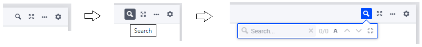
 
In the Search field you can type the sub-string to be used as search key and then press ENTER or click on the search icon on the left side of this field in order to trigger the search process. 
Subsequently, the search counter on the right side of the search field will be updated with the total number of matches found as well as the rank of matching cell which gets the focus after the search. 
This cell is the first matching cell starting from the cell position in the table grid which had the focus immediately before starting the search. 
All matching cells are highlighted using a light colored background, while the matching cell which gets the focus will have additionally thick border grid lines round the cell, see the following example:

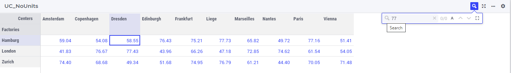

\

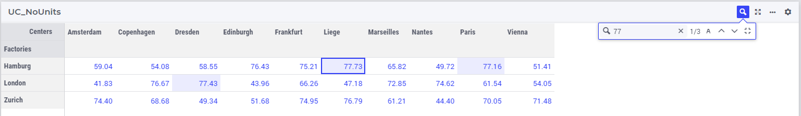

\

By clicking on the arrows for Next or Previous inside the search box one can navigate to the next or the previous matching cell, respectively:

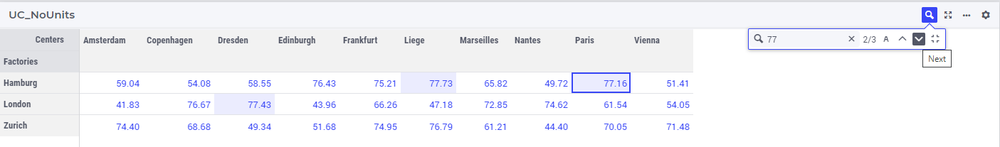

\

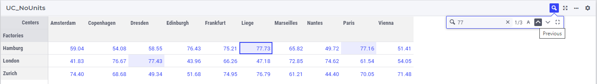

\

The search box also features an icon (with the capital letter A) for toggling on/off the letter case sensitivity during the search, which will clearly impact the number of matches found, as shown by the example below:

Case Sensitivity Off:

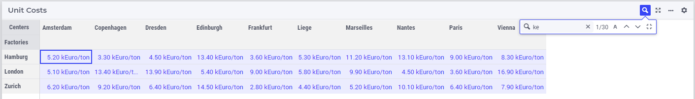

\

Case Sensitivity On:

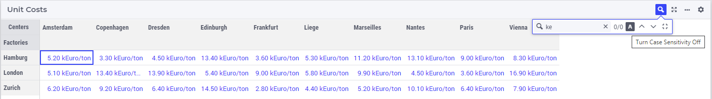

\

The search action may be canceled by clicking on the "x" icon on the right side of the search field, while the entire search box may be minimized by clicking on the "Minimize Search" icon as illustrated in the following picture:

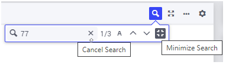

\

In case there are more than 1000 matches during a search action, only the first 1000 matching cells will get highlighted in the table and the search counter will render 1000+ as the total number of matches found:

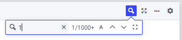

\

Note that, if the table at hand appears on a side panel page, then the layout of the search box is slightly different (due to the limited width of a side panel), but the functionality behind the icons in the box is the same as explained above for a regular page:

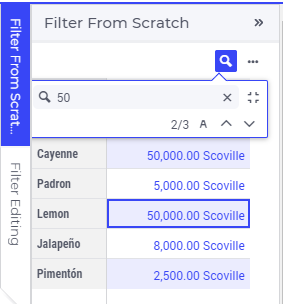

Block Editing
-------------

From AIMMS 4.87 onwards, the table supports block editing. You can select a region of the table using your mouse, then type a value and press **CTRL+ENTER** to change all selected cells into the value you typed. In case of a dropdown cell displaying an element parameter, you should also use **CTRL+ENTER** to do this (in earlier AIMMS versions just pressing **ENTER** would change the value of the -single- cell). In case of a binary cell with a checkbox, use **CTRL+SPACE** to toggle all selected values into the toggled value of the first cell. In case of a DateTime cell, use **CTRL+LEFT MOUSE**. Please be aware that if the top-left cell of your selection is a read-only cell, this does not work, so make sure you select an editable cell in that position. If your top-left cell is editable and your selection includes read-only cells, of course only the editable cells get the new value.

You are not limited to selecting a rectangular region of cells. Holding down the **CTRL** key, you can select more than one region with your mouse. Such a region can also consist of a single cell; in that case simply click on it (while still holding **CTRL** pressed). This offers you a quick way to change a scattered selection of cells to a single value.

A special case of block editing is "block deleting". When selecting a block, as described above, and pressing **CTRL+DELETE**, the whole block of cells will be set to default values (if not overridden by specific default values in the model, that means 0 for numeric/checkbox cells and the empty string for strings, element parameters and datetime values).

As a side-effect of this feature, changing a cell containing a checkbox now requires you to precisely click in the checkbox itself. In earlier versions, clicking anywhere in the cell was enough. By changing this behavior, we prevent that clicking such a cell as part of selecting multiple cells/regions would unintentionally change the boolean value of the cell.

Please note that currently the selection of a block can only be done using the mouse. At a later stage, we will add support for keyboard selection as well (like, for example, **CTRL+A**).

Copy/Paste
----------

Also from AIMMS 4.87 onwards, the table supports copy/paste functionality. Currently, this is limited to rectangular blocks of cells, which you can select as described in the Block Editing section above. When having selected a block of cells, simple press **CTRL+C** to copy the block. In order to paste it, select a single cell in the table and press **CTRL+V**. This will paste your selected block of cells into a region of the same size with the selected cell as its top-left cell. 

In case there is not enough space below or to the right of the selected cell to paste the full block, the paste is executed 'as far as it goes'. So, for example, copying a 5x5 block of cells and trying to paste it into a cell on the bottom right of your table, which only extends to a 2x2 block of cells until the edges of the table are reached, will paste the top-left 2x2 block of your original 5x5 block of values.

If the paste region contains read-only cells, no values will be pasted in those.

Pasting is not limited to the same table as from which you copied the values of course: you can paste into different tables on the same WebUI page or on different WebUI pages, even in other WebUI apps. Furthermore, you can also paste to external programs, like text editors or Excel, for example. Please note that pasting from an external source to a WebUI table is not supported.

.. note::

   The Block Editing and the Copy/Paste features are available as Experimental Features from AIMMS 4.87 onwards. You can toggle the feature 'Advanced Table Editing' on or off in the Experimental Features dialog in order to use it.
   
   Starting from AIMMS 4.90, the Advanced Table Editing is available as a main feature (so, it is no longer shown under the Experimental Features).

.. note::

   Please be aware that there is no undo-functionality provided yet. We are working on this. As for now, please keep this in mind when block editing and pasting data.

Limited Support for Special Numbers
-----------------------------------

AIMMS offers support for special numbers, like inf, na, undef, etc. The WebUI table offers limited support here, for inf and -inf only. The following applies:

* The Table widget displays inf/-inf values from AIMMS as ∞/-∞.
* You can enter the value for infinity in the Table itself by typing either 'inf', '-inf', 'Infinity', '-Infinity', '∞' or '-∞'.
* If you are displaying Totals in the Table, the following rules apply:
  * any Total that contains 'inf' (as an operand) and no '-inf' results in 'inf'.
  * any total that contains '-inf' (as an operand) and no 'inf' results in '-inf'.
  * any total that contains 'inf' (as an operand) as well as '-inf' results in undefined and produces an error message in the WebUI.

The Kebab Menu
--------------

Because the header menu of the Table widget had become a bit cluttered after adding new icons for various features in it, from AIMMS 4.89 onwards we cleaned up the header by introducing the 'kebab' menu (recognizable by the |widget-header-kebab| icon). This menu combines the options to download the table to a CSV file, to upload/download to/from an Excel file, the widget actions for the table and a help menu. Below is an example of the menu contents, when all options are available:

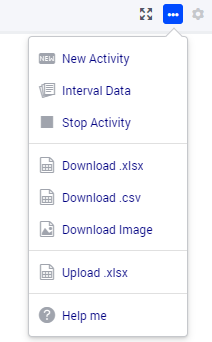

The menu is divided into four sections. The top one contains the custom widget actions (in case these are present), the second one the download options, the third one the upload option and the bottom one includes the help menu. This help menu is only displayed for app developers and it takes you to the documentation of the specific widget. There is one other item which may appear at the bottom of the menu: the cogwheel, alias the settings menu. This is the case in end-user mode with the UI Editable option switched on (so the position of it is less prominent than in app developer mode).

Download Table Data to CSV File
-------------------------------
  
The Table Widget offers you the possibility to download its current contents to a .csv file on your local machine, which you can use to further process your data in, for example, Excel. On the top right, in the kebab menu, you can find the option 'Download.csv' (if the option is allowed by the app developer, see the :ref:`ControlCSV` section below).

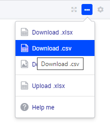

When you click it, the contents of the table, exactly as you configured it (in terms of pivoting, for example), will be downloaded to a .csv file. Depending on your browser, you can specify the name of the file or the download location. As a default, the name of your table will be used as the filename with the '.csv' extension.

If your table contains numerical data, the numbers will be written to the .csv file in their maximum precision. So, if you display only 2 decimals in the table, but the underlying number is for example 1.2345, the full precision is written to the file. This allows you to do calculations in Excel with the resulting file, without running into rounding errors. Furthermore, the value 'na' from AIMMS is written as the value '#N/A', which is used in Excel, in order to maximize the compatibility.

Please note that the .csv file is constructed within your browser environment before downloading. This means that the performance might vary over the devices that you are using. You will get a warning if your download will be too big to handle for the WebUI: this is when the total number of cells involved exceeds 500,000. We have successfully tested up to a scenario like 5,000 x 100 rows/columns, using the Chrome browser on a Windows desktop machine. When you go over the limit of 500,000 cells, the WebUI will download the CSV file, containing more or less these 500,000 values. Any additional data will not be included in the CSV file (the WebUI will display a “Data truncated” warning if this happens). For large data-sets over 500,000 cells, we suggest you create a custom CSV and use the 'download widget' to download the file. 

Furthermore, there is a limit on the number of rows that can be downloaded (i.e. even when having just 1 column!): this is controlled by the value of the project option *WebUI_maximum_number_of_entries_in_widget*. The default value of this option is currently 50,000.

.. note::

   This feature is deprecated from AIMMS 4.89 onwards. By April 2023 we plan to remove it. However, `we are curious to learn <https://community.aimms.com/aimms-webui-44/feedback-wanted-would-you-prefer-the-table-download-csv-feature-over-the-table-download-excel-feature-and-why-1339>`_ whether you, as a user, see use cases where this functionality would be preferable over downloading to an Excel file (see the next paragraph).

Excel Upload/Download Support
-----------------------------

The Table Widget offers you the possibility to download its contents to an Excel workbook on your local machine, which you can use to further process your data in Excel.
Also, the data from an Excel workbook can be uploaded directly to the Table Widget.         
More specifically, after using Excel to make edits to the data, the same sheet can be uploaded to the table and its changes will be automatically applied to the WebUI data (as if you made them through manual changes). 

.. note::

   This feature of the WebUI table was introduced as an Experimental Feature in AIMMS 4.86 onwards. When using AIMMS 4.86, 4.87, or 4.88, you can switch on the feature by checking the 'Excel Upload/Download Support' box in the Experimental Features dialog.
   
   Starting from AIMMS 4.89 this feature is available as a main feature (so, it is no longer shown under the Experimental Features).

On the Table Widget header you can access both actions when opening the kebab menu:

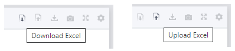

(Please note that the screenshots below have been taken with an AIMMS version prior to 4.89, in which the kebab menu was not present yet).
For example, when clicking the button for downloading to Excel on the following table

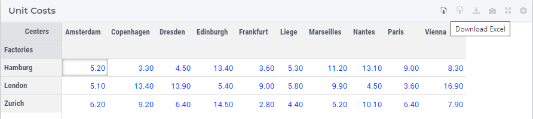

\

its data is downloaded to an Excel workbook (with the same name as the name of the widget):

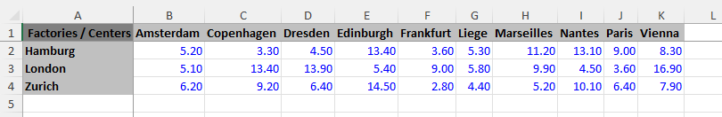

\

Now, if the value in the cell B2 is changed in Excel, for instance, from 5.20 to 15.80 

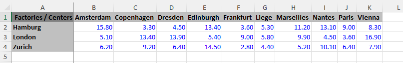

\

and the new contents of the Excel workbook is uploaded to the table

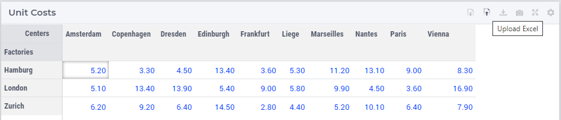

\

then the contents of the table (including the values of the corresponding identifier in the AIMMS model) are updated accordingly:

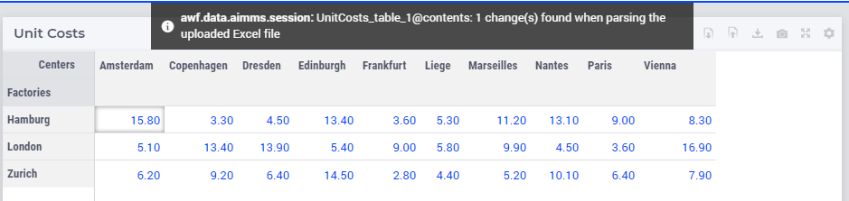

\

Currently the following features are supported:

* The downloaded Excel file is an ‘.xlsx’ file (and not an old-style ‘.xls’ file). The ‘.xlsx’ has some features which AIMMS uses when generating the Excel file, such as the data validation for a range (to show a dropdown for element parameters). You are advised to keep the Excel file (after making some changes) as an ‘.xlsx’ file.
* You are not supposed to change the pivoting in the generated Excel sheet: we assume a constant pivoting in order to be able to read back the changes to the table.
* The styling of the data downloaded to Excel is similar to the one in the WebUI table: editable data is shown in blue, read-only data is shown in black, row and column headers are displayed with a distinct background color. Please note that cells that are read-only in the WebUI table are still editable in your Excel sheet. However, any changes to these cells will not be taken into account during a subsequent upload.
* Calendar data in your model is formatted using an Excel date format based on the granularity of your calendar set. Only AIMMS calendars with granularity 'day', 'hour', 'minute' or 'seconds' are supported.
* Element parameters will show all possible elements in a dropdown list (for now, only for sets with less than 100 elements).
* Numerical values with a binary range will show a 0-1 dropdown list.
* The number of decimals shown in the Excel sheet follows the number of decimals as specified in the WebUI.
* "Sticky" headers: the row and column headers are not subject to scrolling.
* Deleting a row, a column or just a single cell in Excel is interpreted as setting all deleted values to 0 (or the empty string or the empty label).
* You can add a row or column as long as you do not add elements which are not yet in any of the related domain sets (or range set in case of an element parameter). 
* Filters and sorting changes are ignored during the upload: WebUI just looks in the row and column headers (for every cell) to see whether there is a change for that specific tuple.
* Totals which are being displayed in the WebUI table are not shown in the Excel sheet. This is because they are just written as a plain number (instead of a formula), making them not behave like a total when you change data in the Excel sheet anyway. In addition, these totals are (typically) not used as input data.
* After an upload, upon data change on each of the cells, their respective 'Upon Change Procedures' (if any) would be called.
* After an upload, WebUI will report the number of data changes as an INFO message. This is a temporary way of feedback which is likely to be improved in the future.
* In case the uploaded Excel file contains duplicate values for a specific combination of indices, only the last change (when traversing the cells from top-left to bottom-right) will be considered.
* Deleting a value in a cell will reset the corresponding value in AIMMS to its default value (when the corresponding identifier has a default value specified in its declaration).
* When an element text annotation has been specified in the declaration of a set involved in the table contents, then the corresponding element text is taken into account during the upload/download. 

Related to the last point above, also a new predeclared identifier :token:`webui::IdentifierElementText` (ranging over the predeclared set :token:`AllIdentifiers`) has been added to the WebUI library: 

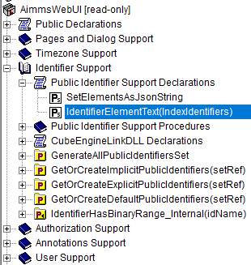

\

This predeclared string parameter can be used to specify some element text for identifiers in your WebUI and it is especially useful for supporting element text while downloading/uploading Excel files from/to a WebUI table 
(the application-specific 'properties' files were not sufficient for this purpose). 
Note that, the translations encountered when parsing the 'properties' files are not automatically used to populate the values of the identifier :token:`webui::IdentifierElementText`.
So, the app developer must assign the desired string values to this predeclared string parameter (for example, by using a procedure) upon the startup of the project.
In that case, the string values available for the :token:`webui::IdentifierElementText` identifier will be used while downloading/uploading Excel files from/to a WebUI table. 

Clearly, the :token:`webui::IdentifierElementText` can be assigned values for all the identifiers in the <IDENTIFIER-SET> specified by the contents of a WebUI table. 
Moreover, it can also be assigned values for the indexes involved in the table contents (here indexes are referred to as elements in the predeclared set :token:`AllIdentifiers`).
This means that also the table headers corresponding to such indexes may be translated by using the values of the :token:`webui::IdentifierElementText`.
It is important to note that the value of :token:`webui::IdentifierElementText` on an index is the one which matters in the context of a table (and not the value of :token:`webui::IdentifierElementText` on the set which is the range of that index).
In particular, this implies that, if a set has two or more indexes, then each of its indexes may get a different name through the string value of :token:`webui::IdentifierElementText` applied on that index.

.. note::

   If a table contains more than one (numerical) identifier and the <IDENTIFIER-SET> index is pivoted to Totals, then the contents of the table may be downloaded, but it cannot be overwritten by an upload, because those (computed) totals have an implicit (runtime) definition in the AIMMS model. 
   Moreover, if a value representing a total had to be distributed among several identifiers values upon upload to the table, it would be rather ambiguous how this was to be done. 
   
.. note::

   If uploading from an Excel file to a WebUI Table results in invalid entries in the WebUI Table (for example, when trying to upload a string value from Excel into a cell in the WebUI Table that expects a numerical value), the first of these errors will be displayed in the WebUI's message banner, together with the total count of errors.
   
   Also, please note that  there is a hard-coded **limit of 128 MB for upload files** in the AIMMS Webserver component! In particular, exceeding this limit will result in an error while attempting to upload an Excel file to a table. 

.. note::

   When you use the :token:`webui::IdentifierElementText` functionality on identifiers that you upload from Excel, please be aware that if you have more than one  identifier mapping to the same element text, things may go wrong. AIMMS scans the Excel sheet and based on the text there tries to determine which AIMMS identifier is involved. Obviously, if the same text maps to more than one AIMMS identifier, it is not clear which of the possible AIMMS identifiers the text is referring to.

.. note::

   Please keep in mind that very large Excel files are not the best way to communicate large amounts of data, because Excel exposes some limitations in this respect. In order to prevent all kinds of Excel related issues when trying to open a generated Excel file, 
   the table feature 'download to Excel' has been restricted to not show more than 65535 dropdown cells (implemented as so-called Excel validations). In addition, in case the number of table cells corresponding to an element parameter or to a binary parameter 
   exceeds 65535, the dropdown cells with just 2 elements will be also skipped, that is, they won't be saved as Excel validations (this in order to favor dropdown cells with more than 2 elements). Dropdown cells with more than 100 elements were 
   already skipped in the initial version of this feature (so, not saved as Excel validations either).

The following aspects are not (yet) supported, but may be subject to further improvements:

• No support for the display of units of measurement (in the downloaded Excel file). Only the plain values (without units) are subject to the download/upload actions.
• There is no dedicated 'procedure upon upload'. The reason for this drawback is that currently the upload changes are applied as if they were a sequence of manual edits. 

.. _ControlCSV:

Controlling the CSV and Excel functionality
-------------------------------------------

Although downloading the Table content as a CSV file or as an Excel file can greatly enhance your end users' workflow, there might also be a risk. If the table widget displays sensitive data, for example, it should not be easy for the end user to download the complete table to a CSV/Excel file. With such a scenario in mind, we introduced the option 'Show Upload/Download Data Controls' (on the 'Miscellaneous' tab) to switch off these possibilities, per table widget.

.. note::

   The 'Show Upload/Download Data Controls' option was introduced in AIMMS 4.88. Since its default value is now Off (whereas before this AIMMS version the controls were always visible by default), this means that if you have table widgets in your existing applications for which you want the user to be able to use this functionality, you should switch the option to On for all these tables. 
	
   Starting from AIMMS 4.89, a global application setting called 'Show Upload/Download Data Controls' was introduced, with which you can override the default for all tables at once. So, if the option on the table level has not been specified, then it will inherit automatically the value of the global application option.

Creating Read-Only Cells
------------------------------------

By using flags (in runtime)
^^^^^^^^^^^^^^^^^^^^^^^^^^^^

In a Table widget, it is possible to make specific cells read-only for the user. You can do this by using an extra string parameter in your model, which has the same name and index domain as the identifier which defines the content of the table, only post-fixed with :token:`_flags`. So, if you have a Table widget showing the content of parameter :token:`MyTableData(i, j)`, you should add a string parameter called :token:`MyTableData_flags(i, j)` in your model. In order to actually make some cells read-only, you have to set the value of the right index combination(s) to :token:`"readonly"`. So, in our example, you should add a line like:

.. code::

    MyTableData_flags(i, 'some_value_for_j') := "readonly";

After doing so, the affected cells in your Table widget will be displayed (in the default WebUI theme) in black, indicating that they cannot be edited. All the other cells are in the default (blue) color.

In case you want to change a cell to become editable again, you have to assign the empty string to the corresponding flags-identifier. So, to undo the effect of the above statement, you should execute the following code:

.. code::

    MyTableData_flags(i, 'some_value_for_j') := "";

By using the :any:`CurrentInputs` set (in runtime)
^^^^^^^^^^^^^^^^^^^^^^^^^^^^^^^^^^^^^^^^^^^^^^^^^^^^

Another way to influence the modifiability of cells, is to use the :any:`CurrentInputs` set of AIMMS. This set is a predeclared subset of :any:`AllIdentifiers`. The identifiers referenced in it are modifiable sets and parameters in both the WinUI and the WebUI. Consider a parameter :token:`P`. Without further specification, this parameter is a parameter that can be modified both in the WinUI and in the WebUI. By removing this element :token:`'P'` from :any:`CurrentInputs`, the parameter :token:`P` will no longer be modifiable in either the WinUI or the WebUI.

.. code::

    CurrentInputs := CurrentInputs - 'MyTableData';
    
By using the WebUI authorization (not in runtime)
^^^^^^^^^^^^^^^^^^^^^^^^^^^^^^^^^^^^^^^^^^^^^^^^^^

You may use the Authorization support from the WebUI Library described in :doc:`../webui/creating`. 
Please mind this authorization is not updated at WebUI runtime. Thus, the following code should be part of the `PostMainInitialization` predeclared procedure or the Startup Procedure ( :menuselection:`Settings===>Project Options===> Startup & authorization` ). 

.. code::
    
    ! Turns MyTableData identifier read-only
    webui::IdentifierAuthorization('MyTableData') := 4;

Authorization Schema reminder:

+--------------------------+-------+-----------------------------------------------------------------------------------------------------------------------------------------------------------------------------------------------------------------------------------+
| Identifier Authorization | Value | Description                                                                                                                                                                                                                       |
+==========================+=======+===================================================================================================================================================================================================================================+
| no access                | 0     | No data will be shown in the WebUI, even if the identifier is specified in a widget in the WebUI. Procedures will not be executed                                                                                                 |
+--------------------------+-------+-----------------------------------------------------------------------------------------------------------------------------------------------------------------------------------------------------------------------------------+
| read access              | 4     | Data will be displayed in the WebUI, but will be shown as read-only data. Data changes via the WebUI are prohibited. Procedures will not be executed.                                                                             |
+--------------------------+-------+-----------------------------------------------------------------------------------------------------------------------------------------------------------------------------------------------------------------------------------+
| read and execute access  | 5     | Data will be displayed in the WebUI, but will be shown as read-only data. Data changes via the WebUI are prohibited. Procedures with this permission can be executed from within the WebUI.                                       |
+--------------------------+-------+-----------------------------------------------------------------------------------------------------------------------------------------------------------------------------------------------------------------------------------+
| read and write access    | 6     | Data will be displayed in the WebUI, and are displayed as editable if no other restrictions prohibit editing the data (e.g. defined identifiers). Data changes via the WebUI are not prohibited. Procedures will not be executed. |
+--------------------------+-------+-----------------------------------------------------------------------------------------------------------------------------------------------------------------------------------------------------------------------------------+
| full access              | 7     | Data will be displayed in the WebUI, and are displayed as editable if no other restrictions prohibit editing the data (e.g. defined identifiers). Procedures with this permission can be executed from within the WebUI.          |
+--------------------------+-------+-----------------------------------------------------------------------------------------------------------------------------------------------------------------------------------------------------------------------------------+

Data Filtering on the Table
---------------------------

.. note::

  Filters are readily available for the table and there is no need to create a specification or configuration in the model. This is an end-user tool.

  Filtering is available on tables that are added to Regular pages and Side Panel pages. It is currently not possible to add filter rules to tables added to Dialog pages. 

When working with tables you could be looking at a lot of data. It can be difficult to find information quickly in such cases. Filters can be used to narrow down the data in your table, allowing you to view only the information you need.

Filters are useful when you want to focus only on specific information in a large dataset in a table. Filtering doesn't remove or modify data, it just changes which records appear on your widget. Filtering lets you temporarily hide unwanted data.

To add filter rules
^^^^^^^^^^^^^^^^^^^

#. In order for filtering to work correctly, your table should include at least one row and column header, which is used to identify the name of each column and row. In the example, the table columns and rows can be identified by the headers Centers and Factories respectively.

    .. image:: images/TableFilters_Example.png
        :align: center

#. A drop-down arrow will appear in the header cell for each column/row. Click the drop-down arrow for the column/row you want to filter and click on the "Add Filters Rule" option. In our example, we will filter the column "Copenhagen".

    .. image:: images/TableFilters_AddFilter.png
        :align: center

#. The Filter dialog will appear, where you can select the desired operator and enter the value. We will filter for values greater than 9.

    .. image:: images/TableFilters_SelectOperator.png
        :align: center
    
    .. image:: images/TableFilters_AddRule.png
        :align: center

    You can also find an operator by typing it in the dropdown field. For example, to see operators that have “greater” just type the word or the mathematical symbol in the field.

    .. image:: images/TableFilters_SearchRule.png
        :align: center

#. Click on "Apply" or "Apply and Close".

    .. image:: images/TableFilters_ApplyRule.png
        :align: center

    The Apply button will apply the rule and the dialog will stay open, allowing you to e.g. add another rule. The data will be filtered and visible on the table, as illustrated above.  
    
    The Apply and Close button will apply the rule and close the dialog as well.

#. The data will be filtered, temporarily hiding any content that doesn't match the criteria. In our example, only 2 values greater than 9 are visible.

    .. image:: images/TableFilters_ApplyRule.png
        :align: center

#. The column will have an indication |filtered-icon| that a filter has been applied. The header cell will also be highlighted with a different color.

    .. image:: images/TableFilters_Filtered.png
        :align: center

    The table header also show an indication |table-filtered| that a filter has been applied to the table.

#. To apply multiple rules follow the instructions again. The below illustration shows another filter applied to the row header cell "London" for values lesser than 10.

    .. image:: images/TableFilters_TwoFilters.png
        :align: center

    You can also add multiple rules for the same column or row. When two or more rules are added to the same column or row, the data for that respective column or row will display data that meets all rules combined (logical AND condition).

New rules are added to the bottom of the list of rules in the dialog. You can reorder these rules by dragging and dropping the rules in the desired order. 

The below illustration shows the effect of reordering rules. We applied two rules, the first rule to the row "Zurich" and the second to the row "Hamburg".

    .. image:: images/TableFilters_FilterOrder1.png
        :align: center

    .. image:: images/TableFilters_FilterOrder1_Result.png
        :align: center

The data shows five columns that meet the applied rules. When we reorder the second rule to the top it results in different data resulting in only four columns.

    .. image:: images/TableFilters_FilterOrder2.png
        :align: center

    .. image:: images/TableFilters_FilterOrder2_Result.png
        :align: center

You can edit values and use the table normally after the data is filtered. If you change a value for a filtered column or row, the data might change based on the filter rules set.

.. note:: When filtering data on columns and rows, select either a numeric or string operator based on the data in the column/row. If the data is numeric use one of the numeric operators and if the data is alphanumeric use one of the string operators. When an element parameter is added to the table, the data will be treated either as numeric or alphanumeric. It is currently not possible to select elements while adding a filter rule the way it can be done when filtering headers, which is explained in the below section. 

To add filter rules to columns/row headers
^^^^^^^^^^^^^^^^^^^^^^^^^^^^^^^^^^^^^^^^^^

Similarly, you can also add filters to the column or row headers. For headers, only five :ref:`string operators <string-operators>` are available; "is", "is not", "contains", "does not contain" and ":ref:`matches regex<RegExp>`".

The "is" and "is not" operators allow you to select one or more elements from the dropdown list. In our example, we will filter the row header "Centers". Here we select 2 elements: Copenhagen and Frankfurt. 

    .. image:: images/TableFilters_FilterHeaderAdd.png
        :align: center

    .. image:: images/TableFilters_FilterHeaderDialog.png
        :align: center

    .. image:: images/TableFilters_FilterHeaderSelect1.png
        :align: center

    .. image:: images/TableFilters_FilterHeaderSelect2.png
        :align: center

    .. image:: images/TableFilters_FilterHeader_Result.png
        :align: center

The same visual indications are seen when the filters are applied as explained in the above steps.

To add filter rules to the identifier header
^^^^^^^^^^^^^^^^^^^^^^^^^^^^^^^^^^^^^^^^^^^^

A special case of this columns/row header filtering is the filtering on the Identifier header. It works exactly the same and it allows you to filter on which actual identifiers are displayed in the table. Please note that this identifier filtering works from AIMMS 4.94 onwards.

You can also remove selected elements by either clicking on the "x" on each individual element, or remove the complete selection by clicking the "X" in the selection box, as illustrated below.

    .. image:: images/TableFilters_FilterHeaderRemove1.png
        :align: center

    .. image:: images/TableFilters_FilterHeaderRemoveAll.png
        :align: center

To edit filter rules
^^^^^^^^^^^^^^^^^^^^

#. Click on the filter icon on the table header |table-filtered| to open the filter dialog. You can also choose to open the dialog by clicking on the drop-down and the clicking on the "Add Filters Rule" option.

    .. image:: images/TableFilters_EditFilter.png
        :align: center

#. Change the desired rule and click Apply or Apply and Close. In our example, we will change the value for the first rule from 9 to 10.

    .. image:: images/TableFilters_EditFirstFilter.png
        :align: center

    .. image:: images/TableFilters_EditFirstFilterResult.png
        :align: center

    You can change multiple rules consecutively and then click either action button. 

To clear filter rules
^^^^^^^^^^^^^^^^^^^^^

#. Click on the filter icon on the table header |table-filtered| to open the filter dialog. You can also choose to open the dialog by clicking on the drop-down and the clicking on the "Add Filters Rule" option.

    .. image:: images/TableFilters_EditFilter.png
        :align: center

#. Click on the delete icon |delete-filter-icon| for the respective rule and either Apply or Apply and Close the dialog. In our example, we will delete the rule applied to the column header cell "Copenhagen".

      .. image:: images/TableFilters_DeletedFilter.png
        :align: center

#. If you do not want to delete the rule and just want to disable it, click on the enable/disable rule switch |disable-rule|, and click either action button. 

    .. image:: images/TableFilters_DisabledFilter.png
        :align: center

    When a rule is disabled it will remain in the filter dialog but will not be applied. The disable rule option is useful when the applied filters result is an empty table. You can disable certain rules and check the results.

#. In either case, deleting or disabling a rule, the data will be filtered only on enabled rules. In our example, the rule on the row header cell "London" is applicable. The indication for the deleted or disabled rule will also be removed.

    .. image:: images/TableFilters_DisabledFilterResult.png
        :align: center

#. To clear all filter rules, click "Clear All Filters". This will clear all enabled and disabled rules and close the dialog, resulting in the original data on the table. 

Operators
^^^^^^^^^

The operators provided are specific to numeric and string/element valued data. The below tables explains each of the operators.

+-----------------------------------+-------------------------------------------------------------------------------------------+
| Numeric Operators                 | Result                                                                                    |
+===================================+===========================================================================================+
| is equal to (=)                   | All data that is equal to the entered value is displayed.                                 |
+-----------------------------------+-------------------------------------------------------------------------------------------+
| is not equal to (!=)              | All data except the entered value is displayed.                                           |
+-----------------------------------+-------------------------------------------------------------------------------------------+
| is less than (<)                  | All data that is lesser than the entered value is displayed                               |
+-----------------------------------+-------------------------------------------------------------------------------------------+
| is less than or equal to (<=)     | All data that is lesser than or equal to the entered value is displayed                   |
+-----------------------------------+-------------------------------------------------------------------------------------------+
| is greater than (>)               | All data that is greater than the entered value is displayed                              |
+-----------------------------------+-------------------------------------------------------------------------------------------+
| is greater than or equal to (>=)  | All data that is greater than or equal to the entered value is displayed                  |
+-----------------------------------+-------------------------------------------------------------------------------------------+
| is in between                     | All data that is in between the range of and equal to the two entered values are displayed|
+-----------------------------------+-------------------------------------------------------------------------------------------+
| is not in between                 | All data that is outside the range of the two entered values are displayed                |
+-----------------------------------+-------------------------------------------------------------------------------------------+
| show top                          | Displays the highest N values in descending order. N is the value entered.                |
+-----------------------------------+-------------------------------------------------------------------------------------------+
| show bottom                       | Displays the lowest N values in ascending order. N is the value entered.                  |
+-----------------------------------+-------------------------------------------------------------------------------------------+

When adding rules to numeric operators, characters cannot be entered. The field accepts only numeric values.

.. note ::
    When ``show top`` or ``show bottom`` operators are used on a column/row, since the data is already sorted, sorting on other columns/rows will not be available. 

    The ``is equal to (=)`` and ``is not equal to (!=)`` filters data that is displayed in the table. The other operators will filter data on the actual stored data which may vary in the number of decimals.

.. _string-operators:

+------------------------------+-------------------------------------------------------------------------------------------+
| String/Elt Operators         | Result                                                                                    |
+==============================+===========================================================================================+
| contains                     | All data that contains the entered characters are displayed                               |
+------------------------------+-------------------------------------------------------------------------------------------+
| does not contain             | All data except the strings that contain the entered characters are displayed             |
+------------------------------+-------------------------------------------------------------------------------------------+
| is                           | All data that is an exact match to the entered characters are displayed                   |
+------------------------------+-------------------------------------------------------------------------------------------+
| is not                       |All data except the strings that are an exact match to the entered characters are displayed|
+------------------------------+-------------------------------------------------------------------------------------------+
| starts with                  | All data that start with the entered characters are displayed                             |
+------------------------------+-------------------------------------------------------------------------------------------+
| ends with                    | All data that end with the entered characters are displayed                               |
+------------------------------+-------------------------------------------------------------------------------------------+
| matches regex                | All data that match the specified regular expression are displayed (see below)            |
+------------------------------+-------------------------------------------------------------------------------------------+

.. _RegExp:

Regular Expressions
^^^^^^^^^^^^^^^^^^^

The last String/Elt Operator mentioned in the tables above ('matches regex') needs some more explanation. It allows you to use regular expressions in your filtering, providing additional flexibility over the other String/Elt Operators. The regular expressions that are accepted are those that are accepted in all search boxes in the WebUI. For details and examples on which expression you can use and on how to use them, please refer to the `documentation of the search boxes <widget-manager.html#using-the-search-boxes>`_.

.. note ::
    Please note that the 'contains', the 'does not contain' and the 'regex' filters do not take into account any translations that are applied through a .properties file. Using the webui::IdentifierElementText translation mechanism instead, these filters work as expected.

Best Practices
^^^^^^^^^^^^^^

#. When using the range operator, i.e. "in between" or "not in between", for decimal values, you might want to input values that have a small variance.  

#. To apply a filter rule on data that are dates, we advise the use of the string operators. The dates are stored in string format in AIMMS.

#. If filter rules are applied and the data in the table changes based on other interactions, please be aware that the filters will still be applied. 

#. When filters are applied and if you add/remove content, change the widget type, change the slicing information or change the pivot the applied filters will be cleared. This will be possible only if you have access to the widget settings.  

.. Important::
    When using aggregators like mean and count, please be aware the WebUI may display different results depending on whether filters are applied or not. When no filters are applied, these aggregators are computed by the AIMMS engine which does not take into account whether columns/rows are visible in the WebUI. In such a case the results may be different than what an end-user might expect because they may assume that the aggregators may be computed using the visible columns/rows only.

    When filters are applied, the aggregators are computed using only the columns/rows that are displayed using the current set of filters, which may lead to a different set of results even when the filters do not change the content of the filtered/non-filtered table.
    
    To prevent any confusion with your end-users when using aggregators like mean and count, you are therefore advised to use a display domain that will make sure that any columns/rows included in the aggregator computations will also be visible on the screen.

Date and Time picker for Calendar elements
------------------------------------------

.. Important:: 
    The Date and Time picker is available in software versions from AIMMS 4.77 onwards.

A Date and Time picker is displayed to select a date and time when a `Calendar <https://how-to.aimms.com/Articles/189/189-using-calendars-in-aimms.html>`_ is referenced in a table. A calendar icon appears in the cell, on hover, that represent `Calendar <https://how-to.aimms.com/Articles/189/189-using-calendars-in-aimms.html>`_ elements and the picker is displayed by either clicking the calendar icon or double clicking on the cell.

.. Image:: images/DateTime_CalendarDefault.png
    :align: center

.. Image:: images/DateTime_CalendarIcon.png
    :align: center

The Date and Time picker makes it easy to differentiate between dates and to maintain a reference. The current date is displayed with a bold blue colour so the users can identify the current date easily. The selected date is highlighted with a blue background. Based on the calendar range, the date picker allows the user to select dates only from the range. Inactive dates are greyed out and cannot be selected. The date and time picker also has the option to select the current date and time by clicking on the "Today" button. The user can also clear the date by clicking the "Clear Date" button. The week numbers are also displayed for users who reference weeks by the week number.

.. Image:: images/DateTime_CalendarRanges.png
    :align: center

When the user selects a certain date, the picker automatically switches to the time picker. The user can also toggle between dates, months and years by clicking on the blue bar of the picker. The users can also change months or years by clicking on the arrows when on the respective selections.

.. Image:: images/DateTime_ToggleDMY.png
    :align: center

As mentioned above, the date picker allows selection of dates only in the range of the defined calendar. Although the actual time ranges are not confined when the time selection is made by the user, if a time is selected that might fall outside the range set in the calendar, an error "Selected Date/Time is outside of allowed range" will be displayed.

For example, if the calendar range is set from ``2019-10-07 06:00`` to ``2019-10-07 20:00``, and the user selects ``2019-10-07 21:00``, the error message "Selected Date/Time is outside of allowed range" will be displayed and the date will be set either to the previous value or left blank.

There are different combinations of the date and time picker which are controlled by the Unit property defined in the calendar.

+------------------------+-----------------------------------------------------------------------------------------------------------------------------+
| Calendar Unit          | Date and Time picker option                                                                                                 |
+========================+=============================================================================================================================+
| Century, Year          | The user is given the option to only select the year.                                                                       |
+------------------------+-----------------------------------------------------------------------------------------------------------------------------+
| Month                  | The user can select a year and the corresponding month.                                                                     |
+------------------------+-----------------------------------------------------------------------------------------------------------------------------+
| Day                    | The user can select a year, the corresponding month and date.                                                               |
+------------------------+-----------------------------------------------------------------------------------------------------------------------------+
| Hour                   | After selecting the date, the time picker is displayed where the user can select the hour.                                  |
+------------------------+-----------------------------------------------------------------------------------------------------------------------------+
| Minutes                | The user can select up-to the minute.                                                                                       |
+------------------------+-----------------------------------------------------------------------------------------------------------------------------+
| Second, Tick           | The user still gets the option to select up-to the minute. Selecting seconds and ticks is not possible at the moment.       |
+------------------------+-----------------------------------------------------------------------------------------------------------------------------+

When the Unit is set to Century, Year, Month or Day, the time picker is not displayed.

.. spelling:word-list::

    IdentifierElementText