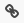
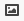
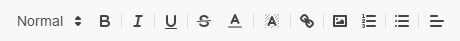
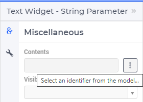
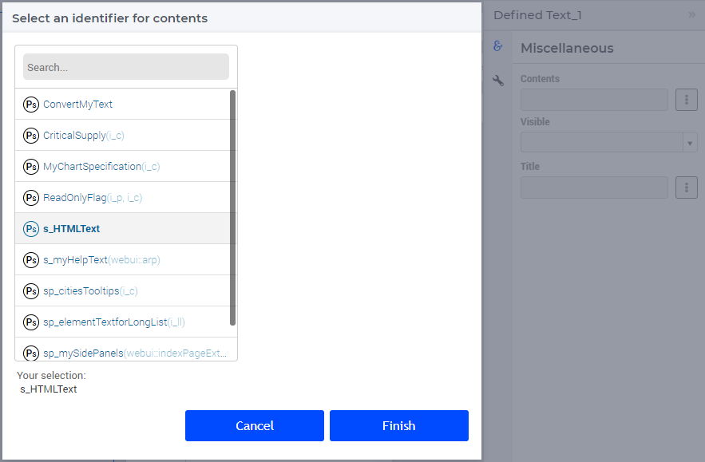
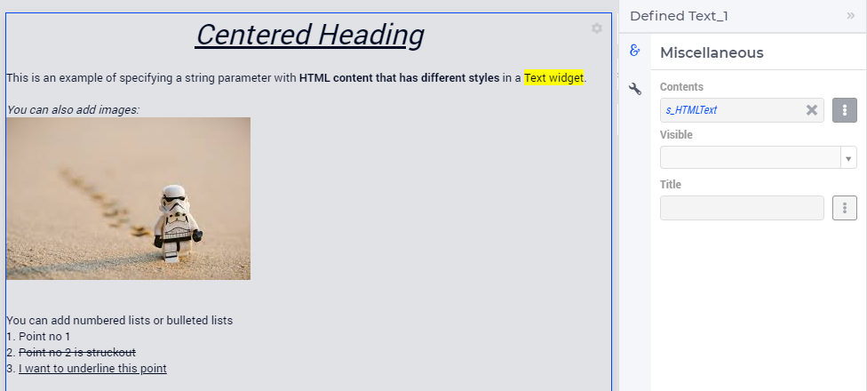
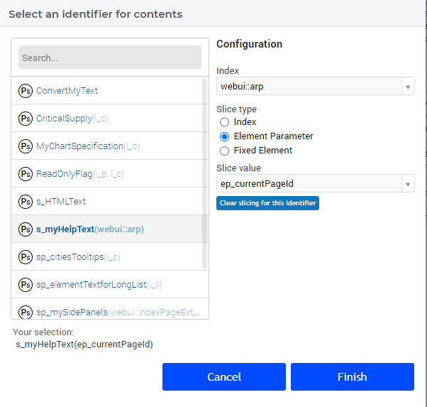
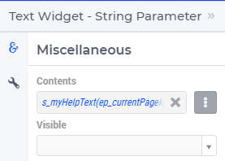
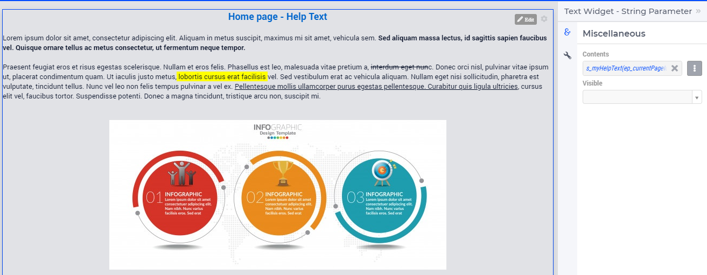
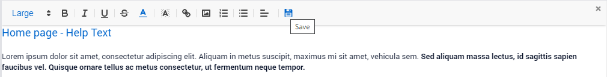

Text Widget
===========

With the Text Widget, you can show text in the WebUI, style it, insert images in between and around it and let the text or images link to other pages, both internal and external.

An example of what a text widget could look like can be seen below.

.. image:: images/text-widget-example.png
    :align: center

Widget menu
--------------

When in edit mode, the text widget’s menu looks as follows:

From left to right, the buttons can be used to change font size, to make text bold, italic, underlined, strikethrough and/or colored, to change the background color of a piece of text, to create links, to insert images, to create lists and bullet points and to change text alignment.

Inserting images
------------------------

Firstly, the image must be placed into the *WebUI*/*resources*/*images* `sub-folder <webui-folder.html#resouces#images>`_ of your *MainProject* directory. To insert an image, click on the ‘Image’ button |image-button| and copy the complete image name (including the image type/file extension) into the box that pops up. If done correctly, you should be able to see a preview of the image. Then click ‘Insert’ to insert the image into the text box. 

.. note:: Please keep in mind that on Linux the casing of the image files should be correct, otherwise your images will not display. Also, please remember to specify the full name of the image, including the filename extension (like .jpg, .png etc). In particular, this is important to keep in mind in case your Windows Explorer is set to hide file extensions.

Creating links
---------------------

In a Text Widget it is possible to add links to internal pages or to external URL pages.

To create a link within a text widget, select the part of the text or an image you want to make a link out of and press the ‘Link’ |link-button| button. 

For creating a link to another (internal) page within your WebUI app, type ‘/[AIMMS project name]/[Page name]’ (for example '/Text App/Welcome Page', if you want to link to a page named 'Welcome Page' inside an app called 'Text App') into the box that pops up and click ‘Done’. 

If you want to create a link to an external URL page, simply paste the external page’s URL into the box.

Since AIMMS 4.90, it is also possible to provide 'mailto:' links. Proceed as above, but instead of a URL simply specify 'mailto:person@organization.xx'. You can also specify more details, by extending this to, for example, 'mailto:person@organization.xx?subject=test&body=test'. By clicking on such a link, your default mail program will open with an e-mail pre-filled according to your link parameters.

To change or remove a link, move your cursor to the left or right of the link and follow the menu that pops up.

Lastly, to exit the text widget's editing mode, click the |exit-button| in the top right of the text box.

Specifying a string parameter in Contents
------------------------------------------

.. important:: String parameter in contents is available in software versions from AIMMS 4.79 onwards.

You can specify a string parameter in the contents to display text that changes based on either the current page or some other condition. This is very similar to specifying a string parameter in a scalar widget with the multi-line option, but with the advantage of using HTML content. This allows you to style the text, add images, hyperlinks, and a lot of other options that come with HTML formatting.

.. Note ::
    
    The text widget is a rich text editor and does not support the complete list of tags or styles that an HTML document would provide. For example, the text widget does not support the ``<table>`` tag, meaning you cannot add tables to the HTML you wish to include in the text widget. The rich text editor will support any text formatting and some basic HTML styles.

You can add a string parameter by opening the Identifier Selector by clicking the button next to the contents field and selecting the identifier you want to specify as the contents.

Specifying the string parameter ``s_HTMLText`` with the below data,

.. code ::
    
    "
<u><i>Centered Heading</i></u>

 
"
    "
This is an example of specifying a string parameter with <b>HTML content that has different styles </b>in a"
    "Text widget.&nbsp;

 

<i>You can also add images:</i>
"
    "

 

 
"
    "
You can add numbered lists or bulleted lists
<ol><li>Point no 1</li><li><s>Point no 2 is struckout</s></li>"
    "<li><u>I want to underline this point</u></li></ol>" ;

The Text widget supports a scalar string or a scalar slice of an indexed string parameter, as illustrated below. The string parameter ``s_myHelpText(webui::arp)`` is sliced over the element parameter ``ep_currentPageId`` ranged over the ``webui::AllPageIds``.

You can edit the contents of the string parameter by clicking on the edit button. After making the edits either click on the ``Save and Close`` "x" icon, or click the save icon.

When you have added content as a "Definition" to the string parameter, you will not be able to edit the content in the WebUI. The Edit button will be disabled.

.. Note ::
    
    When reading from a file or adding HTML content to the string parameter ensure that the quotes used in style tags are escaped e.g., ``\"``.

    When reading from a file and defining content for the string parameter, we strongly recommend you set ``NoSave`` to the ``Property`` attribute. This will ensure that the text is not stored in the case files, which would unnecessarily increase the size of the case file.

.. spelling:word-list::

    mailto