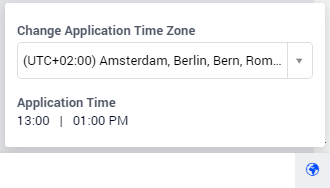
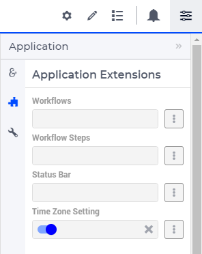
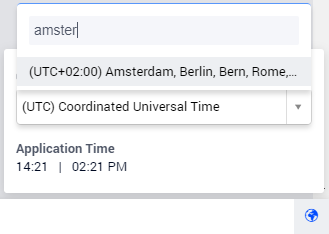
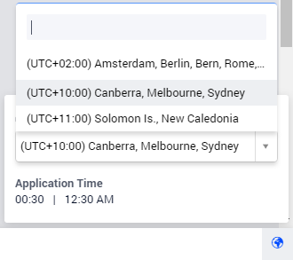
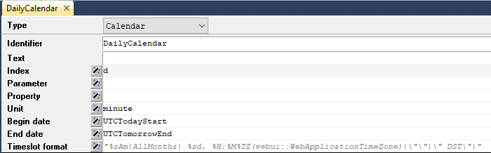

Time Zone Settings
==================

.. important:: Time Zone settings is available in software versions from AIMMS 4.75 onwards as part of Experimental Features. Please reach out to User Support on how to enable Experimental Features.

Applications are accessed across the globe. Users in different time zones find it difficult to convert times when the application is set in a different time zone. AIMMS has the flexibility to configure multi-user time zone applications. Time Zone Settings allows users to change the application time zone to their desired time zone. The data, configured to listen to the application time, changes as per the set time zone. This makes it very easy for users to read time across different time zones, and also set data using different time zones, not worrying about the conversion.

Users can change the application time zone in the Time Zone Panel, that is displayed when the globe icon on the right bottom corner is clicked.

To activate the Time Zone Panel, toggle the switch for the "Time Zone Setting" option in the Application Settings under Application Extensions.

To create a multi-timezone application, the Timezone Support section has been added to the AIMMS WebUI Library. The next few sections describe some of the sets, identifiers, and procedures which you need to know and which will help you when building your multi-timezone application.

webui::DisplayTimeZones Set
+++++++++++++++++++++++++++

The dropdown in the time zone panel gets the values from the ``webui::DisplayTimeZones`` set. This set contains all the time zones available in AIMMS that are displayed with the UTC offset and region. This makes it easy for the user to identify and select the desired time zone. The user can also search for a time zone by typing the city name:

The ``webui::DisplayTimeZones`` set can also be initialized to hold specific time zones from the ``webui::AllTimeZones`` set. For example, when the ``webui::DisplayTimeZones`` set is initialized with three time zones, such as the following:

``W. Europe Standard Time, Central Pacific Standard Time, AUS  Eastern Standard Time``, 

then the users will see only those three options in the list:

webui::DisplayTimeZone
++++++++++++++++++++++

``webui::DisplayTimeZone`` is an element parameter ranged over the ``webui::DisplayTimeZones`` set. This element parameter holds the value of the selected application time zone in the time zone panel.

By default, ``webui::DisplayTimeZone`` does not hold any value. ``webui::DisplayTimeZone`` can also be initialized when the application is loaded. The application time zone will be set to the time zone that has been initialized. When the user changes the application time zone from the time zone panel, the corresponding value is set to ``webui::DisplayTimeZone``.

webui::WebApplicationTimeZone
+++++++++++++++++++++++++++++

``webui::WebApplicationTimeZone`` is an element parameter ranged over ``webui::AllTimeZones`` that is used in the model when configuring a calendar. ``webui::WebApplicationTimeZone`` should be used in defining the Timeslot format for a calendar, as illustrated below.

``webui::WebApplicationTimeZone`` is set to the value selected in the time zone panel, i.e the value of ``webui::DisplayTimeZone``. If the application time zone is not initialized or fails to be set, the ``webui::WebApplicationTimeZone`` is set to the time zone that the application is hosted on, typically UTC. 

When ``webui::WebApplicationTimeZone`` is used in the display formats, the date and time change according to the time zone that is selected in the time zone panel. 

webui::IgnoreDST
++++++++++++++++

``webui::IgnoreDST`` is a binary parameter used to decide whether daylight savings time should be considered or not. By default ``webui::IgnoreDST`` is set to 0, which infers that the application will consider daylight saving time. If the value is set to 1, the application will not consider daylight saving time. 

If you want to display "DST" at the end of the date and/or time based on daylight saving time and value of ``webui::IgnoreDST``, create a string parameter that decides the format based on ``webui::IgnoreDST`` and assign it to the Timeslot format, as illustrated below:

.. code:: 

    StringParameter MyTimeFormat {
    Definition: {
        if webui::IgnoreDST then
            "%c%y-%m-%d %H:%M %TZ(webui::WebApplicationTimeZone)"
        else
            "%c%y-%m-%d %H:%M %TZ(webui::WebApplicationTimeZone) |\"\"|\" DST\"|"
        endif;
        }
    }

webui::ApplicationHourlyTimeSlotFormat and webui::ApplicationMinuteTimeSlotFormat
+++++++++++++++++++++++++++++++++++++++++++++++++++++++++++++++++++++++++++++++++

``webui::ApplicationHourlyTimeSlotFormat`` and ``webui::ApplicationMinuteTimeSlotFormat`` are string parameters already defined in the AIMMS WebUI library that can be used in the Timeslot format for calendar. These can be used as references to create custom formats as well.

``webui::ApplicationHourlyTimeSlotFormat`` is defined as follows (and the resulting format is displayed up to the hour): 

.. code:: 

    if webui::IgnoreDST then
        "%c%y-%m-%d %H %TZ(webui::WebApplicationTimeZone)"
    else
        "%c%y-%m-%d %H %TZ(webui::WebApplicationTimeZone)|\"\"|\" DST\"|"
    endif;

``webui::ApplicationMinuteTimeSlotFormat`` is define as follows (and the resulting format is displayed up to the minute): 

.. code:: 

    if webui::IgnoreDST then
        "%c%y-%m-%d %H:%M %TZ(webui::WebApplicationTimeZone)"
    else
        "%c%y-%m-%d %H:%M %TZ(webui::WebApplicationTimeZone)|\"\"|\" DST\"|"
    endif;

webui::TimeZoneChangeHook
+++++++++++++++++++++++++

``webui::TimeZoneChangeHook`` is an element parameter that is ranged over ``AllProcedures``. This can be used to invoke any procedure when ``webui::DisplayTimeZone`` or ``webui::IgnoreDST`` is changed.

Configuring Calendars with webui::WebApplicationTimeZone 
++++++++++++++++++++++++++++++++++++++++++++++++++++++++

When using a calendar, the data in the calendar are set in the 'Local' time zone, typically where the application is hosted. When configuring multi-user time zone applications, the Timeslot format for the calendar should contain ``%TZ (webui::WebApplicationTimeZone)`` with the specified format, as defined below: 

.. code:: 
    
    "%c%y-%m-%d %H:%M %TZ(webui::WebApplicationTimeZone)"

In the WebUI, the values for the calendar will be displayed in the corresponding Application Time Zone selected in the Time Zone Panel. These values will change each the time zone is changed as well. Users can then choose their desired time zone to either view or set the data. When the data is set, the value is automatically converted and stored to the corresponding value in AIMMS.

Best Practices and Working Example 
++++++++++++++++++++++++++++++++++

When designing a multi-timezone application we recommend following some best practices which can make it consistent and easier to use. Below are some best practices we would advise:

#. Create conventions in your model that cater to different aspects; Model, WebUI and Database:

    - Model Convention - Used as the convention in the AIMMS model.
    - Database Convention - Used as the convention for the databases.
    - WebUI Convention - Used as the convention to display values in the WebUI.

#. Specify the Model Convention for the main model.

#. Ensure that the ``webui::ApplicationConvention`` is initialized to the right convention, preferably to the WebUI Convention.

#. Try to use UTC as the base timezone for your application and initialize ``webui::ModelTimeZone:='UTC'`` as well.

#. Set the ``Use UTC for case and start end date`` option in the Project options to "On", see here:
   
    .. image:: images/TimeZone_ProjectOptionsUTC.png
        :align: center
        :scale: 75

#. When defining the attributes for the calendar, please use a 15-minute granularity or a minute granularity since you will have time zones which will be +15, +30 or +45 minutes away from their offsets. For example, ``Indian standard Time`` has the offset UTC+5:30.

#. In the database, when representing a field as a date, please assign the datatype as datetime.

#. Use the DST format in the timeformat for the conventions in order to indicate daylight saving time in the WebUI. For example: 

``"%c%y-%m-%d %H:%M %TZ(webui::WebApplicationTimeZone)|\"\"|\" DST\"|"``

#. When using a Gantt chart, the string parameters specified for the reference time and the start and end time of the viewport need to be converted to the ``webui::WebApplicationTimeZone`` by using the ``ConvertReferenceDate`` function.

Please refer to this section "Multi-Timezone application with best practices" [Link to the "How To" topic] for detailed explanation on how to implement the best practices and a working example. 