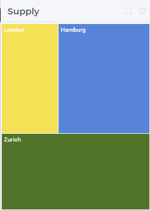
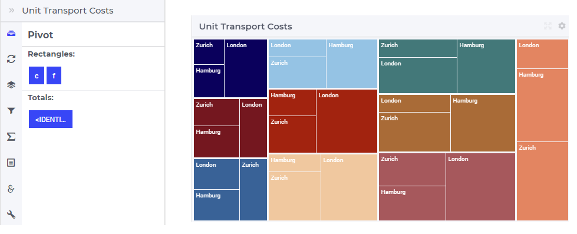
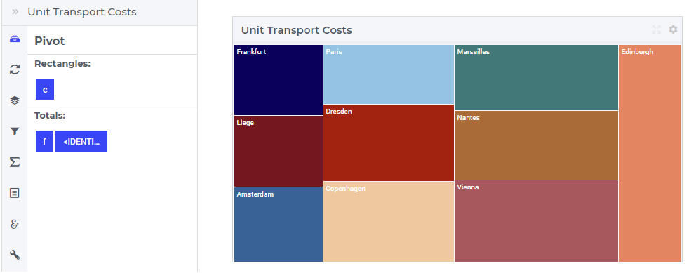
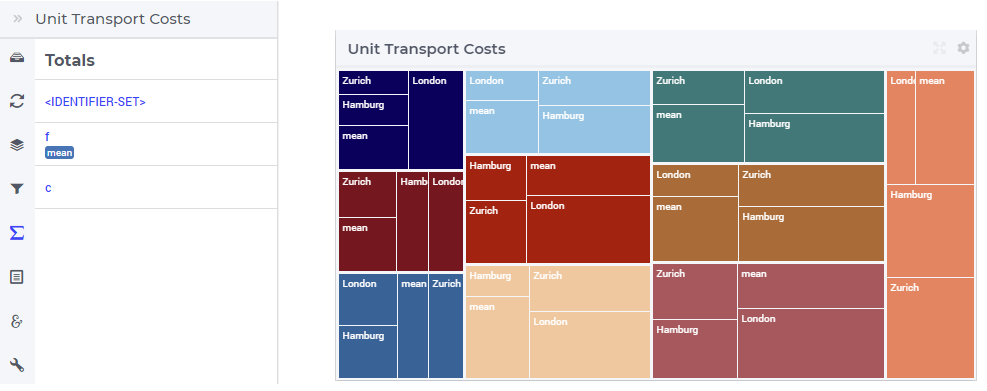
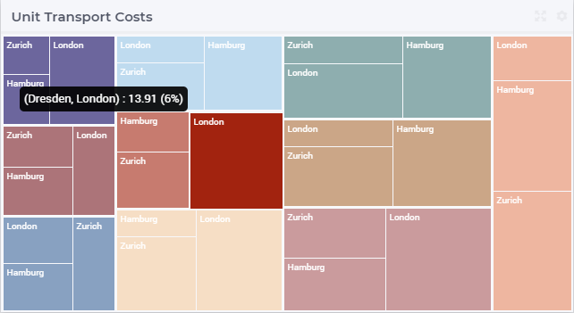
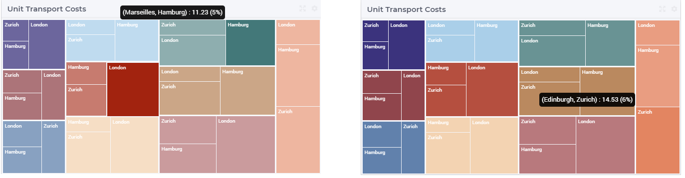

Tree Map Widget
---------------

The Tree Map widget represents data as rectangles filling the surface of the widget. A simple situation is when a 1-dimensional identifier such as the Supply(f) of a factory f in the TransNet application 
(see the "Quick Start: My First WebUI" section) is displayed like in the following picture:

More generally, a tree map widget offers the possibility to display multi-dimensional data in your model by displaying a rectangle for each data point. 
The area of a rectangle provides information about the value of the correspoding data point. 
For example, in the TransNet application, the unit transport costs for every combination (factory, center) may be represented using a tree map widget 
like illustrated in more details in the sequel. More specifically, we discuss and illustrate below one-by-one the tabs in the tree map's options editor 
which may be accessed through the Settings wheel.

Contents and Pivoting
+++++++++++++++++++++

In order to determine the information to be rendered by a tree map, one has to specify first the data identifier(s) in the Contents tab of the widget's options editor, which works in the same way 
as for other widgets, eg. the same way as for the bar chart widget.
	
Next, in the Pivot tab of the options editor, one can specify how the data dimensions are to be organized in the chart. 
For example, if both the center index c and the factory index f are specified in the X-axis section (in this order, first c then f) and the <IDENTIFIER-SET> in the Totals section 
then the resulting bar chart looks like in the picture below on the right:

So, in this case, for every center c the map shows a larger rectangle divided in 3 sub-rectangles, one for each factory. 

One may move some data indexes in the Totals section of the Pivot tab. In our example, moving the center index f to the Totals section results in the following pie chart view:

So, now for every center c there is only one rectagle in the chart representing the total transport to this center from all factories.
	
Change Type
+++++++++++

In the Change Type tab of the widget's options editor, one can switch from the tree map type to some other representation type. 
This functionality works in the same way as for other widgets, eg. the same way as for the bar chart widget.

Totals
++++++

In the Totals tab of the widget's options editor, aggregated values such as sum, mean, count, min, or max computed over one of the data indexes my be added to the map. 
For example, when we add the mean over the factories f to our example tree map, then each center rectangle shows one additional sub-rectangle representing the mean value
of the other three sub-rectangles for factories:

Identifier Settings
+++++++++++++++++++

In the Identifier Settings tab of the widget's options editor, one can apply a display domain or some slicing to the data identifier(s).

These functionalities work in the same way as for other widgets, eg. the same way as for the bar chart widget.

Hover and Select
++++++++++++++++

In the tree map one may select one rectangle by clicking on it. In this case, the selected rectangle is highlighted, while the other rectangles are faded away. The picture below depicts this situation:

When a rectangle has been selected, the user may still hover over another rectangle and inspect the tooltip information, in the same way as the hovering works when no rectangle has been selected 
(remark: a selected rectangle may be unselected by clicking again on it):

Miscellaneous
+++++++++++++

In the Miscellaneous tab of the tree map's options editor, other options may be set such as the title of the widget, whether or not the widget is visible (this may be determined by a model parameter)
or the number of decimals for the values displayed in the map.
