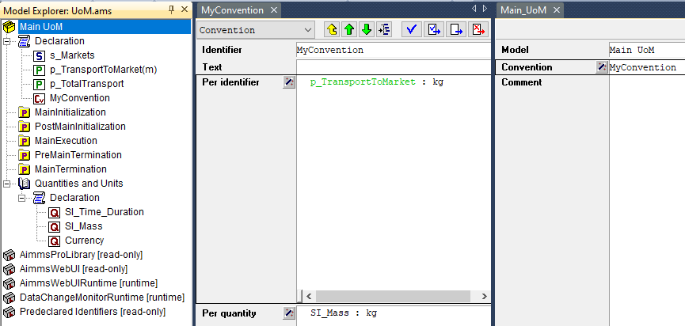

Support for Units of Measurement
================================

In the WebUI, the units of measurement from your AIMMS model are displayed per default in the Table, Scalar and Slider widgets. These widgets have an option 'Show Units' in the 'Miscellaneous' tab of their options editor where you can overrule the displaying of units. Furthermore, for all widget types, the units of measurement are displayed in their tooltips as well.

Current support for units of measurement
----------------------------------------

The units which are displayed in the WebUI follow the Convention identifier in the AIMMS model which is specified in the Convention attribute of the Main node of the model tree.

In order to achieve this setting, first you need to declare a Convention in the model tree. After that, the Convention attribute becomes available for the Main node and the declared Convention may be specified in that attribute, as illustrated in the following picture:

     
| 	 
	
For details on using Conventions for overriding units of measurement please see `AIMMS Language Reference <https://documentation.aimms.com/language-reference/advanced-language-components/units-of-measurement/globally-overriding-units-through-conventions.html#sec-units-convention>`__ .

.. note:: 

    In AIMMS 4.50 and previous versions, unit support was handled in the old manner described below. When opening your WebUI in AIMMS 4.51 or higher, you will automatically get a warning dialog if this 'old-style' unit support is detected. You are encouraged to adapt your model to the new standard using the Convention identifier mentioned above.

Old support for units of measurement (deprecated)
-------------------------------------------------

In AIMMS versions up to 4.50, the units of measurement displayed in the WebUI used to be specified using a mapping identifier such as:

.. code-block:: js

    IdentifierUnitMap = {
		"Distance" : "km"
	};

In this example, the mapping identifier specified that the values of the parameter Distance were to be displayed using the unit 'km'. In this case, also the input for the parameter 'Distance' given through the WebUI was interpreted in terms of the unit 'km'. 

Please note that you could only specify display units for which there was a valid conversion to the base unit of the identifier in your model.
