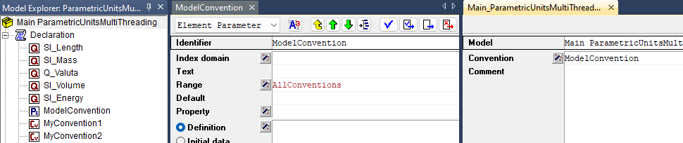
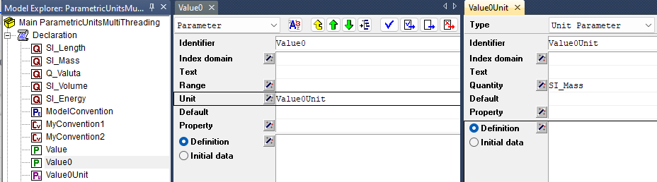
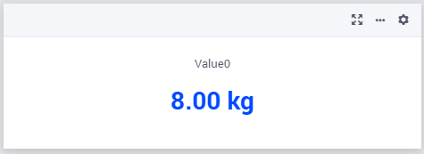
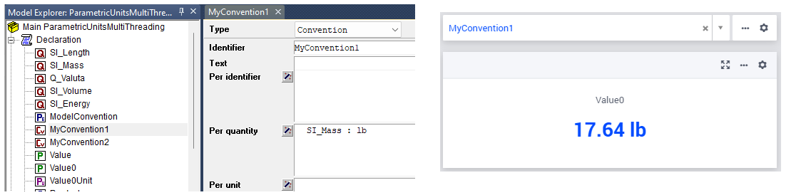
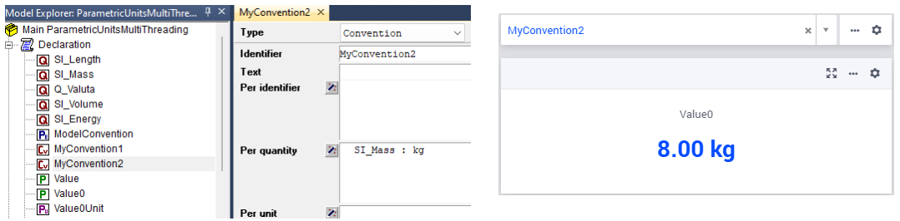
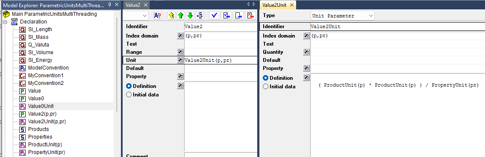
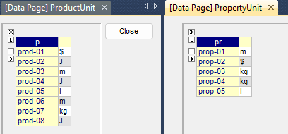
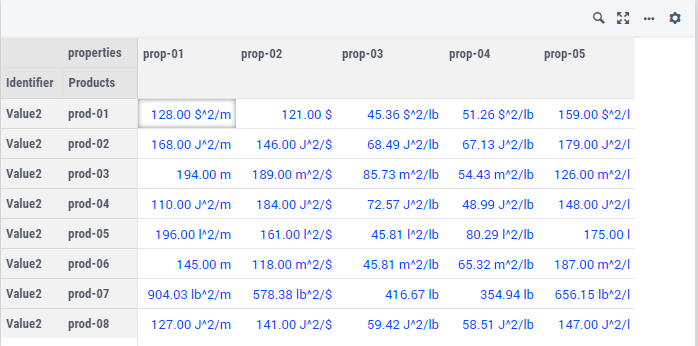
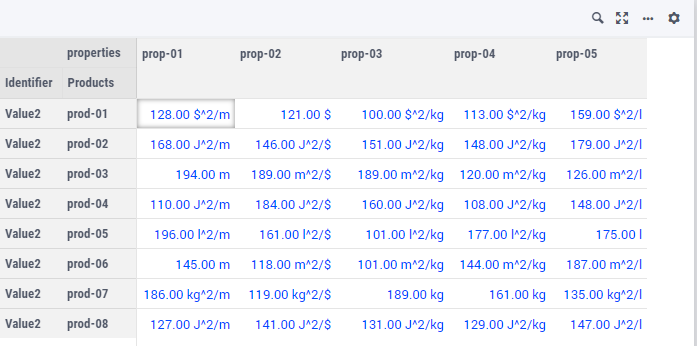

Support for Units of Measurement
================================

In the WebUI, the units of measurement from your AIMMS model are displayed per default in the Table, Scalar and Slider widgets. These widgets have an option 'Show Units' in the 'Miscellaneous' tab of their options editor where you can overrule the displaying of units. Furthermore, for all widget types, the units of measurement are displayed in their tooltips as well.

Current support for units of measurement
----------------------------------------

The units which are displayed in the WebUI follow the Convention identifier in the AIMMS model which is specified in the Convention attribute of the Main node of the model tree.

In order to achieve this setting, first you need to declare a Convention in the model tree. After that, the Convention attribute becomes available for the Main node and the declared Convention may be specified in that attribute, as illustrated in the following picture:

.. image:: images/MainConvention.png
    :align: center
     
| 	 

Moreover, there may be several unit conventions declared inside your model, each with its own convention rules. 
In this case, the Convention attribute of the Main node of the model tree may be also specified by an element parameter with range equal to the set AllConventions.
Such an element parameter may then assume as value one of the conventions declared in the model.
By switching between different values, different conventions may be applied dynamically.

     
| 	 
	
For details on using Conventions for overriding units of measurement please see `AIMMS Language Reference <https://documentation.aimms.com/language-reference/advanced-language-components/units-of-measurement/globally-overriding-units-through-conventions.html#sec-units-convention>`__ .

.. note:: 
    In AIMMS 4.50 and previous versions, unit support was handled in the old manner described at the bottom of this page. When opening your WebUI in AIMMS 4.51 or higher, you will automatically get a warning dialog if this 'old-style' unit support is detected. You are encouraged to adapt your model to the new standard using the Convention identifier mentioned above.

Support for unit parameters
---------------------------

AIMMS supports unit parameters. These are parameters which may assume as value one of the units of measurement declared inside the model. 
Besides fixed units, the units declared in the Unit attribute of a numerical identifier may also be specified using a unit parameter.
When this unit parameter changes its value to a different unit, then the values of the corresponding numerical parameter will be shown using the new unit.

.. note:: 
    In AIMMS 4.97 and previous versions, unit parameters were not supported in the AIMMS WebUI. In these versions, WebUI could only display the units of measurement specified by fixed units. Starting from AIMMS 4.98, WebUI supports displaying of units given by the values of unit parameters as explained in this section.  
	
We illustrate the WebUI support for unit parameters by means of some concrete examples.

Suppose we have declared a scalar numerical parameter Value0 with the Unit attribute specified by a scalar unit parameter Value0Unit with quantity SI_Mass:

     
| 	 
	
When Value0Unit is initialized to the value kg and no specific convention is used for the Main model, then WebUI displays the value as is:

     
| 	 
	
However, if we configure MyConvention1 for the Main model and this specifies the unit lb per quantity SI_Mass, then Value0 is shown in the unit lb:

     
| 	 

Moreover, if we switch to MyConvention2 for the Main model and this specifies the unit kg per quantity SI_Mass, then Value0 is shown in the unit kg:

     
| 	 

Indexed unit parameters are supported as well. 

Supposed we have declared a 2-dimensional numerical parameter Value2(p,pr) with the Unit attribute specified by a 2-dimensional unit parameter Value2Unit(p,pr):

     
| 	 

In this example, the unit parameter Value2Unit(p,pr) is defined by a unit expression involving other unit parameters ProductUnit(p) and PropertyUnit(pr), which may be initialized with various unit values among the declared units in the model.

     
| 	 

In this case, if we configure MyConvention1 for the Main model and this specifies the unit lb per quantity SI_Mass, then Value2 is shown by using the unit lb everywhere where mass is involved:

     
| 	 

However, if we switch to MyConvention2 for the Main model and this specifies the unit kg per quantity SI_Mass, then Value2 is shown by using the unit kg everywhere where mass is involved:

     
| 	 

Old support for units of measurement (deprecated)
-------------------------------------------------

In AIMMS versions up to 4.50, the units of measurement displayed in the WebUI used to be specified using a mapping identifier such as:

.. code-block:: js

    IdentifierUnitMap = {
		"Distance" : "km"
	};

In this example, the mapping identifier specified that the values of the parameter Distance were to be displayed using the unit 'km'. In this case, also the input for the parameter 'Distance' given through the WebUI was interpreted in terms of the unit 'km'. 

Please note that you could only specify display units for which there was a valid conversion to the base unit of the identifier in your model.
