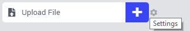

Upload Widget
-------------

The Upload widget and the related `Download widget <download-widget.html>`_ achieve complementary tasks.

With the Upload Widget, end-users can upload a file to the AIMMS PRO server, which can then be further processed by the AIMMS model. This is very useful for Web Apps that depend on user specific data that is not yet available on the server (e.g. Excel data input). 

Like the Button Widget, the Upload Widget has a call 'Procedure' option, in which you can specify the AIMMS procedure that will run, once the upload is finished. You can specify this option via the option editor of the upload widget, or assign it to its current contents when creating a new upload widget.

The AIMMS procedure should have three arguments, in the exact order below:

* An Input string parameter that will contain the name of the uploaded file. WebUI will add a GUID postfix to the name to make sure it is unique.
* An Output parameter called :token:`statusCode` representing the return value of the procedure.
* An Output string parameter called :token:`statusDescription` that should contain a return message for the end-user.

Please note that the latter two (output) arguments should have the exact names as stated, as they are treated in a special way in the underlying procedure call mechanism.

The end-user can add a file to the upload widget by pressing the 'add' button. After that, a file can be selected using the standard browser controls for selecting files. Once a file is added, the end-user can start the upload by pressing the 'start' button. The Upload Widget will show the progress of the upload. Once the upload is successfully finished, the specified AIMMS procedure is called, which should take care of any further processing of the file.

The location of the uploaded file on the AIMMS PRO server is different from the location when running the AIMMS model in developer mode. In order to be able to always get the correct file path, you can use the :token:`webui::GetIOFilePath` function that is available in the :token:`AimmsWebUI` library. When running on the AIMMS PRO server, this function adds the temporary PRO path to the file name. You can use this function in your AIMMS procedure to be able to further process the uploaded file. 

The StatusCode argument should be filled as follows:

.. code::

    statusCode := webui::ReturnStatusCode('OK');

During or after this processing, you should update both the return value parameter and the return message string parameter. The pre-defined function :token:`webui::ReturnStatusCode` has a number of possible arguments (:token:`OK`, :token:`CREATED`, :token:`BAD_REQUEST`, :token:`UNAUTHORIZED`, :token:`CONFLICT` and :token:`ERROR`). Because your procedure is expected to handle the file, the status OK is expected if all goes well. You can use one of the other status codes to signal that something went wrong when handling your file.

Once the AIMMS procedure run has finished, the WebUI will show the return message to the end-user. Depending on the return value, messages are shown as messages (in the message log) or errors. By providing clear messages, you can provide your user with feedback on the uploaded file.

When the uploaded file is no longer needed, you should delete it (e.g. by using :token:`FileDelete` from within the AIMMS procedure). As an app developer, you know best when the file is no longer needed. Please note that uploaded files at the AIMMS PRO server will be deleted automatically once the current data session is closed. In developer mode, however, files are not automatically deleted.

Please note that if you need to use folder names in your model, use forward slashes to separate them. This ensures that your WebUI using this model is also capable of running on Linux.